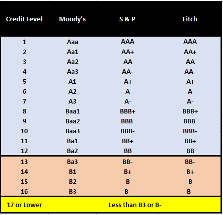

## Table of Contents

## What is a credit rating?

A credit rating is a score given to a person or a company to show how likely they are to pay back money they borrow. It's like a report card for how good someone is at paying their bills. Banks and other lenders use this score to decide if they should lend money and how much interest to charge. A high credit rating means you are seen as trustworthy and likely to pay back loans on time.

Credit ratings are calculated using information from credit reports, which include details about your borrowing and payment history. Things like paying bills on time, how much debt you have, and how long you've had credit can affect your rating. If you miss payments or have too much debt, your credit rating might go down, making it harder to borrow money in the future. Keeping a good credit rating can help you get better deals on loans and credit cards.

## Why is the validity duration of credit ratings important?

The validity duration of credit ratings is important because it tells us how long the rating is good for. Credit ratings can change over time because people's financial situations can change. If a credit rating is only valid for a short time, it means that lenders need to check it more often to make sure it's still accurate. This helps them make better decisions about lending money.

Having a credit rating with a longer validity period can be helpful for people who want to borrow money. If the rating stays the same for a longer time, they might not have to worry about it changing before they get a loan. But, if something big happens in their finances, like losing a job or paying off a big debt, they might want a new rating sooner to show their current situation. So, the right validity duration can help both lenders and borrowers make better choices.

## How long is the typical validity period for a credit rating?

The typical validity period for a credit rating can vary depending on the agency that gives the rating and the type of credit being rated. For personal credit scores, like those from FICO or VantageScore, there isn't a set expiration date. Instead, these scores can change every time new information is added to your credit report, which can happen monthly or even more often.

For business or corporate credit ratings, the validity period might be set by the credit rating agency. These ratings are usually reviewed annually or semi-annually. This means that a business's credit rating might be considered valid for up to a year before it needs to be updated. Keeping track of when these ratings are updated is important for companies that need to borrow money.

## What factors can influence the validity duration of a credit rating?

The validity duration of a credit rating can change because of who is giving the rating and what kind of credit it is. For example, if it's a personal credit score from FICO or VantageScore, there's no set time when it expires. Your score can change anytime new information is added to your credit report. This could happen every month or even more often. So, the validity of your personal credit score is always changing based on your latest financial actions.

For business or corporate credit ratings, the time the rating is good for is often decided by the credit rating agency. These agencies usually check the ratings every year or every six months. This means a business's credit rating might be thought of as valid for up to a year before it needs to be looked at again. The type of business and how much it borrows can also affect how often the rating needs to be updated. Keeping an eye on when these ratings are checked is important for companies that want to borrow money.

## Can a credit rating's validity be extended or shortened?

Yes, a credit rating's validity can be extended or shortened depending on different situations. For personal credit scores, there's no fixed time limit. Your score can change whenever new information is added to your credit report, which might happen monthly or more often. So, if you pay your bills on time or take on new debt, your score might change, making the old rating less valid sooner.

For business or corporate credit ratings, the time they are valid for is usually set by the credit rating agency. These agencies might review the ratings every year or every six months. But if something big happens, like a company getting into financial trouble or making a big improvement, the agency might decide to update the rating sooner. This means the validity of the rating could be shortened. On the other hand, if everything stays stable, the rating might stay valid for the full period without needing an early update.

## What happens when a credit rating expires?

When a credit rating expires, it means it's no longer considered current. For personal credit scores, there isn't really an expiration date because they change whenever new information is added to your credit report. So, if your score was high a few months ago but you've missed some payments since then, your old score isn't valid anymore. Lenders will look at your newest score to decide if they should give you a loan or credit card.

For business or corporate credit ratings, the rating is usually valid for a set time, like a year or six months. When this time is up, the rating agency will review the company's financial situation again. If the company's situation has changed a lot, the new rating might be different. Until the rating is updated, lenders might be careful about lending money because they don't have the most up-to-date information on the company's creditworthiness.

## How do credit rating agencies determine the validity duration?

Credit rating agencies decide how long a credit rating stays valid by looking at different things. For personal credit scores, there's no set time limit because these scores can change whenever new information is added to your credit report. This might happen every month or even more often. So, the agency doesn't set a specific date when the score expires; it's always changing based on your latest financial actions.

For business or corporate credit ratings, agencies usually set a time limit, like a year or six months. They look at how often the company's financial situation might change and how important it is to have the latest information. If a lot can change in a short time, the agency might choose a shorter validity period to make sure the rating stays accurate. If things stay pretty stable, they might set a longer time before the rating needs to be checked again.

## What are the differences in validity duration across different types of credit ratings?

For personal credit scores, like those from FICO or VantageScore, there's no set time when they expire. They can change anytime new information is added to your credit report, which might happen every month or even more often. So, the validity of your personal credit score is always changing based on your latest financial actions. If you pay your bills on time or take on new debt, your score might go up or down, making the old rating less valid sooner.

For business or corporate credit ratings, the time they are valid for is usually decided by the credit rating agency. These agencies might review the ratings every year or every six months. This means a business's credit rating might be thought of as valid for up to a year before it needs to be looked at again. The type of business and how much it borrows can also affect how often the rating needs to be updated. If a lot can change in a short time, the agency might choose a shorter validity period to make sure the rating stays accurate.

## How do regulatory requirements affect the validity duration of credit ratings?

Regulatory requirements can change how long a credit rating stays valid. Different countries have rules about how often credit ratings need to be checked and updated. These rules help make sure that the ratings are fair and correct. For example, some places might say that credit rating agencies have to look at a company's rating every year. This means the rating can only be valid for one year before it needs to be updated.

These rules can be different for personal credit scores and business credit ratings. For personal credit scores, there might not be a set time when they expire because they can change whenever new information is added to your credit report. But for business ratings, the rules might say how often the ratings need to be reviewed. This helps keep the ratings useful and trustworthy for people who need to make decisions about lending money.

## What are the implications of a change in credit rating during its validity period?

If a credit rating changes during its validity period, it can affect how lenders see you or your business. For personal credit scores, a change might happen if you pay your bills on time or if you miss some payments. If your score goes up, it can be easier to get loans or credit cards with good rates. But if it goes down, lenders might think you're riskier and might not want to lend you money, or they might charge you more interest.

For business or corporate credit ratings, a change during the validity period can be important too. If a company does well and its rating goes up, it might get better deals on loans or be able to borrow more money. But if the company has problems and its rating goes down, it might be harder to borrow money, and the cost of borrowing could go up. This is why companies need to keep an eye on their ratings and make sure they're doing well financially.

## How do issuers and investors manage the risks associated with the validity duration of credit ratings?

Issuers, like companies or people who want to borrow money, manage the risks of credit rating validity by keeping a close eye on their finances. They try to make sure they're doing well so their credit rating stays high or goes up. If they know their rating might change soon, they might work hard to pay off debts or improve their financial situation before the rating is checked again. This way, they can keep their borrowing costs low and make it easier to get loans.

Investors, who lend money or buy bonds, also need to think about how long a credit rating is valid. They might check the ratings often to see if they're still good or if they've changed. If a rating is about to expire, investors might wait for the new rating before deciding to lend money or buy bonds. This helps them understand the risk better and make smarter choices about where to put their money.

## What advanced methodologies are used to predict changes in credit ratings before the end of their validity period?

To predict changes in credit ratings before their validity period ends, experts use fancy computer programs called [machine learning](/wiki/machine-learning). These programs look at a lot of data, like how much money a person or company owes, if they pay their bills on time, and even things like the economy. By studying this data, the computer can find patterns and guess if a credit rating might go up or down. This helps people who lend money to make better decisions and be ready for any changes.

Another way to predict credit rating changes is by using something called statistical models. These models use math to look at past information and see how credit ratings have changed before. They can then use this information to predict what might happen next. This is helpful for both people who borrow money and those who lend it because it gives them a heads-up on what to expect. By knowing what might happen, they can plan better and maybe even take steps to keep their credit rating high.

## What is the relationship between Algorithmic Trading and Financial Assessments?

Algorithmic trading automates trading decisions using sophisticated algorithms, which are typically built on predefined rules and procedures. These algorithms can process vast volumes of financial data with speed and accuracy, allowing traders to execute buy and sell orders rapidly and efficiently within milliseconds. Financial assessments play a crucial role in this process by providing essential insights into market conditions and the financial health of various assets.

Precision in financial assessments is paramount. High-quality data, including company financials and market indicators, enables [algorithmic trading](/wiki/algorithmic-trading) systems to gauge the risk and potential return of trades accurately. For instance, incorporating real-time data feeds and financial metrics such as price-to-earnings ratios, debt-to-equity ratios, and earnings per share ensures that the trading algorithms are operating based on the most relevant and up-to-date information. This real-time data processing capability helps in identifying profitable trading opportunities and mitigating potential risks.

The integration of financial assessments in algorithmic trading strategies can be represented by mathematical models. One common approach is the use of quantitative models that calculate expected returns and risk levels. For example, a basic model might predict asset returns by considering factors such as expected growth ($g$), historical [volatility](/wiki/volatility-trading-strategies) ($\sigma$), and market trends ($m$). 

$$

\text{Expected Return} = C + b_1 \times g + b_2 \times \sigma + b_3 \times m 
$$

where $C$ is a constant, and $b_1$, $b_2$, and $b_3$ are coefficients determined through regression analysis on historical data.

Timeliness of the financial data is critical. Algorithmic trading thrives on minimal latency. Delays in data delivery can lead to significant adverse impacts on trade outcomes, especially in volatile markets where prices fluctuate rapidly. Hence, trading platforms must ensure they have access to high-speed data feeds and superior computing power to minimize processing delays and mishaps.

Financial assessments help algorithmic systems to adapt to changing market conditions. By continuously analyzing shifts in market sentiment, economic indicators, and asset performance, algorithms can update their trading strategies in real time. Python, a preferred programming language in this domain due to its rich collection of libraries like Pandas and NumPy, facilitates such real-time data analysis and decision-making. For instance, a simple moving average crossover strategy can be implemented using Python to trigger trades when short-term averages surpass long-term averages, indicating potential upward price movement.

```python
import pandas as pd

# Load market data into a DataFrame
data = pd.DataFrame({
    'Close': [100, 102, 101, 105, 107, 110]  # Sample closing prices
})

# Calculate moving averages
data['Short_MA'] = data['Close'].rolling(window=3).mean()
data['Long_MA'] = data['Close'].rolling(window=5).mean()

# Determine trading signals
data['Signal'] = 0
data.loc[data['Short_MA'] > data['Long_MA'], 'Signal'] = 1  # Buy Signal
data.loc[data['Short_MA'] < data['Long_MA'], 'Signal'] = -1  # Sell Signal
```

In summary, the integration of precise and timely financial assessments in algorithmic trading enhances the effectiveness of trading strategies. As algorithmic trading continues to evolve, the reliance on accurate financial assessments will become increasingly vital for achieving favorable financial outcomes and managing risks.

## References & Further Reading

[1]: Bergstra, J., Bardenet, R., Bengio, Y., & Kégl, B. (2011). ["Algorithms for Hyper-Parameter Optimization."](https://dl.acm.org/doi/10.5555/2986459.2986743) Advances in Neural Information Processing Systems 24.

[2]: ["Advances in Financial Machine Learning"](https://www.amazon.com/Advances-Financial-Machine-Learning-Marcos/dp/1119482089) by Marcos Lopez de Prado

[3]: ["Evidence-Based Technical Analysis: Applying the Scientific Method and Statistical Inference to Trading Signals"](https://www.amazon.com/Evidence-Based-Technical-Analysis-Scientific-Statistical/dp/0470008741) by David Aronson

[4]: ["Machine Learning for Algorithmic Trading"](https://github.com/stefan-jansen/machine-learning-for-trading) by Stefan Jansen

[5]: ["Quantitative Trading: How to Build Your Own Algorithmic Trading Business"](https://www.amazon.com/Quantitative-Trading-Build-Algorithmic-Business/dp/1119800064) by Ernest P. Chan

[6]: Salandro, T., & Zhang, W. (2020). ["Using Credit Ratings as a Signal for Stock Returns: Evidence from Large Investors’ Net Stock Purchases."](https://www.sciencedirect.com/science/article/abs/pii/S0275531918303372) Journal of Empirical Finance.

[7]: Fabozzi, F. J., & Mann, S. V. (2010). ["The Handbook of Fixed Income Securities, Eighth Edition"](https://www.amazon.com/Handbook-Fixed-Income-Securities-Eighth/dp/0071768467) by Frank J. Fabozzi and Steven V. Mann

[8]: Hull, J. C. (2018). ["Risk Management and Financial Institutions"](https://books.google.com/books/about/Risk_Management_and_Financial_Institutio.html?id=1J1QDwAAQBAJ) by John C. Hull