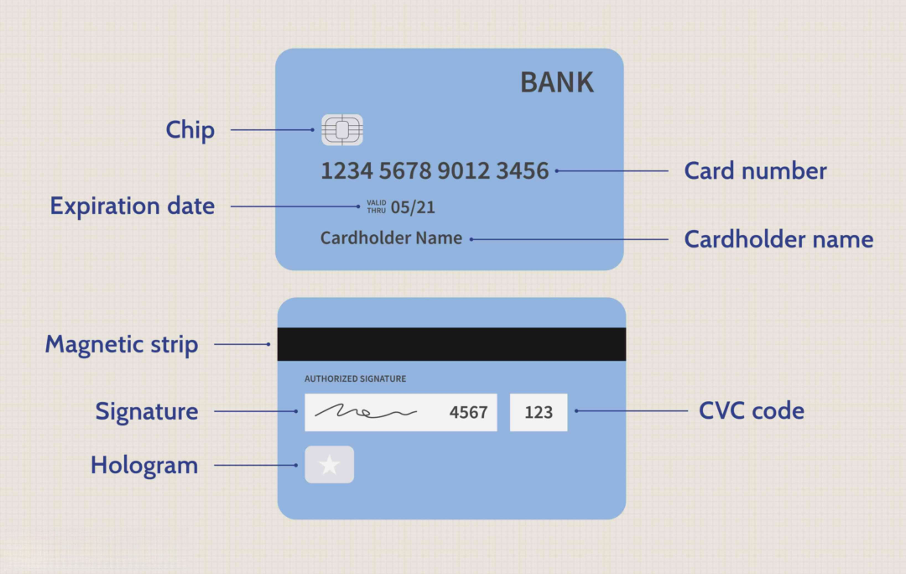

In the evolving landscape of finance, understanding the interplay between credit ratings, financial assessment, and algorithmic trading is vital. These elements form the backbone of decision-making in trading financial instruments. Financial assessments involve a thorough analysis of a company's financial statements, helping to gauge its stability, growth potential, and competitive position in the market. This understanding is crucial, particularly in algorithmic trading where vast amounts of data are utilized to automate and optimize trading strategies.

Credit ratings play an equally significant role by assessing the creditworthiness of entities and indicating their likelihood of default. These ratings are pivotal for shaping investor confidence and guiding investment decisions, especially in bonds and other debt instruments. Ratings from major credit agencies like Moody's, Standard & Poor's, and Fitch provide essential insights required for informed decision-making.



In modern trading strategies, algorithmic trading leverages advancements in technology and data science to formulate and execute trades with precision and speed. The integration of credit ratings and financial assessments into algorithmic trading systems helps create robust strategies that can adapt to changing market conditions and mitigate risks effectively.

This article explores how these components interact and influence each other, shaping the modern trading landscape. We will cover the detailed processes involved in financial assessments within algorithmic trading, the implication of credit ratings, and how their validity is continuously evaluated to ensure they remain reflective of an entity's current financial health. Understanding these elements is crucial for gaining a competitive edge in the rapidly evolving financial markets.

## Table of Contents

## Understanding Financial Assessment

Financial assessment is a critical component of analyzing financial statements to ascertain a company's stability, growth potential, and market position. The primary purpose of this analysis is to provide a foundation for making informed trading decisions. This is particularly applicable in algorithmic trading, which relies on data-driven strategies to optimize trading results.

A comprehensive financial assessment involves examination of various financial documents, such as balance sheets, income statements, and cash flow statements. These documents provide insight into a company’s operational efficiency, [liquidity](/wiki/liquidity-risk-premium), solvency, and profitability. By evaluating these metrics, traders can better understand an entity’s financial health and its potential in the market.

Modern financial assessment has evolved with advanced technologies and tools that enhance precision and minimize human error. Financial ratios, for instance, are fundamental tools employed in financial assessments. Ratios like the current ratio, quick ratio, debt-to-equity ratio, and return on equity are rudimentary but powerful indicators of a company's financial status. These ratios can be calculated using Python, allowing for a detailed analysis quickly and accurately.

```python
# Example of calculating financial ratios in Python

# Sample financial data
current_assets = 50000
current_liabilities = 30000
total_debt = 20000
total_equity = 80000
net_income = 15000
total_assets = 100000

# Financial Ratios
current_ratio = current_assets / current_liabilities
quick_ratio = (current_assets - inventory) / current_liabilities  # assuming 'inventory' is defined
debt_to_equity_ratio = total_debt / total_equity
return_on_equity = net_income / total_equity

# Output the calculated ratios
print(f"Current Ratio: {current_ratio}")
print(f"Quick Ratio: {quick_ratio}")
print(f"Debt to Equity Ratio: {debt_to_equity_ratio}")
print(f"Return on Equity: {return_on_equity}")
```

The integration of [artificial intelligence](/wiki/ai-artificial-intelligence) and [machine learning](/wiki/machine-learning) in financial assessments is further transforming the landscape. These technologies can process large volumes of data more efficiently than traditional methods, identifying patterns and trends that might not be immediately apparent. Predictive analytics, a branch of machine learning, can forecast future financial performance based on historical data, significantly assisting algorithmic traders in developing robust strategies.

With the fusion of financial analytics and [algorithmic trading](/wiki/algorithmic-trading), precision in financial data becomes indispensable. Real-time data processing and advanced analytic tools allow for timely and accurate assessments, thus reducing the risks associated with speculations and assumptions. Consequently, enhanced precision in financial assessments not only bolsters informed decision-making but also optimizes trading outcomes.

## The Role of Credit Ratings

Credit ratings are pivotal in assessing the creditworthiness of borrowers, providing essential insights into the likelihood of default. These ratings serve as a key determinant for the perceived risk associated with lending to a particular entity and play a crucial role in the financial decision-making process. By offering a systematic and standardized measure of credit risk, credit ratings enable investors, financial institutions, and other stakeholders to make informed investment decisions, especially regarding bonds and various debt instruments.

Credit ratings range from high-grade, low-risk ratings to low-grade, high-risk classifications, influencing both the interest rates charged on loans and the yield expectations on bonds. For instance, a higher credit rating typically corresponds to lower interest rates and yields, which reflects a lower risk of default. Conversely, lower credit ratings indicate higher risk and generally result in higher interest costs and yield potential for investors. This connection between credit ratings and financial instruments underlines the importance of these ratings in stabilizing and guiding financial markets.

Three major credit rating agencies dominate the credit rating landscape: Moody's Investors Service, Standard & Poor's (S&P) Global Ratings, and Fitch Ratings. Each of these agencies evaluates creditworthiness using proprietary methodologies, though they generally consider factors such as an entity's financial health, historical financial performance, market position, and overall economic environment.

The process of assigning credit ratings involves rigorous quantitative and qualitative analysis. Typically, these agencies assess financial statements, scrutinize economic trends, and evaluate management strategies. Although each agency may have different methodologies, their credit ratings are universally acknowledged and relied upon by investors and policymakers globally. The significance of these ratings extends beyond confidence bolstering; they are integral in determining regulatory capital requirements for banks and are often embedded in investment mandates and risk management strategies.

In summary, credit ratings are indispensable in the financial ecosystem for evaluating the creditworthiness of borrowers. These ratings not only influence investor confidence and decision-making processes but also play a vital role in shaping interest rates and investment yields. The authoritative assessments by Moody's, S&P, and Fitch reinforce stability and transparency across global financial markets, thus safeguarding both investors and the borrowing entities against unanticipated financial risks.

## Validity Period of Credit Ratings

Credit ratings are pivotal tools in evaluating the creditworthiness of borrowers and play a significant role in investment decisions. These ratings, however, do not possess a fixed expiration date. Instead, they are subject to periodic reviews, typically conducted on a quarterly or annual basis. These reviews are dependent on the financial performance and prevailing market conditions associated with the rated entity. The objective is to ensure these ratings remain reflective of the entity's current financial health and creditworthiness.

Continuous updates to credit ratings are crucial as they provide investors with up-to-date insights into the potential risks and returns tied to an investment. For instance, a company's financial performance could improve or deteriorate due to various factors such as changes in market dynamics, shifts in management, or economic downturns. By keeping credit ratings current, investors can more accurately assess the long-term viability and inherent risk factors associated with their investment choices.

Efficient management of credit ratings extends beyond basic updates. It involves a thorough analysis of financial reports, adherence to regulatory changes, and responsiveness to significant market events. For investors, leveraging these updated ratings can lead to better-informed decisions that align with their risk tolerance and investment strategies.

Incorporating detailed assessments and regular updates into credit ratings provides a comprehensive view of an entity's financial landscape. This comprehensive approach assists in delivering ratings that support transparency in financial markets and aid investors in making decisions based on robust and current data. These practices ensure that credit ratings continue to serve as reliable benchmarks for evaluating credit risk and guiding investment strategies.

## Algorithmic Trading and Financial Assessments

Algorithmic trading automates trading decisions using sophisticated algorithms, which are typically built on predefined rules and procedures. These algorithms can process vast volumes of financial data with speed and accuracy, allowing traders to execute buy and sell orders rapidly and efficiently within milliseconds. Financial assessments play a crucial role in this process by providing essential insights into market conditions and the financial health of various assets.

Precision in financial assessments is paramount. High-quality data, including company financials and market indicators, enables algorithmic trading systems to gauge the risk and potential return of trades accurately. For instance, incorporating real-time data feeds and financial metrics such as price-to-earnings ratios, debt-to-equity ratios, and earnings per share ensures that the trading algorithms are operating based on the most relevant and up-to-date information. This real-time data processing capability helps in identifying profitable trading opportunities and mitigating potential risks.

The integration of financial assessments in algorithmic trading strategies can be represented by mathematical models. One common approach is the use of quantitative models that calculate expected returns and risk levels. For example, a basic model might predict asset returns by considering factors such as expected growth ($g$), historical [volatility](/wiki/volatility-trading-strategies) ($\sigma$), and market trends ($m$). 

$$

\text{Expected Return} = C + b_1 \times g + b_2 \times \sigma + b_3 \times m 
$$

where $C$ is a constant, and $b_1$, $b_2$, and $b_3$ are coefficients determined through regression analysis on historical data.

Timeliness of the financial data is critical. Algorithmic trading thrives on minimal latency. Delays in data delivery can lead to significant adverse impacts on trade outcomes, especially in volatile markets where prices fluctuate rapidly. Hence, trading platforms must ensure they have access to high-speed data feeds and superior computing power to minimize processing delays and mishaps.

Financial assessments help algorithmic systems to adapt to changing market conditions. By continuously analyzing shifts in market sentiment, economic indicators, and asset performance, algorithms can update their trading strategies in real time. Python, a preferred programming language in this domain due to its rich collection of libraries like Pandas and NumPy, facilitates such real-time data analysis and decision-making. For instance, a simple moving average crossover strategy can be implemented using Python to trigger trades when short-term averages surpass long-term averages, indicating potential upward price movement.

```python
import pandas as pd

# Load market data into a DataFrame
data = pd.DataFrame({
    'Close': [100, 102, 101, 105, 107, 110]  # Sample closing prices
})

# Calculate moving averages
data['Short_MA'] = data['Close'].rolling(window=3).mean()
data['Long_MA'] = data['Close'].rolling(window=5).mean()

# Determine trading signals
data['Signal'] = 0
data.loc[data['Short_MA'] > data['Long_MA'], 'Signal'] = 1  # Buy Signal
data.loc[data['Short_MA'] < data['Long_MA'], 'Signal'] = -1  # Sell Signal
```

In summary, the integration of precise and timely financial assessments in algorithmic trading enhances the effectiveness of trading strategies. As algorithmic trading continues to evolve, the reliance on accurate financial assessments will become increasingly vital for achieving favorable financial outcomes and managing risks.

## Integration of Credit Ratings in Algorithmic Trading

Algorithmic trading systems are increasingly leveraging credit ratings to refine and enhance decision-making processes. By incorporating credit ratings, these systems can systematically evaluate the risk profile of various securities, making them more adept at responding to changes in creditworthiness. This capability allows algorithms to dynamically adjust trading strategies in response to shifts in credit ratings, optimizing investment portfolios to align with the latest financial insights.

Integrating credit ratings into algorithmic trading involves using these ratings as inputs in trading algorithms, which can trigger buy or sell signals based on credit rating upgrades or downgrades. For example, a sudden downgrade of a company's credit rating might signal increased default risk, prompting the algorithm to sell off the company's bonds or related financial instruments to mitigate potential losses.

This integration provides a strategic advantage, as it helps formulate trading strategies that are less prone to market anomalies and adverse financial events. Credit ratings can serve as a critical component in assessing market sentiment and potential risks, enabling algorithmic systems to navigate volatile market conditions with greater precision.

The implementation of credit ratings within an algorithmic framework calls for advanced data processing capabilities. Python, for example, can be employed to develop models that process credit rating changes and adjust trading strategies accordingly. Below is a simplified Python snippet illustrating how an algorithm might adjust a trading position based on a credit rating change:

```python
def adjust_trading_strategy(security, current_rating, previous_rating):
    if current_rating < previous_rating:
        # If the credit rating has been downgraded, consider selling
        print(f"Downgrade detected for {security}. Consider selling.")
        return 'sell'
    elif current_rating > previous_rating:
        # If the credit rating has been upgraded, consider buying
        print(f"Upgrade detected for {security}. Consider buying.")
        return 'buy'
    else:
        # No change in rating
        print(f"No change in credit rating for {security}. Hold position.")
        return 'hold'

# Example usage
security_name = 'Company_X_Bonds'
previous_credit_rating = 'BBB+'
current_credit_rating = 'BBB'

adjust_trading_strategy(security_name, current_credit_rating, previous_credit_rating)
```

The integration process requires continuous monitoring and updating of credit ratings, as these ratings are not static and evolve with changing financial conditions and performance metrics of the rated entities. As financial markets grow more complex, the ability to adapt and refine trading strategies in real-time through the integration of credit ratings will play a pivotal role in navigating economic uncertainties and gaining a competitive edge.

## Challenges and Considerations

Adopting algorithmic trading strategies that integrate financial assessments and credit ratings involves several complexities that require careful management. Ensuring accuracy in financial data is paramount; this data forms the basis for any algorithmic trading decision. Inaccurate or outdated data can lead to erroneous trading decisions, increasing the risk of financial losses. To mitigate this, financial data must be regularly updated to reflect the latest market conditions and company performance metrics. 

Adherence to regulatory guidelines is another critical challenge. Regulatory frameworks governing financial markets are constantly evolving to enhance market stability and protect investors. Algorithmic trading systems must be in compliance with these regulations, requiring continuous monitoring and adjustments to the trading algorithms and processes. Failure to adhere can result in legal penalties and damage to an organization's reputation.

Technological challenges also play a significant role in the integration of these elements. The infrastructure required for effective algorithmic trading must be both robust and scalable, capable of handling large volumes of data with minimal latency. This involves investing in high-performance computing resources and advanced data analytics capabilities. Moreover, the rapid pace of technological advancement necessitates ongoing updates and enhancements to these systems.

Resource challenges are another consideration, as implementing these integrated systems requires substantial investment in both human and financial capital. Hiring skilled personnel who specialize in algorithmic trading, data science, and compliance is essential but can be costly. Organizations must also allocate sufficient budgets for technology acquisition and maintenance, training programs, and continuous research and development to keep pace with industry advancements.

In summary, successfully integrating financial assessments and credit ratings into algorithmic trading strategies involves overcoming challenges related to data accuracy, regulatory compliance, technology, and resources. Addressing these challenges is crucial for maximizing the benefits and mitigating the risks associated with this approach.

## Conclusion

The integration of financial assessments, credit ratings, and algorithmic trading is significantly transforming financial markets. As technology progresses, these components synergize to optimize trading efficiency and enhance risk management. Financial assessments provide critical insights into company stability and growth prospects, informing more precise algorithmic trading strategies. Concurrently, credit ratings offer a measure of a borrower's creditworthiness, directly influencing investment decisions and fostering trust in trading activities.

Algorithmic trading, leveraging these assessments and credit ratings, automates decision-making processes with increased accuracy. This automation not only speeds up trading but also aids in mitigating risks by promptly adapting to market changes. For instance, an algorithm could automatically adjust a trading strategy in response to a credit rating downgrade, minimizing exposure to potential defaults.

The continuous evolution of technology ensures that the integration of these financial components will persistently refine trading operations. Advanced machine learning techniques and big data analytics are paving the way for even more sophisticated trading models that can process vast amounts of data with minimal delay. Such advancements aid traders and investors in maintaining a competitive advantage by aligning strategies with real-time financial information.

In this rapidly changing financial landscape, keeping abreast of emerging technologies and their applications in trading is essential for maintaining competitiveness. Understanding how financial assessments and credit ratings interplay with algorithmic trading can help traders and investors make informed decisions and capitalize on market opportunities. Thus, embracing this integration not only enhances trading efficiency but also fortifies risk management practices, proving to be an invaluable asset in today's fast-paced financial world.

## References & Further Reading

[1]: Bergstra, J., Bardenet, R., Bengio, Y., & Kégl, B. (2011). ["Algorithms for Hyper-Parameter Optimization."](https://dl.acm.org/doi/10.5555/2986459.2986743) Advances in Neural Information Processing Systems 24.

[2]: ["Advances in Financial Machine Learning"](https://www.amazon.com/Advances-Financial-Machine-Learning-Marcos/dp/1119482089) by Marcos Lopez de Prado

[3]: ["Evidence-Based Technical Analysis: Applying the Scientific Method and Statistical Inference to Trading Signals"](https://www.amazon.com/Evidence-Based-Technical-Analysis-Scientific-Statistical/dp/0470008741) by David Aronson

[4]: ["Machine Learning for Algorithmic Trading"](https://github.com/stefan-jansen/machine-learning-for-trading) by Stefan Jansen

[5]: ["Quantitative Trading: How to Build Your Own Algorithmic Trading Business"](https://www.amazon.com/Quantitative-Trading-Build-Algorithmic-Business/dp/1119800064) by Ernest P. Chan

[6]: Salandro, T., & Zhang, W. (2020). ["Using Credit Ratings as a Signal for Stock Returns: Evidence from Large Investors’ Net Stock Purchases."](https://www.sciencedirect.com/science/article/abs/pii/S0275531918303372) Journal of Empirical Finance.

[7]: Fabozzi, F. J., & Mann, S. V. (2010). ["The Handbook of Fixed Income Securities, Eighth Edition"](https://www.amazon.com/Handbook-Fixed-Income-Securities-Eighth/dp/0071768467) by Frank J. Fabozzi and Steven V. Mann

[8]: Hull, J. C. (2018). ["Risk Management and Financial Institutions"](https://books.google.com/books/about/Risk_Management_and_Financial_Institutio.html?id=1J1QDwAAQBAJ) by John C. Hull