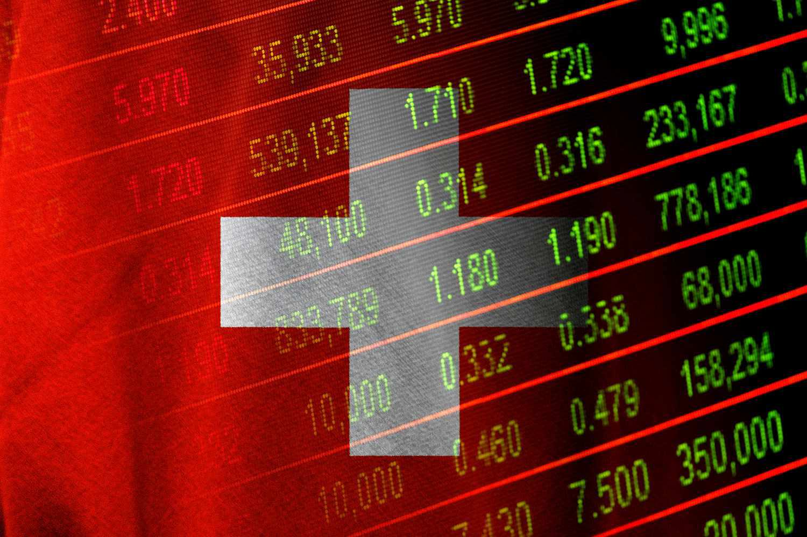

In the evolving landscape of financial markets, accurate identification of securities is crucial for efficient trading. The Valoren Number, a unique identifier employed in the Swiss financial system, serves a vital role in distinguishing financial instruments, thereby facilitating seamless transactions. As the financial markets increasingly rely on advanced technologies and trading strategies, the importance of employing precise security identifiers like Valoren Numbers cannot be overstated.

This article investigates into the significance of Valoren Numbers by examining their structure, how they function within the Swiss financial infrastructure, and their application in algorithmic trading. Understanding how these identifiers operate provides valuable insights for market participants, particularly those engaged in high-frequency trading and automated systems, where rapid and reliable identification of securities is essential for minimizing errors and optimizing trade effectiveness.

Furthermore, comparing Valoren Numbers to other globally recognized security identifiers, such as International Securities Identification Numbers (ISINs), Committee on Uniform Securities Identification Procedures (CUSIPs), and Stock Exchange Daily Official List numbers (SEDOLs), highlights their unique advantages within the Swiss context. By grasping the differences and synergies between these systems, market participants can better navigate both local and international financial environments.

Ultimately, a thorough comprehension of Valoren Numbers equips investors, traders, and financial institutions with the necessary tools to engage effectively in the Swiss and broader financial markets. This understanding is not only essential for operational efficiency but also for ensuring regulatory compliance and enhancing overall market integrity.

## Table of Contents

## What is a Valoren Number?

Valoren Numbers are numeric codes specifically designed to uniquely identify financial instruments within the Swiss financial system. These identifiers are essential for the efficient trading and settlement of a wide range of securities, including stocks, bonds, and other financial assets. The primary responsibility for overseeing and managing Valoren Numbers lies with SIX Financial Information, a critical entity in maintaining the accuracy and reliability of security identification processes in Switzerland.

Different from other global security identifiers, Valoren Numbers are exclusively numeric and can range from six to nine digits. They do not contain embedded information, such as country codes or security type details, which distinguishes them from International Securities Identification Numbers (ISINs), that typically include a two-letter country code followed by a nine-character alphanumeric identifier. This simplicity in design makes Valoren Numbers unique in their approach, focusing on straightforward, unambiguous identification without additional, embedded data.

In the Swiss financial market, the use of Valoren Numbers facilitates streamlined and accurate processes by eliminating confusion and potential errors related to securities trading. This effective identification system is integral to ensuring that transactions are conducted smoothly and that settlements occur without discrepancies. The existence of a dedicated numbering system such as Valoren further enhances market efficiency by providing a stable and consistent framework for identifying financial instruments within Switzerland.

## Benefits of Using Valoren Numbers

Valoren Numbers serve as crucial identifiers within the Swiss financial market, playing a pivotal role in ensuring seamless trade processing and communication. They provide an unambiguous method of identifying securities, which is essential for maintaining clarity between various market participants. This clarity significantly reduces the potential for miscommunication, thereby increasing the efficiency of trade execution.

The use of Valoren Numbers enhances trading efficiency by allowing for the swift and accurate identification of securities. This is especially important in fast-paced trading environments where timely execution and settlement are critical. By providing a clear and unique identifier for each security, Valoren Numbers facilitate quick processing and verification, leading to more rapid transaction times.

In addition to trading efficiency, Valoren Numbers contribute substantially to reducing errors in financial transactions. The accurate identification facilitated by these numbers ensures that securities are consistently traded and settled without mismatches or mistakes. The reduction in errors is vital for maintaining reliable settlement processes, where the precise transfer of ownership and funds must occur seamlessly. This reliability fosters trust in the financial system and minimizes the risk of costly transaction failures.

Furthermore, Valoren Numbers play a significant role in regulatory compliance within the Swiss financial markets. Accurate identification and categorization of securities are necessary for meeting various regulatory requirements, and Valoren Numbers provide a standardized method to achieve this. By ensuring that securities are easily identifiable, authorities can effectively monitor trading activities, collect necessary market data, and ensure compliance with applicable laws and regulations. This capacity to aid in market data collection also supports transparency and informed decision-making among market participants.

Overall, the use of Valoren Numbers is integral to the smooth operation of the Swiss financial system, underpinning effective trade execution, error reduction, and regulatory adherence.

## Comparison with Other Security Identifiers

In the global financial landscape, various systems are employed to uniquely identify securities, each with its own set of attributes and regional applications. The International Securities Identification Number (ISIN) is the most widely adopted global standard. It provides a 12-character alphanumeric code that includes a two-letter country code followed by a nine-character identifier and a check digit. This structure offers a universally recognized format that enables cross-border trading by embedding locality information directly within the identifier.

By contrast, the Committee on Uniform Securities Identification Procedures (CUSIP) number, primarily utilized in North American markets, offers a more detailed insight into the issuer and security type through a nine-character alphanumeric code. It captures specific information regarding the security itself and its issuing company, which facilitates a granular approach to identifying securities within the United States and Canada. A typical CUSIP format includes six characters for the issuer, two characters for the specific issue, and a check digit for error-checking purposes.

The Valoren Number, while unique to Switzerland, provides an equally essential function in its simplicity and ease of integration within the Swiss banking and financial systems. These numbers are numeric and range from six to nine digits, lacking embedded information such as country or issuer details, which makes them straightforward to manage within the confines of the Swiss financial market. Valoren Numbers harmonize effectively with domestic systems, reducing complexity and enhancing compatibility specific to the Swiss marketplace.

Each identification system offers distinct advantages tailored for their intended operational environments, with ISINs offering global versatility, CUSIPs furnishing detailed issuer data, and Valoren Numbers providing seamless integration in Switzerland’s financial network. This diversity in security identifiers enables efficient and accurate processing of trades and settlements across different regions, enhancing global financial operations and regulatory compliance.

## Role of Valoren Numbers in Algorithmic Trading

In [algorithmic trading](/wiki/algorithmic-trading), the precise identification of securities is crucial for executing trades efficiently. Valoren Numbers play a significant role in facilitating this precision within Swiss financial markets. These identifiers are integral to high-frequency trading systems, where rapid and accurate identification of securities is essential. By utilizing Valoren Numbers, algorithmic trading platforms can swiftly access and process securities data with minimal downtime, enhancing trading speed and execution.

The use of Valoren Numbers significantly reduces the risk of errors in automated trading systems. In a domain where milliseconds can impact trading outcomes, the assurance of correct security identification is vital. By providing a reliable reference to securities, Valoren Numbers contribute to smoother operations and reduce the chances of trade execution errors that might arise from incorrect data handling.

Additionally, algorithmic traders leverage Valoren Numbers to optimize order management. These identifiers ensure that the correct securities are targeted during trades, eliminating the complexity and potential pitfalls associated with misidentification. Accurate identification bolsters regulatory compliance by providing a consistent reference across trading systems and platforms, aiding in meeting the stringent requirements imposed by financial authorities.

In a field driven by data precision and rapid decision-making, Valoren Numbers are indispensable. Their role in algorithmic trading not only facilitates efficient ordering and compliance but also enhances the overall robustness of the trading infrastructure. Market participants relying on automated systems gain a competitive edge by integrating these unique identifiers into their trading strategies, ensuring that their operations remain reliable and accurate in a fast-paced environment.

## Fintech and the Future of Valoren Numbers

As fintech evolves, the use of unique identifiers like Valoren Numbers remains crucial in digital trading platforms. These numeric codes ensure precise identification of financial instruments, which is vital for the optimal functioning of innovative financial technologies such as robo-advisors and blockchain systems.

Robo-advisors, which are automated digital platforms providing financial advice or investment management, rely heavily on accurate data input for informed decision-making. Valoren Numbers facilitate this by offering unambiguous security identification, thereby enabling robo-advisors to execute trades and re-balance portfolios efficiently. The precision and reliability of these identifiers minimize errors, enhancing the platform's decision-making accuracy and efficiency.

Blockchain technology also benefits from the exact security identification facilitated by Valoren Numbers. Blockchain’s decentralized nature requires accurate and reliable data to maintain ledger integrity. Valoren Numbers provide this reliability, ensuring that all parties within a transaction have a consistent understanding of the securities in question. This consistency is crucial for smart contracts and automated processes that blockchain technologies employ.

Further, these identifiers bolster the operational efficiency and reliability of fintech applications by streamlining processes. For instance, by ensuring swift and accurate data retrieval, Valoren Numbers contribute to the automated processes that underpin many fintech innovations. This enhances transaction speed and reduces operational risks, crucial for maintaining competitive edges in rapidly evolving markets.

In the digital age, the continued relevance of Valoren Numbers underscores their adaptability and importance. As fintech applications grow more sophisticated, the need for precise and reliable security identification becomes more pronounced. Valoren Numbers, despite their origin as a Swiss financial instrument identifier, have adapted to meet the needs of modern digital platforms, proving instrumental in the fintech sector's operations and advancements. This adaptability ensures that Valoren Numbers will remain a pivotal component of financial infrastructure, helping to drive future fintech innovations.

## Conclusion

Valoren Numbers play a crucial role in the Swiss financial market infrastructure by ensuring the efficient and accurate identification and trading of securities. Their implementation facilitates market reliability through unambiguous identification, reducing errors and enhancing the efficiency of trade settlements. While these identifiers are specifically designed for the Swiss market, their utility and significance extend into the global financial landscape, where precision and reliability are paramount. 

As the financial markets become increasingly interconnected, the ability to correctly identify and process securities without ambiguity is essential. This is particularly true in environments characterized by high-frequency trading and complex financial transactions. Valoren Numbers, in providing a standardized identification method within Switzerland, support both national and international financial operations by simplifying processing and ensuring consistency across platforms.

For market participants, a thorough understanding and use of Valoren Numbers are indispensable. These identifiers contribute to more robust financial operations by minimizing transactional errors and ensuring compliance with regulatory requirements. As the financial landscape continues to evolve with advancements in technology, such as algorithmic trading and blockchain, the role of reliable identifiers like Valoren Numbers becomes even more critical. Their established reliability and adaptability affirm their ongoing importance in maintaining efficient financial market operations.

## References & Further Reading

[1]: ["SIX Financial Information - Valoren Number"](https://www.investopedia.com/terms/v/valorennumber.asp), SIX Group.

[2]: Bloomberg. ["Financial Instrument Global Identifier (FIGI): The Valoren Story"](https://en.wikipedia.org/wiki/Financial_Instrument_Global_Identifier).

[3]: ["An Overview of Securities Identifiers in Financial Markets: Understanding ISIN, CUSIP, and Valoren"](https://www.ksvali.com/wp-content/uploads/2009/04/capitalmarkets_securityids.pdf), Investopedia.

[4]: Lopez de Prado, M. ["Advances in Financial Machine Learning"](https://www.amazon.com/Advances-Financial-Machine-Learning-Marcos/dp/1119482089). Wiley, 2018.

[5]: Harrington, A. ["Algorithmic Trading: A Practitioner's Guide"](https://books.google.com/books/about/Algorithmic_Trading.html?id=doGXzQEACAAJ). Wiley, 2013.

[6]: Publish What You Fund. ["Valoren Numbers and Their Impact on Automated Trading in Swiss Markets"](https://www.publishwhatyoufund.org/).

[7]: Elsässer, B. ["ISIN, CUSIP, and Valoren: Comparative Study on Security Identifiers"](https://www.isin.com/cusip/). Springer Series in Operations Research and Financial Engineering.