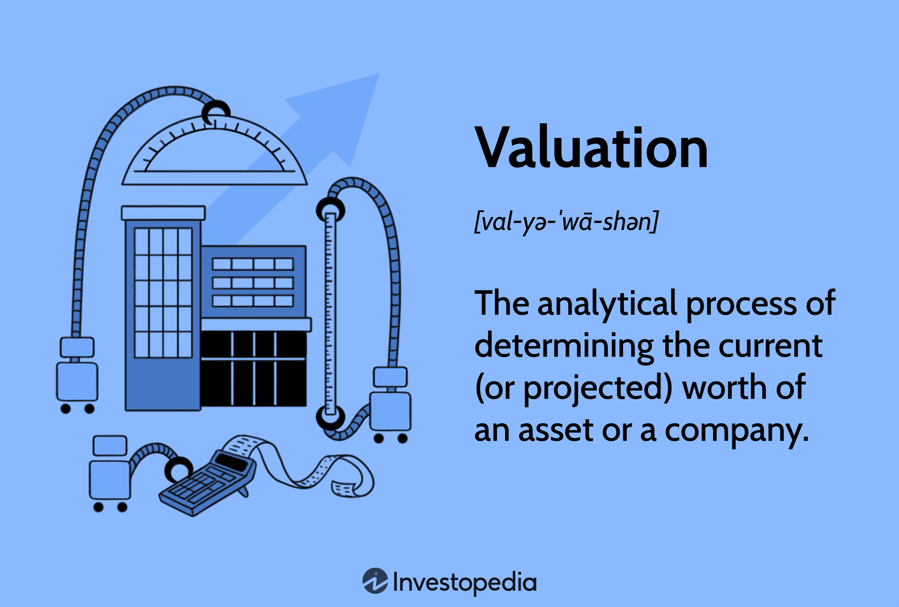

## Table of Contents

## What is valuation analysis and why is it important?

Valuation analysis is a way to figure out how much a business, a piece of property, or an investment is worth. It's like trying to find out the price tag of something that doesn't have a clear price. People use different methods and formulas to come up with this number, looking at things like how much money the business makes, what it owns, and what other similar businesses are worth.

It's important because it helps people make smart decisions about buying, selling, or investing in something. If you know the true value of a business, you can decide if it's a good deal or if you should walk away. It's also useful for business owners who want to know how their company is doing and for investors who want to see if their investments are growing in value. Without valuation analysis, people might end up overpaying or missing out on good opportunities.

## What are the basic concepts and principles of valuation?

Valuation is all about figuring out what something is worth. The main idea is to come up with a number that shows the true value of a business, property, or investment. To do this, people use different methods, like looking at how much money the business makes (income approach), what it owns and owes (asset-based approach), or comparing it to similar businesses that have been sold (market approach). Each method has its own way of calculating value, but they all aim to answer the same question: "How much is this worth?"

There are some basic principles that guide valuation. One big principle is the idea of fair market value, which means the price that a willing buyer and a willing seller would agree on if they both know all the important facts and neither is forced to buy or sell. Another principle is the time value of money, which says that a dollar today is worth more than a dollar in the future because you can invest it and earn interest. Lastly, the principle of highest and best use says that the value of something should be based on its most profitable use. These principles help make sure that valuations are as accurate and fair as possible.

## What are the different methods used in valuation analysis?

Valuation analysis uses different methods to figure out what something is worth. One common method is the income approach, which looks at how much money a business makes. This method often uses a formula called discounted cash flow (DCF), where future earnings are predicted and then adjusted to today's value using the time value of money. Another method is the asset-based approach, which adds up everything the business owns (like buildings, equipment, and inventory) and subtracts what it owes (like loans and debts). This gives you the net asset value, which can be a good way to value companies that own a lot of physical stuff.

Another popular method is the market approach, which compares the business to similar ones that have been sold recently. This method uses something called multiples, like the price-to-earnings (P/E) ratio, to see what other businesses are worth and then applies that to the business being valued. For example, if similar businesses sell for 10 times their annual earnings, you might use that multiple to value your business. Each method has its strengths and weaknesses, so often people use more than one to get a better overall picture of what something is worth.

Sometimes, other methods are used too, like the cost approach, which looks at how much it would cost to replace the business or its assets from scratch. This can be useful for valuing unique or specialized businesses. No single method is perfect for every situation, so it's important to choose the right one based on what you're trying to value and why. By understanding these different methods, you can make smarter decisions about buying, selling, or investing in businesses and other assets.

## How do you perform a simple valuation using the discounted cash flow (DCF) method?

To perform a simple valuation using the discounted cash flow (DCF) method, you first need to predict how much money the business will make in the future. This means looking at the company's past earnings and thinking about things like growth and market changes to guess what its future cash flows might be. You usually do this for a few years into the future, maybe five or ten years. Once you have these future cash flow estimates, you need to adjust them to today's value. This is because money you get in the future is worth less than money you get today, thanks to things like inflation and investment opportunities. You use a discount rate to do this, which is often based on the company's cost of capital or what investors expect to earn.

After you've discounted all the future cash flows, you add them up to get the present value of those cash flows. But businesses usually keep making money even after your forecast period, so you need to figure out the value of all the cash flows beyond your forecast too. This is called the terminal value, and there are different ways to calculate it, but a common one is to assume the business will grow at a steady rate forever. You discount this terminal value back to today as well. Finally, you add the present value of the forecasted cash flows and the discounted terminal value together. This total gives you the estimated value of the business using the DCF method. It's a way to see if the business is worth more or less than what it's currently selling for.

## What are the key financial metrics used in valuation analysis?

In valuation analysis, several key financial metrics help us figure out what a business is worth. One important metric is earnings, which shows how much profit the business makes. This can be measured in different ways, like earnings before interest and taxes (EBIT) or net income, which is the profit after all expenses. Another key metric is cash flow, which is the money that comes in and goes out of the business. Free cash flow, which is the cash left after the business pays for its operations and investments, is especially important for the discounted cash flow (DCF) method. Lastly, multiples like the price-to-earnings (P/E) ratio compare the business's value to its earnings, helping us see if it's priced fairly compared to other similar businesses.

Other useful metrics include the return on equity (ROE), which shows how well the business uses the money invested in it to generate profits, and the return on assets (ROA), which measures how efficiently the business uses its assets to make money. The debt-to-equity ratio tells us about the business's financial health by showing how much it relies on borrowed money compared to its own funds. These metrics give us a clearer picture of the business's performance and help us make better guesses about its future value. By looking at these numbers, we can decide if a business is a good investment or if its current price is too high or too low.

## How do market conditions affect valuation?

Market conditions play a big role in how much a business or an investment is worth. When the economy is doing well, people feel more confident about spending and investing. This can make businesses more valuable because they're likely to make more money. On the other hand, if the economy is struggling, people might be more cautious with their money. This can lower the value of businesses because they might not make as much profit. Things like interest rates, inflation, and even big world events can change how people see the market and affect what they're willing to pay for a business.

Also, what's happening in the specific industry of the business matters a lot. If the industry is growing and there's a lot of demand for what the business does, its value can go up. For example, if there's a new technology that everyone wants, companies in that tech industry might be worth more. But if the industry is shrinking or facing a lot of competition, the business might be worth less. So, when figuring out a business's value, it's important to look at both the big picture of the economy and what's happening in the business's own industry.

## What are the common challenges and pitfalls in valuation analysis?

Valuation analysis can be tricky because it's hard to predict the future. When you're trying to figure out how much a business is worth, you have to guess how much money it will make in the future. But the future is uncertain, and things like economic changes, new competitors, or unexpected events can mess up your predictions. This makes it tough to come up with a number that everyone agrees on. Also, different people might use different methods to value the same business, and these methods can give very different results. For example, one person might focus on the business's earnings, while another might look at its assets. This can lead to disagreements about what the business is really worth.

Another challenge is getting all the right information. Sometimes, the data you need to do a good valuation isn't easy to find or might not be completely accurate. If you're missing important details or if the numbers you're using are wrong, your valuation could be way off. Plus, people can be biased. They might want the business to be worth more or less than it really is, and this can affect how they do the valuation. It's important to be as fair and objective as possible, but it's not always easy. These challenges and pitfalls mean that valuation analysis is more of an art than a science, and it takes a lot of care and skill to get it right.

## How can valuation analysis be applied to different types of assets, such as stocks, real estate, and businesses?

Valuation analysis can be used to figure out the value of different kinds of assets, like stocks, real estate, and businesses. For stocks, you might use the discounted cash flow (DCF) method to predict how much money the company will make in the future and then figure out what that's worth today. Another way is to use multiples, like the price-to-earnings (P/E) ratio, to see how the stock's price compares to its earnings. This helps you decide if the stock is a good buy or if it's overpriced. For real estate, you might look at how much money the property could make if it's rented out, or you might compare it to similar properties that have been sold recently. This gives you an idea of what the property is worth based on what people are willing to pay for similar places.

When it comes to valuing a whole business, you can use different methods depending on what you're looking at. The income approach looks at the business's earnings and uses the DCF method to figure out its value. The asset-based approach adds up everything the business owns and subtracts what it owes to find its net worth. The market approach compares the business to similar ones that have been sold to see what it might be worth. Each method has its own way of figuring out value, but they all help you understand if the business is a good investment or if its price is too high. By using valuation analysis, you can make smarter decisions about buying, selling, or investing in different types of assets.

## What advanced techniques can be used to refine valuation estimates?

To get better at figuring out how much something is worth, you can use some advanced tricks. One way is to use something called Monte Carlo simulations. This is a fancy way of saying you run your valuation a bunch of times with different guesses about the future. It helps you see all the different ways things could go and gives you a range of possible values instead of just one number. Another trick is to use real options valuation, which is like looking at a business as if it has choices it can make in the future, kind of like options in the stock market. This can be useful for businesses that might grow or change a lot, because it helps you see the value of those future choices.

Another advanced technique is to use something called regression analysis. This is a way to look at a bunch of numbers and see how they're related. For example, you might use it to see how a business's value changes with things like interest rates or how the economy is doing. This can help you make better guesses about the future. Also, sensitivity analysis is a good way to see how small changes in your guesses can change your valuation. By playing around with different numbers and seeing how they affect the final value, you can get a better idea of what's important and what's not. These advanced techniques can help make your valuation more accurate and give you a better understanding of what something is really worth.

## How do you incorporate risk and uncertainty into valuation models?

When you're trying to figure out how much a business or investment is worth, you need to think about risk and uncertainty. These things can make a big difference in your valuation. One way to do this is by using a higher discount rate in the discounted cash flow (DCF) method. The discount rate is like a guess about how much risk there is. If you think the business is risky, you use a higher rate, which makes the future cash flows worth less today. Another way is to use something called scenario analysis. This means you look at different stories about how the future might go, like a best-case scenario, a worst-case scenario, and a middle-of-the-road scenario. By seeing how your valuation changes in each story, you can get a better idea of how much uncertainty there is.

Another way to deal with risk and uncertainty is to use Monte Carlo simulations. This sounds complicated, but it's just a way to run your valuation many times with different guesses about the future. It helps you see all the possible outcomes and gives you a range of values instead of just one number. This can show you how likely it is that the business will be worth more or less than you thought. Also, sensitivity analysis can help. This is when you change one thing at a time, like the growth rate or the discount rate, and see how it affects your valuation. By doing this, you can see which guesses are the most important and where you need to be careful. All these methods help you make your valuation more realistic by taking into account the risks and uncertainties that are always there in the real world.

## What role does valuation play in mergers and acquisitions?

Valuation is really important when companies are thinking about merging or being bought out. It helps figure out a fair price for the deal. When one company wants to buy another, they need to know how much the other company is worth. They look at things like how much money the company makes, what it owns, and what similar companies have sold for. This helps them decide if the price they're thinking about is too high, too low, or just right. If the valuation shows the company is worth a lot, the buyer might have to offer more money to get the deal done. But if the valuation is low, they might be able to buy it for less.

In a merger, both companies need to agree on what each is worth so they can figure out how to split the new company. If one company thinks it's worth more than the other company agrees with, it can cause problems. That's why both sides do their own valuations to make sure they're getting a fair deal. Sometimes, they even hire experts to help them. Getting the valuation right is key to making sure the merger or acquisition goes smoothly and that both sides are happy with the final agreement.

## How can valuation analysis be used for strategic decision-making in a corporate setting?

Valuation analysis helps companies make smart choices about what to do next. When a company is thinking about starting a new project, buying another business, or selling off a part of their own business, they use valuation to see if it's a good idea. By figuring out how much these things are worth, the company can decide if the project will make them more money or if the business they want to buy is a good deal. This helps them use their money in the best way possible, so they can grow and make more profit.

Valuation also helps companies understand their own value, which is important for planning and making decisions. If a company knows it's worth a lot, it might decide to borrow money to grow even more, because it knows it can pay back the loan. Or if the valuation shows the company isn't doing as well as it could, the leaders might decide to change their plans or fix some problems. By using valuation analysis, companies can make better choices about what to do and how to do it, which helps them succeed in the long run.

## What is Understanding Financial Valuation?

Financial valuation is the systematic approach to determining the worth of an asset or company, which is crucial for making informed investment decisions. This process fundamentally relies on a comprehensive analysis of financial statements, market trends, and prevailing economic conditions. By evaluating these factors, investors can gauge the intrinsic value of an asset and assess whether it is overvalued or undervalued in the current market context.

Two key methodologies in financial valuation are the Discounted Cash Flow (DCF) analysis and the Dividend Discount Model (DDM). These methods provide structured frameworks for estimating value based on expected future benefits.

1. **Discounted Cash Flow (DCF) Methodology**: The DCF method involves estimating the present value of an asset based on its expected future cash flows. This approach considers:
$$
   \text{DCF} = \sum \frac{CF_t}{(1 + r)^t}

$$

   where $CF_t$ represents the cash flow at time $t$, and $r$ denotes the discount rate reflecting the risk and time value of money. By discounting future cash flows to the present, investors can compare the calculated intrinsic value against the market price to identify potential investment opportunities.

2. **Dividend Discount Model (DDM)**: The DDM is particularly useful for valuing companies that pay steady dividends. It posits that the intrinsic value of a stock is equal to the present value of all future expected dividends. The formula for a simple DDM is:
$$
   \text{P}_0 = \frac{D_1}{r - g}

$$

   where $P_0$ is the present stock price, $D_1$ represents the expected dividend in the next period, $r$ is the required rate of return, and $g$ is the growth rate of dividends. The model assumes that dividends will grow at a constant rate indefinitely.

Both methodologies demand a keen understanding of financial forecasts and assumptions, such as the growth rates and discount rates applicable to the specific asset or firm. By integrating these valuation models, investors are better equipped to dissect the numerous variables impacting an asset's market value, thereby supporting strategic decision-making aligned with their investment goals.

Overall, financial valuation not only identifies the financial health and performance potential of companies but also reinforces a disciplined approach to evaluating investment opportunities in a volatile market landscape.

## What are the techniques and methods used in valuation analysis?

Valuation analysis is a critical component in assessing the intrinsic value of an asset, primarily leveraging quantitative techniques to ascertain whether securities are priced appropriately. This analysis often involves two principal methodologies: Relative Valuation and Absolute Valuation, each offering a unique framework to evaluate assets.

Relative Valuation, often referred to as market-based valuation, involves comparing the financial metrics of one company to those of similar firms in the industry. This approach frequently uses financial ratios, such as the Price-to-Earnings (P/E) ratio and the Price-to-Book (P/B) ratio. These ratios allow investors to determine how a company is valued in relation to its peers. For example, the P/E ratio, calculated as the market price per share divided by the earnings per share (EPS), indicates how much investors are willing to pay per dollar of earnings. A higher P/E ratio may suggest that a company is overvalued compared to its competitors, while a lower ratio could indicate undervaluation.

Absolute Valuation, in contrast, focuses on the fundamental characteristics of a company, such as cash flows, dividends, and growth rates, to arrive at an asset's intrinsic value. This method often employs models like the Discounted Cash Flow (DCF) and the Dividend Discount Model (DDM). The DCF model calculates an asset's value based on its expected future cash flows, which are adjusted for the time value of money. The formula for a simple DCF can be expressed as:

$$
V = \sum \frac{CF_t}{(1 + r)^t}
$$

where $V$ represents the intrinsic value, $CF_t$ denotes the cash flow at time $t$, and $r$ is the discount rate. The DDM is specifically used for valuing companies that regularly distribute dividends, estimating the present value of expected dividends.

The selection between Relative and Absolute Valuation depends significantly on the type of asset being assessed and the prevailing market conditions. Relative Valuation is particularly useful in stable industries where comparables are easily identified. On the other hand, Absolute Valuation is often most effective for companies with predictable and stable cash flows, such as utility firms or mature companies with consistent dividend payments.

In contemporary finance, a blend of these valuation techniques often yields the most comprehensive insights, allowing investors to substantiate their decisions with corroborated data from multiple valuation frameworks.

## References & Further Reading

Comprehensive resources like 'Valuation: Measuring and Managing the Value of Companies' by McKinsey & Company assist investors and financial analysts in understanding the intricate elements of valuation. This book is a vital tool, providing frameworks and methodologies that are essential for evaluating company worth and making informed investment decisions. For those focused on algorithmic trading, 'Algorithmic Trading and DMA' by Barry Johnson provides detailed insights into creating and implementing sophisticated trading strategies using direct market access technologies.

Academic research plays a crucial role in advancing the understanding of financial markets. Articles by renowned economists like Eugene Fama, known for the Efficient Market Hypothesis, and Fischer Black and Myron Scholes, who developed the Black-Scholes model for option pricing, offer foundational knowledge critical for both valuation and trading. Exploring these works can provide a deeper comprehension of market dynamics and valuation techniques.

For practical applications, online courses and guides are invaluable. Platforms such as Coursera and edX offer comprehensive courses on financial valuation and algorithmic trading. These courses typically cover theoretical concepts while also providing hands-on experience through projects and case studies. For instance, Python is a widely used language for implementing algorithmic trading strategies due to its robust libraries like Pandas for data manipulation and NumPy for numerical computations. Such resources enable learners to develop skills necessary for crafting effective investment strategies and engaging with real-world financial markets.

