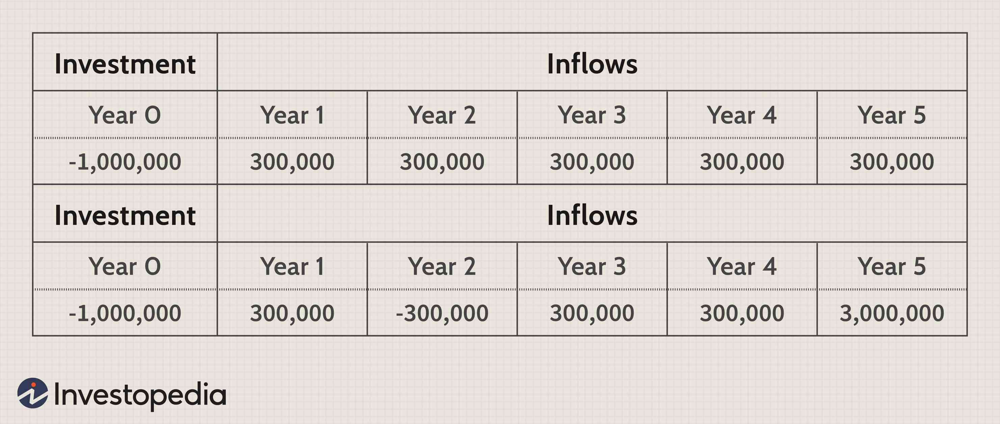

## Table of Contents

## What is the definition of an emerging market?

An emerging market is a country that is working on growing its economy. It is not as advanced as countries like the United States or Japan, but it is trying to improve and develop. These countries often have a lot of potential for growth because they are still building their industries and infrastructure.

Emerging markets can be found in places like Asia, Latin America, and Africa. They attract investors because they offer the chance to make good profits. However, investing in these markets can also be risky because their economies can be less stable than those of developed countries.

## Why is it important to understand the valuation of companies in emerging markets?

Understanding the valuation of companies in emerging markets is important because it helps investors make smart choices. When you know how much a company is worth, you can decide if it's a good idea to invest your money in it. In emerging markets, where things can change quickly, knowing the right value of a company can help you see if it's a good deal or if it's too expensive.

Also, emerging markets can be riskier than more developed markets. By understanding a company's valuation, you can better understand these risks. For example, if a company seems to be worth a lot more than what it's actually selling for, it might be a sign that the market is too excited about it, and there could be a bubble. On the other hand, if a company is undervalued, it might be a hidden gem that could grow a lot in the future. Knowing these things can help you make safer and smarter investment choices.

## What are the common methods used to value companies in any market?

There are several common methods used to value companies in any market. One popular method is the Price-to-Earnings (P/E) ratio, which compares a company's stock price to its earnings per share. This helps investors see if a company's stock is priced fairly compared to how much money it makes. Another method is the Discounted Cash Flow (DCF) analysis, which looks at the money a company is expected to make in the future and then figures out what that money is worth today. This method is useful because it takes into account the time value of money, meaning that money today is worth more than the same amount of money in the future.

Another common method is the Comparable Company Analysis, where you look at similar companies to see how they are valued. This helps you understand if the company you're looking at is priced similarly to its peers. The Asset-Based Valuation method is also used, which adds up all the company's assets and subtracts its liabilities to find out its net worth. This method is especially useful for companies that have a lot of physical assets, like factories or real estate. Each of these methods has its own strengths and can be used depending on the specific situation and the type of company being valued.

## How do economic and political factors in emerging markets affect company valuation?

Economic and political factors in emerging markets can have a big impact on how companies are valued. For example, if a country's economy is growing fast, people might think that companies in that country will make more money in the future. This can make their stock prices go up. But if the economy is not doing well, or if there is a lot of inflation, people might worry that companies will not do as well, and their stock prices might go down. Also, if a country has a lot of debt, it can make investors nervous because they might think the government will have to raise taxes or do other things that could hurt businesses.

Political factors are also important. If a country has a stable government that makes good laws for businesses, companies might be valued higher because people trust that the government will help them grow. But if there is a lot of political unrest or if the government changes a lot, it can make investors worried. They might think that new laws could hurt businesses or that the country could become less safe for investing. All these things can make the value of companies in emerging markets go up or down, depending on what is happening in the country.

## What are the key financial metrics to consider when valuing companies in emerging markets?

When valuing companies in emerging markets, it's important to look at some key financial metrics. One of the main ones is the Price-to-Earnings (P/E) ratio. This tells you how much you're paying for each dollar of the company's earnings. A lower P/E ratio might mean the company is a good deal, but in emerging markets, you have to be careful because the economy can be more unpredictable. Another important metric is the Price-to-Book (P/B) ratio, which compares the market value of a company to its book value. This can help you see if the company's assets are worth more than what the stock market says.

Another metric to consider is the Return on Equity (ROE), which shows how well a company is using the money shareholders have invested to make a profit. A high ROE can be a good sign, but you need to compare it with other companies in the same market to see if it's really good. Also, looking at the company's Debt-to-Equity (D/E) ratio is helpful. This tells you how much debt the company has compared to its equity. In emerging markets, where economic conditions can change quickly, a high debt level can be risky. By looking at these metrics, you can get a better idea of whether a company in an emerging market is a good investment.

## How does currency risk impact the valuation of companies in emerging markets?

Currency risk can have a big impact on how much companies in emerging markets are worth. When you invest in a company from another country, you have to think about how changes in the value of that country's money might affect your investment. If the currency of the emerging market goes down compared to your own currency, the value of your investment might go down too, even if the company itself is doing well. This is because when you want to change the money you made back into your own currency, you'll get less of it.

On the other hand, if the currency of the emerging market goes up, your investment could be worth more when you convert it back to your own currency. This makes currency risk a big thing to think about when you're trying to figure out if a company in an emerging market is a good investment. It can make the value of the company seem higher or lower, depending on what happens with the currency. So, it's important to keep an eye on currency movements and understand how they might affect the value of the company you're looking at.

## What role do local accounting standards play in the valuation process?

Local accounting standards can make a big difference when you're trying to figure out how much a company in an emerging market is worth. Different countries have their own rules for how companies should keep track of their money and report it. These rules can change how a company's profits, debts, and assets look on paper. For example, one country might let companies use a method that makes their profits look bigger, while another country might have stricter rules that make profits look smaller. This can make it hard to compare companies from different countries and can affect how much you think a company is worth.

Because of these differences, it's important to understand the local accounting standards when you're valuing a company. If you don't, you might think a company is worth more or less than it really is. Sometimes, companies in emerging markets might not follow the same high standards as companies in more developed countries, which can make their financial reports less reliable. So, when you're looking at a company's value, you need to take a close look at their financial statements and understand the local rules to get a true picture of what the company is worth.

## How can one adjust valuation models to account for higher volatility in emerging markets?

When valuing companies in emerging markets, you have to think about how much more the economy can change compared to more stable markets. These markets can go up and down a lot more, so you need to adjust your valuation models to deal with this. One way to do this is by using a higher discount rate in your Discounted Cash Flow (DCF) analysis. A higher discount rate means you're expecting more risk, so you're lowering the value of the company's future earnings to account for that risk. This can help you get a more realistic idea of what the company might be worth in a place where things can change quickly.

Another way to adjust for [volatility](/wiki/volatility-trading-strategies) is by using scenario analysis. This means you look at different possible futures for the company and the economy, from the best-case scenario to the worst-case scenario. By thinking about how the company might do in each of these situations, you can get a better sense of the range of possible values for the company. This can help you make a safer investment decision because you're not just looking at one possible future, but many. It's a good way to deal with the uncertainty that comes with investing in emerging markets.

## What are the challenges of obtaining reliable data in emerging markets?

Getting reliable data in emerging markets can be really hard. One big problem is that the rules for how companies report their money can be different from one country to another. This makes it tough to trust the numbers you see because they might not be as accurate or complete as what you'd find in more developed countries. Also, some companies in emerging markets might not have to share as much information as companies in other places, so you might not get all the details you need to make a good decision about their value.

Another challenge is that the systems for collecting and sharing data in emerging markets might not be as good. This can mean that the information you get is out of date or just not very detailed. Sometimes, the government or other groups might not have the resources or the technology to keep good records, which makes it even harder to find reliable data. All these things together can make it really tricky to figure out how much a company in an emerging market is really worth.

## How do cultural and business practices influence company valuations in different emerging markets?

Cultural and business practices can really change how much a company in an emerging market is worth. In some places, people might trust family businesses more than big companies. This can make family-run companies seem more valuable because people feel safer investing in them. Also, the way people do business can be different. For example, in some countries, it's common to build strong relationships before making deals. This can affect how fast a company grows and how much money it makes, which in turn affects its value.

Another thing to think about is how much people in different cultures care about things like the environment or social responsibility. In some emerging markets, companies that focus on these things might be seen as more valuable because they fit with what people want. But in other places, these things might not matter as much, so companies that don't focus on them might still be valued highly. Understanding these cultural and business differences is important because they can make a big difference in how much a company is worth in different emerging markets.

## What advanced valuation techniques are particularly useful for companies in emerging markets?

One advanced valuation technique that's really helpful for companies in emerging markets is called the Monte Carlo Simulation. This method helps you see how different things, like changes in the economy or currency rates, might affect a company's value. It does this by running a lot of different scenarios and showing you a range of possible outcomes. This is super useful in emerging markets because things can change a lot, and this technique helps you understand the risks better. By looking at all these different possibilities, you can make smarter choices about whether a company is a good investment.

Another useful technique is the Real Options Valuation. This method looks at a company like it's a series of choices or "options" that can be used in the future. In emerging markets, where things can be unpredictable, this way of thinking can help you see the value in a company's ability to change and grow. For example, a company might have the option to expand into new markets or start new projects if things go well. By valuing these options, you can get a better idea of what the company might be worth, even if the future is uncertain. This can help you see the potential in a company that might not look valuable if you just look at its current numbers.

## How can investors mitigate risks associated with investing in companies in emerging markets?

Investors can lower the risks of putting money into companies in emerging markets by spreading their investments around. This means not putting all their money into just one company or one country. By investing in different places and different kinds of businesses, they can protect themselves if one investment doesn't do well. Another way to reduce risk is by doing a lot of research. This means looking closely at a company's financial reports, understanding the local economy, and keeping an eye on political changes. The more you know, the better you can predict what might happen and make smarter choices.

Using tools like currency hedging can also help. This means taking steps to protect against changes in the value of the local money. For example, if the currency of the emerging market goes down, currency hedging can help make sure you don't lose as much money when you change it back to your own currency. Finally, working with local experts or advisors who know the market well can be a big help. They can give you advice based on their experience and help you understand things that might be hard to see from the outside. By using these strategies, investors can feel more confident about putting their money into emerging markets.

## References & Further Reading

#