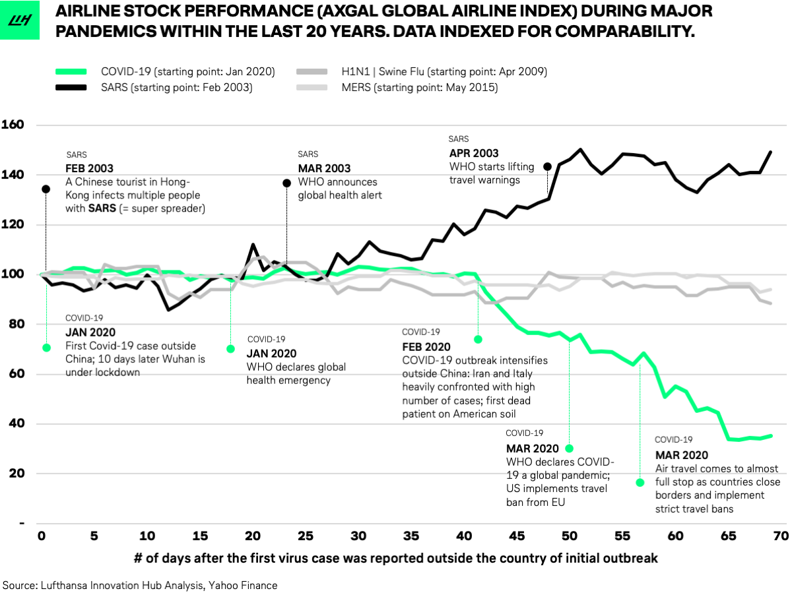

## Table of Contents

## What are airline stocks and why are they important?

Airline stocks are shares of companies that operate airplanes to carry passengers and cargo. These companies, like Delta, American Airlines, and Southwest, are part of the airline industry. When you buy airline stocks, you are buying a small piece of these companies. The price of these stocks can go up or down based on how well the company is doing, how many people are flying, and other factors like the price of fuel.

Airline stocks are important for a few reasons. First, they give investors a way to make money if the airline industry does well. If more people are flying and the companies are making more money, the stock prices might go up. Second, airline stocks can show us how the economy is doing. When people feel good about their money, they might fly more, which can make airline stocks go up. If people are worried about their money, they might fly less, and airline stocks might go down. So, watching airline stocks can help us understand what is happening in the economy.

## How do airline stocks differ from other types of stocks?

Airline stocks are different from other types of stocks because they are specifically tied to the airline industry. This means their performance depends a lot on things like how many people are flying, the price of jet fuel, and how well the airline manages its routes and schedules. For example, if fuel prices go up a lot, it can hurt airline stocks more than it might hurt a company that makes computers. Also, things like weather or global events can affect how many people fly, which can make airline stocks go up or down more than other stocks.

Another way airline stocks differ is in how sensitive they are to the economy. When the economy is doing well, people might have more money to spend on travel, which can make airline stocks do better. But when the economy is not doing well, people might cut back on travel, and airline stocks can suffer more than other types of stocks. This makes airline stocks a bit riskier but also potentially more rewarding if the economy is strong. So, if you're thinking about investing in airline stocks, it's important to keep an eye on both the airline industry and the overall economy.

## What are the basic financial metrics used to value airline stocks?

When people want to know how much an airline stock is worth, they look at a few important numbers. One of these numbers is the price-to-earnings ratio, or P/E ratio. This tells you how much you are paying for each dollar of the company's earnings. A lower P/E ratio might mean the stock is a good deal, but you have to compare it with other airlines to be sure. Another number is the load factor, which shows how full the planes are. A higher load factor usually means the airline is doing well because they are carrying more passengers and making more money.

Another important number is the operating margin. This tells you how much money the airline makes after paying for things like fuel, salaries, and other costs. A higher operating margin is good because it means the airline is good at making money. Finally, people also look at the debt-to-equity ratio. This number shows how much the airline owes compared to what it owns. A lower debt-to-equity ratio can be a sign that the airline is in good financial health and might be a safer investment. By looking at these numbers, you can get a better idea of whether an airline stock is a good investment.

## How do economic cycles affect the valuation of airline stocks?

Economic cycles have a big impact on how much airline stocks are worth. When the economy is doing well, people have more money to spend on things like travel. This means more people fly, which is good for airlines. More passengers mean more money for the airlines, so their stocks can go up in value. During good economic times, airlines might also add new routes or buy new planes, which can make investors feel good about the company's future and drive the stock price even higher.

On the other hand, when the economy is not doing well, people might not have as much money to spend on travel. This means fewer people fly, and airlines make less money. When airlines make less money, their stocks can go down in value. During bad economic times, airlines might have to cut back on flights or even lay off workers, which can make investors worried about the company's future. So, the value of airline stocks can go up and down a lot depending on how the economy is doing.

## What role do fuel prices play in the valuation of airline stocks?

Fuel prices are a big deal for airlines because they have to buy a lot of jet fuel to fly their planes. When fuel prices go up, it costs the airlines more money to operate their flights. This can make their profits go down because they have to spend more on fuel and might not be able to charge passengers more to cover the extra cost. When profits go down, the value of the airline's stock can also go down because investors see that the company is making less money.

On the other hand, when fuel prices go down, it's good news for airlines. They spend less money on fuel, which means they can keep more of their earnings as profit. When airlines make more profit, their stock prices can go up because investors are happy that the company is doing well. So, fuel prices can make a big difference in how much airline stocks are worth, and investors keep a close eye on them.

## How do regulatory changes impact airline stock valuation?

Regulatory changes can have a big impact on how much airline stocks are worth. When the government makes new rules or changes old ones, it can affect how airlines run their business. For example, if new rules make it harder for airlines to fly certain routes or if they have to spend more money to meet new safety standards, it can cost them a lot of money. This can make their profits go down, and when profits go down, the value of their stocks can go down too.

On the other hand, if the government makes rules that help airlines, like giving them money or making it easier for them to fly new routes, it can be good for their business. When airlines can make more money because of these rules, their stocks can go up in value. So, investors always keep an eye on what the government is doing because regulatory changes can really move the price of airline stocks up or down.

## What are the key performance indicators (KPIs) specific to the airline industry that investors should monitor?

When investors want to know how an airline is doing, they look at a few key performance indicators, or KPIs. One important KPI is the load factor, which tells you how full the planes are. A higher load factor means more passengers are flying, which usually means the airline is making more money. Another KPI is the revenue per available seat mile (RASM), which shows how much money the airline makes for each seat they fly one mile. A higher RASM is good because it means the airline is good at making money from its flights.

Another KPI investors watch is the cost per available seat mile (CASM), which tells you how much it costs the airline to fly one seat one mile. If the CASM is low, it means the airline is good at keeping costs down, which can help them make more profit. Finally, the on-time performance is also important. This KPI shows how often the airline's flights leave and arrive on time. Good on-time performance can make passengers happy and more likely to fly with that airline again, which can help the airline's stock price.

## How can investors use discounted cash flow (DCF) analysis to value airline stocks?

Investors can use a method called discounted cash flow (DCF) analysis to figure out how much an airline stock is worth. This method looks at how much money the airline is expected to make in the future and then brings that money back to today's value. To do this, investors guess how much money the airline will make each year and then use a discount rate to figure out what that money is worth now. The discount rate is like the [interest rate](/wiki/interest-rate-trading-strategies) and takes into account how risky it is to invest in the airline. If the airline is expected to make a lot of money in the future, and the risk is not too high, the DCF analysis might show that the stock is worth more than its current price.

However, using DCF analysis for airline stocks can be tricky because the airline business can be very up and down. Things like fuel prices, how many people are flying, and even the weather can change a lot from year to year. This makes it hard to guess how much money the airline will make in the future. So, investors need to be careful and think about all these things when they use DCF analysis. They might also look at other ways to value the stock, like comparing it to other airlines or looking at how much the company owns compared to what it owes.

## What are the common valuation multiples used in the airline industry and how are they applied?

In the airline industry, investors often use valuation multiples like the price-to-earnings (P/E) ratio and the enterprise value-to-EBITDA (EV/EBITDA) ratio to figure out how much a stock is worth. The P/E ratio tells you how much you are paying for each dollar of the company's earnings. You find it by dividing the stock price by the earnings per share. A lower P/E ratio might mean the stock is a good deal, but you need to compare it with other airlines to know for sure. The EV/EBITDA ratio looks at the whole value of the company, including its debt, compared to its earnings before interest, taxes, depreciation, and amortization. This ratio can show how the company is doing without being affected too much by how it is financed or how old its planes are.

To apply these multiples, investors compare them to other airlines or to the company's own history. For example, if an airline's P/E ratio is lower than other airlines in the same market, it might be seen as a good investment. But if it's higher, investors might think the stock is too expensive. The same goes for the EV/EBITDA ratio. If it's lower than other airlines, the stock might be a good buy. But if it's higher, the stock might be overpriced. By looking at these multiples and comparing them, investors can get a better idea of whether an airline stock is a good investment or not.

## How do geopolitical events influence the valuation of airline stocks?

Geopolitical events can really shake up the value of airline stocks. When there's trouble like wars, political disagreements, or new rules between countries, it can mess with how airlines fly their routes. If a country closes its airspace or if there's a big fight, airlines might have to change their flights or even stop flying to some places. This can make them lose money because fewer people will want to fly where it's not safe. When airlines make less money, their stock prices can go down because investors get worried about the future.

But sometimes, geopolitical events can be good for airline stocks. For example, if two countries start to get along better and open up new routes, airlines can make more money by flying to new places. More flights can mean more passengers and more profit. When airlines do better, their stock prices can go up because investors feel good about the company's future. So, keeping an eye on what's happening around the world is important for anyone thinking about investing in airline stocks.

## What advanced financial models can be used to predict future performance of airline stocks?

One advanced financial model that can be used to predict the future performance of airline stocks is the Monte Carlo simulation. This model uses a lot of random guesses to see what might happen in the future. It takes into account things like how many people might fly, what fuel prices might be, and what the economy might do. By running these guesses many times, the model can show different possible futures for the airline's stock price. This helps investors see not just one guess but a whole range of what might happen, which can be really helpful when the airline business is so unpredictable.

Another useful model is the regression analysis. This model looks at past data to find patterns that can help predict the future. For example, it might look at how changes in fuel prices or the number of passengers have affected the stock price in the past. By understanding these patterns, the model can make guesses about what might happen if those things change in the future. While this model can't predict everything, it can give investors a good idea of how different factors might affect the airline's stock price. Both of these models help investors make smarter choices by giving them a better picture of what might happen with airline stocks.

## How do mergers and acquisitions within the airline industry affect stock valuation?

Mergers and acquisitions in the airline industry can change how much a stock is worth. When two airlines decide to join together or one buys another, it can make the new, bigger airline stronger. They might be able to fly to more places, have more planes, and save money by working together. This can make investors feel good about the company's future, so the stock price might go up. But sometimes, mergers and acquisitions can be risky. They can cost a lot of money and take a long time to finish. If investors think the merger might not work out or that it's too expensive, the stock price might go down.

Another thing to think about is how the merger or acquisition might change the competition in the airline industry. If a big airline buys a smaller one, it might be able to charge more for tickets because there are fewer other airlines to choose from. This can be good for the stock price because the airline might make more money. But if the merger makes the government worried about too much control in the industry, they might make new rules or even stop the merger. This can make investors nervous, and the stock price might go down because of the uncertainty. So, mergers and acquisitions can have a big impact on how much an airline stock is worth, but it depends on how investors see the future of the new airline.

## What are the investment valuation metrics for airlines?

When evaluating airline stocks, investors rely on specific valuation metrics to assess a company's financial health and operational efficiency. Among these, the Enterprise Value to EBITDAR (EV/EBITDAR) ratio is prominently used. This financial measure provides insight into an airline's operational profitability, excluding factors such as interest, taxes, depreciation, amortization, and restructuring or rent costs—a critical [factor](/wiki/factor-investing) given that many airlines lease a significant portion of their fleets.

### Enterprise Value to EBITDAR (EV/EBITDAR)

Enterprise Value (EV) is calculated as the sum of a company's market capitalization, debt, minority interest, and preferred shares, minus total cash and cash equivalents. EBITDAR stands for Earnings Before Interest, Taxes, Depreciation, Amortization, and Rent costs. The formula is:

$$
\text{EV/EBITDAR} = \frac{\text{Enterprise Value}}{\text{EBITDAR}}
$$

This ratio helps investors compare companies within the airline industry, accounting for differences in capital structure and leasing. A lower EV/EBITDAR ratio might indicate that the airline is undervalued relative to its peers, while a higher ratio could suggest potential overvaluation.

### Free Cash Flow Yield

Free Cash Flow Yield is another critical metric, reflecting how efficiently a company generates cash relative to its market value. It is calculated by dividing the free cash flow (FCF) by the company's market capitalization:

$$
\text{Free Cash Flow Yield} = \frac{\text{Free Cash Flow}}{\text{Market Capitalization}}
$$

Free Cash Flow (FCF) is derived from operating cash flow minus capital expenditures, representing the cash available to shareholders after necessary investments in the business. A high free cash flow yield could indicate that an airline efficiently generates cash, potentially offering attractive returns to investors, while a low yield might signal inefficiencies or overvaluation.

### Comparative Analysis

Both EV/EBITDAR and Free Cash Flow Yield are best analyzed in the context of industry peers and historical data. Comparing these metrics across competitors and over time can provide valuable insights into relative performance. This comparative analysis helps investors understand whether an airline's stock is priced attractively given its financial and operational metrics, assisting in making informed investment decisions.

## References & Further Reading

[1]: ["Fuel Hedging in the Airline Industry: The Case of Southwest Airlines"](https://papers.ssrn.com/sol3/papers.cfm?abstract_id=578663) by Tufano, P. Harvard Business Review.

[2]: Feng, Z., & Wang, W. (2010). ["Determinants of Credit Spreads: Evidence from the US Listed Airline Industry."](https://www.sciencedirect.com/science/article/pii/S1062940819302700) Journal of Air Transport Management.

[3]: Simchi-Levi, D., & Wang, H. (2018). ["Valuing American Airlines’ Capacity Purchase Agreements."](https://onlinelibrary.wiley.com/doi/abs/10.1111/poms.12887) Manufacturing & Service Operations Management.

[4]: ["Airline Finance"](https://www.routledge.com/Airline-Finance/Morrell/p/book/9780367481384) by Peter S. Morrell

[5]: ["The Alchemy of Air: A Jewish Genius, a Doomed Tycoon, and the Scientific Discovery That Fed the World but Fueled the Rise of Hitler"](https://www.amazon.com/Alchemy-Air-Jewish-Scientific-Discovery/dp/0307351793) touches on the history and dependencies of the airline industry.

[6]: ["Airline Industry Almanac"](https://www.plunkettresearch.com/plunketts-airline-hotel-travel-industry-almanac-2023/) by Jack W. Plunkett.

[7]: Bertsimas, D., & Popescu, I. (2003). ["Revenue Management in a Random Environment."](https://www.researchgate.net/publication/220412934_Revenue_Management_in_a_Dynamic_Network_Environment) Operations Research.