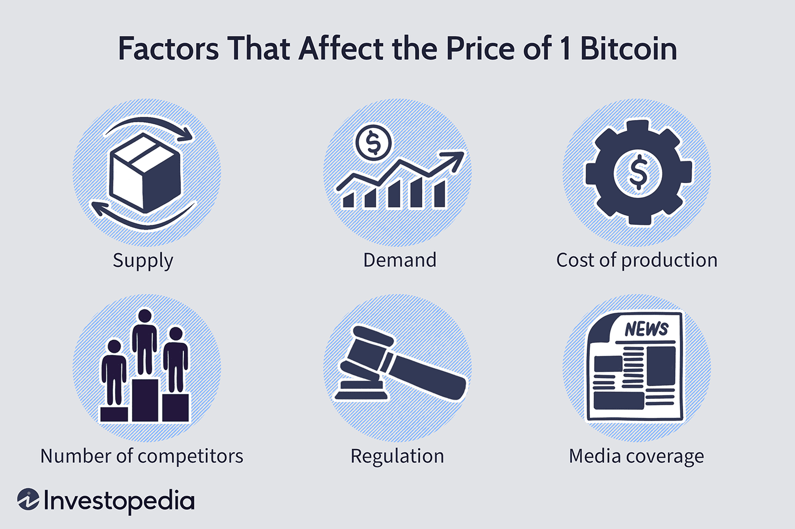

Bitcoin, since its inception in 2009 by the pseudonymous Satoshi Nakamoto, has significantly influenced the financial world by introducing the concept of decentralized digital currency. As the first cryptocurrency, Bitcoin set the foundation for a plethora of digital assets, altering the landscape of finance and investment profoundly. Cryptocurrencies are digital or virtual currencies that leverage blockchain technology to attain decentralization, transparency, and immutability. Bitcoin's pivotal role lies in its ability to function as a decentralized peer-to-peer payment system, which eschews the need for intermediaries, thereby revolutionizing how value can be transferred globally.

The valuation of Bitcoin is an essential consideration for investors and market participants, as it dictates the profitability and viability of investing in this asset. Bitcoin valuation differs from traditional asset valuation due to factors such as its finite supply, driven by the algorithmically enforced cap of 21 million coins. Market demand, technological advancements, regulatory developments, and macroeconomic trends also play crucial roles in influencing Bitcoin's market value. Unlike traditional assets such as stocks or bonds, Bitcoin lacks intrinsic value derived from cash flows or dividends, presenting unique challenges in determining its true worth.

Algorithmic trading, an advanced method of executing trades using pre-programmed instructions based on variables such as time, price, and volume, has gained traction in cryptocurrency markets. Traditionally rooted in conventional financial markets, algorithmic trading offers efficiency and precision, enabling traders to exploit market opportunities swiftly and without emotional bias. As Bitcoin and other cryptocurrencies experience volatile price fluctuations, algorithmic trading helps in capitalizing on these dynamics efficiently.

The purpose of this article is to examine the critical aspects of Bitcoin valuation and the integration of algorithmic trading within cryptocurrency markets. By understanding these elements, market participants can better navigate the challenges and opportunities presented by the burgeoning digital asset ecosystem.

## Table of Contents

## Understanding Bitcoin Valuation

Bitcoin valuation refers to the process of determining the market value of Bitcoin, a critical aspect for investors seeking to make informed financial decisions. Unlike traditional currencies or stocks, Bitcoin's valuation does not derive from a physical asset or a steady income stream, making it a unique asset class in financial markets.

Several factors influence Bitcoin's value, making its valuation a complex and multifaceted task. One primary factor is market demand, which is driven by user adoption, investor interest, and macroeconomic trends. The principle of scarcity also plays a crucial role in Bitcoin valuation. Bitcoin is designed to have a maximum supply of 21 million coins, a characteristic that contributes to its scarcity and, consequently, its value. Technological developments within the blockchain ecosystem, such as network upgrades or breakthroughs in security measures, can significantly impact Bitcoin's market perception and valuation.

Traditional methods of asset valuation, such as the discounted cash flow (DCF) model used for stocks, are less applicable to Bitcoin due to its lack of cash flows or dividends. Furthermore, conventional approaches like price-to-earnings (P/E) ratios cannot be utilized as Bitcoin does not generate earnings. Instead, Bitcoin valuation often relies on market-driven models and metrics. Some notable approaches include the stock-to-flow model, which considers Bitcoin's scarcity by examining the ratio of existing stock (supply) to new production (flow). 

Evaluating Bitcoin poses distinct challenges due to its high [volatility](/wiki/volatility-trading-strategies) and the absence of intrinsic value. Bitcoin's price can experience significant fluctuations within short periods, influenced by market sentiment, regulatory announcements, and macroeconomic events. This volatility introduces difficulty in predicting short-term price movements and necessitates continuous adjustments to valuation models. Moreover, Bitcoin's lack of intrinsic value differentiates it from commodities like gold or assets with inherent worth, complicating the development of a universally accepted valuation framework.

Despite these challenges, the [cryptocurrency](/wiki/cryptocurrency) sector has developed various valuation models to assess Bitcoin's market worth. The Metcalfe's Law-based models, for example, evaluate the value of the Bitcoin network by considering the number of active users, drawing parallels to the valuation of technology companies. Additionally, on-chain analysis employs data from the blockchain to gauge network activity and investor behavior, providing insights into potential valuation trends. 

In conclusion, understanding Bitcoin valuation is crucial for investors as it informs strategic decision-making in the volatile cryptocurrency market. The interplay of demand, scarcity, and technology significantly influences its value, requiring novel valuation approaches that transcend traditional methods.

## Algorithmic Trading in the Cryptocurrency Market

Algorithmic trading, commonly referred to as algo trading, involves the use of computer algorithms to automate and execute trading strategies with minimal human intervention. Originating in traditional finance, algo trading first took root in the late 20th century, driven by technological advancements that allowed for rapid data processing and the execution of trades within fractions of a second. This methodology provided traders with a competitive edge through speed, precision, and the ability to manage large volumes of transactions simultaneously.

The transition of algo trading into the cryptocurrency market, particularly with Bitcoin, marks a significant evolution in digital asset trading. Bitcoin's decentralized and global nature, combined with high market volatility, presents unique opportunities and challenges that are well-suited to algorithmic strategies. Cryptocurrency exchanges operate 24/7, offering continuous trading possibilities that align seamlessly with the automated nature of algo trading.

The benefits of employing [algorithmic trading](/wiki/algorithmic-trading) in Bitcoin markets include enhanced efficiency and the elimination of emotional bias, which often affects human trading decisions. Algorithms can process vast amounts of data at lightning speed, executing trades based on pre-defined criteria without emotional interference. This can lead to more consistent trading results, as emotions like fear and greed are removed from decision-making processes.

Common algo trading strategies in cryptocurrency markets encompass [arbitrage](/wiki/arbitrage), [market making](/wiki/market-making), and [trend following](/wiki/trend-following), among others:

1. **Arbitrage**: This strategy exploits price discrepancies across different exchanges or markets. For example, if Bitcoin is priced lower on one exchange compared to another, an algorithm can automatically buy on the cheaper exchange and sell on the more expensive one, pocketing the difference.

2. **Market Making**: This involves placing buy and sell orders simultaneously to profit from the spread, or the difference between the bid and ask price. Market-making algorithms provide liquidity to the market and earn a profit from these small spreads.

3. **Trend Following**: Algorithms identify and capitalize on upward or downward market trends. By detecting patterns and momentum, they can initiate trades that align with the current market direction.

Despite its advantages, algorithmic trading in the Bitcoin market carries significant risks and limitations due to the asset's inherent volatility. Sudden price swings can result in substantial losses if algorithms are not calibrated to account for extreme market conditions. Additionally, the unregulated nature of many cryptocurrency exchanges heightens the risk of market manipulation, potentially leading to algorithm-triggered flash crashes or unexpected market moves.

The rapid pace of technological advancement also presents challenges, as new trading algorithms emerge that could outpace existing ones. Furthermore, there's a risk of systemic failure—where a minor flaw in an algorithm could lead to significant financial losses. These risks necessitate rigorous testing and continuous refinement of algorithmic strategies to mitigate potential pitfalls.

Overall, while algorithmic trading introduces improved efficiency and discipline to Bitcoin trading, it requires careful consideration and management of risks to maximize the potential benefits. As the cryptocurrency market continues to evolve, the integration of advanced algo trading strategies is likely to become increasingly sophisticated.

## Interconnection Between Bitcoin Valuation and Algo Trading

Algorithmic trading, commonly known as algo trading, has a profound impact on Bitcoin's value and market price. By automating the process of buying and selling, algorithmic trading enhances market efficiency and can lead to significant shifts in Bitcoin's valuation.

Algo trading systems monitor market conditions and execute transactions within milliseconds. This rapid execution contributes to price stabilization by minimizing lag and exploiting price discrepancies. However, the very efficiency that algorithms introduce can also lead to unintended volatility, especially during periods of low [liquidity](/wiki/liquidity-risk-premium) or heightened market sensitivity. For instance, an algorithm tasked with selling Bitcoin at a certain price level can activate a cascade of similar selling, intensifying a market downtrend.

The volatile nature of Bitcoin presents both opportunities and challenges for algorithmic traders. On one hand, algos can capitalize on price fluctuations by executing timely trades, thus generating profit from short-lived market trends. One common strategy is mean reversion, where algorithms predict that the asset will revert to its historical average price, executing trades accordingly. On the other hand, volatility poses significant risks. Algorithms can misinterpret sudden changes in price as long-term trends, leading to undesirable trade executions and financial loss.

Several case studies highlight the impactful role of algorithmic trading in influencing Bitcoin price movements. For instance, during the 2021 bull run, algorithmic trading boosted Bitcoin's upward trajectory by creating an automated demand surge. Conversely, in certain market crashes, panic-induced algo sell-offs have exacerbated price declines, demonstrating both the positive and negative forces of automated trading on Bitcoin's value.

There exists a dynamic feedback loop between Bitcoin valuation and trading algorithms. As Bitcoin's value changes, algorithms recalibrate their strategies to optimize trading outcomes. Similarly, the collective actions of numerous algos engaged in trading activity can inversely affect Bitcoin's market price. This interplay can result in intricate patterns where the behavior of algorithms and market valuation are mutually influential.

The integration of algo trading with Bitcoin valuation raises important ethical and regulatory considerations. The capacity of algorithms to execute large volumes of trades rapidly can lead to market manipulation, raising concerns about fairness and market integrity. Regulatory bodies are tasked with creating frameworks that ensure algorithms do not exploit the market or lead to systemic risks. The introduction of trading curbs and monitoring software are potential measures to mitigate such risks.

In conclusion, algorithmic trading significantly impacts Bitcoin's valuation dynamics. While the technological sophistication of algos promises enhanced trading efficiency and tighter spreads, it also introduces challenges related to volatility and regulation. Understanding these interactions is crucial as market participants navigate the ever-evolving landscape of cryptocurrency trading.

## Future Trends and Implications

As the cryptocurrency market continues to mature, the valuation of Bitcoin is expected to evolve alongside it. Currently, Bitcoin's valuation is influenced by a range of factors, including market demand, adoption rates, and technological advancements. As the market matures, these factors are likely to become more stable, allowing for more predictable valuation models. Additionally, increased institutional adoption and mainstream acceptance could lend Bitcoin a status similar to that of traditional financial assets, further stabilizing its value.

Algorithmic trading technologies are poised for significant advancements, influenced by ongoing developments in computing power and data analytics. Future algo trading systems may incorporate more sophisticated predictive models, leveraging historical data and real-time market analytics to optimize trade executions. These advancements could increase market efficiency, reduce transaction costs, and enhance liquidity for Bitcoin, potentially impacting its overall valuation. Furthermore, the implementation of decentralized finance (DeFi) protocols could create more complex trading strategies that integrate various blockchain assets, contributing to the dynamism of Bitcoin's market.

Regulatory landscapes are expected to undergo meaningful changes, which could heavily influence Bitcoin valuation and algo trading practices. Governments and regulatory bodies are likely to introduce clearer guidelines and frameworks to ensure market stability and protect investors. These regulations could lead to enhanced transparency and reduced market manipulation, impacting both the methods of valuation and the execution of algorithmic trades. In turn, increased regulation may encourage institutional participation, furthering Bitcoin's mainstream integration.

The role of [artificial intelligence](/wiki/ai-artificial-intelligence) (AI) and [machine learning](/wiki/machine-learning) in Bitcoin valuation and trading strategies is anticipated to grow significantly. AI-driven models can analyze vast datasets to identify patterns and predict market movements with improved accuracy. Machine learning algorithms, capable of adapting to new information, could refine these predictions, enhancing decision-making in trading strategies. Such technological integration points to a future where Bitcoin valuation models are increasingly sophisticated, combining traditional financial metrics with real-time blockchain analytics.

Finally, the potential integration of Bitcoin into mainstream finance poses substantial implications for both its valuation and trading. As Bitcoin gains recognition as a legitimate asset class, financial institutions may develop novel financial instruments—such as Bitcoin ETFs or derivatives—further embedding it into global financial markets. This integration could lead to greater market stability, affect liquidity, and alter how Bitcoin's value is assessed by investors and institutions alike. As Bitcoin bridges the gap between digital assets and traditional finance, the implications for its valuation and trading will become ever more significant, shaping the future financial landscape.

## Conclusion

Bitcoin's valuation and algorithmic trading have emerged as pivotal topics in the intersection of finance and technology. Understanding Bitcoin's value is essential for investors navigating the complexities of cryptocurrency markets. This digital asset, which lacks intrinsic value and is influenced by numerous factors, including market demand and technological developments, presents unique challenges in valuation.

Algorithmic trading, with its origins in traditional finance, offers significant promise and challenges for Bitcoin markets. The efficiency and emotionless decision-making of algo trading can be highly beneficial, yet the volatility of Bitcoin presents inherent risks. As technological advancements and trading strategies continue to evolve, they play a crucial role in determining Bitcoin's market price and providing opportunities for traders to capitalize on market movements.

Staying informed about the changes in cryptocurrency and trading technologies is crucial for anyone involved in these markets. The dynamic interplay between technology, financial systems, and new asset classes like Bitcoin requires continuous learning and adaptation.

We invite readers to share their insights and experiences with Bitcoin valuation and algorithmic trading, to enrich the collective understanding of this rapidly developing field. As these digital landscapes continue to mature, the integration of innovative technologies will undoubtedly shape the future of finance in profound and unforeseen ways.

## References & Further Reading

[1]: Nakamoto, S. (2009). ["Bitcoin: A Peer-to-Peer Electronic Cash System."](https://nakamotoinstitute.org/library/bitcoin/) Bitcoin.org. 

[2]: Antonopoulos, A. M. (2017). ["Mastering Bitcoin: Unlocking Digital Cryptocurrencies."](https://books.google.com/books/about/Mastering_Bitcoin.html?id=IXmrBQAAQBAJ) O'Reilly Media.

[3]: Narayanan, A., Bonneau, J., Felten, E., Miller, A., & Goldfeder, S. (2016). ["Bitcoin and Cryptocurrency Technologies."](https://press.princeton.edu/books/hardcover/9780691171692/bitcoin-and-cryptocurrency-technologies) Princeton University Press.

[4]: De Vries, A. (2018). ["Bitcoin’s Growing Energy Problem."](https://www.sciencedirect.com/science/article/pii/S2542435118301776)30255-3.pdf) Joule, 2(9), 801-805.

[5]: Scopino, G. (2015). ["The BOLT of the Marketplace: Regulation of High Frequency Trading in the United States and the European Union."](https://www.sciencedirect.com/science/article/pii/S001393512402406X) Iowa Law Review, 100(3), 863-937.

[6]: Makarov, I., & Schoar, A. (2019). ["Trading and Arbitrage in Cryptocurrency Markets."](https://www.sciencedirect.com/science/article/pii/S0304405X19301746) National Bureau of Economic Research Working Paper No. 25438.

[7]: Chan, E. P. (2009). ["Quantitative Trading: How to Build Your Own Algorithmic Trading Business."](https://github.com/ftvision/quant_trading_echan_book) Wiley.

[8]: Lopez de Prado, M. (2018). ["Advances in Financial Machine Learning."](https://www.amazon.com/Advances-Financial-Machine-Learning-Marcos/dp/1119482089) Wiley.

[9]: Peters, G. W., & Panayi, E. (2016). "[Understanding Modern Banking Ledgers through Blockchain Technologies: Future of Transaction Processing and Smart Contracts on the Internet of Money.](https://link.springer.com/chapter/10.1007/978-3-319-42448-4_13)" In Bholat, D., & Knight, J. (Eds.), Banking Beyond Banks and Money: A Guide to Banking Services in the Twenty-First Century, Springer.