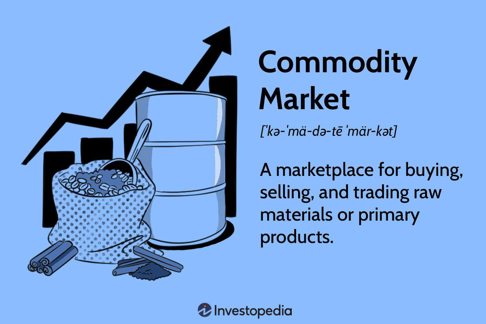

Understanding the fundamentals of pricing, valuation, and market dynamics in commodities is essential for investors and traders aiming to succeed in a highly volatile landscape. Commodities, which include a range of agricultural products, minerals, and energy resources, are subject to unique pricing structures influenced by numerous variables. Factors such as supply and demand imbalances, geopolitical developments, and economic conditions can cause significant price fluctuations, highlighting the need for a comprehensive grasp of market intricacies.

This article aims to explore key aspects of commodity pricing, delving into the methodologies used for market valuation and examining the growing role of algorithmic trading. The commodities market, characterized by its complex interplay of factors, requires a deep understanding of not only immediate pricing mechanisms but also future trends and expectations. Through an investigation of these subjects, readers will better comprehend the myriad elements that shape commodity prices, providing them with the tools needed to navigate and succeed in this challenging market.



Additionally, the article will address algorithmic trading's impact, which utilizes advanced computer algorithms to execute trades swiftly and efficiently, potentially leveling the playing field by minimizing human error and emotional bias. As these algorithmic systems become more sophisticated, their influence on the market dynamics and pricing of commodities continues to grow, warranting closer scrutiny.

By examining these dimensions, the discussion seeks to offer readers a more nuanced view of the commodities market, thereby equipping them with valuable insights to make informed and strategic investment choices.

## Table of Contents

## Understanding Commodity Pricing

Commodity pricing is fundamentally governed by the economic principle of supply and demand. When supply exceeds demand, prices tend to fall; conversely, when demand outstrips supply, prices generally rise. This equilibrium is influenced by a variety of factors, including weather conditions, geopolitical events, and overarching economic trends.

Weather conditions can significantly affect the supply side of commodities like agricultural products and natural resources. For instance, adverse weather such as droughts or hurricanes can lower crop yields, leading to reduced supply and thus higher prices. Geopolitical events, such as conflicts or trade embargoes, can disrupt the supply chain, constraining market access to certain commodities and causing price volatility. Additionally, economic trends, including inflation rates, currency fluctuations, and global economic growth, play essential roles in shaping commodity demand and pricing structures.

Commodity pricing mechanisms can broadly be categorized into fixed, floating, and basis pricing. Fixed pricing involves setting a specific price for a commodity, independent of market fluctuations. This approach provides certainty and stability for both buyers and sellers but can be disadvantageous if the market price significantly deviates from the agreed price.

Floating pricing, on the other hand, ties the commodity price to fluctuating market rates. This method allows prices to adjust in real-time according to supply and demand dynamics. An example is linking [crude oil](/wiki/crude-oil) contracts to Brent Crude prices, where the final price reflects ongoing market prices.

Basis pricing combines elements of both fixed and floating models. It involves setting a fixed component plus a variable component based on a benchmark price. For example, a contract might stipulate a base price of $20 per barrel plus any differential between that base and the prevailing market index price. This method offers a middle ground, providing stability while allowing some responsiveness to market conditions.

Each pricing method presents unique advantages and challenges. Fixed pricing enhances predictability but can expose the contracting parties to market risks. Floating pricing reflects current market conditions more accurately but introduces greater uncertainty. Basis pricing, while complex, attempts to balance the benefits of the other two methods, offering both security and flexibility.

Understanding these pricing mechanisms and the factors influencing them is vital for those involved in the commodity markets, enabling them to navigate the complexities and make informed decisions.

## Commodity Valuation Methodologies

Commodity valuation methodologies are essential for determining the worth of commodities by considering current market conditions and future expectations. These methodologies rely on various techniques and indicators to establish a comprehensive understanding of a commodity's value.

### Spot Prices and Futures Contract Prices

The valuation of commodities often hinges on the relationship between spot prices and futures contract prices. Spot prices represent the current market price at which a commodity can be bought or sold for immediate delivery. These prices are influenced by the present supply and demand dynamics and reflect the immediate market situation.

Futures contract prices, on the other hand, are agreed prices for delivery at a future date. These prices are instrumental in providing insights into market expectations regarding future price movements. The difference between the spot price and the futures price is known as the basis, and it can serve as a benchmark for assessing market conditions. This relationship can be expressed mathematically as:

$$
\text{Basis} = \text{Futures Price} - \text{Spot Price}
$$

A positive basis indicates a market expectation of price increases, while a negative basis might suggest a potential decline.

### Speculative Trading and Market Sentiment

Speculative trading plays a significant role in commodity valuation. Speculators attempt to profit from expected future price changes by buying or selling commodities or futures contracts. Their activities can lead to increased market [liquidity](/wiki/liquidity-risk-premium), which may stabilize prices. However, it can also introduce [volatility](/wiki/volatility-trading-strategies), as speculative actions might not always align with underlying supply and demand fundamentals.

Market sentiment, which reflects the collective attitudes and perceptions of traders and investors, can significantly impact commodity prices. Positive sentiment can drive prices higher, while negative sentiment can push them lower. Sentiment is often gauged through market surveys and indices, such as the Commitment of Traders (COT) report, which provides insights into the positions held by different types of traders in the futures market.

To conclude, accurately valuing commodities involves understanding the interplay between spot prices and futures contract prices, along with the influential roles of speculative trading and market sentiment. These elements collectively shape the perceived value of commodities, making them key components in the strategic decision-making processes of investors and traders.

## Market Valuation: A Deeper Dive

Market valuation is a multifaceted process that entails evaluating the worth of commodities within a broader economic context. It is crucial for investors and traders to consider a spectrum of macroeconomic indicators, supply chain dynamics, and regulatory environments to understand and predict price movements effectively.

Macroeconomic indicators such as Gross Domestic Product (GDP), inflation rates, and interest rates play a pivotal role in assessing market valuation. A robust GDP suggests a growing economy, often leading to increased demand for commodities, thus pushing prices higher. Conversely, high inflation can erode purchasing power, affecting commodity prices negatively. For example, if inflation increases, the cost of inputs for commodity production might rise, leading to increased commodity prices unless offset by demand contraction.

Supply chain dynamics are equally critical. The supply chain for any commodity includes all processes from extraction or production to delivery to the end user. Any disruption, such as political instability in a key production region or logistical challenges in transportation, can lead to significant price fluctuations. For instance, during the COVID-19 pandemic, supply chain disruptions led to substantial impacts on the pricing of commodities like crude oil and agricultural products due to bottlenecks in transport and labor shortages.

Regulatory environments also influence market valuation. Governments can control commodity prices through tariffs, subsidies, or trade restrictions. For instance, stringent environmental regulations may increase production costs for certain commodities, thereby affecting their market valuation. Moreover, changes in trade policies can alter the global supply and demand balance, influencing prices. For example, a new tariff on imported steel can make domestic steel more competitive, affecting market valuation.

Understanding these factors is essential for making informed decisions in the commodity markets. Investors and traders can use this knowledge to anticipate price movements. Predictive models, often enhanced by [machine learning](/wiki/machine-learning) algorithms, can analyze these macroeconomic indicators, supply chain dynamics, and regulatory impacts to forecast commodity prices. For example, a simple linear regression model in Python might use GDP growth and oil supply data to predict future oil prices, as demonstrated in the code snippet below:

```python
import numpy as np
from sklearn.linear_model import LinearRegression

# Sample data: GDP growth rate, oil supply disruption index, and oil prices
gdp_growth = np.array([2.5, 3.0, 2.0, 2.8]).reshape(-1, 1)
oil_disruption = np.array([1, 0, 1, 0]).reshape(-1, 1)
oil_prices = np.array([60, 65, 55, 62])

# Combine predictors
X = np.concatenate((gdp_growth, oil_disruption), axis=1)

# Create and train the model
model = LinearRegression()
model.fit(X, oil_prices)

# Predict future oil prices
future_gdp_growth = np.array([3.2]).reshape(-1, 1)
future_disruption = np.array([0]).reshape(-1, 1)
future_X = np.concatenate((future_gdp_growth, future_disruption), axis=1)
predicted_price = model.predict(future_X)

predicted_price
```

Overall, assessing market valuation through these lenses enables traders to navigate the complexities of the commodities market with greater precision and foresight.

## The Role of Algorithmic Trading in Commodities

Algorithmic trading employs computer algorithms to execute trades based on preset rules, significantly impacting the commodities market by improving trading efficiency and speed. By automating the trading process, [algorithmic trading](/wiki/algorithmic-trading) eliminates many of the emotional biases that can affect human traders, allowing for more rational and data-driven decisions.

One of the primary advantages of algorithmic trading in commodities is its ability to execute large orders across multiple markets in a fraction of a second, responding instantly to market changes. This high-frequency trading can capture short-term market inefficiencies and [arbitrage](/wiki/arbitrage) opportunities that are often missed by human traders. For instance, algorithms can quickly take advantage of price discrepancies between related commodity futures and spot markets, securing profits from even the smallest price differences.

Algorithmic systems can handle complex strategies that involve analyzing vast datasets, identifying patterns, and making predictions about future price movements. These systems employ statistical models and machine learning techniques to update their decision-making processes with new market data. The sophistication of these algorithms ranges from simple rule-based strategies to advanced machine learning models that continuously optimize trading strategies based on outcomes and new information.

Despite its advantages, algorithmic trading presents several challenges in the commodities market. One major concern is market volatility. Algorithms can contribute to increased volatility due to the speed and [volume](/wiki/volume-trading-strategy) of trading they facilitate. In turbulent markets, algorithms can amplify price movements, leading to unexpected market disruptions or flash crashes, where prices plummet and recover rapidly within a short time.

Moreover, the reliance on complex algorithms introduces the risk of technical failures and vulnerabilities. Algorithms require rigorous testing and constant monitoring to ensure they perform effectively under different market conditions. Additionally, there is the threat of algorithm manipulation or hacking, which could lead to unfair trading practices or market manipulation.

In conclusion, algorithmic trading profoundly influences commodity markets by enhancing trading efficiency and speed while also presenting unique challenges. As the technology continues to evolve, the commodity markets may see further integration of advanced algorithms, necessitating ongoing adjustments in regulatory frameworks to ensure fair and orderly market operations.

## Comparing Spot and Futures Markets

Spot and futures markets are two pivotal components of the commodities market, each with distinct characteristics and purposes. Understanding these differences is essential for participants engaging in commodities trading.

**Spot Markets**

Spot markets, also known as cash markets, involve the immediate transaction of goods and payment. In these markets, buyers and sellers agree on a price, and the physical delivery of the commodity occurs almost instantaneously. The price, known as the spot price, is influenced by current supply and demand dynamics. For example, if there's a sudden shortage in oil supply due to geopolitical tensions, the spot price of oil might increase rapidly. This immediacy makes spot markets highly volatile, reflecting real-time market conditions.

A key characteristic of spot markets is their simplicity. Transactions are straightforward and lack the complexities of contracts or agreements specifying future deliveries. This makes spot markets an attractive option for participants who need commodities quickly or want to capitalize on current market conditions.

**Futures Markets**

In contrast, futures markets allow traders to buy or sell a standardized amount of a commodity at a predetermined price, with delivery set at a specific time in the future. These contracts are traded on futures exchanges, where the terms are standardized to facilitate trading. The primary advantage of futures markets is their utility in risk management. By locking in prices, participants can hedge against price volatility. For instance, a farmer might use futures contracts to secure a set price for their crop months before harvest, protecting against potential price drops.

Futures contracts are not typically concerned with the physical delivery of commodities. Instead, they are often settled financially, with the difference between the contracted price and the current market price paid in cash. This feature allows traders to speculate on price movements without having to handle physical goods.

Futures pricing is generally determined by several factors, including the spot price, interest rates, and the time until the contract's expiration. The formula reflecting the relationship between futures price ($F$), spot price ($S$), risk-free [interest rate](/wiki/interest-rate-trading-strategies) ($r$), and time to maturity ($T$) is often expressed as:

$$
F = S \times e^{rT}
$$

**Comparison and Uses**

While both markets offer opportunities for profit, their uses and risks differ. Spot markets are more suited to traders who deal with the physical aspect of commodities and need immediate transactions. Futures markets, on the other hand, are ideal for hedgers who wish to mitigate risks or speculators aiming to profit from price changes without engaging in actual commodity transfers.

In summary, the choice between spot and futures markets depends largely on an individual trader's goals, whether seeking immediate goods, wishing to hedge against risks, or speculating on future prices. Understanding these fundamental differences enables market participants to utilize each market's distinctive features effectively.

## Conclusion

Commodity pricing, valuation, and market dynamics form the foundation of successful investment strategies in the commodities sector. Each element plays a vital role in understanding and anticipating market behaviors, which can lead to more informed and lucrative investment decisions. By comprehensively grasping how prices are established through various methodologies, such as supply-demand equilibrium, fixed, floating, and basis pricing methods, investors can better predict market trends and counter unexpected shifts caused by factors like geopolitical events or weather anomalies.

The valuation of commodities is intricately tied to both current market conditions and forward-looking perspectives, involving complex assessments of spot prices, futures prices, and market sentiment. This dual focus aids in deciphering the intrinsic value of commodities, providing not just a snapshot of current worth but also a projection of future valuations based on economic indicators and speculative activities.

Market dynamics are further influenced by broader economic landscapes, where macroeconomic signals and supply chain dynamics interact with regulatory frameworks. These forces create a challenging yet rich environment for traders, emphasizing the importance of a holistic understanding of market ecosystems.

Algorithmic trading introduces a sophisticated layer to commodities markets, where computer algorithms execute trades at speeds and efficiencies beyond human capability, often free from emotional biases. While this technological advancement presents its own set of advantages and challenges, it undeniably reshapes how commodities are traded, underscoring the necessity for investors to adapt to new trading paradigms.

In conclusion, knowledge of commodity pricing, valuation, and market dynamics, coupled with an appreciation for the transformative impact of algorithmic trading, provides investors and traders with a significant strategic advantage. This comprehensive understanding aids in navigating the often tumultuous waters of commodity markets, paving the way for more robust investment outcomes.

## References & Further Reading

[1]: Hull, J. (2018). ["Options, Futures, and Other Derivatives"](https://www.semanticscholar.org/paper/Options%2C-Futures%2C-and-Other-Derivatives-Hull/89bdee500c8623864fc9eb7a471546aa713acc44). Pearson Education.

[2]: Gorton, G., & Rouwenhorst, K. G. (2006). ["Facts and Fantasies about Commodity Futures."](https://www.nber.org/papers/w10595) Journal of Economic Perspectives, 20(2), 167-188.

[3]: Hull, J. C. (2016). ["Risk Management and Financial Institutions"](https://www.amazon.com/Management-Financial-Institutions-Wiley-Finance/dp/1119932483). John Wiley & Sons.

[4]: Domowitz, I., & Wang, J. (1994). ["Market Making with Time-Varying Adverse Selection."](https://www.fbv.kit.edu/symposium/10th/papers/Yung%20-%20Time-Varying%20Adverse%20Selection%20in%20Credit%20Markets.pdf) Journal of Financial Economics, 35(3), 345-371.

[5]: Kaminski, K. M. (2011). ["In Search of Real-Time Alpha: Measuring ATM Economic Value in Algorithmic Trading."](https://www.iasg.com/blog/2019/12/02/in-search-of-crisis-alpha-a-short-guide-to-investing-in-managed-futures) 

[6]: Elder, A. (2014). ["The New Trading for a Living: Psychology, Discipline, Trading Tools and Systems, Risk Control, Trade Management"](https://www.amazon.com/New-Trading-Living-Psychology-Discipline/dp/1118443926). John Wiley & Sons.

[7]: Chincarini, L. B., & Kim, D. (2006). ["Quantitative Equity Portfolio Management: An Active Approach to Portfolio Construction and Management."](https://archive.org/details/quantitativeequi0000chin_c9d6) McGraw Hill Professional.