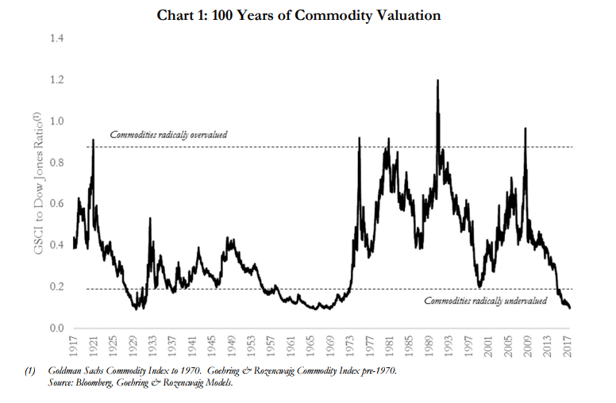

## Table of Contents

## What are commodity markets and why are they important?

Commodity markets are places where people buy and sell things like oil, gold, wheat, and other raw materials. These markets help people who need these materials for their businesses, like farmers or factories, to get what they need. They also help people who want to invest in these materials, hoping to make money if the prices go up.

These markets are important because they help keep the economy running smoothly. They make sure that there is a fair price for things like food and energy, which everyone needs. When commodity markets work well, they help prevent big price changes that can hurt businesses and people. They also give important information about what people want and need, which helps businesses plan for the future.

## What are the main types of commodities traded in these markets?

Commodities traded in these markets can be split into two big groups: hard commodities and soft commodities. Hard commodities are things that come from the ground, like oil, natural gas, and metals like gold, silver, and copper. These are often used in making things or as energy sources. For example, oil is used to make gasoline for cars, and copper is used in electrical wires.

Soft commodities, on the other hand, are things that are grown or raised, like wheat, corn, cotton, and livestock. These are usually things we eat or use to make clothes. For example, wheat is used to make bread, and cotton is used to make shirts. Both hard and soft commodities are important because they are used every day by people all over the world.

Sometimes, commodities can also be grouped into energy, metals, and agricultural products. Energy commodities include oil and natural gas, which power our homes and vehicles. Metals like gold and copper are used in industries and for investments. Agricultural commodities cover crops like wheat and corn, as well as livestock like cattle and pigs. Each type of commodity plays a key role in our daily lives and the global economy.

## How are commodity prices determined?

Commodity prices are determined by the basic idea of supply and demand. When there is a lot of a commodity available, the price usually goes down because sellers want to sell it all. On the other hand, if there is not much of a commodity, the price goes up because people are willing to pay more to get it. For example, if there is a big harvest of wheat, the price of wheat might go down. But if there is a drought and less wheat is grown, the price might go up.

Other things can also affect commodity prices. Things like weather, political events, and changes in technology can change how much of a commodity is available or how much people want it. For example, if a new technology makes it easier to find oil, the price of oil might go down because there is more of it. Or if there is a war in a country that produces a lot of oil, the price might go up because it's harder to get. All these factors together help decide the price of commodities in the market.

## What are the basic principles of commodity valuation?

Commodity valuation is mainly about figuring out how much a commodity is worth based on supply and demand. If there's a lot of a commodity, like a huge corn harvest, the price will be lower because everyone can get it easily. But if there's not much of it, like when there's a drought and less wheat is grown, the price goes up because it's harder to find. This basic idea helps people decide if they should buy or sell a commodity.

Other things can also affect how much a commodity is worth. For example, if there's a new way to find oil that makes it easier and cheaper, the value of oil might go down because there's more of it around. On the other hand, if there's a war or a problem in a country that makes a lot of a commodity, like oil, the value might go up because it's harder to get. These factors, along with supply and demand, are the basic principles that help set the value of commodities.

In the end, commodity valuation is a mix of looking at how much of a commodity there is and how much people want it, plus considering other things that might change its value. This helps everyone from farmers to big companies decide when to buy or sell, and it keeps the markets working smoothly.

## What role do supply and demand play in commodity pricing?

Supply and demand are the main things that decide how much a commodity costs. If there's a lot of something, like a big wheat harvest, the price goes down because everyone can get it easily. But if there's not much of something, like when there's a drought and less wheat grows, the price goes up because it's harder to find. This simple idea helps everyone know how much to pay or charge for a commodity.

Other things can also change how much people want a commodity or how much is available. For example, if there's a new way to find oil that makes it easier and cheaper, more oil comes to the market and the price might go down. But if there's a war or a problem in a country that makes a lot of oil, less oil might be available and the price goes up. These changes in supply and demand help set the price of commodities every day.

## How do geopolitical events influence commodity market prices?

Geopolitical events can have a big impact on commodity market prices. When there's a war, conflict, or political problem in a country that produces a lot of a commodity, like oil, it can make it harder to get that commodity. For example, if there's a war in the Middle East, where a lot of oil comes from, it might be harder to get oil out of the country. This can make the supply of oil go down, and when there's less of something, the price goes up. People who need oil, like airlines and car owners, might have to pay more to get it.

Also, political decisions and trade policies can change how much of a commodity is available or how much people want it. If a country puts a tax on importing a commodity, like steel, it can make the commodity more expensive in that country. This might make people look for other places to buy steel or use less of it. On the other hand, if two countries agree to trade more of a commodity, like wheat, it can make more wheat available and the price might go down. These kinds of events show how politics can affect what we pay for everyday things.

## What are futures and options, and how are they used in commodity valuation?

Futures and options are types of financial contracts that people use to buy or sell commodities at a certain price in the future. A futures contract means that someone agrees to buy or sell a commodity, like oil or wheat, at a set price on a specific date. This helps farmers, companies, and investors plan ahead and protect themselves from big price changes. For example, a farmer might sell wheat futures to make sure they get a good price, even if the market price goes down later.

Options are a bit different. They give someone the right, but not the obligation, to buy or sell a commodity at a set price before a certain date. There are two types: call options, which let you buy a commodity, and put options, which let you sell it. Options can be used to bet on whether a commodity's price will go up or down. For instance, if someone thinks the price of gold will go up, they might buy a call option to buy gold at today's price, hoping to make money if the price does go up. Both futures and options help people manage risk and make decisions based on what they think will happen to commodity prices in the future.

## How do macroeconomic indicators affect commodity prices?

Macroeconomic indicators, like how fast an economy is growing or the unemployment rate, can change how much people want to buy commodities and how much they are willing to pay. For example, if a country's economy is doing well and growing fast, people and companies might use more energy, like oil and gas, to make things or travel. This can make the demand for these commodities go up, and when more people want something, the price usually goes up too. On the other hand, if the economy is not doing well and people are losing their jobs, they might not buy as much, so the demand for commodities can go down, and prices might drop.

Also, things like interest rates and inflation can affect commodity prices. If interest rates go up, it can be more expensive for companies to borrow money to buy commodities, so they might buy less and the prices could go down. Inflation means that the money people have is worth less, so they might want to buy things like gold or other commodities that can keep their value over time. This can make the demand for these commodities go up and push their prices higher. All these big economic factors play a role in deciding how much commodities cost.

## What are the common valuation models used for commodities?

One common way to value commodities is by using the cost of carry model. This model looks at how much it costs to store and take care of a commodity until it's sold. For example, if you're storing wheat, you need to think about the cost of the storage space, insurance to protect it, and any interest you might have to pay on money borrowed to buy the wheat. If these costs are high, the price of the commodity might be higher to cover them. This model helps people figure out if it's worth buying and holding onto a commodity until they can sell it later.

Another way to value commodities is by using the supply and demand model. This model is all about how much of a commodity there is and how much people want it. If there's a lot of something, like a big oil find, the price might go down because everyone can get it easily. But if there's not much of something, like during a drought when less corn is grown, the price might go up because it's harder to find. This model helps people understand what might happen to prices based on what's happening in the world, like weather changes or new technology.

Some people also use technical analysis to value commodities. This method looks at past price movements and trading patterns to guess what might happen next. For example, if the price of gold has been going up steadily for a while, someone using technical analysis might think it will keep going up. They look at charts and graphs to make these guesses. While it's not as simple as just looking at supply and demand or costs, technical analysis can help people make decisions about buying or selling commodities based on what's happened before.

## How can technical analysis be applied to predict commodity price movements?

Technical analysis is a way to guess what might happen to commodity prices by looking at past prices and trading patterns. People who use technical analysis look at charts and graphs to find patterns that might show if a price will go up or down. For example, if the price of oil has been going up in a steady pattern for a while, someone might think it will keep going up. They use things like trend lines, support and resistance levels, and different kinds of charts to help them make these guesses.

While technical analysis can be helpful, it's not always right because it only looks at past prices and doesn't consider things like big news or changes in the world that can affect commodity prices. For example, if there's a sudden war in a country that makes a lot of oil, the price might change a lot, and the patterns in the charts might not help predict that. Still, many people use technical analysis along with other ways of looking at commodity prices to make better guesses about what might happen next.

## What are the advanced strategies for hedging and speculating in commodity markets?

Hedging and speculating in commodity markets can be done using advanced strategies like spread trading and options strategies. Spread trading involves buying and selling different futures contracts of the same commodity at the same time. For example, someone might buy a futures contract for oil that will be delivered in three months and sell a contract for oil that will be delivered in six months. This can help them make money from the difference in prices between the two contracts, and it can also protect them from big price changes. It's a bit like betting on how the price difference will change, rather than betting on the price itself going up or down.

Options strategies are another way to hedge and speculate. One popular strategy is called a straddle, where someone buys both a call option and a put option for the same commodity at the same price and time. This can be useful if they think the price will move a lot but aren't sure which way. If the price goes up a lot, they can use the call option to buy the commodity at a lower price and sell it at the higher price. If the price goes down a lot, they can use the put option to sell the commodity at a higher price and buy it back at the lower price. This strategy can help them make money no matter which way the price moves, as long as it moves a lot.

Both spread trading and options strategies need a good understanding of how commodity markets work and how prices can change. They can be more complicated than just buying and selling commodities, but they can also offer more ways to make money and protect against risks. People who use these strategies often look at a lot of information, like economic reports and technical analysis, to help them make their decisions.

## How do environmental and sustainability factors impact long-term commodity valuations?

Environmental and sustainability factors can really change how much commodities are worth over time. For example, if people start caring more about the environment, they might want to use less oil and more renewable energy like solar or wind power. This can make the demand for oil go down, and when fewer people want something, the price usually goes down too. Also, if there are new rules about how to grow crops or raise animals that are better for the environment, it might cost more to do these things. This can make the price of things like wheat or beef go up because it costs more to make them in a way that's good for the planet.

Another way environmental factors can affect commodity prices is through things like climate change. If the weather gets hotter or there are more storms, it can be harder to grow crops like corn or wheat. When there's less of something, the price goes up because it's harder to find. Also, if people and companies start using more sustainable practices, like using less water or less harmful chemicals, it might cost more to do things this way. But in the long run, these practices can help keep the supply of commodities steady, which can help keep prices from going up and down too much. So, thinking about the environment and sustainability can really change how we value commodities over time.

## What are Commodity Valuation Methodologies?

Commodity valuation methodologies are essential for determining the worth of commodities by considering current market conditions and future expectations. These methodologies rely on various techniques and indicators to establish a comprehensive understanding of a commodity's value.

### Spot Prices and Futures Contract Prices

The valuation of commodities often hinges on the relationship between spot prices and futures contract prices. Spot prices represent the current market price at which a commodity can be bought or sold for immediate delivery. These prices are influenced by the present supply and demand dynamics and reflect the immediate market situation.

Futures contract prices, on the other hand, are agreed prices for delivery at a future date. These prices are instrumental in providing insights into market expectations regarding future price movements. The difference between the spot price and the futures price is known as the basis, and it can serve as a benchmark for assessing market conditions. This relationship can be expressed mathematically as:

$$
\text{Basis} = \text{Futures Price} - \text{Spot Price}
$$

A positive basis indicates a market expectation of price increases, while a negative basis might suggest a potential decline.

### Speculative Trading and Market Sentiment

Speculative trading plays a significant role in commodity valuation. Speculators attempt to profit from expected future price changes by buying or selling commodities or futures contracts. Their activities can lead to increased market [liquidity](/wiki/liquidity-risk-premium), which may stabilize prices. However, it can also introduce [volatility](/wiki/volatility-trading-strategies), as speculative actions might not always align with underlying supply and demand fundamentals.

Market sentiment, which reflects the collective attitudes and perceptions of traders and investors, can significantly impact commodity prices. Positive sentiment can drive prices higher, while negative sentiment can push them lower. Sentiment is often gauged through market surveys and indices, such as the Commitment of Traders (COT) report, which provides insights into the positions held by different types of traders in the futures market.

To conclude, accurately valuing commodities involves understanding the interplay between spot prices and futures contract prices, along with the influential roles of speculative trading and market sentiment. These elements collectively shape the perceived value of commodities, making them key components in the strategic decision-making processes of investors and traders.

## What are the differences between Spot and Futures Markets?

Spot and futures markets are two pivotal components of the commodities market, each with distinct characteristics and purposes. Understanding these differences is essential for participants engaging in commodities trading.

**Spot Markets**

Spot markets, also known as cash markets, involve the immediate transaction of goods and payment. In these markets, buyers and sellers agree on a price, and the physical delivery of the commodity occurs almost instantaneously. The price, known as the spot price, is influenced by current supply and demand dynamics. For example, if there's a sudden shortage in oil supply due to geopolitical tensions, the spot price of oil might increase rapidly. This immediacy makes spot markets highly volatile, reflecting real-time market conditions.

A key characteristic of spot markets is their simplicity. Transactions are straightforward and lack the complexities of contracts or agreements specifying future deliveries. This makes spot markets an attractive option for participants who need commodities quickly or want to capitalize on current market conditions.

**Futures Markets**

In contrast, futures markets allow traders to buy or sell a standardized amount of a commodity at a predetermined price, with delivery set at a specific time in the future. These contracts are traded on futures exchanges, where the terms are standardized to facilitate trading. The primary advantage of futures markets is their utility in risk management. By locking in prices, participants can hedge against price volatility. For instance, a farmer might use futures contracts to secure a set price for their crop months before harvest, protecting against potential price drops.

Futures contracts are not typically concerned with the physical delivery of commodities. Instead, they are often settled financially, with the difference between the contracted price and the current market price paid in cash. This feature allows traders to speculate on price movements without having to handle physical goods.

Futures pricing is generally determined by several factors, including the spot price, interest rates, and the time until the contract's expiration. The formula reflecting the relationship between futures price ($F$), spot price ($S$), risk-free [interest rate](/wiki/interest-rate-trading-strategies) ($r$), and time to maturity ($T$) is often expressed as:

$$
F = S \times e^{rT}
$$

**Comparison and Uses**

While both markets offer opportunities for profit, their uses and risks differ. Spot markets are more suited to traders who deal with the physical aspect of commodities and need immediate transactions. Futures markets, on the other hand, are ideal for hedgers who wish to mitigate risks or speculators aiming to profit from price changes without engaging in actual commodity transfers.

In summary, the choice between spot and futures markets depends largely on an individual trader's goals, whether seeking immediate goods, wishing to hedge against risks, or speculating on future prices. Understanding these fundamental differences enables market participants to utilize each market's distinctive features effectively.

## References & Further Reading

[1]: Hull, J. (2018). ["Options, Futures, and Other Derivatives"](https://www.semanticscholar.org/paper/Options%2C-Futures%2C-and-Other-Derivatives-Hull/89bdee500c8623864fc9eb7a471546aa713acc44). Pearson Education.

[2]: Gorton, G., & Rouwenhorst, K. G. (2006). ["Facts and Fantasies about Commodity Futures."](https://www.nber.org/papers/w10595) Journal of Economic Perspectives, 20(2), 167-188.

[3]: Hull, J. C. (2016). ["Risk Management and Financial Institutions"](https://www.amazon.com/Management-Financial-Institutions-Wiley-Finance/dp/1119932483). John Wiley & Sons.

[4]: Domowitz, I., & Wang, J. (1994). ["Market Making with Time-Varying Adverse Selection."](https://www.fbv.kit.edu/symposium/10th/papers/Yung%20-%20Time-Varying%20Adverse%20Selection%20in%20Credit%20Markets.pdf) Journal of Financial Economics, 35(3), 345-371.

[5]: Kaminski, K. M. (2011). ["In Search of Real-Time Alpha: Measuring ATM Economic Value in Algorithmic Trading."](https://www.iasg.com/blog/2019/12/02/in-search-of-crisis-alpha-a-short-guide-to-investing-in-managed-futures) 

[6]: Elder, A. (2014). ["The New Trading for a Living: Psychology, Discipline, Trading Tools and Systems, Risk Control, Trade Management"](https://www.amazon.com/New-Trading-Living-Psychology-Discipline/dp/1118443926). John Wiley & Sons.

[7]: Chincarini, L. B., & Kim, D. (2006). ["Quantitative Equity Portfolio Management: An Active Approach to Portfolio Construction and Management."](https://archive.org/details/quantitativeequi0000chin_c9d6) McGraw Hill Professional.