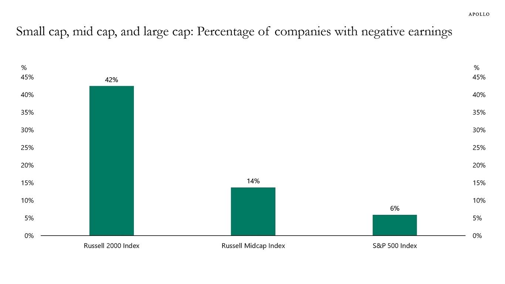

## Table of Contents

## What does it mean for a company to have negative earnings?

When a company has negative earnings, it means that the company is spending more money than it is making. This is also known as a net loss. Instead of earning a profit, the company is losing money during a specific period, like a quarter or a year. Negative earnings can happen for many reasons, such as high costs, low sales, or unexpected expenses.

Having negative earnings is not always a bad thing, especially for new or growing companies. These companies might be investing a lot of money to grow bigger and might not make a profit right away. However, if a company keeps having negative earnings for a long time, it can be a sign that the business is struggling and might need to make changes to start making money again. Investors and analysts watch a company's earnings closely to understand its financial health.

## Why is it important to value companies with negative earnings?

Valuing companies with negative earnings is important because it helps investors and business owners understand how much a company might be worth, even if it's not making money yet. Sometimes, a company might be working on new ideas or growing quickly, and it needs to spend a lot of money before it can start making a profit. By valuing these companies, people can decide if it's worth investing in them, hoping that they will make money in the future.

It's also important because it gives a full picture of a company's health. Just looking at profits or losses doesn't tell the whole story. A company might have negative earnings but still have valuable things like a strong brand, good technology, or a lot of customers. Valuing these aspects can show that a company is worth more than it seems, even if it's not making money right now. This helps everyone make smarter decisions about buying, selling, or investing in the company.

## What are the common reasons a company might have negative earnings?

A company might have negative earnings because it's spending more money than it's making. This can happen when a company is new or trying to grow bigger. For example, a startup might spend a lot of money on making new products or telling people about their business. They might not make any money from selling things yet, so they end up with negative earnings. Another reason could be that the company has to pay a lot for things like rent, salaries, or materials, and these costs are more than what they earn from selling their products or services.

Also, a company might have negative earnings because of things they can't control, like a bad economy or a big unexpected cost. For instance, if there's a recession, people might not buy as much, and the company's sales go down. Or, if something breaks and it costs a lot to fix it, that can also lead to negative earnings. Sometimes, a company might make a bad decision, like spending too much on something that doesn't help them make more money, and that can cause them to lose money too.

## How do traditional valuation methods fail when applied to companies with negative earnings?

Traditional valuation methods, like the price-to-earnings (P/E) ratio, don't work well for companies with negative earnings because these methods need a company to be making money. The P/E ratio compares a company's stock price to its earnings per share. If a company has negative earnings, you can't use this ratio because it would give you a negative or meaningless number. It's like trying to divide by zero; it just doesn't make sense.

Other methods, like discounted cash flow (DCF) analysis, also have problems when a company is losing money. DCF tries to guess what a company's future cash flows will be and then figures out what those cash flows are worth today. But if a company is losing money now, it's hard to predict when it will start making money and how much it will make. This makes the valuation less reliable and more like a guess. So, these traditional methods don't work well for companies that are not yet profitable.

## What alternative valuation methods can be used for companies with negative earnings?

When a company has negative earnings, you can't use the usual ways to figure out its value. Instead, you can look at other things that might show how much the company is worth. One way is to use the price-to-sales (P/S) ratio, which compares the company's stock price to its revenue. Even if a company isn't making a profit, it might still be making money from sales. This can give you a better idea of the company's value, especially if it's growing quickly.

Another method is to look at the company's assets, like its technology, brand, or customer base. These things can be valuable even if the company isn't making money yet. You can use something called the asset-based approach to figure out how much these assets are worth. This can give you a sense of the company's value without looking at its earnings. By using these different methods, you can get a better picture of a company's worth, even when it has negative earnings.

## How does the concept of 'burn rate' apply to valuing startups with negative earnings?

The concept of 'burn rate' is really important when you're trying to figure out the value of startups that are losing money. Burn rate is just how fast a startup is spending its money. If a startup is spending money faster than it's making it, it has a high burn rate. This is common for startups because they often need to spend a lot to grow before they start making a profit. By looking at the burn rate, you can guess how long the startup can keep going before it runs out of money. This helps investors decide if the startup is worth investing in, even if it's not making money yet.

When valuing a startup with negative earnings, knowing the burn rate can show if the company has a good plan for the future. If the burn rate is high but the company is growing fast and getting closer to making money, it might still be a good investment. But if the burn rate is high and the company isn't growing or getting any closer to making a profit, it might be riskier. So, the burn rate gives investors a way to see if the startup is spending its money wisely and if it has a chance to be successful in the future.

## What role do future growth projections play in valuing a company with negative earnings?

Future growth projections are really important when trying to figure out how much a company with negative earnings might be worth. Even if a company is losing money now, it might be working on something new or growing fast. If people think the company will make a lot of money in the future, they might be willing to pay more for it now. This is because they believe that the company's future profits will be worth more than the money it's losing today. So, when valuing a company with negative earnings, people look at how fast it's growing and how likely it is to start making money soon.

These future growth projections help investors decide if it's worth taking a risk on a company that's not making money yet. If a company has a good plan and is growing quickly, investors might think it's a good investment, even with negative earnings. But if the company's growth is slow or if it doesn't seem like it will ever make money, investors might not want to take the risk. So, future growth projections are a big part of figuring out if a company with negative earnings is worth investing in.

## How can qualitative factors influence the valuation of a company with negative earnings?

When a company has negative earnings, looking at things that can't be measured with numbers, like qualitative factors, can really help figure out its value. These factors include things like how strong the company's brand is, how good its management team is, and how happy its customers are. For example, if a company has a brand that people love and trust, it might be worth more money even if it's not making a profit yet. The same goes for a company with a smart and experienced management team. People might believe that these leaders can turn things around and make the company successful in the future.

Another important qualitative [factor](/wiki/factor-investing) is the company's place in the market and its potential to grow. If a company is in a market that's getting bigger and has a lot of room to grow, investors might see it as a good investment even if it's losing money now. They might think that the company will be able to make money in the future as the market grows. So, by looking at these qualitative factors, people can get a better idea of a company's value, even when it's not making money. This helps them decide if it's worth taking a risk on the company and investing in it.

## What are the key financial metrics to focus on when valuing a company with negative earnings?

When valuing a company with negative earnings, it's important to look at its revenue. Revenue is the money a company makes from selling its products or services. Even if a company is losing money, it might still be making a lot of sales. By looking at the price-to-sales (P/S) ratio, which compares the company's stock price to its revenue, you can get a better idea of its value. A low P/S ratio might mean the company is a good deal, even if it's not making a profit yet.

Another key metric to focus on is the company's cash flow. Cash flow is the money coming in and going out of the company. If a company has negative earnings but is still bringing in enough cash to cover its costs, it might be in a better position than it seems. Looking at the burn rate, which is how fast the company is spending its money, can also help. A lower burn rate means the company can keep going longer before it runs out of money. By paying attention to these financial metrics, you can get a clearer picture of a company's value, even when it's losing money.

## How do investors adjust their valuation models to account for the risk associated with negative earnings?

When a company has negative earnings, it means the company is losing money. This makes it risky for investors because there's a chance the company might not make money in the future. To handle this risk, investors change how they value the company. They might use a higher discount rate in their valuation models. A discount rate is like a guess of how much risk there is. If the risk is high, like with a company losing money, investors use a bigger discount rate. This makes the company's future earnings seem less valuable today, so the company's value goes down.

Investors also look at other things to figure out how risky a company with negative earnings is. They might look at how much money the company has in the bank and how fast it's spending it. This is called the burn rate. If the company is spending money quickly and doesn't have much left, it's riskier. Investors might also think about how the company is doing compared to other companies in the same industry. If the whole industry is struggling, the company might be less risky than if it's the only one losing money. By looking at all these things, investors can better understand the risk and adjust their valuation models to be more accurate.

## Can you explain the use of discounted cash flow (DCF) analysis in valuing companies with negative earnings?

Discounted cash flow (DCF) analysis is a way to guess how much a company is worth by looking at the money it might make in the future. Even if a company is losing money now, DCF can still be used to value it. The idea is to predict when the company will start making money and how much it will make. Then, you figure out what that future money is worth today by using a discount rate. The discount rate is like a guess of how risky it is to invest in the company. If the company is losing money, the discount rate is usually higher because it's riskier.

Using DCF for a company with negative earnings can be tricky because it's hard to predict when and how much money the company will make in the future. You have to make a lot of guesses about things like how fast the company will grow and when it will start making a profit. If these guesses are wrong, the valuation can be way off. But if you can make good guesses and use a high enough discount rate to account for the risk, DCF can still give you a useful idea of what the company might be worth, even if it's losing money now.

## What advanced statistical models or machine learning techniques can be applied to improve the accuracy of valuations for companies with negative earnings?

Advanced statistical models and [machine learning](/wiki/machine-learning) techniques can help make better guesses about the value of companies that are losing money. One way is to use something called regression analysis. This helps you look at past data and find patterns that can predict future money the company might make. By using a lot of data, like how fast the company is growing, how much money it's spending, and how the market is doing, regression analysis can give a more accurate guess of the company's value. Another way is to use machine learning models like random forests or neural networks. These models can learn from a lot of data and find complex patterns that are hard for people to see. This can help predict when a company might start making money and how much it will make, even if it's losing money now.

Machine learning can also help by looking at similar companies that used to lose money but started making money later. By studying these examples, machine learning models can learn what makes a company successful and use that to guess the future of a company with negative earnings. This can be really helpful because it gives a more complete picture of what might happen. But, it's important to remember that these models are still making guesses, and the future can be hard to predict. So, while these advanced techniques can improve the accuracy of valuations, they should be used carefully and with other methods to get the best results.

## What are the valuation techniques for unprofitable companies?

Valuing companies that do not currently generate profits is a complex task that necessitates employing alternative valuation methods. Traditional valuation metrics such as the Price-to-Earnings (P/E) ratio are inapplicable due to the absence of positive earnings. Therefore, investors rely on different approaches to assess the potential and value of these unprofitable companies.

1. **Discounted Cash Flow (DCF) Analysis**: This method involves estimating the company's future free cash flows and discounting them back to their present value. A DCF analysis relies heavily on assumptions about growth rates and discount rates, which can significantly impact the valuation outcome. The formula for calculating the present value of future cash flows is:
$$
   DCF = \sum \frac{FCF_t}{(1 + r)^t}

$$

   where $FCF_t$ is the free cash flow in year $t$ and $r$ is the discount rate. This methodology can be highly effective but is sensitive to the accuracy of the projected cash flows and chosen discount rates.

2. **Enterprise Value-to-EBITDA (EV/EBITDA)**: This approach uses the enterprise value (EV) of a company and compares it to its earnings before interest, taxes, depreciation, and amortization (EBITDA). By applying industry-standard multiples, investors can estimate a company's enterprise value. This method is particularly useful for comparing companies within the same industry, offering a perspective on relative valuation irrespective of current profitability levels.

3. **Price-to-Sales (P/S) Ratios**: Given the difficulty in applying profit-based metrics, the price-to-sales ratio becomes a crucial tool for valuing companies, especially those in high-growth sectors such as technology and biotechnology where revenues are often prioritized over immediate profits. This ratio is calculated as:
$$
   P/S = \frac{\text{Market Capitalization}}{\text{Total Sales}}

$$

   Companies in phases of rapid growth may have high P/S ratios, but these must be interpreted in the context of potential future profitability and market conditions.

Each of these valuation methods assesses different aspects of a company's operational performance and market position. Typically, they are used in conjunction to provide a robust analysis of the potential and challenges an unprofitable company might face. These methods move beyond traditional metrics, providing a nuanced framework to evaluate companies focusing on future growth rather than immediate profitability.

## How can one make informed investment decisions?

Investing in companies with negative earnings necessitates a nuanced approach that appreciates both the intricacies of financial markets and the technological tools available. Investors must balance the inherent risks of allocating resources to unprofitable companies with the potential for exceptional returns. This balance is achieved through a combination of strategic investment techniques, an understanding of market dynamics, and the deployment of advanced analytical tools, such as [algorithmic trading](/wiki/algorithmic-trading).

Alternative valuation methods are fundamental in assessing the potential of companies lacking profitability. Traditional metrics like the Price-to-Earnings (P/E) ratio are not applicable for companies with negative earnings. Instead, investors rely on approaches like Discounted Cash Flow (DCF), which involves estimating the present value of expected future free cash flows. The formula for DCF is:

$$
DCF = \sum \frac{FCF_t}{(1 + r)^t}
$$

where $FCF_t$ represents the free cash flow in year $t$, and $r$ is the discount rate. This approach allows investors to value a company based on its anticipated cash generation capabilities, a crucial aspect when profitability is yet to be achieved.

In high-risk environments, understanding market trends and economic indicators becomes critical. Algorithmic trading serves as a tool to enhance this understanding by leveraging large datasets to identify patterns that might not be apparent through traditional analysis methods. These algorithms can quickly process and analyze voluminous financial data, enabling investors to make timely decisions on buying or selling stocks, optimizing investment strategies, and enhancing risk management practices.

Algorithmic trading can be implemented using Python, a preferred language due to its simplicity and powerful libraries such as Pandas and NumPy, which facilitate data processing and analysis. An example code snippet for implementing a simple trading algorithm is:

```python
import pandas as pd

# Load financial data
data = pd.read_csv('financial_data.csv')

# Calculate moving averages
data['Short_MAvg'] = data['Close'].rolling(window=20).mean()
data['Long_MAvg'] = data['Close'].rolling(window=50).mean()

# Create signals
data['Signal'] = 0
data['Signal'][data['Short_MAvg'] > data['Long_MAvg']] = 1
data['Position'] = data['Signal'].diff()

# Execute trades
for index, row in data.iterrows():
    if row['Position'] == 1:
        print(f"Buy on {row['Date']}")
    elif row['Position'] == -1:
        print(f"Sell on {row['Date']}")
```

Investors should exercise prudence and conduct thorough due diligence, acknowledging the high risks alongside substantial potential rewards. Comprehensive financial analysis and sound judgment in evaluating management's capability, market position, and innovative strategies are paramount. A well-diversified investment strategy mitigates risks, ensuring that the potential success of one investment can offset failures in others.

Ultimately, success in investing in companies with negative earnings hinges on the integration of rigorous financial analysis and effective risk management. Armed with robust investment strategies, investors can seize opportunities that capitalize on the potential of these high-risk entities while safeguarding their portfolios against [volatility](/wiki/volatility-trading-strategies).

## References & Further Reading

[1]: Bergstra, J., Bardenet, R., Bengio, Y., & Kégl, B. (2011). ["Algorithms for Hyper-Parameter Optimization."](https://dl.acm.org/doi/10.5555/2986459.2986743) Advances in Neural Information Processing Systems 24.

[2]: ["Advances in Financial Machine Learning"](https://www.amazon.com/Advances-Financial-Machine-Learning-Marcos/dp/1119482089) by Marcos Lopez de Prado

[3]: ["Evidence-Based Technical Analysis: Applying the Scientific Method and Statistical Inference to Trading Signals"](https://www.amazon.com/Evidence-Based-Technical-Analysis-Scientific-Statistical/dp/0470008741) by David Aronson

[4]: ["Machine Learning for Algorithmic Trading"](https://github.com/stefan-jansen/machine-learning-for-trading) by Stefan Jansen

[5]: ["Quantitative Trading: How to Build Your Own Algorithmic Trading Business"](https://www.amazon.com/Quantitative-Trading-Build-Algorithmic-Business/dp/1119800064) by Ernest P. Chan