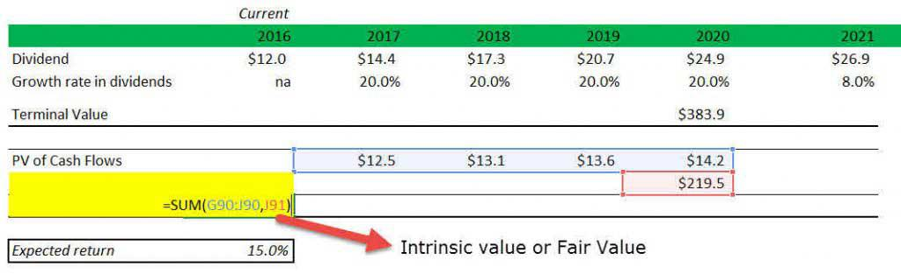

In the landscape of stock investment, non-dividend stocks present unique opportunities and challenges. Unlike their dividend-paying counterparts, non-dividend stocks do not provide regular income through dividend payouts. Instead, these stocks typically belong to companies that choose to reinvest their earnings back into the business to fuel growth and expansion. This decision is often seen in industries characterized by rapid innovation and growth potential, such as technology and biotechnology.

For investors seeking capital appreciation, understanding the valuation, investment strategies, and the role of algorithmic trading for non-dividend stocks is paramount. The valuation of these stocks often relies on growth metrics, such as earnings growth and future potential, rather than immediate cash returns. This necessitates a different approach in financial analysis, often employing metrics like the Price/Earnings (P/E) ratio and book value assessment, which provide insights into the financial health and growth prospects of the company.



Moreover, non-dividend stocks can be particularly appealing for algorithmic traders who capitalize on short-term price movements. Due to their inherent volatility, these stocks offer numerous opportunities for profit through sophisticated algorithmic strategies. Algorithmic trading involves the use of computer programs to identify trading opportunities based on predefined criteria and can be particularly effective in dynamic sectors where stock prices are influenced by a range of factors including innovation cycles, market sentiment, and macroeconomic trends.

However, investing in non-dividend stocks is not without risks. The absence of regular dividend payouts means that investors rely heavily on stock price appreciation, which can be unpredictable and subject to market volatility. Robust risk management strategies, including diversification and the use of technical indicators, are essential to mitigate these risks. Understanding and adapting to market conditions are crucial for maximizing returns from non-dividend stocks.

This article explores the methodologies employed in valuing non-dividend stocks, the attractiveness of these stocks for algorithmic trading, and the strategies implemented to exploit their potential. Additionally, we assess the risks linked with non-dividend stock investments, highlighting the importance of strategic execution and continual market analysis for investors aiming to harness the full potential of these stocks.

## Table of Contents

## Understanding Non-Dividend Stocks

Non-dividend stocks are equities that do not distribute profits to shareholders as dividends. Instead, these companies choose to reinvest their earnings back into the business to fund growth and expansion projects. This approach is especially prevalent in sectors such as technology and biotechnology, where innovation and rapid development are crucial. By reinvesting earnings, these companies aim to enhance their operational capabilities, pursue new market opportunities, and ultimately increase the value of their stocks.

Investors in non-dividend stocks primarily seek capital gains, or the profit realized when a stock is sold for more than its purchase price, rather than dividend income. This strategy is particularly attractive to those who focus on long-term growth opportunities rather than immediate income. The underlying principle is that reinvestment in the company's core operations can lead to enhanced business performance and, subsequently, higher stock prices.

The successful reinvestment of earnings can indeed lead to an increase in stock value. When a company effectively utilizes its profits to innovate, expand its market presence, or improve operational efficiency, it can achieve substantial business growth. This can result in a higher valuation of the company and, therefore, higher share prices. This process, however, requires skilled management and strategic foresight to ensure that reinvestments yield positive returns. Hence, investors considering non-dividend stocks must evaluate a company's business strategy, market position, and management capability to gauge the potential for future stock appreciation.

Moreover, investors should consider factors such as the industry landscape, competitive pressures, and technological advancements when assessing non-dividend stocks. Companies in rapidly evolving sectors may present greater risks but also offer significant opportunities for growth-driven returns. Overall, the investment in non-dividend stocks necessitates a focus on the potential for capital appreciation through strategic company growth and robust earnings reinvestment.

## Valuing Non-Dividend Stocks

The valuation of non-dividend stocks relies predominantly on metrics that gauge future growth potential rather than immediate income through dividends. The Price/Earnings (P/E) ratio is a prevalent metric utilized to assess the relative value of non-dividend stocks. It is calculated as the ratio of a company's current share price to its earnings per share (EPS). This metric serves as a proxy for evaluating how much investors are willing to pay for a dollar of earnings, thereby highlighting expected future earnings growth.

$$
\text{P/E Ratio} = \frac{\text{Price per Share}}{\text{Earnings per Share}}
$$

Growth investors prioritize earnings growth over dividend payouts, making the P/E ratio a suitable tool for these evaluations. A high P/E ratio might suggest that investors expect significant growth in the future earnings of the company. Conversely, a low P/E might indicate undervaluation or slow growth prospects.

Beyond P/E ratios, book value is another crucial metric used in valuing companies that do not offer dividends. The book value represents the net asset value of a company, calculated by subtracting its liabilities from its assets. It provides an estimation of what the company is worth if all its assets were liquidated. For companies with strong asset bases and no dividends, book value becomes a vital determinant of stock value. Investors examine book value to identify stocks trading below intrinsic value, considering it an opportunity for potential capital appreciation.

Analyzing a company's earnings, market trends, and reinvestment strategies is indispensable for the valuation of non-dividend stocks. Detailed analysis of earnings history and forecasts can uncover a company's growth trajectory. Monitoring market trends provides insight into the industry's future prospects, while evaluation of reinvestment strategies offers understanding into how effectively a company might leverage its earnings for sustainable growth.

Python can be utilized to automate this analysis. Here's a simple example of how one might calculate P/E ratios and book value using Python:

```python
def calculate_pe_ratio(price_per_share, eps):
    return price_per_share / eps

def calculate_book_value(total_assets, total_liabilities):
    return total_assets - total_liabilities

# Example calculations
price_per_share = 150
eps = 3
total_assets = 5000
total_liabilities = 2000

pe_ratio = calculate_pe_ratio(price_per_share, eps)
book_value = calculate_book_value(total_assets, total_liabilities)

print(f"P/E Ratio: {pe_ratio}")
print(f"Book Value: {book_value}")
```

This code provides a fundamental approach to automate basic financial calculations integral to the valuation of non-dividend stocks, forming a basis for more complex algorithmic analyses.

## The Appeal of Non-Dividend Stocks for Algo Traders

Non-dividend stocks are often characterized by their [volatility](/wiki/volatility-trading-strategies), a trait that can be particularly appealing to algorithmic traders. Volatility refers to the degree of variation of a trading price series over time and is a critical component of [algorithmic trading](/wiki/algorithmic-trading) systems designed to generate profits from short-term price movements. The absence of dividends means that the stock prices of these companies can be more susceptible to market speculation, thus creating frequent fluctuations that traders can exploit.

Algorithmic traders deploy complex algorithms to capture these price movements. These algorithms are typically designed to respond swiftly to market changes, executing trades based on predefined criteria without the need for human intervention. For instance, an algorithm might be programmed to buy stocks when they are below a certain moving average and sell when they rise above a different moving average. This approach capitalizes on technical indicators which are mathematical calculations based on historic prices, intended to predict future price movements.

The growth sectors, notably technology, provide a fertile ground for such trading strategies. Companies within these sectors often reinvest their profits to fuel innovation and expansion rather than distributing earnings through dividends. This reinvestment strategy can lead to significant shifts in company valuations, further enhancing price volatility and offering numerous opportunities for algorithmic interventions. For instance, tech stocks can be evaluated using technical indicators like the Relative Strength Index (RSI) and the Moving Average Convergence Divergence (MACD). The RSI measures the speed and change of price movements, while the MACD analyzes the relationship between two moving averages of a security's price, providing traders with signals for buy and sell decisions.

Python is frequently utilized by traders for its rich libraries suited for data analysis and algorithm development. Libraries such as Pandas and NumPy facilitate handling and processing large datasets, while libraries like Matplotlib and Seaborn allow visualization of trends and patterns. Moreover, [backtesting](/wiki/backtesting) tools such as Backtrader offer traders a sandbox to test their strategies against historical data to validate their effectiveness prior to live deployment.

The following Python snippet illustrates a simple trading strategy using moving averages:

```python
import pandas as pd
import numpy as np

# Load historical stock data
data = pd.read_csv('stock_data.csv')

# Calculate moving averages
data['Short_MA'] = data['Close'].rolling(window=40).mean()
data['Long_MA'] = data['Close'].rolling(window=100).mean()

# Generate trading signals
data['Signal'] = 0
data['Signal'][40:] = np.where(data['Short_MA'][40:] > data['Long_MA'][40:], 1, 0)

# Identify entry/exit points
data['Position'] = data['Signal'].diff()

# Print entry/exit points
print(data[['Date', 'Position']].dropna())
```

The script computes a short-term and a long-term moving average of a stock's closing prices and generates signals to indicate potential entry (buy) and [exit](/wiki/exit-strategy) (sell) points when the short-term moving average crosses the long-term moving average.

In summary, the volatility of non-dividend stocks provides a dynamic environment for algorithmic trading, especially within growth sectors like technology. By using technical indicators and sophisticated algorithms, traders can effectively capitalize on the frequent price movements inherent to these stocks, thereby potentially enhancing profit margins.

## Designing Algorithmic Strategies for Non-Dividend Stocks

Designing algorithmic trading strategies for non-dividend stocks requires a thorough analysis of historical price data. This analysis serves as the foundation for identifying patterns and trends that can be exploited for profit. A key component of this process is the utilization of technical indicators, which aid in developing data-driven strategies.

### Technical Indicators

Technical indicators such as moving averages, the Relative Strength Index (RSI), and the Moving Average Convergence Divergence (MACD) are frequently employed in algorithmic strategies to enhance decision-making. Moving averages, for example, smooth out price data, making it easier to identify the direction of the trend. For a simple moving average (SMA), the formula is:

$$
\text{SMA}_n = \frac{\sum_{i=1}^{n} P_i}{n}
$$

where $P_i$ is the asset's price at period $i$ and $n$ is the number of periods.

The RSI is a [momentum](/wiki/momentum) oscillator that measures the speed and change of price movements, providing signals on overbought and oversold conditions. It is calculated using the formula:

$$
\text{RSI} = 100 - \frac{100}{1 + RS}
$$

where $\text{RS}$ is the average of $n$ days' up closes divided by the average of $n$ days' down closes.

MACD, which is calculated by subtracting the 26-period EMA (Exponential Moving Average) from the 12-period EMA, helps to reveal changes in the strength, direction, momentum, and duration of a trend in a stock's price.

### Backtesting Strategies

Backtesting is an essential step in developing algorithmic trading strategies. It involves testing the strategy against historical data to evaluate its performance before applying it in real-market conditions. Effective backtesting assesses not only potential profitability but also risk factors and drawdowns.

An example implementation of a backtesting framework in Python may involve libraries such as `pandas` for data manipulation and `Backtrader` for strategy testing. A simple moving average crossover strategy can be implemented as follows:

```python
import backtrader as bt

class SmaCross(bt.SignalStrategy):
    def __init__(self):
        sma1, sma2 = bt.ind.SMA(period=10), bt.ind.SMA(period=30)
        self.signal_add(bt.SIGNAL_LONG, bt.ind.CrossOver(sma1, sma2))

cerebro = bt.Cerebro()
cerebro.addstrategy(SmaCross)
data = bt.feeds.YahooFinanceData(dataname='AAPL', fromdate=datetime(2020, 1, 1), todate=datetime(2021, 1, 1))
cerebro.adddata(data)
cerebro.run()
```

### Determining Entry and Exit Points

Entry and exit points in trading strategies are typically based on signals generated by the selected technical indicators. For instance, a moving average crossover might signal a potential entry point when a short-term moving average crosses above a long-term moving average, indicating an upward trend. Conversely, an exit point might be signaled when the short-term moving average crosses below the long-term moving average, suggesting a downward trend.

The accuracy and timing of these entry and exit signals are crucial for the success of algorithmic trading strategies, and ongoing refinement is necessary to adapt to new patterns and market dynamics. Implementing robust strategies allows traders to capitalize on the inherent volatility of non-dividend stocks effectively.

## Case Studies and Examples

Prominent non-dividend stocks like Amazon and Tesla highlight the potential for innovation-driven growth. These companies have strategically opted to reinvest their earnings into business expansion and technological development, rather than distributing profits as dividends. This approach has allowed them to achieve substantial capital appreciation, making them appealing to investors seeking growth.

Amazon, founded by Jeff Bezos in 1994, initially focused on an online bookstore model but quickly diversified into various sectors, including cloud computing, logistics, and [artificial intelligence](/wiki/ai-artificial-intelligence). By continuously reinvesting its profits, Amazon expanded its market share and revenue significantly, as reflected in its stock price. The company's decision not to issue dividends aligns with its strategy to dominate multiple industries and to continuously innovate, providing significant returns through capital gains.

Similarly, Tesla, led by Elon Musk, has leveraged its earnings to advance electric vehicle technology, battery development, and renewable energy solutions. This reinvestment strategy supports Tesla's mission to accelerate the world's transition to sustainable energy, bolstering its market position and driving stock price growth. Tesla's focus on innovation and expansion rather than dividend distribution underscores its commitment to long-term growth prospects, attracting investors focused on capital gains.

Algorithmic trading effectively captures the opportunities presented by the price volatility of such growth-oriented stocks. Algorithms are designed to capitalize on short-term price fluctuations, leveraging the dynamic nature of stocks like Amazon and Tesla. By analyzing historical performance data, algorithmic traders can identify patterns and trends that inform strategy development. Technical indicators, such as moving averages, relative strength index (RSI), and moving average convergence divergence (MACD), play a crucial role in formulating effective trading strategies tailored to volatile stocks.

Python code can be employed to develop algorithmic trading strategies for companies like Amazon and Tesla:

```python
import pandas as pd
import numpy as np
import talib

# Fetch historical price data
# Example: prices = fetch_historical_data('AMZN') 
prices = pd.DataFrame()  # Placeholder for historical price data

# Calculate moving averages
short_window = 40
long_window = 100

signals = pd.DataFrame(index=prices.index)
signals['short_mavg'] = prices['Close'].rolling(window=short_window, min_periods=1, center=False).mean()
signals['long_mavg'] = prices['Close'].rolling(window=long_window, min_periods=1, center=False).mean()

# Signal generation
signals['signal'] = 0.0
signals['signal'][short_window:] = np.where(signals['short_mavg'][short_window:] > signals['long_mavg'][short_window:], 1.0, 0.0)   
signals['positions'] = signals['signal'].diff()

# Backtesting
# Example: backtest_strategy(signals) 
```

Algorithmic models are extensively backtested against historical data to ensure they can reliably predict market movements and optimize entry and exit points. This approach helps in capturing profits from the inherent volatility and growth potential of non-dividend stocks like Amazon and Tesla. By continuously refining these algorithms in response to performance data, traders can maintain competitive in rapidly changing market conditions.

## Potential Risks and Considerations

Non-dividend stocks, while offering significant capital appreciation potential, are inherently subject to heightened market volatility and macroeconomic influences. These factors can impact stock value unpredictably, presenting risks that require careful management. Market volatility is particularly pronounced in sectors such as technology, where non-dividend stocks are prevalent. Sudden economic shifts, geopolitical events, or industry disruptions can lead to rapid price fluctuations.

To manage these risks, investors often employ robust risk management strategies. Stop-loss orders, a popular risk mitigation tool, automatically sell stocks when prices fall to a predetermined level, limiting potential losses. Diversification is another critical strategy, as it involves spreading investments across various assets to reduce exposure to any single stock or market segment. By not placing all capital in non-dividend stocks alone, investors can cushion the impact of adverse price movements in the portfolio.

Algorithmic trading, while advantageous for exploiting the volatility of non-dividend stocks, necessitates continual refinement of trading algorithms. Market conditions are dynamic, influenced by factors such as changes in interest rates, inflation, and technological advancements. Algorithms must be frequently updated and tested to adapt to these ever-changing conditions. This adaptation can be achieved through backtesting and using [machine learning](/wiki/machine-learning) techniques to optimize performance.

Consider the following Python snippet, which demonstrates a simple framework for implementing and refining a trading strategy using stop-loss orders:

```python
import pandas as pd
import numpy as np

# Example stock data
data = pd.DataFrame({
    'price': [100, 102, 105, 103, 107, 106, 110],
})

# Define a stop-loss order function
def apply_stop_loss(prices, stop_loss_pct):
    stop_loss_level = prices[0] * (1 - stop_loss_pct)
    for price in prices:
        if price < stop_loss_level:
            return f"Sold at {price} due to stop-loss"
    return "Held stock"

# Simulate trading with a 5% stop-loss
result = apply_stop_loss(data['price'], 0.05)
print(result)
```

This script illustrates a straightforward application of a stop-loss order within a trading strategy, automatically deciding whether to hold or sell based on pre-set loss limits. Such mechanisms are fundamental to risk management in trading non-dividend stocks.

In summary, while non-dividend stocks offer attractive prospects for growth-oriented investors, especially through algorithmic trading, the risks associated with market volatility and economic factors mandate the use of prudent risk management strategies. These include implementing stop-loss orders, diversifying investments, and consistently updating trading algorithms to ensure they respond effectively to evolving market landscapes.

## Conclusion

Non-dividend stocks present distinct opportunities for capital appreciation, primarily through algorithmic trading, due to their intrinsic volatility. This volatility, often seen in growth sectors like technology and biotechnology, is an attractive feature for algorithmic traders who exploit short-term price fluctuations for profit. The dynamic nature of these stocks requires traders to remain continuously aware of market conditions to adjust their trading strategies accordingly.

Successful investment in non-dividend stocks relies on an iterative process of in-depth analysis and strategic execution. Traders must utilize sophisticated algorithms capable of processing vast amounts of data to identify profitable patterns and trends. The implementation of robust trading algorithms, coupled with vigilant monitoring and real-time adjustments to reflect market developments, is essential. 

Rapid technological advancements further underscore the importance of continually refining trading algorithms. Algorithmic strategies should integrate technical indicators such as moving averages, Relative Strength Index (RSI), and Moving Average Convergence Divergence (MACD) to determine optimal entry and exit points. Backtesting these strategies on historical price data ensures their efficacy and robustness before public deployment.

Moreover, a comprehensive risk management framework is critical. This framework includes provisions such as stop-loss orders and portfolio diversification to mitigate the inherent risks of investing in volatile non-dividend stocks. By effectively managing risks and adapting strategies to the fast-paced nature of modern markets, investors can maximize the potential benefits of these unique investment vehicles.

## References & Further Reading

[1]: Bergstra, J., Bardenet, R., Bengio, Y., & Kégl, B. (2011). ["Algorithms for Hyper-Parameter Optimization."](https://dl.acm.org/doi/10.5555/2986459.2986743) Advances in Neural Information Processing Systems 24.

[2]: ["Advances in Financial Machine Learning"](https://www.amazon.com/Advances-Financial-Machine-Learning-Marcos/dp/1119482089) by Marcos Lopez de Prado

[3]: ["Evidence-Based Technical Analysis: Applying the Scientific Method and Statistical Inference to Trading Signals"](https://www.amazon.com/Evidence-Based-Technical-Analysis-Scientific-Statistical/dp/0470008741) by David Aronson

[4]: ["Machine Learning for Algorithmic Trading"](https://github.com/stefan-jansen/machine-learning-for-trading) by Stefan Jansen

[5]: ["Quantitative Trading: How to Build Your Own Algorithmic Trading Business"](https://www.amazon.com/Quantitative-Trading-Build-Algorithmic-Business/dp/1119800064) by Ernest P. Chan