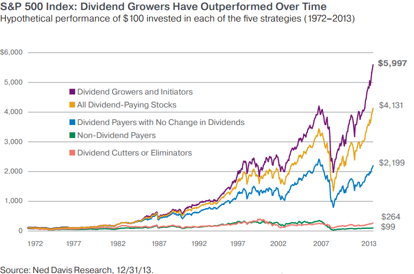

## Table of Contents

## What is a non-dividend stock?

A non-dividend stock is a type of stock that does not pay out regular dividends to its shareholders. Dividends are payments made by a company to its shareholders as a way to share profits. If a company decides not to pay dividends, it means that any profits made are kept within the company, often to be used for growth or other investments.

Investors who buy non-dividend stocks are usually looking for the stock's price to go up over time. They hope to make money by selling the stock at a higher price than they bought it for. This is different from dividend stocks, where investors might get regular payments even if the stock price doesn't change much. Non-dividend stocks can be riskier because they rely more on the company's future success and less on immediate returns.

## Why do investors buy stocks that do not pay dividends?

Investors buy stocks that do not pay dividends mainly because they believe the stock's price will go up over time. They want to buy the stock at a low price and then sell it later at a higher price to make a profit. This is called capital appreciation. Companies that do not pay dividends often use their profits to grow the business, which can make the stock price go up if the company does well.

Another reason investors choose non-dividend stocks is that they might offer more potential for big gains. These stocks are often from smaller or newer companies that are trying to grow quickly. If these companies succeed, the stock price can increase a lot. However, this also means that non-dividend stocks can be riskier because there's no regular income from dividends, and the stock price can go down if the company doesn't do well.

## What are the basic methods used to value non-dividend stocks?

One common method to value non-dividend stocks is by looking at the company's earnings. Investors use a ratio called the price-to-earnings (P/E) ratio, which compares the stock's price to the company's earnings per share. A lower P/E ratio might mean the stock is a good deal, but it's important to compare it with other companies in the same industry. Another way is to look at the company's growth potential. If a company is expected to grow a lot, investors might be willing to pay more for its stock, even if it doesn't pay dividends.

Another method is to use the price-to-sales (P/S) ratio, which compares the stock's price to the company's revenue per share. This can be useful for companies that are not yet profitable but are growing their sales. A lower P/S ratio might suggest the stock is undervalued. Investors also look at the company's overall financial health, including its debt and cash flow, to decide if the stock is a good investment. These methods help investors figure out if a non-dividend stock is worth buying, even though it doesn't provide regular income.

## How does the Discounted Cash Flow (DCF) model apply to non-dividend stocks?

The Discounted Cash Flow (DCF) model can be used to value non-dividend stocks by focusing on the company's future cash flows instead of dividends. The idea is to estimate how much money the company will make in the future and then figure out what those future cash flows are worth today. This is done by "discounting" the future cash flows, which means reducing their value to account for the time value of money and the risk involved.

To use the DCF model for a non-dividend stock, you first predict the company's future cash flows. These predictions can be based on the company's past performance, its growth plans, and the overall market conditions. Once you have these future cash flow estimates, you apply a discount rate to each of them. The discount rate reflects how risky the investment is; a higher risk means a higher discount rate. By summing up all the discounted future cash flows, you get an estimate of the stock's value today. This method helps investors decide if a non-dividend stock is a good buy, even though it doesn't pay dividends.

## What role does the growth rate play in valuing non-dividend stocks?

The growth rate is really important when you're trying to figure out how much a non-dividend stock is worth. When a company doesn't pay dividends, its value often depends a lot on how fast it's growing. If a company is growing quickly, it might make more money in the future. This means the stock could be worth more because people are willing to pay more for a piece of a company that's getting bigger and making more money.

To use the growth rate in valuing a non-dividend stock, you need to guess how much the company will grow in the future. This guess helps you predict how much money the company will make. Then, you can use a method like the Discounted Cash Flow (DCF) model to figure out what those future earnings are worth today. If the growth rate is high, the stock might seem like a good deal because the future earnings could be a lot bigger. But, if the growth rate is low or if people think it will slow down, the stock might not seem as valuable.

## How can the Price/Earnings (P/E) ratio be used to value non-dividend stocks?

The Price/Earnings (P/E) ratio is a tool that investors use to figure out if a non-dividend stock is a good deal. It compares the stock's price to how much money the company makes per share, which is called earnings per share. A lower P/E ratio might mean the stock is cheaper compared to its earnings, and it could be a good buy. But, it's important to compare the P/E ratio of one company to others in the same industry, because what's considered a "good" P/E ratio can be different from one industry to another.

When you use the P/E ratio to value a non-dividend stock, you're looking at how much you're paying for the company's ability to make money. If the company is growing and making more money each year, a higher P/E ratio might still be okay because the stock's price could go up in the future. But if the company isn't growing much, a high P/E ratio might mean the stock is too expensive. So, the P/E ratio helps you see if the stock's price matches up with the company's earnings and growth.

## What are the limitations of using traditional valuation models for non-dividend stocks?

Traditional valuation models like the Discounted Cash Flow (DCF) and Price/Earnings (P/E) ratio have some problems when you use them to value non-dividend stocks. One big issue is that these models often rely on guessing future earnings or cash flows. For non-dividend stocks, especially from smaller or newer companies, it's really hard to predict how much money they'll make in the future. If your guesses are wrong, the value you come up with for the stock can be way off. Also, these models don't always take into account how risky the stock is. Non-dividend stocks can be riskier because they don't give you regular income, and traditional models might not show this risk clearly.

Another limitation is that traditional models might not work well for companies that are growing really fast. For example, a company might not be making much money now but could grow a lot in the future. The P/E ratio might make the stock look expensive because it's based on current earnings, but if the company grows, the stock could be a good deal. The DCF model can help with this by looking at future cash flows, but it still depends a lot on your guesses about growth. So, while these models can give you some ideas about a stock's value, they have limits, especially for non-dividend stocks where the future is harder to predict.

## How do market conditions affect the valuation of non-dividend stocks?

Market conditions can really change how much a non-dividend stock is worth. When the economy is doing well and people feel good about the future, they might be more willing to buy stocks that don't pay dividends. They think the company will grow and make more money, so the stock's price might go up. But if the economy is not doing well, people might be more careful with their money. They might not want to take the risk on a stock that doesn't give them regular payments, so the stock's price could go down.

Another way market conditions affect non-dividend stocks is through interest rates. When interest rates are low, borrowing money is cheaper, and companies can use that money to grow. This can make investors think the company's future earnings will be higher, so they might pay more for the stock. But if interest rates go up, borrowing gets more expensive, and companies might not grow as fast. This can make investors less excited about the stock, and its price might drop. So, market conditions can make a big difference in how much people are willing to pay for a non-dividend stock.

## What advanced valuation techniques can be used for non-dividend stocks?

One advanced way to value non-dividend stocks is by using the Residual Income Model (RIM). This model looks at the company's book value, which is what the company would be worth if it sold everything and paid off all its debts. Then, it adds up the extra money the company makes over time, after paying for the cost of the money it uses. This extra money is called residual income. If a company can keep making more residual income, it might be worth more than its book value. The RIM is good for non-dividend stocks because it focuses on how well the company uses its money to grow, instead of looking at dividends.

Another method is the Economic Value Added (EVA) approach. EVA measures how much value a company creates by taking its after-tax operating profit and subtracting the cost of the capital it uses. If the EVA is positive, it means the company is making more money than it costs to run the business, which can make the stock more valuable. This method helps investors see if a non-dividend stock is really adding value, even if it's not paying out dividends. Both RIM and EVA can give a better picture of a non-dividend stock's worth by looking at how the company is doing overall, not just at its current earnings or dividends.

## How does the concept of terminal value impact the valuation of non-dividend stocks?

Terminal value is a big deal when you're trying to figure out how much a non-dividend stock is worth. It's the value of all the money the company will make way into the future, after the time period you're looking at closely. For non-dividend stocks, this is really important because these companies often don't make much money now but are expected to grow a lot later on. So, when you're using a model like the Discounted Cash Flow (DCF), the terminal value can make up a huge part of the total value of the stock. If you think the company will keep growing and making money forever, the terminal value will be high, and the stock might seem like a good buy.

But guessing the terminal value can be tricky. You have to make a lot of guesses about how fast the company will grow and how much money it will make far into the future. If you guess wrong, the value you come up with for the stock can be way off. For non-dividend stocks, this is even more important because they don't have regular dividends to help you figure out their worth. So, the terminal value can really change how you see a non-dividend stock's value, depending on how you think the company will do in the long run.

## What are the key differences in valuation approaches between dividend and non-dividend stocks?

The main difference in valuing dividend and non-dividend stocks is what you look at to figure out their worth. For dividend stocks, you often use the Dividend Discount Model (DDM). This model adds up all the future dividend payments and figures out what they're worth today. It's easier to use because you can see the dividends the company is paying now and guess how they might change. But for non-dividend stocks, you can't use this model because there are no dividends. Instead, you focus on how much money the company will make in the future, using methods like the Discounted Cash Flow (DCF) model. This model guesses the company's future cash flows and figures out what they're worth today, but it's harder because you have to make a lot of guesses about the company's growth.

Another big difference is that non-dividend stocks often rely more on the company's growth to be valuable. Investors buy these stocks hoping the company will grow and make more money in the future, which could make the stock's price go up. So, when valuing non-dividend stocks, you need to think a lot about the company's growth rate and how much money it will make down the road. For dividend stocks, growth is still important, but the regular payments give investors some money even if the stock's price doesn't go up much. This makes dividend stocks a bit less risky because you get some return no matter what, while non-dividend stocks depend more on the company doing well in the future.

## How can investors incorporate qualitative factors into the valuation of non-dividend stocks?

When valuing non-dividend stocks, investors can look at more than just numbers. They can think about things like the company's management team. If the people running the company are good at their jobs and have a smart plan for the future, that can make the stock more valuable. Investors also look at the company's brand and how people feel about it. If the brand is strong and customers love it, the company might do well in the future, which can make the stock worth more.

Another important qualitative factor is the company's place in the market. If the company is doing something new or different that no one else is doing, it might have a big advantage. This can make investors think the company will grow a lot, so they might be willing to pay more for the stock. Also, investors can think about how the world is changing and if the company is ready for those changes. If the company can keep up with new trends and technology, it might be a good investment even if it doesn't pay dividends now.

## How do you value non-dividend stocks?

The valuation of non-dividend stocks relies predominantly on metrics that gauge future growth potential rather than immediate income through dividends. The Price/Earnings (P/E) ratio is a prevalent metric utilized to assess the relative value of non-dividend stocks. It is calculated as the ratio of a company's current share price to its earnings per share (EPS). This metric serves as a proxy for evaluating how much investors are willing to pay for a dollar of earnings, thereby highlighting expected future earnings growth.

$$
\text{P/E Ratio} = \frac{\text{Price per Share}}{\text{Earnings per Share}}
$$

Growth investors prioritize earnings growth over dividend payouts, making the P/E ratio a suitable tool for these evaluations. A high P/E ratio might suggest that investors expect significant growth in the future earnings of the company. Conversely, a low P/E might indicate undervaluation or slow growth prospects.

Beyond P/E ratios, book value is another crucial metric used in valuing companies that do not offer dividends. The book value represents the net asset value of a company, calculated by subtracting its liabilities from its assets. It provides an estimation of what the company is worth if all its assets were liquidated. For companies with strong asset bases and no dividends, book value becomes a vital determinant of stock value. Investors examine book value to identify stocks trading below intrinsic value, considering it an opportunity for potential capital appreciation.

Analyzing a company's earnings, market trends, and reinvestment strategies is indispensable for the valuation of non-dividend stocks. Detailed analysis of earnings history and forecasts can uncover a company's growth trajectory. Monitoring market trends provides insight into the industry's future prospects, while evaluation of reinvestment strategies offers understanding into how effectively a company might leverage its earnings for sustainable growth.

Python can be utilized to automate this analysis. Here's a simple example of how one might calculate P/E ratios and book value using Python:

```python
def calculate_pe_ratio(price_per_share, eps):
    return price_per_share / eps

def calculate_book_value(total_assets, total_liabilities):
    return total_assets - total_liabilities

# Example calculations
price_per_share = 150
eps = 3
total_assets = 5000
total_liabilities = 2000

pe_ratio = calculate_pe_ratio(price_per_share, eps)
book_value = calculate_book_value(total_assets, total_liabilities)

print(f"P/E Ratio: {pe_ratio}")
print(f"Book Value: {book_value}")
```

This code provides a fundamental approach to automate basic financial calculations integral to the valuation of non-dividend stocks, forming a basis for more complex algorithmic analyses.

## How can algorithmic strategies be designed for non-dividend stocks?

Designing algorithmic trading strategies for non-dividend stocks requires a thorough analysis of historical price data. This analysis serves as the foundation for identifying patterns and trends that can be exploited for profit. A key component of this process is the utilization of technical indicators, which aid in developing data-driven strategies.

### Technical Indicators

Technical indicators such as moving averages, the Relative Strength Index (RSI), and the Moving Average Convergence Divergence (MACD) are frequently employed in algorithmic strategies to enhance decision-making. Moving averages, for example, smooth out price data, making it easier to identify the direction of the trend. For a simple moving average (SMA), the formula is:

$$
\text{SMA}_n = \frac{\sum_{i=1}^{n} P_i}{n}
$$

where $P_i$ is the asset's price at period $i$ and $n$ is the number of periods.

The RSI is a [momentum](/wiki/momentum) oscillator that measures the speed and change of price movements, providing signals on overbought and oversold conditions. It is calculated using the formula:

$$
\text{RSI} = 100 - \frac{100}{1 + RS}
$$

where $\text{RS}$ is the average of $n$ days' up closes divided by the average of $n$ days' down closes.

MACD, which is calculated by subtracting the 26-period EMA (Exponential Moving Average) from the 12-period EMA, helps to reveal changes in the strength, direction, momentum, and duration of a trend in a stock's price.

### Backtesting Strategies

Backtesting is an essential step in developing algorithmic trading strategies. It involves testing the strategy against historical data to evaluate its performance before applying it in real-market conditions. Effective backtesting assesses not only potential profitability but also risk factors and drawdowns.

An example implementation of a backtesting framework in Python may involve libraries such as `pandas` for data manipulation and `Backtrader` for strategy testing. A simple moving average crossover strategy can be implemented as follows:

```python
import backtrader as bt

class SmaCross(bt.SignalStrategy):
    def __init__(self):
        sma1, sma2 = bt.ind.SMA(period=10), bt.ind.SMA(period=30)
        self.signal_add(bt.SIGNAL_LONG, bt.ind.CrossOver(sma1, sma2))

cerebro = bt.Cerebro()
cerebro.addstrategy(SmaCross)
data = bt.feeds.YahooFinanceData(dataname='AAPL', fromdate=datetime(2020, 1, 1), todate=datetime(2021, 1, 1))
cerebro.adddata(data)
cerebro.run()
```

### Determining Entry and Exit Points

Entry and exit points in trading strategies are typically based on signals generated by the selected technical indicators. For instance, a moving average crossover might signal a potential entry point when a short-term moving average crosses above a long-term moving average, indicating an upward trend. Conversely, an exit point might be signaled when the short-term moving average crosses below the long-term moving average, suggesting a downward trend.

The accuracy and timing of these entry and exit signals are crucial for the success of algorithmic trading strategies, and ongoing refinement is necessary to adapt to new patterns and market dynamics. Implementing robust strategies allows traders to capitalize on the inherent volatility of non-dividend stocks effectively.

## References & Further Reading

[1]: Bergstra, J., Bardenet, R., Bengio, Y., & Kégl, B. (2011). ["Algorithms for Hyper-Parameter Optimization."](https://dl.acm.org/doi/10.5555/2986459.2986743) Advances in Neural Information Processing Systems 24.

[2]: ["Advances in Financial Machine Learning"](https://www.amazon.com/Advances-Financial-Machine-Learning-Marcos/dp/1119482089) by Marcos Lopez de Prado

[3]: ["Evidence-Based Technical Analysis: Applying the Scientific Method and Statistical Inference to Trading Signals"](https://www.amazon.com/Evidence-Based-Technical-Analysis-Scientific-Statistical/dp/0470008741) by David Aronson

[4]: ["Machine Learning for Algorithmic Trading"](https://github.com/stefan-jansen/machine-learning-for-trading) by Stefan Jansen

[5]: ["Quantitative Trading: How to Build Your Own Algorithmic Trading Business"](https://www.amazon.com/Quantitative-Trading-Build-Algorithmic-Business/dp/1119800064) by Ernest P. Chan