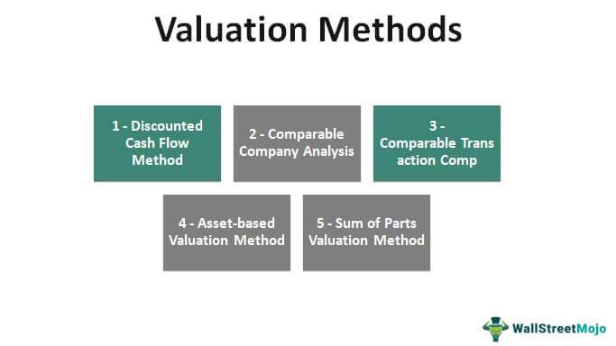

Understanding the valuation of private company shares is essential for investors and business owners seeking to make informed decisions. Private companies differ from their public counterparts by lacking a transparent pricing mechanism, which adds layers of complexity to the valuation process. In public markets, share prices are readily available due to active trading on stock exchanges, providing a clear indicator of a company's value. In contrast, private companies do not have such a pricing mechanism, making it challenging to determine the fair market value of their shares.

The valuation of private company shares requires a comprehensive understanding of various methodologies and factors that impact their worth. These include an analysis of financial performance, growth potential, and the efficacy of the management team. Additionally, external factors such as market conditions and regulatory changes play a significant role in shaping the perceived value of private company shares.



Algorithmic trading, often associated with high-frequency trading in public markets, also offers potential benefits in this context. Through the use of sophisticated algorithms, investors can simulate market scenarios and analyze historical data to assist in making more accurate valuations of private shares. This article explores how algorithmic trading can integrate with traditional valuation methods to offer enhanced insights and support the decision-making process in private company investments. By leveraging both quantitative and qualitative assessments, stakeholders can navigate the complexities of valuing private company shares effectively.

## Table of Contents

## Understanding Private Company Valuation

Understanding the valuation of private company shares is markedly different from valuing public company shares due to the absence of a transparent, market-driven pricing mechanism. Unlike public companies, which have their share prices determined by stock exchanges based on supply and demand dynamics, private companies require a more nuanced approach. The lack of readily available market prices necessitates a careful analysis of various qualitative and quantitative factors to establish fair value.

One of the primary factors is financial performance, which encompasses an in-depth evaluation of the company's revenue streams, profitability, and cash flow. Analysts often scrutinize historical financial statements, wherein they employ metrics such as Earnings Before Interest, Taxes, Depreciation, and Amortization (EBITDA), net income, and revenue growth rates. A robust financial performance typically translates into a higher valuation as it suggests that the company can generate sustainable profits.

Growth potential is another critical element. This involves examining the size of the market in which the company operates, prevailing industry trends, and the competitive landscape. Companies positioned in burgeoning sectors or those capable of capturing a larger market share are often attributed higher valuations due to the future value they can potentially deliver.

The management team also plays a vital role in valuation. A seasoned leadership team with a proven track record of driving growth and innovation can significantly enhance a company's value. Investors typically assess the experience and expertise of the executive team to gauge the company's potential for strategic execution.

Finally, risk factors must be considered. These include market [volatility](/wiki/volatility-trading-strategies), which can affect future earnings forecasts, and regulatory changes that could impact operations. Companies that are insulated from such risks or have strategies in place to mitigate them are likely to be more attractive to investors, positively influencing their valuation.

An intricate understanding of these aspects helps create a comprehensive valuation model that accurately reflects the intrinsic value of private company shares. This process is fundamental for investors making informed decisions and for business owners who wish to gauge the financial health and potential [exit](/wiki/exit-strategy) value of their companies.

## Key Factors Influencing Private Share Valuation

Valuing shares in a private company requires an in-depth analysis of several fundamental components that directly influence a company's perceived worth. These components are largely consistent across various industries and sectors and provide a reliable framework for investors and business analysts.

### Financial Performance

Financial performance stands as a pivotal determinant in the valuation process. The examination of revenue, profitability, and cash flow is paramount:

- **Revenue**: This is the total amount of income generated by the sale of goods or services. Consistent revenue growth is often interpreted as a positive indicator of business health.

- **Profitability**: Analyzing key metrics such as gross margin, operating margin, and net profit margin provides insight into a company's operational efficiency.

- **Cash Flow**: The examination of operating cash flow and free cash flow helps in assessing the liquidity and financial flexibility of a business.

Using financial performance metrics, one might employ formulas such as \[ \text{EBITDA Margin} = \frac{\text{EBITDA}}{\text{Total Revenue}} \] to grasp operational efficiency.

### Growth Potential

Investors seek companies with substantial growth prospects, which involve evaluating:

- **Market Size**: Understanding the total available market (TAM) offers insight into the potential for expansion.

- **Industry Trends**: Current and predicted trends impact a company's future performance. For instance, technological advancements or shifts in consumer behavior can alter growth trajectories.

- **Competitive Landscape**: A comprehensive analysis of competitors helps determine how a company positions itself in the market. This includes the strengths and weaknesses of major players within the industry.

### Management Team

The competence and track record of a company's leadership team significantly influence its valuation. Key considerations include:

- **Experience**: Leaders with substantial experience within the industry are often better equipped to steer the company toward success.

- **Track Record**: A history of successful ventures or positive outcomes in previous roles can boost investor confidence.

### Risk Factors

Addressing potential risks is crucial for an accurate valuation. Two key risk considerations include:

- **Market Volatility**: Economic fluctuations can impact demand, pricing, and overall market conditions. Volatility metrics, such as beta (β), can quantify a company's market-related risk.

- **Regulatory Changes**: Understanding the regulatory environment and potential changes is vital for predicting how external factors might influence business operations.

Overall, a meticulous evaluation of these factors, supported by quantitative metrics and qualitative insights, forms the foundation for accurately assessing private share value.

## Methods for Calculating Share Value

Valuating private company shares requires rigorous analysis, often utilizing established financial methods to derive an accurate estimation of value. Among the most prominent methods employed are Comparable Company Analysis (CCA), Discounted Cash Flow (DCF) Analysis, and Asset-Based Valuation, each offering unique insights based on different aspects of the company's financial profile.

### Comparable Company Analysis (CCA)

Comparable Company Analysis (CCA) involves comparing the financial metrics and valuation ratios of the target private firm with those of similar public companies. The fundamental premise is that companies operating in the same industry and with similar business models should exhibit analogous valuation multiples. Commonly used metrics in CCA include price-to-earnings (P/E), enterprise value-to-EBITDA (EV/EBITDA), and price-to-sales (P/S) ratios.

To conduct CCA, one must:

1. Identify a peer group of comparable public companies.
2. Gather the financial data and ratios for each peer company.
3. Calculate the averages or medians of these ratios.
4. Apply these multiples to the financial figures of the target private company to estimate its value.

The formula used is:

$$

\text{Estimated Value} = \text{Metric} \times \text{Comparable Multiple} 
$$

For example, if the average EV/EBITDA ratio for comparable firms is 8x, and the private company's EBITDA is $5 million, the estimated enterprise value would be $40 million.

### Discounted Cash Flow (DCF) Analysis

Discounted Cash Flow (DCF) Analysis calculates a company's value by projecting its future cash flows and discounting them back to their present value. This method is heavily reliant on estimating future operational performance and determining an appropriate discount rate, which reflects the risk associated with the investment.

The general steps in DCF are:

1. Forecast future cash flows (typically over a 5-10 year period).
2. Determine a terminal value, representing the business's value beyond the forecast period.
3. Discount the forecasted cash flows and terminal value to present value using the company's weighted average cost of capital (WACC).

The core formula is:

$$

\text{PV} = \sum_{t=1}^{n} \frac{CF_t}{(1 + r)^t} + \frac{TV}{(1 + r)^n} 
$$

Where:
- $CF_t$ is the cash flow in year $t$,
- $r$ is the discount rate, 
- $TV$ is the terminal value.

### Asset-Based Valuation

Asset-Based Valuation calculates the Net Asset Value (NAV) by subtracting total liabilities from total assets. This approach is most suitable for firms with substantial tangible assets and is often used for asset-heavy industries like manufacturing or real estate.

The calculation involves:

1. Listing all the company's assets and their respective values.
2. Listing all liabilities.
3. Subtracting total liabilities from total assets to determine the NAV.

The equation is:

$$

\text{NAV} = \text{Total Assets} - \text{Total Liabilities} 
$$

While straightforward, this method may not adequately capture intangibles or future growth potential, thus limiting its applicability to certain sectors.

In summary, each of these valuation methods provides insights from different perspectives, and deploying a combination can often yield the most comprehensive understanding of a private company's worth.

## Implementing Algorithmic Trading in Share Valuation

Algorithmic trading, prominently used in public markets, is gradually influencing private share valuation by simulating market conditions and predicting share performance. By employing sophisticated algorithms and extensive historical data, [algorithmic trading](/wiki/algorithmic-trading) can provide insightful predictions that assist in making informed valuation decisions for private companies.

### Simulating Market Scenarios to Predict Share Performance

One of the core strengths of algorithmic trading is its ability to model and simulate various market scenarios. By adjusting parameters within these models, investors and analysts can observe potential outcomes for a private company's share performance under different conditions. This process often involves running thousands of simulations using techniques such as Monte Carlo simulations, which allow analysts to evaluate how an asset might perform across a wide array of theoretical market conditions.

For instance, suppose we have historical financial data of a private company. An algorithm could simulate how the company's shares would react to different levels of economic growth, changes in interest rates, and shifts in consumer demand. This simulation provides a spectrum of potential outcomes, assisting in identifying risks and opportunities associated with the valuation of shares.

### Using Historical Data and Algorithms for Decision-Making

Historical data is pivotal in algorithmic approaches for it serves as the foundation for building predictive models. Time series analysis and [machine learning](/wiki/machine-learning) techniques can be applied to historical data to unearth trends and patterns that might not be immediately visible. These models can be used to predict future financial performance and potentially identify the fair market value of a private company's shares.

For example, using Python, one might employ libraries such as pandas for data manipulation, scikit-learn for machine learning modeling, and matplotlib for data visualization. Here's a simple Python snippet illustrating how historical revenue data could be used to predict future revenue using linear regression:

```python
import pandas as pd
from sklearn.model_selection import train_test_split
from sklearn.linear_model import LinearRegression
import matplotlib.pyplot as plt

# Sample Data
data = {'Year': [2016, 2017, 2018, 2019, 2020],
        'Revenue': [150, 200, 250, 300, 350]}
df = pd.DataFrame(data)

# Preparing data for the model
X = df[['Year']]
y = df['Revenue']
X_train, X_test, y_train, y_test = train_test_split(X, y, test_size=0.2, random_state=42)

# Linear Regression Model
model = LinearRegression()
model.fit(X_train, y_train)

# Predicting future revenue
future_years = pd.DataFrame({'Year': [2021, 2022, 2023]})
predictions = model.predict(future_years)

# Plotting
plt.scatter(df['Year'], df['Revenue'], color='blue', label='Actual Revenue')
plt.plot(df['Year'], model.predict(df[['Year']]), color='red', label='Trend Line')
plt.plot(future_years['Year'], predictions, color='green', label='Predicted Revenue')
plt.xlabel('Year')
plt.ylabel('Revenue')
plt.legend()
plt.show()
```

### Advantages and Limitations

Algorithmic approaches offer considerable precision and speed in processing vast amounts of data, thus aiding in the swift identification of trends and anomalies. Moreover, algorithms can efficiently handle large datasets, and automated models can reduce human bias in decision-making. However, these methods are not without limitations.

The accuracy of algorithmic predictions heavily depends on the quality and relevance of the data. Private companies often have less data available compared to public entities, making it challenging to build robust models. Additionally, market conditions can change rapidly, rendering historical data less predictive. Furthermore, the development and maintenance of complex algorithms require specialized knowledge and significant computational resources.

Despite these challenges, as technology advances, the integration of algorithmic trading techniques in the valuation of private company shares will likely become increasingly sophisticated, refining the precision and reliability of valuation analyses.

## Practical Tips for Valuing Private Company Shares

Reviewing shareholder agreements is a crucial step when valuing private company shares. These agreements often contain specific clauses related to valuation, such as methods to be used or conditions under which valuation is mandated. Additionally, understanding transfer restrictions is vital, as they can affect the [liquidity](/wiki/liquidity-risk-premium) and marketability of shares, subsequently influencing their value. Such clauses might limit who can buy shares or impose certain conditions before a transfer is allowed, potentially leading to valuation discounts due to reduced marketability.

In complex valuation scenarios, engaging professional valuation firms can provide substantial benefits. These firms bring expertise and industry knowledge, employing rigorous methodologies to evaluate a company’s worth. They are equipped to navigate intricate financial data and market conditions, offering an impartial and detailed analysis. Their services are particularly valuable for businesses with unique structures or when a high degree of precision is necessary, such as during mergers and acquisitions or when preparing for an initial public offering (IPO).

Employing multiple valuation methods can lead to a more comprehensive understanding of a private company's share value. Each method provides a different perspective, thereby mitigating the limitations of any single approach. For instance, Comparable Company Analysis (CCA) offers insights based on relative market data, while Discounted Cash Flow (DCF) Analysis focuses on the intrinsic value derived from projected cash flows. Asset-based valuation, by calculating net asset value (NAV), provides an understanding grounded in the company’s tangible resources. A blended approach, using a weighted average of these methods, can offer a balanced view, accommodating varying market conditions and internal company specifics.

To illustrate, consider a scenario where an investor seeks to value a private technology firm. The investor might combine the median valuation multiples from CCA with the intrinsic insights from a DCF model, adjusting for the company’s rapid technological advancements. This joint application compensates for each method's individual shortcomings, enhancing the valuation's overall accuracy. 

In summary, valuing private company shares requires careful consideration of legal documentation, professional expertise, and methodical cross-verification through multiple valuation techniques. These practices not only streamline the valuation process but also enhance the reliability of the outcomes, offering stakeholders a robust framework for decision-making.

## Conclusion

Valuing private company shares is a nuanced process that requires a blend of both quantitative and qualitative evaluations. The absence of publicly available share prices necessitates a more comprehensive approach, relying on a detailed understanding of a company's financials, management, and market position. Regularly updating valuations is crucial as business circumstances and market conditions are dynamic. Engaging professional valuation firms is often advisable to gain in-depth insights and ensure accuracy, especially with complex valuations involving multiple methodologies such as Discounted Cash Flow (DCF), Comparable Company Analysis (CCA), and Asset-Based Valuation.

Algorithmic trading presents promising prospects for enhancing private share valuation. Its ability to process large volumes of data and simulate various market conditions provides valuable insights into potential future share performance. Algorithms can assist in identifying patterns and trends that might not be evident through traditional analysis alone. However, it's important to recognize the limitations alongside the advantages. Algorithms require substantial historical data, which can be challenging to obtain for private companies. Nevertheless, as algorithmic techniques continue to advance, they offer significant potential to refine valuation processes by combining computational power with expert judgment. As such, the blend of human expertise and sophisticated algorithms can provide a more robust framework for valuing private company shares.

## References & Further Reading

[1]: Damodaran, A. (2002). ["Investment Valuation: Tools and Techniques for Determining the Value of Any Asset."](https://archive.org/details/investmentvaluat0000damo_n6k9) Wiley.

[2]: Koller, T., Goedhart, M., & Wessels, D. (2010). ["Valuation: Measuring and Managing the Value of Companies."](https://www.wiley.com/en-us/Valuation%3A+Measuring+and+Managing+the+Value+of+Companies%2C+7th+Edition-p-9781119610885) Wiley.

[3]: Lopez de Prado, M. (2018). ["Advances in Financial Machine Learning."](https://www.amazon.com/Advances-Financial-Machine-Learning-Marcos/dp/1119482089) Wiley.

[4]: Rosenbaum, J., & Pearl, J. (2009). ["Investment Banking: Valuation, Leveraged Buyouts, and Mergers and Acquisitions."](https://www.amazon.com/Investment-Banking-Valuation-Leveraged-Acquisitions/dp/1118656210) Wiley.

[5]: Jansen, S. (2020). ["Machine Learning for Algorithmic Trading."](https://github.com/stefan-jansen/machine-learning-for-trading) Packt Publishing.