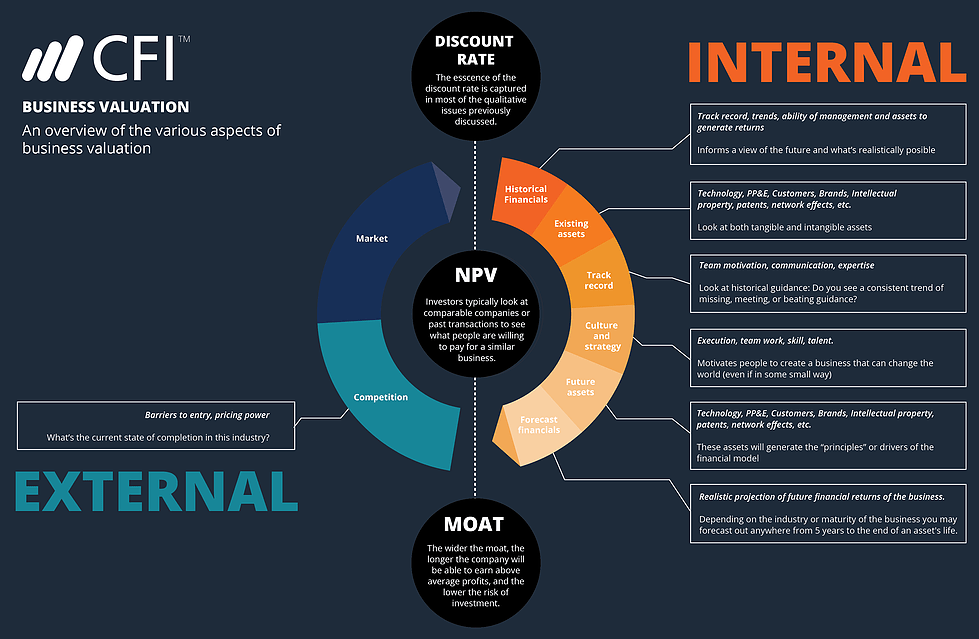

## Table of Contents

## What is the basic concept of valuing private company shares?

Valuing private company shares means figuring out how much a part of a business that isn't traded on a public stock market is worth. This is important for things like selling the company, bringing in new investors, or planning for the future. Since these shares don't have a clear price like stocks on the stock market, people use different ways to guess their value. They look at things like how much money the company makes, how fast it's growing, and what similar companies are worth.

One common way to value private company shares is by using the income approach. This means looking at how much money the company is expected to make in the future and then figuring out what that money is worth now. Another way is the market approach, where you compare the company to similar ones that have been sold or valued recently. Each method has its own strengths and weaknesses, so often people use a mix of methods to get a better idea of what the shares are really worth.

## Why is it important to value private company shares?

Valuing private company shares is important because it helps everyone involved understand how much the company is worth. This is crucial when someone wants to buy or sell part of the company. If the shares are valued correctly, it makes sure that the price is fair for both the person selling and the person buying. It also helps when the company wants to bring in new investors. By knowing the value of the shares, the company can offer a fair price to new investors, which can help the company grow.

Another reason valuing private company shares is important is for planning the future of the business. When the owners know how much their company is worth, they can make better decisions about things like expanding the business, selling it, or passing it on to someone else. It also helps with things like getting loans or insurance, because banks and insurance companies want to know the value of the company before they agree to give money or coverage. So, valuing private company shares is a key part of running and growing a private business.

## What are the common methods used to value private company shares?

One common method to value private company shares is the income approach. This method looks at how much money the company is expected to make in the future. It uses things like the company's profits and how fast it's growing to guess its value. The idea is to figure out what all that future money is worth right now. This can be tricky because it's hard to predict the future, but it's useful because it focuses on the company's ability to make money.

Another method is the market approach. This involves comparing the private company to other similar companies that have been sold or valued recently. By looking at what these other companies are worth, you can get an idea of what your company might be worth. This method is good because it uses real-world examples, but it can be hard to find companies that are exactly like yours, so it's not always perfect.

Sometimes, people also use the asset-based approach. This method looks at everything the company owns, like buildings, equipment, and money in the bank, and subtracts what it owes, like loans. The value of the shares is based on what's left over. This method is straightforward, but it might not show the full value of the company if it's more about its ideas or future growth than its physical stuff. Using a mix of these methods often gives the best picture of what the private company shares are really worth.

## How does the market approach to valuation work for private companies?

The market approach to valuation for private companies works by comparing the company to other similar companies that have been sold or valued recently. People look at what these other companies are worth and use that information to guess the value of the private company. They might look at things like how much money the companies make, how big they are, and what industry they're in. By finding companies that are a lot like the private company, they can get a good idea of what the private company might be worth.

This method is useful because it uses real examples from the market. It's like looking at the price of similar houses in a neighborhood to guess the value of your house. But it can be hard to find companies that are exactly the same as the private company you're trying to value. Sometimes, the companies used for comparison might not be a perfect match, which can make the guess less accurate. Even with these challenges, the market approach is a popular way to value private company shares because it gives a real-world view of what the company might be worth.

## What is the income approach and how is it applied to private company valuation?

The income approach is a way to value private company shares by looking at how much money the company is expected to make in the future. It's like trying to guess how much all that future money is worth right now. People use this method by looking at the company's profits and how fast it's growing. They make guesses about how much money the company will make over the next few years and then use a special math formula to figure out what that money is worth today. This formula is called the discounted cash flow (DCF) method, and it helps turn future money into today's money.

Using the income approach can be tricky because it's hard to predict the future. If the guesses about future profits are wrong, the value of the company could be way off. But this method is really useful because it focuses on the company's ability to make money, which is a big part of what makes a company valuable. By looking at the company's potential to earn money over time, the income approach gives a good idea of what the private company shares might be worth, even if it's not perfect.

## Can you explain the asset-based approach to valuing private company shares?

The asset-based approach to valuing private company shares looks at everything the company owns and subtracts what it owes. It's like figuring out how much money you'd have if you sold all the company's stuff and paid off all its debts. This method adds up the value of things like buildings, equipment, and money in the bank, and then subtracts the value of loans and other debts. The value left over is what the company's shares are worth according to this approach.

This method is simple and straightforward because it's based on what the company actually has right now. It's easy to understand and use, especially for companies that own a lot of physical stuff. But it might not show the full value of a company if its real worth comes from things like ideas, future growth, or its brand. For companies where the future potential is more important than what they own today, the asset-based approach might not give a complete picture of what the shares are really worth.

## What role do financial statements play in the valuation of private company shares?

Financial statements are really important when you're trying to figure out how much private company shares are worth. They show how much money the company is making, how much it's spending, and what it owns and owes. By looking at these statements, people can use different ways to guess the company's value. For example, the income approach looks at the company's profits and growth to predict future money, and financial statements give all the numbers you need for that. The market approach compares the company to others, and financial statements help find similar companies to compare with.

Even the asset-based approach, which looks at what the company owns minus what it owes, relies on the financial statements to get those numbers right. Without good financial statements, it's hard to make accurate guesses about the company's value. They give a clear picture of the company's money situation, which is key for deciding how much the shares are worth. So, financial statements are a big part of valuing private company shares because they provide the basic information needed for all the different valuation methods.

## How do factors like market conditions and industry trends affect private company valuation?

Market conditions and industry trends play a big role in figuring out how much private company shares are worth. When the economy is doing well, people might be willing to pay more for a company's shares because they think the company will make more money. On the other hand, if the economy is struggling, people might not want to pay as much because they're worried about the company's future. The same goes for the industry the company is in. If the industry is growing and doing well, that can make the company's shares more valuable. But if the industry is shrinking or facing problems, that can lower the value of the shares.

Industry trends also matter because they can show where the company might be headed. For example, if there's a new technology or way of doing things that's becoming popular in the industry, a company that's using that new thing might be seen as more valuable. But if a company is stuck with old ways of doing things and the industry is moving on, that could make its shares less valuable. So, when people are trying to value private company shares, they need to think about what's going on in the market and the industry to get a good guess about what the shares are really worth.

## What are the challenges and limitations of valuing private company shares?

Valuing private company shares can be tricky because there's no easy way to know what they're worth. Unlike public companies where you can just look at the stock price, private companies don't have a clear price tag. This means people have to guess the value using different methods, like looking at the company's profits or comparing it to other companies. But these guesses can be off if the information they're based on isn't accurate or if the future doesn't turn out the way people expected. Also, private companies don't have to share as much information as public companies, so it can be hard to get all the details needed to make a good guess.

Another challenge is that the value of private company shares can change a lot depending on what's going on in the economy and the industry. If the economy is doing well, people might think the company's shares are worth more. But if the economy is struggling, the value could go down. The same goes for the industry the company is in. If the industry is growing, that can make the company's shares more valuable. But if the industry is facing problems, that can lower the value. So, valuing private company shares isn't just about looking at the company itself, but also about understanding what's happening around it.

## How can discounts for lack of marketability and lack of control impact the valuation of private shares?

When valuing private company shares, discounts for lack of marketability and lack of control can lower the value of the shares. A discount for lack of marketability means that because private company shares can't be sold easily like stocks on the stock market, they might be worth less. If you own shares in a public company, you can sell them anytime you want. But with private company shares, you might have to wait a long time to find someone to buy them, or you might not be able to sell them at all. This makes the shares less valuable because people don't want to buy something they can't sell easily.

A discount for lack of control is about how much say you have in running the company. If you own shares in a private company but don't have a big enough part to make decisions, your shares might be worth less. For example, if you own just a small piece of the company, you can't tell the company what to do or how to spend its money. This lack of control makes the shares less valuable because people usually want to have some say in how a company is run. So, when figuring out the value of private company shares, you have to think about these discounts to get a fair price.

## What advanced techniques can be used to refine the valuation of private company shares?

One advanced technique to refine the valuation of private company shares is using Monte Carlo simulations. This method involves running many different scenarios to see how the company's value might change based on different things that could happen in the future. For example, it can show how the value might go up or down if the economy grows or shrinks, or if the company's profits are higher or lower than expected. By looking at all these different possibilities, you can get a better idea of what the shares might be worth, instead of just guessing based on one set of numbers.

Another technique is using real options valuation. This method looks at the company like it's a set of choices or "options" that can be used in the future. For example, the company might have the choice to expand into a new market or to buy another business. Real options valuation tries to figure out how much these choices are worth and adds that to the overall value of the company. This can be really helpful for companies that have a lot of potential for growth or change, because it takes into account the value of all the different things they might do in the future.

## How do regulatory and legal considerations influence the valuation process for private companies?

Regulatory and legal considerations can have a big impact on how much private company shares are worth. Different rules and laws can affect how much money the company can make and how it has to spend that money. For example, if there are strict rules about what the company can do, it might not be able to grow as fast or make as much money as it could without those rules. This can make the shares less valuable. Also, if the company is in an industry where the government keeps changing the rules, it can be hard to predict what will happen in the future, which makes it harder to guess the value of the shares.

Legal issues like lawsuits or problems with contracts can also affect the company's value. If the company is dealing with a big lawsuit, it might have to pay a lot of money if it loses, which would make the shares worth less. Or if the company has contracts that aren't very clear or that might be broken, that can make people worried about the company's future, which can lower the value of the shares. So, when figuring out how much private company shares are worth, people have to think about all these regulatory and legal things to get a good idea of what the shares might be worth.

## What are the methods for calculating share value?

Valuating private company shares requires rigorous analysis, often utilizing established financial methods to derive an accurate estimation of value. Among the most prominent methods employed are Comparable Company Analysis (CCA), Discounted Cash Flow (DCF) Analysis, and Asset-Based Valuation, each offering unique insights based on different aspects of the company's financial profile.

### Comparable Company Analysis (CCA)

Comparable Company Analysis (CCA) involves comparing the financial metrics and valuation ratios of the target private firm with those of similar public companies. The fundamental premise is that companies operating in the same industry and with similar business models should exhibit analogous valuation multiples. Commonly used metrics in CCA include price-to-earnings (P/E), enterprise value-to-EBITDA (EV/EBITDA), and price-to-sales (P/S) ratios.

To conduct CCA, one must:

1. Identify a peer group of comparable public companies.
2. Gather the financial data and ratios for each peer company.
3. Calculate the averages or medians of these ratios.
4. Apply these multiples to the financial figures of the target private company to estimate its value.

The formula used is:

$$

\text{Estimated Value} = \text{Metric} \times \text{Comparable Multiple} 
$$

For example, if the average EV/EBITDA ratio for comparable firms is 8x, and the private company's EBITDA is $5 million, the estimated enterprise value would be $40 million.

### Discounted Cash Flow (DCF) Analysis

Discounted Cash Flow (DCF) Analysis calculates a company's value by projecting its future cash flows and discounting them back to their present value. This method is heavily reliant on estimating future operational performance and determining an appropriate discount rate, which reflects the risk associated with the investment.

The general steps in DCF are:

1. Forecast future cash flows (typically over a 5-10 year period).
2. Determine a terminal value, representing the business's value beyond the forecast period.
3. Discount the forecasted cash flows and terminal value to present value using the company's weighted average cost of capital (WACC).

The core formula is:

$$

\text{PV} = \sum_{t=1}^{n} \frac{CF_t}{(1 + r)^t} + \frac{TV}{(1 + r)^n} 
$$

Where:
- $CF_t$ is the cash flow in year $t$,
- $r$ is the discount rate, 
- $TV$ is the terminal value.

### Asset-Based Valuation

Asset-Based Valuation calculates the Net Asset Value (NAV) by subtracting total liabilities from total assets. This approach is most suitable for firms with substantial tangible assets and is often used for asset-heavy industries like manufacturing or real estate.

The calculation involves:

1. Listing all the company's assets and their respective values.
2. Listing all liabilities.
3. Subtracting total liabilities from total assets to determine the NAV.

The equation is:

$$

\text{NAV} = \text{Total Assets} - \text{Total Liabilities} 
$$

While straightforward, this method may not adequately capture intangibles or future growth potential, thus limiting its applicability to certain sectors.

In summary, each of these valuation methods provides insights from different perspectives, and deploying a combination can often yield the most comprehensive understanding of a private company's worth.

## References & Further Reading

[1]: Damodaran, A. (2002). ["Investment Valuation: Tools and Techniques for Determining the Value of Any Asset."](https://archive.org/details/investmentvaluat0000damo_n6k9) Wiley.

[2]: Koller, T., Goedhart, M., & Wessels, D. (2010). ["Valuation: Measuring and Managing the Value of Companies."](https://www.wiley.com/en-us/Valuation%3A+Measuring+and+Managing+the+Value+of+Companies%2C+7th+Edition-p-9781119610885) Wiley.

[3]: Lopez de Prado, M. (2018). ["Advances in Financial Machine Learning."](https://www.amazon.com/Advances-Financial-Machine-Learning-Marcos/dp/1119482089) Wiley.

[4]: Rosenbaum, J., & Pearl, J. (2009). ["Investment Banking: Valuation, Leveraged Buyouts, and Mergers and Acquisitions."](https://www.amazon.com/Investment-Banking-Valuation-Leveraged-Acquisitions/dp/1118656210) Wiley.

[5]: Jansen, S. (2020). ["Machine Learning for Algorithmic Trading."](https://github.com/stefan-jansen/machine-learning-for-trading) Packt Publishing.