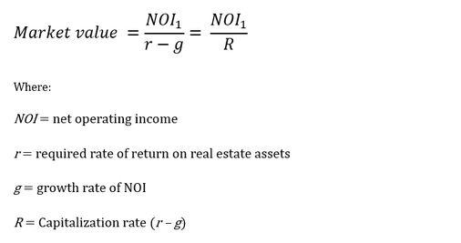

The real estate market stands as a pivotal component of wealth creation, having undergone significant transformations due to technological advancements. In recent years, the fusion of technology and real estate has introduced new methodologies, profoundly altering investment landscapes. A core part of these changes is the comprehensive understanding of property value, which remains essential for making informed investment decisions and engaging in successful trading. Knowing the precise value of properties enables investors to maximize returns while minimizing risks.

Algorithmic trading has emerged as a significant innovation reshaping real estate investments. This technology uses algorithms to automate trading decisions, thereby enhancing the speed and efficiency of transactions. By leveraging big data and advanced computational techniques, algorithmic trading allows investors to exploit market inefficiencies and execute trades at optimal times. This modern approach is transforming traditional investment strategies, providing investors with precise and actionable insights.



This article examines the convergence of property investment, real estate appraisal, and advanced trading algorithms. By exploring how these elements intersect, investors can enhance their investment strategies and outcomes, leading to improved performance in the market. Understanding current trends and leveraging technology are crucial for both seasoned investors and newcomers seeking to thrive in today's ever-evolving market. Embracing these innovations not only helps in navigating the complexities of real estate investments but also provides a competitive edge in maximizing investment potential.

## Table of Contents

## Understanding Property Investment

Property investment is centered on the acquisition of real estate assets with the primary goal of generating financial returns. This investment avenue presents potential earnings through two main forms: capital appreciation, where the property's market value increases over time, and rental income, derived from leasing the property to tenants.

The diversity in property types, from residential to commercial and industrial, contributes to varying risk and return profiles. Residential properties, including single-family homes and apartments, often present lower risk but can also offer moderate returns. Conversely, commercial and industrial properties potentially offer higher returns, accompanied by increased risk due to factors such as market demand fluctuations and economic changes.

Conducting thorough market research and exercising diligence are imperative for successful property investment. Market research involves analyzing economic indicators, location-specific factors, and property market trends to make informed decisions. Due diligence refers to the comprehensive evaluation of a property's legal, financial, and physical condition before purchase, thereby minimizing unforeseen liabilities and ensuring the investment aligns with the investor's objectives.

Formulating a coherent investment strategy is another critical element, encompassing the alignment of investment choices with personal financial goals and the investor’s capacity for risk. This strategy often involves evaluating one's investment horizon, expected growth, and risk tolerance before committing financial resources. 

Understanding these aspects not only aids in the selection of appropriate investments but also in maximizing returns while managing potential risks.

## Real Estate Appraisal: The Heart of Property Valuation

Real estate appraisal is a meticulous process that involves the professional assessment of a property's value, and it serves as a vital component in determining the appropriate buying and selling prices of properties. The primary goal of an appraisal is to establish an objective and unbiased estimate of a property's market value at a specific point in time. This estimate is pivotal for a variety of stakeholders, including buyers, sellers, investors, and financial institutions.

Several key factors are considered when assessing the value of real estate. One of the most critical variables is the property's location. The desirability of a location can significantly influence a property's value, as it determines accessibility to amenities, the quality of the neighborhood, and potential future developments. Another important [factor](/wiki/factor-investing) is the condition of the property. This involves assessing the physical state of the building, including its age, maintenance level, and any renovations or improvements. Market trends also play a crucial role, as they reflect the broader economic conditions and consumer preferences which can affect property demand and value.

Various appraisal methods are employed, each tailored to different property types and investment scenarios. The sales comparison approach is one of the most common methods; it involves comparing the property in question to similar properties that have recently sold in the same area. By analyzing these comparable sales, appraisers can estimate a property's market value. Another approach is the cost method, which calculates the cost to replace the building with a similar one, accounting for depreciation and land value. This method is particularly useful for new constructions. The income approach is often used for investment properties. It involves estimating the potential income generated by the property, such as rental income, and applying a capitalization rate to derive its value.

Accurate appraisals are foundational to sound investment decisions. They provide investors with a reliable basis for evaluating property transactions and formulating strategies. Without a precise valuation, investors may either overpay for an asset or sell at a less than optimal price, potentially eroding their returns. With the integration of technology and data analytics, modern appraisals are becoming more precise and efficient, further enhancing their role in the real estate market. The evolution of these tools complements traditional appraisal practices and supports the continual advancement of investment strategies in the sector.

## Real Estate Valuation Techniques

Real estate valuation is a critical component of the real estate investment process. It informs buyers, sellers, and investors of the property's worth, ensuring sound decision-making. Several valuation methods cater to varied needs, each with distinct advantages and limitations.

One of the traditional techniques is the **Sales Comparison Approach**, which calculates a property's value by comparing it to similar properties recently sold in the area. This method is particularly useful for residential properties where market activity is robust, allowing for plentiful comparable data. However, its accuracy can diminish in markets with fewer transactions or unique properties lacking direct comparability.

Another approach, commonly utilized in commercial real estate, is the **Income Approach**. It assesses value based on the expected income generation potential of the property. This involves calculating the Net Operating Income (NOI) and applying a capitalization rate to derive the market value:

$$
\text{Value} = \frac{\text{NOI}}{\text{Capitalization Rate}}
$$

This method is powerful for income-producing properties but demands accurate future income projection and a reliable capitalization rate, which can fluctuate with market conditions.

The **Cost Approach**, often applied to unique or newly constructed properties, estimates value based on the cost to replace or reproduce the structure, subtracting any depreciation, and adding the land value. Though it provides a tangible cost framework, it might not fully reflect market demand.

Emerging technologies have revolutionized property valuation, introducing **Automated Valuation Models (AVMs)**. AVMs employ sophisticated algorithms and [machine learning](/wiki/machine-learning) to evaluate vast datasets, providing rapid and often cost-effective property assessments. These models analyze factors such as recent sales, property characteristics, and regional market trends to generate an estimate. While AVMs offer speed and efficiency, they might not capture the nuances of local markets or unique property features, requiring careful validation.

To enhance valuation accuracy, it's crucial to consider **market dynamics** and **property-specific factors**. Macroeconomic indicators, zoning regulations, and local development trends can significantly impact property value. Additionally, understanding the property's condition, age, and unique features helps in refining the valuation process.

Ultimately, selecting the appropriate valuation technique depends on the assessment's purpose, be it for purchase, sale, investment, or lending. A multifaceted approach, combining traditional methods with technological advancements like AVMs, can offer a comprehensive valuation, ensuring informed and strategic real estate decisions. As technology continues to evolve, these methods will likely become even more integrated and refined, providing enhanced insights into property valuation.

## The Rise of Algo Trading in Real Estate

Algorithmic trading has significantly transformed various sectors in the financial markets, and its adoption in real estate is reshaping investment strategies. This technological advancement utilizes computer algorithms to make investment decisions, automating the process with unparalleled efficiency. In the context of real estate, [algorithmic trading](/wiki/algorithmic-trading) optimizes the timing of property transactions, offering significant enhancements in market efficiency.

The core advantage of algo trading in real estate is its ability to process and analyze vast amounts of data rapidly. Tools powered by [artificial intelligence](/wiki/ai-artificial-intelligence) (AI) and machine learning (ML) are particularly adept at sifting through historical and real-time data to predict market trends. For instance, machine learning models can use regression techniques or time-series analysis to forecast property prices. Scikit-learn, a popular Python library, can be utilized to build these predictive models:

```python
from sklearn.model_selection import train_test_split
from sklearn.linear_model import LinearRegression
import pandas as pd

# Assuming 'df' is a DataFrame with real estate data
X = df[['feature_1', 'feature_2', 'feature_3']]  # Predictor variables
y = df['property_price']  # Target variable

# Splitting data into training and testing sets
X_train, X_test, y_train, y_test = train_test_split(X, y, test_size=0.2, random_state=42)

# Building and training the model
model = LinearRegression()
model.fit(X_train, y_train)

# Predicting property prices
predictions = model.predict(X_test)
```

The scalability and speed of decision-making provided by algo trading allow investors to respond quickly to market shifts, reducing the time lag inherent in manual analysis. This rapid adaptability is crucial in volatile real estate markets where timing can significantly affect investment returns.

Investors are increasingly adopting algorithmic trading technologies to gain an edge over competitors. By incorporating AI-driven insights, these investors can make more informed decisions, optimizing their portfolios for better performance. Algorithmic trading also facilitates the exploitation of [arbitrage](/wiki/arbitrage) opportunities, where differences in property pricing across various platforms or locales can be capitalized upon.

The integration of algorithmic trading in real estate is not merely a trend but rather a significant shift towards a more data-informed investment approach. This technology empowers investors to augment traditional methods with data-driven insights, ensuring a competitive advantage in an evolving market landscape. As real estate continues to embrace digital transformation, algorithmic trading stands out as a pivotal innovation, enhancing both the efficiency and profitability of property investments.

## Integrating Appraisals with Algo Trading for Investment Success

Integrating traditional property appraisals with algorithmic trading technologies offers a dynamic approach to real estate investment. This combination leverages the comprehensive insights provided by appraisals alongside the computational power and efficiency of advanced trading algorithms.

Traditional property appraisals provide an in-depth evaluation of a property's worth, taking into consideration various factors such as location, condition, and current market trends. These appraisals deliver a baseline of evidence-based value which algorithms can further refine. By integrating appraisal data into algorithmic models, investors can enhance their investment strategies by effectively processing vast amounts of information and extracting actionable insights.

Algorithms excel at handling large datasets, uncovering patterns and predicting future trends that might not be immediately visible through manual analysis. By feeding appraisal data into these systems, the algorithms can assess property value fluctuations over time and provide predictions on potential market movements. This capability allows for better timing in buying and selling decisions, optimizing portfolio performance. For instance, machine learning models can be designed to factor in data from comparable recent sales, economic indicators, and even social trends, thus ensuring a more nuanced analysis of property values.

Furthermore, algorithmic trading models can help investors react faster to market changes. The speed at which algorithms process information is unparalleled, enabling real-time adaptive strategies that maximize returns and minimize risks. By using real-time data, algorithms provide insights into rapidly changing market environments, helping investors to act decisively and strategically.

Several case studies underscore the significant gains realized when integrating appraisal data into algorithmic models. For example, a firm might use historical appraisal data to train a predictive model that anticipates real estate market changes. The model can generate forecasts, allowing the firm to adjust its investment portfolio accordingly. This approach not only improves the accuracy of property valuations over time but also gives investors a competitive edge in decision-making processes.

In conclusion, merging the systematic approach of traditional appraisals with the innovative capabilities of algorithmic trading presents a powerful avenue for enhancing investment outcomes. As the real estate market becomes increasingly complex, these integrated strategies empower investors to achieve superior performance, demonstrating the immense potential of combining human expertise with technological advancement.

## Challenges and Future Trends

Challenges in integrating algorithmic trading within real estate investment primarily stem from data reliability, market [volatility](/wiki/volatility-trading-strategies), and regulatory concerns. Ensuring data reliability is crucial, as erroneous data can lead to flawed investment strategies. In real estate, data includes property prices, trends, and economic indicators. This data must be accurate and timely to serve as a dependable foundation for algorithmic models. Market volatility, characterized by sudden and unpredictable changes in property values, adds complexity to algorithmic trading. Algorithms must be designed to adapt swiftly to these fluctuations, minimizing potential risks.

Regulatory concerns also present challenges, as real estate markets are subject to stringent legal frameworks that can vary significantly across different regions. Algorithms must comply with these regulations, necessitating constant updates to align with any legislative changes.

On the horizon, technological advances are expected to reshape valuation methods and trading strategies. The integration of big data analytics, machine learning, and artificial intelligence into real estate is likely to enhance prediction accuracy and decision-making processes. For example, machine learning algorithms can analyze historical data to forecast future property trends, thereby optimizing investment decisions. Python, with libraries such as TensorFlow and scikit-learn, is often used for developing these predictive models.

The future of real estate investment lies in the continuous evolution of algorithmic technologies. Innovations like blockchain could revolutionize property transactions, offering transparency and security. Smart contracts could automate processes like leasing or sales, reducing the need for intermediaries.

Balancing technology and intuition remains crucial, as human judgment is often necessary when contextual factors that algorithms can't quantify come into play. This involves integrating qualitative insights, such as changes in neighborhood desirability or lifestyle trends, with quantitative algorithmic strategies.

Finally, investors must stay informed about technological developments to remain competitive. This involves continuous learning and adaptation to new tools and platforms that can enhance investment strategies. By understanding and leveraging these technological advancements, investors can navigate the complex real estate market more effectively, achieving superior outcomes.

## Conclusion

The convergence of property investment, real estate appraisal, and algorithmic trading is revolutionizing the real estate industry. Investors armed with the appropriate tools and an informed understanding are in a prime position to harness these innovations, unlocking new levels of potential. By merging cutting-edge technology with established practices, investors can achieve enhanced outcomes and hedge against uncertainties.

In this dynamic landscape, continuous learning and the ability to adapt are crucial. As real estate markets evolve with advancements in data analysis and algorithmic efficiencies, staying updated with these technologies becomes a competitive advantage. Both experienced and beginner investors must embrace these trends to remain relevant and successful. The potential to optimize property valuation, enrich investment portfolios, and manage market risks effectively is within reach for those who are ready to integrate traditional expertise with modern technological capabilities. Embracing such advancements is not merely recommended but essential for thriving in today's rapidly changing real estate environment.

## References & Further Reading

[1]: Lind, H. (2016). ["Real Estate Valuation and Property Prices: An Important Gap between Theory and Practice."](https://www.researchgate.net/publication/352446072_Advanced_Issues_in_Property_Valuation) The Journal of Real Estate Finance and Economics, 53(4), 439-444.

[2]: Shiller, R. J. (2015). ["Irrational Exuberance"](https://press.princeton.edu/books/paperback/9780691173122/irrational-exuberance). Princeton University Press.

[3]: Quan, D. C., & Quigley, J. M. (1991). ["Price Formation and the Appraisal Function in Real Estate Markets."](https://link.springer.com/article/10.1007/BF00173120) The Journal of Real Estate Finance and Economics, 4(2), 127-146.

[4]: Lo, A. W. (2019). ["Adaptive Markets: Financial Evolution at the Speed of Thought"](https://books.google.com/books/about/Adaptive_Markets.html?id=Q4d7DwAAQBAJ). Princeton University Press.

[5]: Rosen, S. (1984). ["Hedonic Prices and Implicit Markets: Product Differentiation in Pure Competition."](https://matthewturner.org/ec2410/readings/Rosen_JPE_1974.pdf) Journal of Political Economy, 82(1), 34-55.

[6]: Sloman, S. A., & Fernbach, P. (2018). ["The Knowledge Illusion: Why We Never Think Alone"](https://books.google.com/books/about/The_Knowledge_Illusion.html?id=2xuMDAAAQBAJ). Riverhead Books.

[7]: Fabozzi, F. J., & Markowitz, H. M. (Eds.). (2010). ["The Theory and Practice of Investment Management"](https://onlinelibrary.wiley.com/doi/book/10.1002/9781118267028). John Wiley & Sons.

[8]: Thaler, R. H., & Sunstein, C. R. (2009). ["Nudge: Improving Decisions About Health, Wealth, and Happiness"](https://psycnet.apa.org/record/2008-03730-000). Penguin Books.