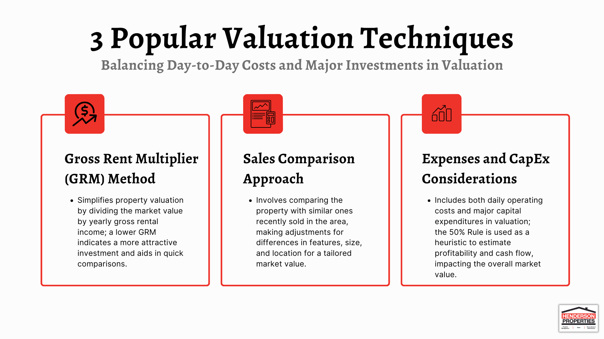

## Table of Contents

## What is real estate investment property valuation?

Real estate investment property valuation is the process of figuring out how much a property is worth. This is important for people who want to buy, sell, or invest in properties. The valuation helps them make smart decisions about whether a property is a good deal or not. To do a valuation, people look at things like the property's location, size, condition, and how much similar properties in the area have sold for recently.

There are different ways to value a property. One common method is the sales comparison approach, where the value is estimated by comparing the property to similar ones that have sold nearby. Another method is the income approach, which is often used for rental properties. This method looks at how much money the property can make from rent and uses that to figure out its value. No matter which method is used, the goal is to get a fair and accurate estimate of what the property is worth in today's market.

## Why is it important to value real estate investment properties?

Valuing real estate investment properties is important because it helps investors make good decisions. When you know the value of a property, you can figure out if it's a good deal to buy it. If the price is lower than the value, you might want to buy it because you could make money when you sell it later. On the other hand, if the price is higher than the value, it might be better to look for another property. Knowing the value also helps when you want to sell your property, because you can set a fair price that will attract buyers.

Another reason valuation is important is for getting loans and managing finances. Banks and lenders want to know the value of a property before they give you a loan. They want to make sure the property is worth enough to cover the loan if you can't pay it back. Valuation also helps you plan your finances better. If you know how much your property is worth, you can decide if it's a good time to borrow money against it or if you should wait. Overall, understanding the value of your real estate investment helps you make smarter choices and manage your money better.

## What are the basic methods used to value real estate investment properties?

There are three main methods people use to value real estate investment properties. The first one is the sales comparison approach. This method looks at other similar properties that have sold recently in the same area. By comparing these properties, you can get a good idea of how much your property might be worth. This is a common method because it's easy to understand and gives a clear picture of what buyers are willing to pay in the current market.

The second method is the income approach. This one is often used for properties that are rented out. It works by figuring out how much money the property can make from rent each year. Then, you use a formula to turn that yearly income into a value for the whole property. This method is helpful for investors who want to know if a rental property will make them money over time.

The third method is the cost approach. This one looks at how much it would cost to build the same property from scratch today. It also takes into account how much the land is worth. This method is not used as often as the other two, but it can be useful for new buildings or when there aren't many similar properties to compare. Each method has its own strengths, and the best one to use can depend on the specific property and what you're trying to find out.

## How does the income approach to valuation work?

The income approach to valuation is a way to figure out how much a property is worth based on the money it can make from rent. First, you need to know how much rent the property can bring in every year. This is called the gross potential income. Then, you have to think about any money you might lose, like if the property is empty sometimes or if you have to pay for things like repairs. After you take away these costs, you have the net operating income (NOI). This is the money left over after all the regular costs of running the property are paid.

Next, you use the net operating income to find the property's value. You do this by dividing the NOI by something called the capitalization rate, or cap rate. The cap rate is like an [interest rate](/wiki/interest-rate-trading-strategies) that shows how much return investors expect to get from this kind of property. For example, if your NOI is $50,000 and the cap rate is 5%, you divide $50,000 by 0.05 to get a value of $1,000,000. The income approach is really helpful for investors because it shows how much money a rental property can make, which helps them decide if it's a good investment.

## What is the sales comparison approach and how is it applied?

The sales comparison approach is a way to find out how much a property is worth by looking at other similar properties that have sold recently in the same area. It's like comparing apples to apples. You look at things like how big the properties are, how many bedrooms and bathrooms they have, and what kind of shape they're in. Then, you see how much these similar properties sold for and use that information to guess how much your property might be worth.

To use the sales comparison approach, you start by finding a bunch of properties that are a lot like yours. These are called comparables, or "comps" for short. You look at the prices these comps sold for and make adjustments if needed. For example, if one of the comps has an extra bathroom, you might take a little bit off its sale price to make it more like your property. Once you've adjusted all the comps, you average out their prices to get a good idea of what your property might be worth. This method is really popular because it's easy to understand and gives a clear picture of what buyers are willing to pay in the current market.

## Can you explain the cost approach to real estate valuation?

The cost approach to real estate valuation is a way to figure out how much a property is worth by thinking about how much it would cost to build it from scratch today. First, you find out how much the land is worth if it were empty. Then, you add the cost of building the same kind of building that's on the property right now. This includes everything from the materials and labor to any other costs like permits and fees. After you have the total cost of the land and building, you might take off some money if the building is old or needs repairs. This is called depreciation.

This method isn't used as much as the sales comparison or income approaches, but it can be really helpful in some cases. For example, it's good for new buildings or when there aren't many similar properties to compare. It's also useful for special kinds of properties, like schools or churches, where it's hard to find comps. By figuring out the cost to build the property today and adjusting for depreciation, you get a good idea of what the property might be worth in the current market.

## What role do market conditions play in real estate valuation?

Market conditions are really important when figuring out how much a property is worth. They can change a lot and affect how much people are willing to pay for a property. Things like how many people want to buy houses, how many houses are for sale, and what's happening with the economy can make a big difference. If a lot of people want to buy and there aren't many houses for sale, prices can go up. But if there are a lot of houses for sale and not many buyers, prices might go down.

Interest rates also play a big role. When interest rates are low, it's cheaper for people to borrow money to buy a house, so more people can afford to buy, and prices might go up. But when interest rates are high, fewer people can afford to buy, and prices might go down. It's important to keep an eye on these market conditions because they can make the value of a property go up or down, even if the property itself hasn't changed.

## How do capitalization rates affect property valuation?

Capitalization rates, or cap rates, are a big deal when it comes to figuring out how much a property is worth. They show how much money investors expect to make from a property each year compared to how much they paid for it. A lower cap rate means people are willing to pay more for the property because they think it's a safe investment. A higher cap rate means people want more money back each year because they think the investment might be riskier.

When you use the income approach to value a property, the cap rate helps turn the yearly money you make from rent into a total value for the property. If the cap rate goes up, the value of the property goes down because investors want more return for their money. If the cap rate goes down, the value goes up because people are okay with less return. So, knowing what the cap rate is in your area can really help you understand if a property is a good deal or not.

## What advanced techniques are used in real estate valuation?

Advanced techniques in real estate valuation include using computer models and data analysis to get a better idea of what a property is worth. One popular method is called regression analysis. This is where you use a lot of data about past property sales to find patterns and make predictions. You can look at things like how the size of a house or its location affects its price. By putting all this information into a computer, you can come up with a formula that helps you guess how much a property might be worth.

Another advanced technique is called the discounted cash flow (DCF) method. This one is really useful for big investment properties that make money over a long time. You start by figuring out how much money the property will make in the future, and then you use a special formula to figure out how much that money is worth today. This method takes into account things like how much money you'll make from rent, how much it will cost to run the property, and even how much you might make if you sell it later. By looking at all these factors, you can get a really detailed picture of what the property is worth.

## How can technology and data analytics improve real estate valuation accuracy?

Technology and data analytics can make real estate valuation more accurate by helping people look at a lot of information quickly and easily. Instead of just guessing or using a few examples, computers can look at thousands of past property sales and find patterns. This means they can see how things like the size of a house, its location, or how old it is affect its price. By using all this data, the computer can come up with a formula that helps guess how much a property might be worth more accurately than just using a few examples.

Another way technology helps is by making it easier to update valuations as the market changes. Real estate markets can change quickly, and what a property was worth last month might be different now. With data analytics, you can keep track of new sales and changes in the market in real-time. This means you can adjust your valuation to be more accurate based on the latest information. So, technology and data analytics not only help make valuations more precise but also keep them up-to-date with what's happening in the market.

## What are the common pitfalls to avoid in real estate valuation?

One common pitfall in real estate valuation is not looking at enough comparable properties, or comps. If you only look at a few properties that are similar to the one you're valuing, you might miss out on important information. It's better to look at a lot of comps and make sure they are as similar as possible to your property. Another mistake is not adjusting the comps properly. If a comp has an extra bedroom or a bigger backyard, you need to take that into account when comparing it to your property. Not making these adjustments can lead to a wrong valuation.

Another pitfall is not considering the current market conditions. The real estate market can change quickly, and what a property was worth last year might be different now. You need to keep an eye on things like interest rates, how many people want to buy houses, and how many houses are for sale. Ignoring these factors can make your valuation inaccurate. Also, some people forget to account for the property's potential income, especially for rental properties. If you're using the income approach, you need to think about how much money the property can make and what the capitalization rate is in your area. Skipping these steps can lead to a big mistake in your valuation.

## How do expert appraisers incorporate risk and uncertainty into their valuations?

Expert appraisers know that real estate valuation isn't just about numbers and formulas. They understand that there's always some risk and uncertainty involved. To deal with this, they look at things like the local economy, how easy it is to sell the property, and what might happen in the future. They might use different scenarios to see how the property's value could change if the market goes up or down. By thinking about these risks, they can give a more realistic range of what the property might be worth instead of just one number.

Appraisers also use something called a confidence interval to show how sure they are about their valuation. This means they might say the property is worth between $200,000 and $250,000, instead of just saying it's worth $225,000. They can also use sensitivity analysis, which helps them see how small changes in things like interest rates or rental income could affect the property's value. By doing all this, expert appraisers can give a valuation that takes into account the real-world risks and uncertainties, making their estimates more useful and reliable for investors and buyers.

## What are Real Estate Valuation Techniques?

Real estate valuation is a critical component of the real estate investment process. It informs buyers, sellers, and investors of the property's worth, ensuring sound decision-making. Several valuation methods cater to varied needs, each with distinct advantages and limitations.

One of the traditional techniques is the **Sales Comparison Approach**, which calculates a property's value by comparing it to similar properties recently sold in the area. This method is particularly useful for residential properties where market activity is robust, allowing for plentiful comparable data. However, its accuracy can diminish in markets with fewer transactions or unique properties lacking direct comparability.

Another approach, commonly utilized in commercial real estate, is the **Income Approach**. It assesses value based on the expected income generation potential of the property. This involves calculating the Net Operating Income (NOI) and applying a capitalization rate to derive the market value:

$$
\text{Value} = \frac{\text{NOI}}{\text{Capitalization Rate}}
$$

This method is powerful for income-producing properties but demands accurate future income projection and a reliable capitalization rate, which can fluctuate with market conditions.

The **Cost Approach**, often applied to unique or newly constructed properties, estimates value based on the cost to replace or reproduce the structure, subtracting any depreciation, and adding the land value. Though it provides a tangible cost framework, it might not fully reflect market demand.

Emerging technologies have revolutionized property valuation, introducing **Automated Valuation Models (AVMs)**. AVMs employ sophisticated algorithms and [machine learning](/wiki/machine-learning) to evaluate vast datasets, providing rapid and often cost-effective property assessments. These models analyze factors such as recent sales, property characteristics, and regional market trends to generate an estimate. While AVMs offer speed and efficiency, they might not capture the nuances of local markets or unique property features, requiring careful validation.

To enhance valuation accuracy, it's crucial to consider **market dynamics** and **property-specific factors**. Macroeconomic indicators, zoning regulations, and local development trends can significantly impact property value. Additionally, understanding the property's condition, age, and unique features helps in refining the valuation process.

Ultimately, selecting the appropriate valuation technique depends on the assessment's purpose, be it for purchase, sale, investment, or lending. A multifaceted approach, combining traditional methods with technological advancements like AVMs, can offer a comprehensive valuation, ensuring informed and strategic real estate decisions. As technology continues to evolve, these methods will likely become even more integrated and refined, providing enhanced insights into property valuation.

## References & Further Reading

[1]: Lind, H. (2016). ["Real Estate Valuation and Property Prices: An Important Gap between Theory and Practice."](https://www.researchgate.net/publication/352446072_Advanced_Issues_in_Property_Valuation) The Journal of Real Estate Finance and Economics, 53(4), 439-444.

[2]: Shiller, R. J. (2015). ["Irrational Exuberance"](https://press.princeton.edu/books/paperback/9780691173122/irrational-exuberance). Princeton University Press.

[3]: Quan, D. C., & Quigley, J. M. (1991). ["Price Formation and the Appraisal Function in Real Estate Markets."](https://link.springer.com/article/10.1007/BF00173120) The Journal of Real Estate Finance and Economics, 4(2), 127-146.

[4]: Lo, A. W. (2019). ["Adaptive Markets: Financial Evolution at the Speed of Thought"](https://books.google.com/books/about/Adaptive_Markets.html?id=Q4d7DwAAQBAJ). Princeton University Press.

[5]: Rosen, S. (1984). ["Hedonic Prices and Implicit Markets: Product Differentiation in Pure Competition."](https://matthewturner.org/ec2410/readings/Rosen_JPE_1974.pdf) Journal of Political Economy, 82(1), 34-55.

[6]: Sloman, S. A., & Fernbach, P. (2018). ["The Knowledge Illusion: Why We Never Think Alone"](https://books.google.com/books/about/The_Knowledge_Illusion.html?id=2xuMDAAAQBAJ). Riverhead Books.

[7]: Fabozzi, F. J., & Markowitz, H. M. (Eds.). (2010). ["The Theory and Practice of Investment Management"](https://onlinelibrary.wiley.com/doi/book/10.1002/9781118267028). John Wiley & Sons.

[8]: Thaler, R. H., & Sunstein, C. R. (2009). ["Nudge: Improving Decisions About Health, Wealth, and Happiness"](https://psycnet.apa.org/record/2008-03730-000). Penguin Books.