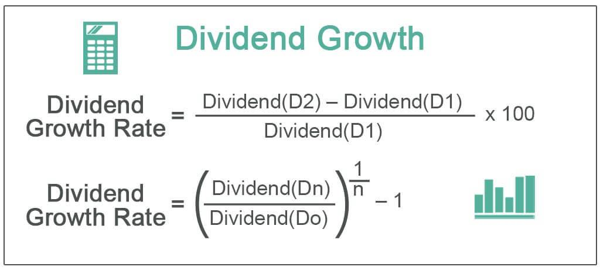

## Table of Contents

## What is stock valuation and why is it important?

Stock valuation is the process of figuring out how much a company's stock is worth. It's like trying to guess the price of a toy by looking at how much it costs to make, how popular it is, and what similar toys are selling for. Investors use stock valuation to decide if a stock is a good buy or if it's too expensive. They look at things like the company's earnings, its growth potential, and what other people are willing to pay for similar stocks.

Understanding stock valuation is important because it helps investors make smart choices with their money. If you know a stock is undervalued, meaning it's cheaper than it should be, you might want to buy it because its price could go up in the future. On the other hand, if a stock is overvalued, meaning it's more expensive than it should be, you might decide to sell it or avoid buying it because its price could drop. By knowing the true value of a stock, investors can build a better portfolio and hopefully make more money over time.

## What are dividends and how do they relate to stock valuation?

Dividends are payments that companies give to their shareholders, usually from their profits. Imagine you own a piece of a company through its stock. If the company does well and makes money, it might decide to share some of that money with you. This sharing happens in the form of dividends, which can be paid out regularly, like every three months or once a year.

Dividends play a big role in stock valuation because they affect how much a stock is worth to an investor. When figuring out a stock's value, investors look at the dividends they might get in the future. If a company pays high dividends consistently, it can make its stock more attractive, which might increase its value. On the other hand, if a company doesn't pay dividends or cuts them, it might make the stock less appealing, which could lower its value. So, dividends are an important piece of the puzzle when investors are trying to decide if a stock is a good buy or not.

## What is meant by supernormal dividend growth?

Supernormal dividend growth means that a company's dividends are growing much faster than usual for a certain period of time. Imagine a company is doing really well and making a lot more money than before. Instead of keeping all that extra money, the company decides to give a lot more of it to its shareholders in the form of bigger dividends. This fast growth in dividends can happen because the company is expanding quickly, launching new successful products, or entering new markets.

However, this supernormal growth usually doesn't last forever. After a while, the company's growth slows down to a more normal rate. Investors need to be careful because they might expect the high dividends to keep coming, but they won't. When valuing a stock with supernormal dividend growth, investors have to guess how long the fast growth will last and what the dividends will be after it slows down. This makes stock valuation a bit trickier but also more interesting.

## How does supernormal dividend growth differ from normal dividend growth?

Supernormal dividend growth happens when a company's dividends grow much faster than usual for a short time. It's like when a company is doing really well and decides to give a lot more money to its shareholders. This can happen because the company is growing quickly, launching new products that sell well, or entering new markets. But this fast growth doesn't last forever. After a while, the company's growth slows down to a more normal rate.

Normal dividend growth, on the other hand, is when a company's dividends grow at a steady, predictable rate over time. This is more common and happens when a company is doing okay but not growing super fast. It's like getting a little more money each year, but not a big jump. Investors can usually expect this kind of growth to continue for a longer time because it's based on the company's regular business activities, not on something special or temporary.

## What are the key factors to consider when valuing stocks with supernormal dividend growth?

When valuing stocks with supernormal dividend growth, the first thing to think about is how long the fast growth will last. This is important because supernormal growth usually doesn't go on forever. You need to guess when the company will slow down and start growing at a normal rate again. This can be tricky because it depends on things like how well the company keeps doing, what's happening in the market, and if there are any new competitors.

Another key [factor](/wiki/factor-investing) is what the dividends will be after the supernormal growth ends. Once the company's growth slows down, the dividends will probably grow at a more normal rate. You need to figure out what that normal rate will be and how it will affect the stock's value. This helps you understand if the stock is a good buy now, even though the big dividends won't last forever.

Lastly, you should also think about the risks. Stocks with supernormal dividend growth can be more risky because they depend a lot on the company keeping up its fast growth. If the company can't do that, the stock's value could drop a lot. So, it's important to look at the company's overall health, its plans for the future, and how it's doing compared to other companies in the same industry.

## What valuation models are commonly used for stocks with supernormal dividend growth?

One common valuation model for stocks with supernormal dividend growth is the two-stage dividend discount model (DDM). This model splits the valuation into two parts: the first part looks at the time when the dividends are growing really fast, and the second part looks at the time after that when the dividends grow at a normal rate. You guess how long the fast growth will last and what the dividends will be during that time. Then, you figure out what the dividends will be after the growth slows down. By adding up the value of the dividends from both stages, you get an idea of what the stock is worth.

Another model that can be used is the three-stage dividend discount model. This model adds an extra stage to the two-stage model. The first stage is still the supernormal growth period, the second stage is a transition period where the growth rate starts to slow down, and the third stage is when the dividends grow at a steady, normal rate. This model can be more accurate because it takes into account the gradual slowdown of the growth rate. You need to estimate the length of each stage and the dividend growth rates for each one. By doing this, you can get a more detailed picture of the stock's value over time.

## How do you apply the two-stage dividend discount model to stocks with supernormal dividend growth?

To use the two-stage dividend discount model for stocks with supernormal dividend growth, you first need to figure out how long the fast growth will last. Let's say you think the company will have supernormal growth for the next five years. During this time, you guess what the dividends will be each year. If the company is growing really fast, the dividends might go up a lot each year. You add up the value of these fast-growing dividends, but you need to discount them back to today's value. This means you take away a little bit of value for each year into the future because money today is worth more than money you get later.

After the supernormal growth period, the dividends will start growing at a normal rate. You need to guess what this normal growth rate will be and how long it will last. Let's say you think the dividends will grow at 3% a year after the first five years. You figure out what the dividends will be in each of these normal growth years and add them up, again discounting them back to today's value. Once you have the value of the dividends from both the supernormal growth period and the normal growth period, you add them together. This total gives you an idea of what the stock is worth today, taking into account the fast growth and the slower growth that will come later.

## What are the challenges and limitations of using the two-stage dividend discount model?

Using the two-stage dividend discount model can be tricky because it's hard to guess how long the supernormal growth will last. You have to make a lot of guesses about the future, like how well the company will do and what the dividends will be. If you guess wrong, your calculation of the stock's value could be way off. It's like trying to predict the weather a year from now – it's tough to get it right. Also, the model depends a lot on the discount rate you use, which is the rate you use to figure out how much future money is worth today. If you pick the wrong discount rate, it can change your valuation a lot.

Another challenge is that the model assumes that after the supernormal growth period, the dividends will grow at a steady, normal rate forever. But in real life, things can change a lot. The company might run into problems, the economy might change, or new competitors might come along. These things can make the dividends go up or down in ways that the model doesn't expect. So, while the two-stage dividend discount model can be helpful, it's important to remember that it's based on a lot of guesses and assumptions that might not be right. It's a good tool, but it's not perfect.

## How can sensitivity analysis be used to assess the impact of changes in growth rates on stock valuation?

Sensitivity analysis is a way to see how changes in the growth rates of dividends can affect the value of a stock. Imagine you're using the two-stage dividend discount model to value a stock. You might start with a guess about how fast the dividends will grow during the supernormal growth period and after it. But what if those growth rates change? With sensitivity analysis, you can change the growth rates a little bit and see how much the stock's value goes up or down. This helps you understand how sensitive the stock's value is to these growth rates.

For example, if you think the supernormal growth rate is 20% but you're not sure, you can try using 18% and 22% to see what happens to the stock's value. If a small change in the growth rate makes a big difference in the stock's value, then the valuation is very sensitive to that growth rate. This tells you that you need to be very careful with your guesses about growth rates because they can have a big impact on your decision to buy or sell the stock. By doing sensitivity analysis, you get a better idea of how confident you can be in your valuation and how much risk you're taking on.

## What role do market conditions and economic cycles play in valuing stocks with supernormal dividend growth?

Market conditions and economic cycles are really important when you're trying to figure out the value of stocks that have supernormal dividend growth. Imagine the economy is doing great and everyone is buying stuff. Companies might make more money and be able to pay bigger dividends. This can make their stocks look more valuable because investors see the fast growth and want to buy in. But if the economy starts to slow down or there's a recession, people might buy less, and companies might not make as much money. This could mean they can't keep paying those big dividends, and the stock's value might drop.

Economic cycles can also change how long the supernormal growth lasts. In good times, the fast growth might go on longer because the company keeps doing well. But in bad times, the growth might slow down sooner than you thought. This makes it harder to guess what the dividends will be in the future, which is a big part of figuring out the stock's value. So, when you're valuing stocks with supernormal dividend growth, you need to think about what's happening in the economy and how it might affect the company's dividends and the stock's value.

## How can an investor adjust their valuation model to account for potential changes in a company's dividend policy?

When a company changes its dividend policy, it can affect how much money it gives to shareholders. If you're using a valuation model like the two-stage dividend discount model, you need to think about how these changes might happen. For example, if the company decides to pay out more dividends than before, you might need to increase the growth rate in your model for the supernormal growth period. On the other hand, if the company decides to pay less or stop dividends altogether, you would need to lower the growth rate or even change the model to reflect no dividends at all.

To adjust your model, you can use different scenarios to see how changes in the dividend policy might affect the stock's value. You could try different growth rates or even use a different model that doesn't rely on dividends, like a free cash flow model. By doing this, you can get a better idea of how sensitive the stock's value is to changes in the dividend policy. This helps you make smarter investment decisions because you're thinking about what might happen if the company changes how it handles dividends.

## What advanced techniques can be used to refine the valuation of stocks with supernormal dividend growth?

One advanced technique to refine the valuation of stocks with supernormal dividend growth is to use Monte Carlo simulations. This method involves running many different scenarios to see how changes in growth rates, discount rates, and other factors might affect the stock's value. Imagine you're trying to guess the score of a soccer game. Instead of making one guess, you make thousands of guesses with different outcomes. By looking at all these different outcomes, you get a better idea of what might happen and how likely it is. This helps you understand the range of possible values for the stock and how confident you can be in your valuation.

Another technique is to use a multi-stage dividend discount model with more than two stages. Instead of just having a supernormal growth period and a normal growth period, you can add more stages to capture different phases of the company's growth. For example, you might have a supernormal growth period, a transition period where the growth rate starts to slow down, and then a normal growth period. This can give you a more accurate picture of the stock's value because it takes into account the gradual changes in the company's performance over time. By using these advanced techniques, you can make your valuation more precise and better understand the risks and opportunities involved in investing in stocks with supernormal dividend growth.

## How do you value stocks with supernormal growth?

Valuing stocks with supernormal growth involves addressing the unique challenges posed by shifting growth rates that deviate from the assumptions of traditional valuation models. The Gordon Growth Model, a widely used method for valuing stocks, operates under the assumption of a constant growth rate in dividends, which makes it ill-suited for stocks experiencing periods of rapid, unsustainable growth. Instead, investors often turn to multi-stage or two-stage Dividend Discount Models (DDM) that are more adaptable to such conditions.

These models are structured to handle distinct growth phases: an initial phase of supernormal growth followed by a transition to a long-term stable growth phase. The objective is to distinguish between varying growth rates to derive a more accurate determination of a stock's intrinsic value.

The multi-stage DDM approach involves splitting the valuation process into different time segments, each characterized by varying growth expectations. During the initial phase, supernormal growth is projected, often based on factors such as market expansion, technological advancements, or innovative product offerings. The model estimates dividends during this phase and discounts them back to their present value.

The formula for the present value of dividends during the supernormal growth phase is:

$$

PV = \sum_{t=1}^{n} \frac{D_t}{(1 + r)^t}
$$

where $D_t$ is the dividend expected at time $t$, $r$ is the required rate of return, and $n$ is the period representing the duration of supernormal growth. 

Following the supernormal phase, the model employs assumptions of a perpetual, stable growth rate, typically aligned with the long-term growth rate of the economy or industry. This period uses the Gordon Growth Model to value the future stable dividends:

$$

P = \frac{D_{n+1}}{r - g}
$$

In this formula, $D_{n+1}$ represents the dividend at the beginning of the stable growth period, $r$ is the required rate of return, and $g$ is the stable growth rate.

Combining these two phases, the overall valuation is the sum of the present value of dividends during the supernormal growth phase and the present value of the stock at the beginning of the stable growth phase, discounted back to the present:

$$

V = \sum_{t=1}^{n} \frac{D_t}{(1 + r)^t} + \frac{P}{(1 + r)^n}
$$

This approach accounts for the fluctuating growth conditions and provides a comprehensive view by encapsulating the dynamics of both exuberant and normalized growth phases. By using multi-stage models, investors can better estimate the intrinsic worth of companies poised for shifts in growth, thereby enhancing their decision-making in stock valuation.

## What are Dividend Discount Models for Supernormal Growth?

The Dividend Discount Model (DDM) is a fundamental method used in valuing companies that pay dividends, particularly useful when dealing with stocks experiencing supernormal growth. Supernormal growth occurs when a company's dividends grow at an unusually high rate, impacting the assessment of its intrinsic value. The DDM requires modification to accommodate this rapid growth phase, typically employing a multi-stage or two-stage approach.

### Overview of the Dividend Discount Model (DDM)

The basic premise of the DDM is that the value of a stock is the present value of all its future dividend payments. The standard formula for the Gordon Growth Model—a commonly used single-stage DDM—is:

$$
P_0 = \frac{D_1}{r - g}
$$

where $P_0$ is the current stock price, $D_1$ is the expected dividend next year, $r$ is the required rate of return, and $g$ is the constant growth rate of the dividends.

However, this model falls short when applied to supernormal growth scenarios since it assumes a constant growth rate to perpetuity, which is unrealistic for companies undergoing rapid expansion.

### Calculating Expected Dividends and Present Value

To address supernormal growth, a multi-stage DDM is often employed. This model divides the growth phases into distinct periods: the initial high-growth phase and the subsequent stable growth phase. The present value of dividends during these periods is calculated separately.

#### Phase 1: Supernormal Growth Phase

During the supernormal growth phase, dividends grow at an exceptionally high rate. These expected future dividends can be represented as:

$$
D_t = D_0 \times (1 + g_s)^t
$$

where $D_t$ is the dividend at time $t$, $D_0$ is the current dividend, $g_s$ is the supernormal growth rate, and $t$ represents the time period. The present value $PV_1$ of the dividends during this phase is:

$$
PV_1 = \sum_{t=1}^{n} \frac{D_0 \times (1 + g_s)^t}{(1 + r)^t}
$$

where $n$ is the duration of the supernormal growth phase.

#### Phase 2: Transition to Stable Growth

After the high-growth period, companies typically transition to a stable growth phase. The expected dividends switch to growing at a more sustainable rate, $g$. The present value $PV_2$ for the stable growth phase starting at year $n+1$ is calculated using the Gordon Growth Model, adjusted for the year $n$:

$$
PV_2 = \frac{D_{n+1}}{r - g} \times \frac{1}{(1 + r)^n}
$$

where $D_{n+1} = D_n \times (1 + g_s)$.

### Completing the Stock Valuation Process

The stock’s intrinsic value $P_0$ is determined by summing the present values of dividends for both growth phases:

$$
P_0 = PV_1 + PV_2
$$

Using this multi-stage dividend discount approach allows investors to estimate more accurately the value of stocks experiencing supernormal growth. By separately accounting for high initial growth and eventual stabilization, this model aligns with varying dividend growth expectations, providing a robust framework for valuation in dynamically changing market conditions.

## References & Further Reading

[1]: Gordon, M. J. (1959). ["Dividends, Earnings, and Stock Prices."](https://www.jstor.org/stable/1927792) The Review of Economics and Statistics, 41(2), 99-105.

[2]: Damodaran, A. (2012). ["Investment Valuation: Tools and Techniques for Determining the Value of Any Asset."](https://books.google.com/books/about/Investment_Valuation.html?id=5SRHAAAAQBAJ) Wiley Finance.

[3]: ["Machine Learning for Asset Managers"](https://www.cambridge.org/core/books/machine-learning-for-asset-managers/6D9211305EA2E425D33A9F38D0AE3545) by Marcos Lopez de Prado

[4]: Williams, J. B. (1938). ["The Theory of Investment Value."](https://archive.org/details/in.ernet.dli.2015.225177) Harvard University Press.

[5]: Bodie, Z., Kane, A., & Marcus, A. J. (2014). ["Investments and Portfolio Management."](https://books.google.com/books/about/EBOOK_Investments_Global_edition.html?id=BMsvEAAAQBAJ) McGraw-Hill Education.