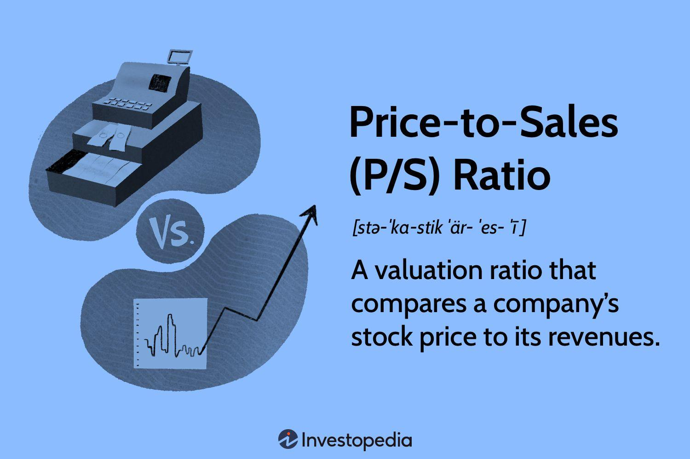

## Table of Contents

## What is a Price-To-Sales (P/S) ratio?

The Price-To-Sales (P/S) ratio is a financial metric used to evaluate the value of a company by comparing its stock price to its revenue. It's calculated by dividing the company's market capitalization by its total sales or revenue over a certain period, usually a year. This ratio helps investors understand how much they are paying for each dollar of a company's sales, which can be useful when comparing companies within the same industry.

A lower P/S ratio might suggest that a company is undervalued, meaning its stock price is low compared to its sales. On the other hand, a higher P/S ratio could indicate that a company is overvalued, with its stock price being high relative to its sales. However, the P/S ratio should not be used alone to make investment decisions. It's important to consider other financial metrics and factors, like the company's growth prospects, profitability, and the overall market conditions, to get a complete picture of its value.

## How is the P/S ratio calculated?

The P/S ratio is calculated by dividing a company's market capitalization by its total sales or revenue over a certain period, usually a year. Market capitalization is the total value of all a company's shares of stock. It is found by multiplying the current stock price by the total number of shares outstanding. Total sales or revenue is the income a company earns from its business activities before any costs or expenses are subtracted.

To find the P/S ratio, you take the market capitalization number and divide it by the total sales or revenue number. For example, if a company has a market capitalization of $100 million and total sales of $50 million, the P/S ratio would be $100 million divided by $50 million, which equals 2. This means investors are paying $2 for every $1 of the company's sales.

## Why is the P/S ratio important in stock valuation?

The P/S ratio is important in stock valuation because it helps investors see how much they are paying for a company's sales. This can be useful when comparing companies in the same industry. A lower P/S ratio might mean the stock is a good deal because the price is low compared to the sales. A higher P/S ratio might mean the stock is expensive because the price is high compared to the sales. 

But, the P/S ratio is just one piece of the puzzle. It does not tell the whole story about a company's value. Investors should look at other things too, like how much profit the company makes, how fast it is growing, and what is happening in the market. Using the P/S ratio with other financial measures helps investors make smarter choices about which stocks to buy.

## How does the P/S ratio differ from other valuation metrics like P/E ratio?

The P/S ratio and the P/E ratio are both used to value a company, but they look at different things. The P/S ratio compares a company's stock price to its sales. It tells you how much you are paying for each dollar of a company's sales. This can be helpful when a company is not making a profit yet, because it still has sales. The P/E ratio, on the other hand, compares a company's stock price to its earnings. It tells you how much you are paying for each dollar of a company's profit. This ratio is more useful for companies that are already making money.

Both ratios can help you decide if a stock is a good buy, but they focus on different parts of a company's performance. The P/S ratio is good for looking at companies that might be growing quickly but are not profitable yet. It can give you a sense of the company's value based on its sales, even if it's not making a profit. The P/E ratio is better for looking at companies that are already profitable. It can help you see if the stock price is a good deal based on how much profit the company is making. Using both ratios together can give you a fuller picture of a company's value.

## What is considered a good P/S ratio for a stock?

A good P/S ratio for a stock can vary a lot depending on the industry and the company. In general, a lower P/S ratio is often seen as better because it means you are paying less for each dollar of the company's sales. For example, if a company has a P/S ratio of 1, you are paying $1 for every $1 of sales. But what is considered "good" can change. In some industries, like technology, a P/S ratio of 5 or even higher might be normal because those companies are expected to grow a lot. In other industries, like retail, a P/S ratio of 1 or less might be seen as good.

It's also important to compare a company's P/S ratio to other companies in the same industry. This helps you see if the stock is a good deal compared to its competitors. For example, if one tech company has a P/S ratio of 3 and another has a P/S ratio of 6, the first one might look like a better buy. But you should not just look at the P/S ratio alone. You need to think about other things too, like how fast the company is growing, how much profit it makes, and what is happening in the market. Using the P/S ratio with other information can help you make a smarter choice about buying a stock.

## How can the P/S ratio be used to compare companies within the same industry?

The P/S ratio can help you compare companies in the same industry by showing you how much you are paying for each dollar of their sales. If one company has a lower P/S ratio than another, it might mean that the first company is a better deal because you are paying less for its sales. For example, if Company A has a P/S ratio of 2 and Company B has a P/S ratio of 4, Company A might look like a better buy because you are paying less for each dollar of its sales.

But, it's important to remember that the P/S ratio is just one piece of the puzzle. You should also look at other things, like how fast the companies are growing, how much profit they are making, and what is happening in the market. Using the P/S ratio with other information can give you a fuller picture of which company might be a better investment.

## What are the limitations of using the P/S ratio for stock valuation?

The P/S ratio can be helpful for looking at a company's value, but it has some limits. One big problem is that it does not tell you anything about a company's profits. A company might have a lot of sales but still lose money. If you only look at the P/S ratio, you might think the company is a good buy, but it could be losing money and not a good investment. Also, the P/S ratio can be hard to compare across different industries because what is considered a "good" ratio can change a lot. A P/S ratio that is good for one industry might not be good for another.

Another limit is that the P/S ratio does not take into account a company's debts or other financial problems. A company with a lot of debt might look good based on its P/S ratio, but it could be in trouble because of the money it owes. Also, the P/S ratio does not tell you about a company's future growth. A company might have a high P/S ratio now, but if it is expected to grow a lot in the future, that high ratio might be okay. So, while the P/S ratio can be a useful tool, it should not be the only thing you look at when deciding if a stock is a good buy.

## How does the P/S ratio vary across different industries?

The P/S ratio can be very different from one industry to another. In some industries, like technology or biotech, companies might have high P/S ratios because people expect them to grow a lot in the future. For example, a tech company with a P/S ratio of 5 or even 10 might be seen as normal because investors believe it will make a lot more money down the road. On the other hand, industries like retail or manufacturing often have lower P/S ratios. A retail company with a P/S ratio of 1 or less might be seen as a good deal because these companies usually do not grow as fast as tech companies.

It's important to compare companies within the same industry when looking at P/S ratios. What might be a high P/S ratio in one industry could be low in another. For example, a P/S ratio of 2 might be high for a retail company but low for a tech company. This is why it's helpful to look at the average P/S ratios for different industries to get a better idea of what is normal. By understanding these differences, you can make smarter choices about which stocks to buy based on their P/S ratios.

## Can the P/S ratio be used effectively for valuing companies with no profits?

Yes, the P/S ratio can be very useful for valuing companies that are not making profits yet. When a company does not have earnings, it can be hard to use other valuation measures like the P/E ratio. But the P/S ratio looks at sales instead of profits, so it can still give you an idea of the company's value based on how much money it is bringing in from sales. This is especially helpful for startups or companies in industries like technology or biotech, where they might be spending a lot of money to grow and are not profitable yet.

However, the P/S ratio is not perfect. It does not tell you anything about how much money the company is losing, or how much debt it has. So, while it can help you see if a company's stock price is a good deal compared to its sales, you should also look at other things. For example, you might want to think about how fast the company is growing, what its long-term plans are, and what other investors think about its future. Using the P/S ratio along with other information can help you make a smarter choice about whether to invest in a company that is not profitable yet.

## How do changes in a company's sales affect its P/S ratio?

When a company's sales go up, its P/S ratio usually goes down if the stock price stays the same. This is because the P/S ratio is the company's market value divided by its sales. If sales increase but the market value does not change, you are paying less for each dollar of sales, so the P/S ratio gets smaller. For example, if a company's market value is $100 million and its sales go from $50 million to $60 million, the P/S ratio would drop from 2 to about 1.67.

On the other hand, if a company's sales go down, the P/S ratio will go up if the stock price stays the same. This means you are paying more for each dollar of sales because the sales number in the denominator is smaller. For instance, if the same company's sales drop from $50 million to $40 million, the P/S ratio would rise from 2 to 2.5. Changes in sales can make a big difference in the P/S ratio, which is why it's important to keep an eye on how a company's sales are doing when you are looking at its stock value.

## What historical P/S ratio trends should investors be aware of when valuing stocks?

Investors should know that P/S ratio trends can change over time and depend a lot on the economy and the industry. In good economic times, when companies are doing well and growing, P/S ratios might be higher because people are willing to pay more for stocks. But in tough economic times, when companies are struggling, P/S ratios might be lower because people are more careful with their money and want to pay less for stocks. Also, some industries, like tech, often have higher P/S ratios because people expect them to grow a lot in the future. Other industries, like retail, usually have lower P/S ratios because they do not grow as fast.

Looking at how P/S ratios have changed in the past can help investors see if a stock is a good deal now. For example, if a company's P/S ratio is a lot lower than it has been in the past few years, it might mean the stock is cheaper than usual and could be a good buy. But if the P/S ratio is a lot higher than it has been, the stock might be more expensive than usual, and investors might want to be careful. It's important to look at these trends along with other information, like how the company is doing and what is happening in the economy, to make smart choices about buying stocks.

## How can investors incorporate the P/S ratio into a comprehensive stock valuation model?

Investors can use the P/S ratio as one part of a bigger plan to figure out how much a stock is worth. The P/S ratio helps show how much you are paying for each dollar of a company's sales. This can be useful when you are looking at companies that are not making a profit yet, but still have sales. To use the P/S ratio in a complete plan, you should compare it to other companies in the same industry. This helps you see if the stock's price is a good deal compared to its sales. But the P/S ratio is just one piece of the puzzle. You should also look at other things, like how much profit the company makes, how fast it is growing, and how much debt it has. 

Using the P/S ratio with other measures can give you a fuller picture of a company's value. For example, you might also look at the P/E ratio, which shows how much you are paying for each dollar of a company's profit. This can be good for companies that are already making money. Another useful measure is the Price-to-Book (P/B) ratio, which compares the stock price to the company's book value. You can also look at how fast the company's sales and earnings are growing, and what other people think about its future. By putting all these pieces together, you can make a smarter choice about whether to buy a stock.

## What is the Price-to-Sales Ratio and how can it be understood?

The price-to-sales (P/S) ratio is a financial metric used to evaluate a company's market capitalization relative to its total revenue over a specific period. It provides insights into how much investors are willing to pay for each unit of sales, allowing for the estimation of company valuation based on sales figures alone. This is particularly useful for companies with negative or volatile earnings, where traditional metrics like the price-to-earnings (P/E) ratio may not be applicable.

To calculate the P/S ratio, the market capitalization of the company is divided by its total sales for a given period, typically one year. The formula is expressed as:

$$
\text{P/S Ratio} = \frac{\text{Market Capitalization}}{\text{Total Sales}}
$$

Where:
- **Market Capitalization** is the total market value of a company's outstanding shares.
- **Total Sales** refers to the revenue generated by the company over the specified period.

The P/S ratio is particularly advantageous for evaluating growth companies, which often report high sales growth but may have low or negative profits due to significant investment in expansion and development. These firms may still hold substantial market potential, and the P/S ratio provides a means to assess their valuation based on sales performance rather than earnings alone.

Furthermore, the P/S ratio allows investors and analysts to compare companies across the same industry, normalizing differences in accounting practices and operational structures that might affect profit figures. For example, a tech startup entering a rapid growth phase may not yet exhibit profitability, but by using the P/S ratio, investors can identify its value proposition based on robust sales numbers.

Overall, the P/S ratio serves as a critical tool in scenarios where earnings are not a reliable measure, offering an alternative perspective that focuses on revenue generation as an indicator of potential value. However, it's important to remember that while useful, the P/S ratio should be considered alongside other metrics to gain a comprehensive understanding of a company's financial health and market positioning.

## References & Further Reading

[1]: ["Valuation: Measuring and Managing the Value of Companies"](https://www.amazon.com/Valuation-Measuring-Managing-Companies-Finance/dp/1119610885) by McKinsey & Company Inc., Tim Koller, Marc Goedhart, and David Wessels

[2]: Damodaran, A. (2012). ["Investment Valuation: Tools and Techniques for Determining the Value of Any Asset,"](https://books.google.com/books/about/Investment_Valuation.html?id=5SRHAAAAQBAJ) 3rd Edition.

[3]: ["Security Analysis"](https://www.wallstreetmojo.com/security-analysis/) by Benjamin Graham and David L. Dodd

[4]: ["Algorithmic Trading and DMA: An Introduction to Direct Access Trading Strategies"](https://archive.org/details/algorithmictradi0000john) by Barry Johnson

[5]: ["Python for Finance: Mastering Data-Driven Finance"](https://www.amazon.com/Python-Finance-Mastering-Data-Driven/dp/1492024333) by Yves Hilpisch