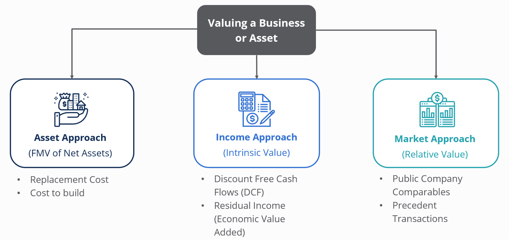

## Table of Contents

## What is valuation and why is it important?

Valuation is the process of figuring out how much something is worth. This can be a company, a piece of property, or even a stock. People use different methods to come up with this number, like looking at how much money the company makes or comparing it to similar things that have been sold recently. Valuation is important because it helps people make smart decisions about buying, selling, or investing in something.

Knowing the value of something is really helpful for making choices. For example, if you want to buy a house, you need to know if the price the seller is asking is fair. If you are thinking about investing in a company, you want to know if the stock price is a good deal or too expensive. Valuation helps everyone from business owners to investors to make better decisions by giving them a clear idea of what things are really worth.

## What are the different types of valuation methods?

There are several ways to figure out how much something is worth, and each method looks at different things. One common way is the market approach. This method compares what you're valuing to similar things that have been sold recently. For example, if you want to know how much your house is worth, you might look at how much similar houses in your neighborhood sold for. Another method is the income approach, which looks at how much money the thing makes. If you're valuing a business, you might look at its profits and use that to guess how much it's worth.

Another way to value something is the cost approach. This method tries to figure out how much it would cost to replace the thing you're valuing. For example, if you're valuing a building, you might think about how much it would cost to build a new one just like it. Lastly, there's the asset-based approach, which adds up everything the thing owns and subtracts what it owes. If you're valuing a company, you might add up all its stuff like buildings and machines, then subtract any money it owes, to get an idea of its value.

Each of these methods has its own strengths and can be better for different situations. The market approach works well when there are lots of similar things being sold, like houses. The income approach is good for businesses that make a lot of money. The cost approach can be useful for things like buildings or special equipment. And the asset-based approach is often used when a company is going out of business and needs to sell everything it owns. By understanding these different methods, you can pick the best one for what you're trying to value.

## How does the market approach to valuation work?

The market approach to valuation works by comparing the thing you want to value to similar things that have been sold recently. For example, if you want to know how much your house is worth, you would look at how much similar houses in your neighborhood sold for. This method assumes that if two things are pretty much the same, they should be worth about the same amount of money. So, you find houses that are similar in size, age, and location to yours, and then use their sale prices to guess what your house might be worth.

This approach is really useful when there are a lot of similar things being bought and sold, like houses, cars, or stocks. It's easier to find good comparisons when there's a lot of activity in the market. But it can be tricky if the thing you're valuing is unique or if there aren't many similar things being sold. In those cases, you might need to use other methods along with the market approach to get a good idea of the value.

## What is the income approach and how is it used in valuation?

The income approach to valuation looks at how much money something makes to figure out its worth. If you're trying to value a business, you might look at its profits or cash flow. The idea is that a business that makes a lot of money is worth more than one that doesn't. To use this method, you take the money the business makes each year and then use a formula to guess how much that money is worth over time. This is called "discounting" future earnings to find out what they're worth today.

This approach is really helpful for businesses that make steady money, like rental properties or companies with regular profits. It's not as good for businesses that don't make a lot of money or have unpredictable earnings. When you use the income approach, you need to think about things like how long the business will keep making money and what interest rates are. By doing this, you can come up with a number that shows how much the business is worth based on the money it brings in.

## Can you explain the asset-based approach to valuation?

The asset-based approach to valuation is a way to figure out how much a business is worth by looking at what it owns and what it owes. You start by adding up everything the business has, like buildings, machines, and money in the bank. These are called assets. Then, you subtract everything the business owes, like loans or bills that need to be paid. These are called liabilities. What you're left with is the net worth of the business, which is how much it's worth based on its assets.

This method is really useful when a business is thinking about selling everything it owns or if it's going out of business. It's a straightforward way to see what the business would be worth if it had to sell all its stuff. But it might not be the best way to value a business that's still running and making money. That's because it doesn't take into account things like how much money the business makes or how well it's doing in the market. So, the asset-based approach is good for some situations but not for others.

## What are the key differences between book value and market value?

Book value and market value are two different ways to figure out how much something is worth. Book value is what you get when you take everything a company owns, like buildings and money, and subtract everything it owes, like loans. It's like looking at the company's balance sheet to see its net worth. Book value is based on what the company paid for its stuff, minus how much it's used up over time. This number is important for understanding the basic value of a company's assets.

Market value, on the other hand, is what people are willing to pay for the company right now. It's based on what's happening in the market and can change a lot depending on how people feel about the company and the economy. Market value can be higher or lower than book value. For example, if a company is doing really well and people think it will keep making a lot of money, its market value might be a lot higher than its book value. But if people think the company is in trouble, its market value might be lower than its book value. So, market value is more about what the market thinks the company is worth, while book value is about the actual stuff the company owns.

## How do you choose the appropriate valuation method for a business?

Choosing the right valuation method for a business depends on what you need to know and what kind of business it is. If the business makes a lot of money and has steady income, the income approach might be best. This method looks at how much money the business makes and uses that to guess its worth. It's good for things like rental properties or companies with regular profits. On the other hand, if you're thinking about selling off all the business's stuff, the asset-based approach could be better. This method adds up everything the business owns and subtracts what it owes to find out its net worth. It's useful when a business is going out of business or selling everything it has.

The market approach is another option, and it works well when there are a lot of similar businesses being bought and sold. This method compares your business to others that are similar and uses their sale prices to guess your business's worth. It's like looking at how much other houses in your neighborhood sold for to figure out what your house might be worth. Sometimes, you might need to use more than one method to get a good idea of the business's value. For example, if the business is unique or if there aren't many similar businesses being sold, you might use the market approach along with the income approach to get a better picture. Choosing the right method helps you make smart decisions about buying, selling, or investing in a business.

## What role do financial statements play in the valuation process?

Financial statements are really important when you're trying to figure out how much a business is worth. They give you a clear picture of how the business is doing financially. The balance sheet shows what the business owns and what it owes, which is key for the asset-based approach to valuation. The income statement tells you how much money the business is making, which is important for the income approach. And the cash flow statement shows how money moves in and out of the business, which can help with all kinds of valuation methods.

Using financial statements helps you make better guesses about a business's value. For example, if you're using the income approach, you'll look at the income statement to see how much profit the business is making. If you're using the asset-based approach, you'll look at the balance sheet to add up all the assets and subtract the liabilities. Even for the market approach, financial statements can help you compare your business to others that have been sold. By looking at these statements, you can get a good idea of the business's financial health and use that information to figure out its worth.

## How do factors like industry trends and economic conditions affect valuation?

Industry trends and economic conditions can have a big impact on how much a business is worth. If the industry is doing well and growing, people might be willing to pay more for a business in that industry. For example, if tech companies are popular and making a lot of money, a tech business might be valued higher. On the other hand, if the industry is struggling, like if fewer people are buying cars, then a car company might be worth less. Economic conditions, like whether the economy is growing or shrinking, also matter. In a good economy, people feel confident and might pay more for businesses. But in a bad economy, people might be more cautious and value businesses lower.

These factors can change how much money a business makes and how people see its future. If there's a trend towards using more renewable energy, a company that makes solar panels might see its value go up because people think it will make more money in the future. But if there's a recession and people are worried about losing their jobs, they might not want to spend as much on things like solar panels, which could lower the company's value. So, when figuring out how much a business is worth, it's important to think about what's happening in the industry and the economy.

## What are some common valuation multiples and how are they calculated?

Valuation multiples are a quick way to guess how much a business is worth by comparing it to other businesses. One common multiple is the price-to-earnings (P/E) ratio. To find the P/E ratio, you take the price of a company's stock and divide it by how much money the company makes per share in a year. This tells you how much people are willing to pay for each dollar of the company's earnings. Another multiple is the enterprise value-to-EBITDA (EV/EBITDA) ratio. To calculate this, you take the total value of the company, including its debt and cash, and divide it by its earnings before interest, taxes, depreciation, and amortization. This ratio helps you see how much the whole business is worth compared to its profits before some expenses.

Another useful multiple is the price-to-sales (P/S) ratio. You find this by dividing the company's market value by its total sales over a year. It's a good way to value companies that aren't making profits yet but are growing fast. The price-to-book (P/B) ratio is also common. To get this, you divide the company's stock price by its book value per share, which is what's left if you sell all the company's stuff and pay off its debts. This ratio helps you see if the market thinks the company is worth more or less than its net assets. Each of these multiples gives you a different way to look at a company's value, and which one you use can depend on what kind of business it is and what you're trying to find out.

## How can discounted cash flow (DCF) analysis be used in valuation?

Discounted cash flow (DCF) analysis is a way to figure out how much a business is worth by looking at the money it will make in the future. You start by guessing how much money the business will make each year for a certain number of years. Then, you use a formula to figure out what that future money is worth today. This is called "discounting" the cash flows, and it's based on the idea that money you get today is worth more than money you get in the future because you can invest it and make more money. So, DCF analysis helps you see what all the future money the business will make is worth right now.

This method is really useful for businesses that have steady money coming in, like rental properties or companies with regular profits. But it can be tricky because you have to make a lot of guesses about the future, like how much money the business will make and what interest rates will be. If your guesses are wrong, your valuation might not be accurate. Still, DCF analysis is a powerful tool that can give you a good idea of a business's value if you use it carefully and think about all the things that could change in the future.

## What advanced techniques can be used to refine valuation estimates for complex businesses?

For complex businesses, one advanced technique to refine valuation estimates is using Monte Carlo simulations. This method involves running many different scenarios to see how changes in things like sales, costs, and interest rates could affect the business's value. By doing this, you can get a range of possible values instead of just one number, which helps you understand the risks and uncertainties better. It's like playing out lots of different futures for the business and seeing what the value might be in each one.

Another technique is real options valuation, which looks at the value of choices the business might have in the future. For example, a company might have the option to expand into new markets or start making new products. Real options valuation tries to figure out how much these choices are worth by thinking about what could happen if the company decides to use them. This method is useful for businesses that are growing fast or in industries that change a lot because it helps you see the value of being able to adapt and make new decisions as things change.

Lastly, using sensitivity analysis can also help refine valuation estimates. This technique involves changing one thing at a time, like the growth rate or the cost of capital, and seeing how it affects the business's value. By doing this, you can see which factors have the biggest impact on the valuation and focus on getting those numbers right. Sensitivity analysis helps you understand how small changes in your assumptions can lead to big differences in the final value, making your valuation more accurate and reliable.

## What are the key valuation methods?

Different companies may require different valuation methods to accurately assess their economic value. Three of the most prevalent methods include Market Capitalization, Earnings Multiplier, and Discounted Cash Flow (DCF) Analysis.

Market Capitalization is one of the simplest and most straightforward valuation methods. It is calculated by multiplying the company's current share price by its total number of outstanding shares. This method provides a quick snapshot of a company's market value but has limitations; it does not account for the company's debt or cash reserves. As a result, while it provides a useful starting point, it may not fully reflect the company's financial health or growth potential.

The Earnings Multiplier method, often referred to as the price-to-earnings (P/E) ratio, is frequently used as it provides insight into a company's profitability. This method focuses on a company's earnings, considering them a more precise indicator of success than mere revenue figures. The formula for the Earnings Multiplier is:

$$
\text{Earnings Multiplier} = \frac{\text{Current Share Price}}{\text{Earnings per Share (EPS)}}
$$

This ratio helps investors determine the relative value of a company's earnings, allowing comparisons across companies and industries. However, it is important to consider the context of the market and sector, as different industries have varying average P/E ratios.

Discounted Cash Flow (DCF) Analysis is a more complex and thorough method used to calculate a business’s worth based on its projected future cash flows. This method involves estimating the future cash flows that a company will generate and discounting them to their present value using a discount rate that reflects the risk associated with the investment. The DCF formula is expressed as:

$$
\text{DCF} = \sum_{t=1}^{n} \frac{CF_t}{(1 + r)^t}
$$

where $CF_t$ is the cash flow in year $t$, $n$ is the number of years, and $r$ is the discount rate.

DCF Analysis offers a comprehensive view by considering the time value of money and risk, making it a preferred method for investors looking for a thorough valuation. However, its accuracy heavily depends on the precision of cash flow forecasts and the appropriate choice of discount rate. Misestimations in these areas can lead to significant errors in valuation.

Each of these methods has unique strengths and limitations, and their applicability depends on the specific characteristics and circumstances of the company being evaluated.

## References & Further Reading

[1]: Damodaran, A. (2002). ["Investment Valuation: Tools and Techniques for Determining the Value of Any Asset."](https://archive.org/details/investmentvaluat0000damo_n6k9) Wiley Finance.

[2]: Bodie, Z., Kane, A., & Marcus, A. J. (2013). ["Investments"](https://www.mheducation.com/highered/product/Investments-Bodie.html) (10th Edition). McGraw-Hill Education.

[3]: Fabozzi, F. J., & Drake, P. P. (2009). ["The Basics of Finance: An Introduction to Financial Markets, Business Finance, and Portfolio Management."](https://onlinelibrary.wiley.com/doi/book/10.1002/9781118267790) Wiley.

[4]: Fernandez, P. (2007). ["Company valuation methods: the most common errors in valuations."](https://media.iese.edu/research/pdfs/DI-0449-E.pdf) IESE Business School - University of Navarra.

[5]: Poterba, J. M., & Summers, L. H. (1991). ["Dividend Taxes, Corporate Investment, and 'Q'."](https://www.sciencedirect.com/science/article/pii/0047272783900634) The Quarterly Journal of Economics, 96(3), 883-901.