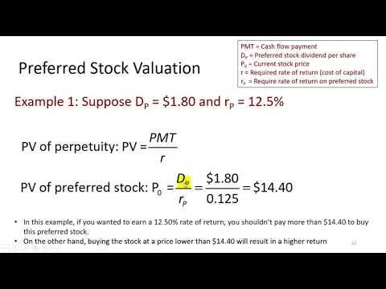

Investment in stocks is a complex and multi-dimensional activity requiring a sound grasp of various stock types, accurate valuation techniques, and the utilization of modern trading technologies. This article discusses three primary facets essential to informed stock investment: stock valuation, preferred stock characteristics, and algorithmic trading. Understanding the intrinsic value of a stock is crucial for making informed investment decisions, as it allows investors to determine whether a stock is overvalued, undervalued, or fairly priced. Preferred stocks offer unique investment opportunities, primarily due to their blend of features reminiscent of both stocks and bonds. These include fixed dividends and preferential treatment over common stockholders concerning asset claims, albeit often without voting rights. Meanwhile, algorithmic trading introduces significant efficiencies and speed to financial markets by automating trade execution based on pre-set criteria. This innovation has transformed how trades are executed, reducing the influence of human emotions and allowing for the immediate exploitation of transient market opportunities. As we explore these components further, it becomes evident that mastering these elements is vital for navigating and excelling in today's complex financial landscape.

## Table of Contents



## Understanding Stock Valuation

Stock valuation is a crucial component in assessing a company's intrinsic worth, which aids investors in making informed decisions about whether to buy, hold, or sell a particular stock. This process ensures that investors can evaluate if a stock is overvalued, undervalued, or fairly priced relative to its actual worth. Valuation methods are broadly split into two categories: absolute and relative valuation models, each serving a distinct purpose in financial analysis.

Absolute valuation models are founded on the principles of fundamental analysis. They focus on a company's intrinsic fundamentals such as dividends, cash flows, and growth rates. Prominent among these models are the Dividend Discount Model (DDM) and the Discounted Cash Flow (DCF) Model.

1. **Dividend Discount Model (DDM):** This model calculates the present value of expected future dividends. Assuming the company's dividend grows at a constant rate $g$, the Gordon Growth Model, a variation of the DDM, can be expressed mathematically as:
$$
   P_0 = \frac{D_0 \times (1 + g)}{r - g}

$$

   where $P_0$ is the present value of the stock, $D_0$ is the dividend per share, $g$ is the growth rate of the dividend, and $r$ is the required rate of return for the equity.

2. **Discounted Cash Flow (DCF) Model:** The DCF model assesses a company's value by estimating the present value of its expected future cash flows. This method accounts for the time value of money, with the formula generally being:
$$
   DCF = \sum_{t=1}^{n} \frac{CF_t}{(1 + r)^t}

$$

   where $CF_t$ is the cash flow in time period $t$, $r$ is the discount rate, and $n$ is the number of periods.

Relative valuation models, on the other hand, involve comparing a company's financial metrics to those of its industry peers. This comparison offers a more market-based perspective of a stock’s value. Financial ratios are commonly employed in this approach:

1. **Price-to-Earnings (P/E) Ratio:** This ratio compares the company's current share price to its per-share earnings. A lower P/E ratio might suggest a stock is undervalued compared to competitors.

2. **Price-to-Book (P/B) Ratio:** This ratio assesses a stock's market value relative to its book value. A P/B ratio less than one could indicate undervaluation if the company's assets are effectively managed.

Both absolute and relative valuation methods complement each other, enabling investors to form a comprehensive view of a company’s valuation. Through these models, investors can better navigate market conditions and make more informed investment decisions.

## Unique Features of Preferred Stock

Preferred stock is a hybrid financial instrument that exhibits characteristics of both equity and debt. This unique asset class offers fixed dividends akin to interest payments on bonds, providing investors with a predictable income stream. One of its primary advantages is the preferential claim on a company's assets in the event of liquidation, positioning preferred stockholders ahead of common stockholders but behind debt holders. This preferential claim, however, generally comes at the expense of voting rights, which preferred stockholders typically forgo.

Preferred stocks are noted for their reduced price [volatility](/wiki/volatility-trading-strategies) compared to common stocks. This stability arises from their fixed dividend payments, which are often insulated from the company’s operational performance barring extreme financial distress. Consequently, preferred stocks can be particularly appealing to risk-averse investors seeking steady returns.

In addition to their basic features, preferred stocks may offer several optional features that enhance their flexibility as an investment option:

1. **Convertibility**: Some preferred stocks come with the option to convert into a predetermined number of common shares. This feature provides potential for capital appreciation if the company's stock value increases significantly over time. The conversion ratio, which specifies the number of common shares received for each preferred share, is predetermined at issuance.

2. **Callable Provisions**: Issuing companies may have the right to redeem preferred stocks at a specified call price before maturity. By exercising this option during favorable interest rate environments, companies can refinance their obligations at lower costs. For investors, callable preferred stocks necessitate consideration of reinvestment risk, as they may need to reinvest funds at prevailing lower rates if a call occurs.

These unique features underscore the versatility of preferred stock as an investment vehicle, allowing for a blend of income stability and potential for gain depending on the specific terms attached to each issuance.

## Valuation of Preferred Stock

Valuing preferred stock primarily revolves around estimating the present value of forthcoming dividend payments. Preferred stocks often promise a fixed dividend, which simplifies the valuation process for investors. To calculate the present value, the fixed dividend can be considered a series of constant cash flows, akin to an annuity.

The present value (PV) of preferred stock can be calculated using the formula:

$$
PV = \frac{D}{r}
$$

where:

- $D$ is the fixed dividend,
- $r$ represents the discount rate, usually the investor's required rate of return.

If the dividend is expected to grow at a consistent rate, the Gordon Growth Model, often applied to common stocks, can also be adapted for preferred stocks. The model assumes a steady growth rate in dividends and incorporates it into the valuation:

$$
P_0 = \frac{D_0 \times (1 + g)}{r - g}
$$

where:

- $P_0$ is the price of the preferred stock today,
- $D_0$ is the dividend just paid or expected to be paid,
- $g$ is the growth rate of dividends,
- $r$ is the discount rate.

However, while computing valuations, it is crucial to consider potential risks. Preferred stocks may face dividend cuts if the issuing company encounters financial difficulties. Additionally, fluctuations in interest rates can impact the discount rate, thereby influencing the valuation. Therefore, investors should ensure the discount rate appropriately reflects these risks to avoid inaccuracies in stock pricing.

Python can facilitate these calculations, particularly for large data sets and sensitivity analyses. The following sample code demonstrates a basic calculation of the present value of a preferred stock:

```python
def calculate_preferred_stock_value(dividend, discount_rate, growth_rate=0):
    if growth_rate == 0:  # no growth scenario
        value = dividend / discount_rate
    else:  # growth scenario
        value = dividend * (1 + growth_rate) / (discount_rate - growth_rate)
    return value

# Example usage:
fixed_dividend = 5  # Example dividend
required_rate_of_return = 0.06  # Example discount rate
growth_rate = 0.02  # Example growth rate

stock_value = calculate_preferred_stock_value(fixed_dividend, required_rate_of_return, growth_rate)
print(f"The estimated value of the preferred stock is: ${stock_value:.2f}")
```

Investors should integrate considerations of potential dividend volatility and [interest rate](/wiki/interest-rate-trading-strategies) changes into their analysis to derive a more comprehensive assessment of preferred stock value.

## Algorithmic Trading in Financial Markets

Algorithmic trading, commonly referred to as algo trading, employs sophisticated computer algorithms to automate the execution of trades according to pre-established criteria. This approach offers significant advantages in terms of speed and precision, enabling traders to process large volumes of trades at a pace unachievable by human operators. The algorithms employed in these systems are designed to make real-time decisions about whether to buy or sell securities based on market data, thus minimizing the time lag between decision-making and execution.

By removing human emotional biases, [algorithmic trading](/wiki/algorithmic-trading) can take advantage of short-lived market fluctuations that might otherwise go unnoticed. These quick, data-driven decisions can enhance the execution of trades, capturing opportunities even in turbulent market conditions. 

Trend-following is a popular algo trading strategy that identifies and exploits the [momentum](/wiki/momentum) of stock price movements. This method aims to ride existing trends by purchasing securities that have performed well and short-selling those that have shown poor performance. 

Arbitrage involves profiting from price discrepancies between different markets or instruments. Algorithms can quickly identify and execute trades to benefit from these inefficiencies before they are corrected by the market. 

Market making is another essential strategy, where traders provide [liquidity](/wiki/liquidity-risk-premium) to the market by offering to buy and sell securities at stated prices. This strategy requires sophisticated algorithms capable of maintaining a balance between risk and reward, as well as ensuring the availability of the security.

Despite its benefits, algorithmic trading is not without risks. Technical failures, such as system malfunctions or connectivity issues, can lead to significant financial losses. Furthermore, the speed and [volume](/wiki/volume-trading-strategy) of trades executed algorithmically can contribute to increased market volatility. As witnessed during incidents like the 2010 Flash Crash, these systems can exacerbate market movements when multiple algorithms respond to the same signals simultaneously.

Overall, while algorithmic trading introduces efficiency and precision to financial markets, it necessitates robust risk management practices to mitigate its associated dangers. The integration of advanced technologies and constant monitoring is crucial in ensuring stable and secure trading environments.

## Integrating Valuation and Algorithmic Trading

The integration of stock valuation with algorithmic trading represents a sophisticated synergy that enhances investment strategies. This integration enables the automatic evaluation of stocks by assessing their intrinsic value, allowing investors to make data-driven decisions with increased efficiency and accuracy.

Algorithmic trading systems can process vast amounts of financial data in real time, utilizing various valuation techniques to assess stocks' intrinsic values. This capability facilitates the swift identification of valuation-driven investment opportunities. For instance, algorithms can be programmed to calculate fundamental metrics such as discounted cash flow (DCF) valuations or use ratios like the price-to-earnings (P/E) ratio to determine whether a stock is undervalued or overvalued.

```python
# Example: Calculating DCF using Python

def calculate_dcf(cash_flows, discount_rate):
    """
    Calculate the discounted cash flow (DCF) of a series of cash flows.

    Parameters:
    cash_flows (list): List of expected future cash flows.
    discount_rate (float): The discount rate as a decimal.

    Returns:
    float: The present value of the expected cash flows.
    """
    dcf_value = sum(cf / (1 + discount_rate)**i for i, cf in enumerate(cash_flows, start=1))
    return dcf_value

# Example Data
cash_flows = [1000, 1100, 1210]  # Future cash flows
discount_rate = 0.1  # 10% discount rate

# Calculate DCF
dcf_value = calculate_dcf(cash_flows, discount_rate)
print(f"DCF Value: {dcf_value}")
```

The union of valuation and algorithmic trading is further advanced by incorporating [machine learning](/wiki/machine-learning) techniques. Machine learning models can enhance predictive capabilities by identifying complex patterns and trends in financial data that may not be immediately apparent through traditional analysis. These models can adapt to changing market conditions, refining algorithmic strategies over time to optimize trading performance.

The use of machine learning also allows for the development of predictive models that forecast stock performance based on historical data, current market conditions, and economic indicators. Techniques such as regression analysis, random forests, and neural networks can be employed to predict future stock prices or identify factors driving stock value changes.

In summary, the convergence of stock valuation methodologies with algorithmic trading systems provides a powerful toolkit for investors. These systems not only streamline the process of evaluating investment opportunities based on intrinsic value but also adapt and improve through machine learning, ensuring a dynamic approach to ever-evolving financial markets.

## Conclusion

A comprehensive approach that incorporates stock valuation, an understanding of preferred stock characteristics, and the use of algorithmic trading significantly enhances investment performance. Stock valuation, through models such as the Dividend Discount Model and Discounted Cash Flow Model, allows investors to ascertain a stock's intrinsic value, facilitating informed decisions on the stock's worth and guiding investment strategies. Preferred stocks offer unique advantages, such as fixed dividends and preferential claims on assets, which can diversify investment portfolios and provide a stable income stream.

Algorithmic trading optimizes trade execution by employing computer algorithms to process market data and execute trades with speed and precision. This method not only mitigates emotional biases in trading but also seizes fleeting market opportunities via strategies such as trend-following and [arbitrage](/wiki/arbitrage).

Integrating these elements empowers investors to effectively navigate complex financial markets and manage risks. Constant advancements in technology and the adoption of machine learning within algorithmic trading systems further refine these processes, enhancing predictive capabilities and adaptability. Continuous learning and adaptation to technological evolutions are therefore crucial for maintaining a competitive edge in the dynamic financial landscape.

## References & Further Reading

- *Valuation: Measuring and Managing the Value of Companies* by McKinsey & Company Inc. provides a comprehensive framework for assessing corporate value, emphasizing techniques such as the Discounted Cash Flow (DCF) model to determine intrinsic stock value. It offers practical insights into valuation challenges and methodologies, aiding investors in making informed decisions.

- *Algorithmic Trading and DMA: An Introduction to Direct Access Trading Strategies* by Barry Johnson explores the integration of technology and trading strategies. It outlines various algorithms and their applications, from market making to arbitrage, offering a detailed understanding of how algorithms enhance trading efficiency and performance.

- *Principles of Corporate Finance* by Richard A. Brealey, Stewart C. Myers, and Franklin Allen is a fundamental resource that provides a thorough grounding in financial theory and practice. Key topics include risk management, capital structure, and dividend policy, offering essential knowledge for valuing stocks and understanding corporate financial decisions.

- *Efficient Capital Markets: A Review of Theory and Empirical Work* by Eugene F. Fama is a seminal paper that discusses the Efficient Market Hypothesis (EMH). It examines the extent to which stock prices reflect available information, influencing valuation techniques and the role of algorithmic trading in accessing market efficiencies.

