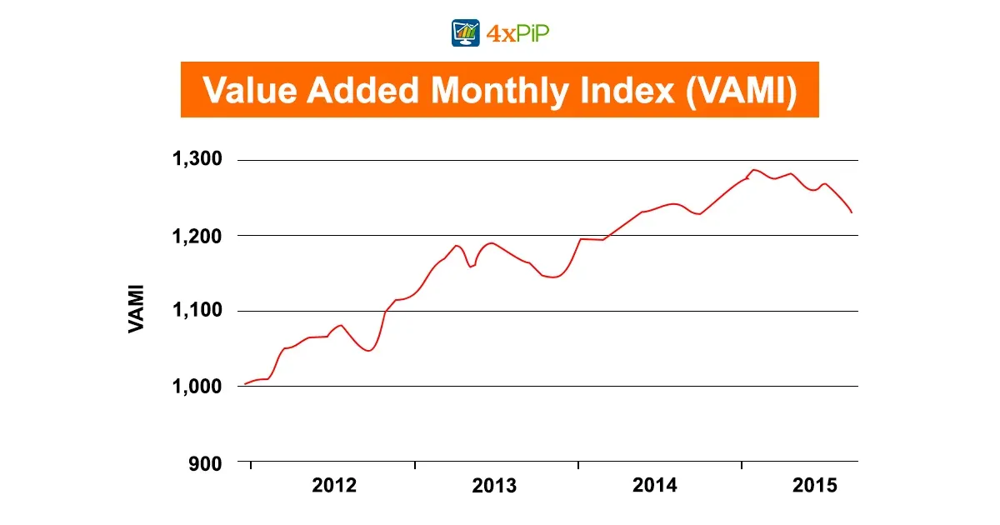

## Table of Contents

## What is the Value Added Monthly Index (VAMI)?

The Value Added Monthly Index (VAMI) is a tool used to track the performance of an investment over time. It starts with an initial investment amount, usually set at $1,000, and then shows how that amount grows or shrinks based on the returns of the investment each month. This makes it easy to see how well an investment is doing without getting into complicated numbers.

VAMI is helpful because it gives a clear picture of an investment's growth. By looking at the VAMI chart, you can quickly tell if the investment is going up or down. It's like watching a line on a graph go up when things are good and down when they're not. This way, anyone can understand how an investment is performing without needing to know a lot about finance.

## How is VAMI calculated?

To calculate the Value Added Monthly Index (VAMI), you start with an initial investment amount, usually set at $1,000. Each month, you take the returns of the investment and apply them to this starting amount. If the investment goes up by 5% in a month, you multiply the current VAMI value by 1.05. If it goes down by 2%, you multiply by 0.98. This way, the VAMI value changes every month based on how the investment is doing.

For example, if your investment grows by 3% in the first month, you would multiply the initial $1,000 by 1.03, making the new VAMI value $1,030. The next month, if the investment drops by 1%, you would then multiply $1,030 by 0.99, giving you a new VAMI value of $1,019.70. By doing this calculation each month, you can see how your investment performs over time in a simple, easy-to-understand way.

## What is the purpose of using VAMI in financial analysis?

The main purpose of using VAMI in financial analysis is to make it easy for people to understand how well an investment is doing over time. By starting with a simple number like $1,000, VAMI shows how that amount changes each month based on the investment's returns. This way, even someone who doesn't know a lot about finance can look at a VAMI chart and see if the investment is growing or shrinking.

Another reason to use VAMI is that it helps compare different investments easily. Because VAMI always starts with the same number, you can put different investments side by side and see which one is doing better. This makes it a handy tool for anyone trying to decide where to put their money, as it gives a clear picture of performance without getting into complicated financial details.

## Can you explain the significance of the base value in VAMI?

The base value in VAMI is important because it gives everyone a starting point that's the same. By starting with $1,000, VAMI makes it easy to see how an investment changes over time. If you start with a different number, it might be hard to compare different investments or understand how they're doing. But with $1,000 as the base, anyone can look at the VAMI and quickly get the idea.

Using a common base value like $1,000 also helps people who aren't experts in finance. It keeps things simple and clear. When you see the VAMI go up, you know the investment is doing well. When it goes down, you know it's not doing so great. This way, VAMI helps everyone understand investment performance without needing to learn complicated financial stuff.

## How does VAMI help in comparing different investment performances?

VAMI helps in comparing different investment performances by using the same starting point for all investments. If you want to see how two or more investments are doing, VAMI starts them all at $1,000. This way, you can easily put them side by side and see which one is growing more or less over time. It's like having a race where everyone starts at the same line, so it's fair to compare who's ahead.

When you look at the VAMI chart, you can see a line for each investment. If one line is going up faster than the others, that investment is doing better. If another line is going down, that investment is not doing as well. Because VAMI uses the same base value for all investments, it's easy to tell which one is the best choice without getting confused by different starting amounts or complicated financial numbers.

## What are the common applications of VAMI in the financial industry?

In the financial industry, VAMI is commonly used to show investors how well their money is doing over time. It's like a simple report card for investments. By starting with $1,000, VAMI makes it easy for anyone to see if their investment is growing or shrinking. This helps people who aren't experts in finance understand their investments without getting lost in complicated numbers.

Another big use of VAMI is to compare different investments. Because VAMI starts all investments at the same point, it's easy to put them side by side and see which one is doing better. This is really helpful for people trying to decide where to put their money. By looking at the VAMI chart, they can quickly tell which investment is ahead and make smarter choices about where to invest.

## How does VAMI account for compounding returns?

VAMI accounts for compounding returns by changing the value each month based on the investment's performance. If your investment grows by 3% in a month, VAMI takes the current value and multiplies it by 1.03. The next month, if it grows by another 2%, VAMI multiplies the new value by 1.02. This way, the growth from one month adds to the growth of the next month, just like how compounding works.

This makes VAMI a good tool to see how your money can grow over time. By showing the effects of compounding in a simple chart, VAMI helps you understand how your investment can get bigger and bigger each month. It's like watching your money grow in a way that's easy to see and understand, without needing to know a lot about math or finance.

## What are the limitations of using VAMI for investment analysis?

VAMI is a great tool for showing how an investment grows over time, but it does have some limitations. One big one is that VAMI only shows the performance of the investment and doesn't take into account things like fees, taxes, or other costs that can affect how much money you actually make. So, while VAMI might show your investment growing, the real amount you get could be less after you pay for these things.

Another limitation is that VAMI doesn't give you the whole picture of risk. It shows how much your investment goes up or down, but it doesn't tell you about how risky the investment is. Some investments can go up a lot but are also more likely to lose money quickly. VAMI doesn't show this part, so you might think an investment is doing well without understanding the risks involved.

Overall, VAMI is useful for seeing how an investment performs over time in a simple way. But for a complete understanding of an investment, you need to look at more than just VAMI. You should also consider fees, taxes, and how risky the investment is. This way, you can make smarter choices about where to put your money.

## How can VAMI be used to track the performance of a mutual fund?

VAMI can be used to track the performance of a mutual fund by showing how a starting amount, usually $1,000, changes over time based on the fund's returns. If the mutual fund goes up by 4% in a month, you multiply the current VAMI value by 1.04. If it goes down by 1%, you multiply by 0.99. This way, you can see month by month how well the mutual fund is doing, making it easy to understand if your investment is growing or shrinking.

Using VAMI to track a mutual fund also helps you compare it with other investments. Because VAMI always starts with the same number, you can put different mutual funds side by side and see which one is doing better. This makes it easier to decide if you should keep your money in one fund or move it to another that's doing better. By looking at the VAMI chart, you get a clear picture of how your mutual fund is performing without needing to know a lot about finance.

## What role does VAMI play in the evaluation of hedge fund performance?

VAMI plays an important role in evaluating [hedge fund](/wiki/hedge-fund-trading-strategies) performance by showing how a starting amount, usually $1,000, changes over time based on the fund's returns. If the hedge fund grows by 5% in a month, you multiply the current VAMI value by 1.05. If it goes down by 2%, you multiply by 0.98. This way, VAMI gives you a simple way to see month by month how well the hedge fund is doing, making it easy to understand if your investment is growing or shrinking.

Using VAMI also helps you compare different hedge funds easily. Because VAMI always starts with the same number, you can put different hedge funds side by side and see which one is doing better. This is helpful for investors trying to decide if they should keep their money in one fund or move it to another that's doing better. By looking at the VAMI chart, you get a clear picture of how your hedge fund is performing without needing to know a lot about finance.

## How does VAMI adjust for different time periods in performance analysis?

VAMI helps track how an investment does over time by starting with $1,000 and changing that amount each month based on the investment's returns. If you want to see how it's doing over different times, like a year or five years, you just keep updating the VAMI value month by month. This way, you can see how your money grows or shrinks over any period you choose.

For example, if you want to compare how your investment did over the last year, you look at the VAMI values from the start of the year to the end. If you want to see how it's done over five years, you look at the VAMI values from five years ago until now. VAMI makes it easy to understand how your investment performs over different time periods without getting into complicated math.

## What advanced statistical methods can be applied to enhance the analysis using VAMI?

To make VAMI analysis even better, you can use something called regression analysis. This is a way to see if there's a pattern in how your investment is doing over time. For example, regression can help you understand if your investment tends to go up or down at certain times of the year, or if it's affected by things like the economy or interest rates. By using regression with VAMI, you can get a clearer picture of what might happen in the future, which can help you make smarter decisions about your investments.

Another useful method is called time series analysis. This looks at how your investment changes from one month to the next and tries to find patterns or trends. Time series analysis can help you see if your investment is getting more or less risky over time, or if it's following a certain cycle. By combining this with VAMI, you can get a better understanding of how steady or unpredictable your investment's growth is. This can be really helpful for figuring out how much risk you're taking and planning for the long term.

## What is the Value Added Monthly Index (VAMI) and how can it be understood?

The Value Added Monthly Index (VAMI) is a fundamental metric used to track the total return on an investment. It captures both reinvested dividends and capital gains, offering a comprehensive overview of an investment's growth over time. VAMI provides insight by starting with a hypothetical initial investment, commonly set at $1,000, and adjusting this value based on net monthly returns. This approach factors in gains after deducting applicable management fees, ensuring that the index reflects the true net performance of an investment.

The calculation of VAMI is straightforward, making it an accessible tool for investors aiming to visualize and understand investment performance. At the outset of an investment period, the VAMI is initialized to $1,000. Each subsequent month's VAMI is determined by multiplying the previous month's VAMI by the factor of (1 + net monthly return). This iterative process effectively compounds the investment, incorporating all periodic gains.

$$

\text{VAMI}_{n} = \text{VAMI}_{n-1} \times (1 + r_n)
$$

In this formula, $\text{VAMI}_{n}$ represents the VAMI for the current month, $\text{VAMI}_{n-1}$ is the VAMI from the previous month, and $r_n$ is the net return for the current month. For example, if the VAMI starts at $1,000 with a net monthly return of 2%, the VAMI for the next month would be calculated as follows:

$$

\text{VAMI}_{1} = 1,000 \times (1 + 0.02) = 1,020
$$

The utility of VAMI extends to providing a historical perspective of fund performance. By charting the VAMI over time, investors gain a visual representation of how an investment has grown or shrunk, facilitating the evaluation of overall strategy effectiveness. This historical view is particularly beneficial for comparing various investment strategies or funds, allowing investors to identify trends, assess consistency in returns, and make informed decisions regarding future allocations. 

VAMI’s simplicity and clarity make it a favored metric among both novice and seasoned investors, giving a transparent and intuitive sense of how well investment strategies perform over extended periods. While it does not account for taxes and transaction costs, it remains a vital tool for assessing the raw performance of investment returns.

## How is the Calculation of VAMI performed?

The Value Added Monthly Index (VAMI) begins its calculation with an initial investment, typically set at $1,000. To determine VAMI for each subsequent month, the prior month's VAMI is multiplied by a [factor](/wiki/factor-investing) that incorporates the net monthly return. The formula used for this process is:

$$
\text{VAMI}_{n} = \text{VAMI}_{n-1} \times (1 + \text{Net Return}_{n})
$$

Where $\text{VAMI}_{n}$ represents the VAMI at the end of month $n$, $\text{VAMI}_{n-1}$ is the VAMI value for the previous month, and $\text{Net Return}_{n}$ is the net return for the month $n$.

For example, if the initial VAMI is $1,000 and the net return for the first month is 2%, the calculation for the end of the first month would be as follows:

$$
\text{VAMI}_{1} = 1,000 \times (1 + 0.02) = 1,020
$$

This step-by-step approach allows for the visualization of cumulative investment growth over time, showing how small gains compound. This straightforward multiplication method provides an intuitive understanding of the investment's performance trajectory as each month's return is integrated seamlessly into the overall index.

In practice, calculating VAMI can be automated using programming languages like Python to handle larger sets of financial data efficiently. Below is a simple Python example illustrating how to compute VAMI over a series of monthly returns:

```python
def calculate_vami(initial_value, returns):
    vami_values = [initial_value]
    for monthly_return in returns:
        new_vami = vami_values[-1] * (1 + monthly_return)
        vami_values.append(new_vami)
    return vami_values

# Example usage:
initial_investment = 1000
monthly_returns = [0.02, 0.03, -0.01, 0.04]  # Example monthly return rates
vami_result = calculate_vami(initial_investment, monthly_returns)
print(vami_result)
```

This snippet initializes the VAMI with the base value, iteratively applying each monthly return to derive the VAMI progression across time. The resulting list, `vami_result`, shows the VAMI over the specified months, providing a clear view of investment growth. Such programming techniques allow investors and analysts to evaluate historical performance efficiently and make informed decisions based on derived data trends.

## What is VAMI in Algorithmic Trading?

Algorithmic trading benefits significantly from the use of the Value Added Monthly Index (VAMI) as it aids in [backtesting](/wiki/backtesting) and evaluation of trading strategies. VAMI provides a clear picture of the cumulative performance of an investment, which is essential for understanding the historical efficacy of trading algorithms. By tracking the growth of a hypothetical investment over time, traders can gauge the performance of their algorithms in terms of returns and [volatility](/wiki/volatility-trading-strategies), critical elements for assessing the risk profile of trading strategies.

Traders use VAMI to optimize their strategies for better risk-adjusted returns. By analyzing VAMI data, they can identify strategies that yield consistent and sustainable growth while minimizing risks. This is particularly beneficial in [algorithmic trading](/wiki/algorithmic-trading), where automated systems are tasked with executing trades based on pre-set rules. VAMI can serve as a benchmark, allowing traders to compare the risk-return profiles of different strategies over identical timeframes. For example, a trader can calculate the Sharpe ratio, a measure of risk-adjusted return, using VAMI values:

$$
\text{Sharpe Ratio} = \frac{E[R] - R_f}{\sigma}
$$

where $E[R]$ is the expected return, $R_f$ is the risk-free rate, and $\sigma$ is the standard deviation of the excess returns.

Additionally, VAMI is pivotal in identifying periods of drawdown—a condition where the investment’s value declines from a peak. Drawdowns are particularly insightful in algorithmic trading as they reveal the vulnerability of trading strategies during market contractions. By visualizing VAMI, traders can easily spot drawdown periods and take necessary actions such as refining their algorithms or implementing new risk management protocols. For instance, using Python, a trader can simulate and visualize drawdowns with VAMI data:

```python
import numpy as np
import matplotlib.pyplot as plt

def calculate_vami(returns):
    vami = np.zeros(len(returns) + 1)
    vami[0] = 1000  # Starting investment of $1,000
    for i, r in enumerate(returns):
        vami[i + 1] = vami[i] * (1 + r)
    return vami

def draw_vami_chart(vami):
    plt.plot(vami)
    plt.title('VAMI Chart')
    plt.xlabel('Time')
    plt.ylabel('VAMI Value ($)')
    plt.show()

# Example usage with hypothetical monthly returns
monthly_returns = [0.02, -0.01, 0.03, -0.02, 0.04]
vami = calculate_vami(monthly_returns)
draw_vami_chart(vami)
```

In this example, the VAMI chart can visually depict both the growth and the drawdowns experienced over the simulated period. Such analysis is crucial for refining trading algorithms to enhance performance while mitigating potential losses.

Overall, VAMI’s ability to encapsulate complex data into an accessible format makes it unparalleled in algorithmic trading. By leveraging VAMI alongside other performance metrics, traders can develop more robust and adaptive trading strategies.

## References & Further Reading

[1]: ["Quantitative Trading: How to Build Your Own Algorithmic Trading Business"](https://www.amazon.com/Quantitative-Trading-Build-Algorithmic-Business/dp/1119800064) by Ernest P. Chan

[2]: ["Advances in Financial Machine Learning"](https://www.amazon.com/Advances-Financial-Machine-Learning-Marcos/dp/1119482089) by Marcos Lopez de Prado

[3]: ["Performance Evaluation and Attribution of Security Portfolios"](https://www.sciencedirect.com/book/9780127444833/performance-evaluation-and-attribution-of-security-portfolios) by Bernd R. Fischer and Russ Wermers

[4]: ["Algorithmic Trading: Winning Strategies and Their Rationale"](https://www.wiley.com/en-us/Algorithmic+Trading%3A+Winning+Strategies+and+Their+Rationale-p-9781118746912) by Ernie Chan

[5]: Lindemann, C., & Ritter, M. (2018). ["Algorithmic Trading"](https://academic.oup.com/rfs/article-abstract/31/6/2184/4708266). Springer International Publishing. 

[6]: ["Evidence-Based Technical Analysis: Applying the Scientific Method and Statistical Inference to Trading Signals"](https://www.amazon.com/Evidence-Based-Technical-Analysis-Scientific-Statistical/dp/0470008741) by David Aronson

[7]: ["Backtesting Strategies on Historical Data"](https://www.quantifiedstrategies.com/historical-data/) by Adam Hayes, Investing Basics on Investopedia.