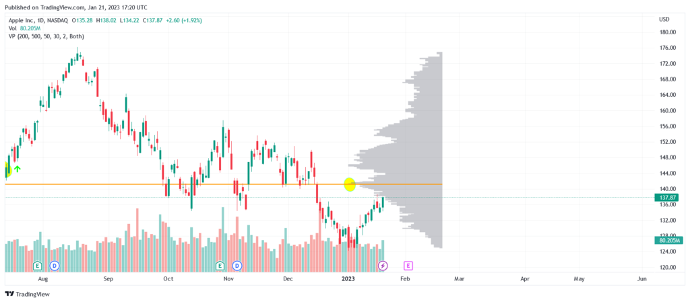

Trading markets present various strategies to capitalize on price movements, one of which is centered around the concepts of Value Area High (VAH) and Value Area Low (VAL) within algorithmic trading. Understanding these concepts can provide traders with a substantial advantage, especially those who heavily rely on volume profiles and market profiles. The Value Area trading strategy is based on identifying where the majority of the trading activity occurred during a specific period, which can subsequently highlight potential support and resistance levels.

The Value Area represents the range within which 70% of the trading volume took place, indicating the price levels considered fair or balanced by the market participants during that timeframe. This strategy has gained traction among traders who prioritize data-driven decision-making, as it facilitates a methodical approach to identifying key price levels. Traders use these areas to predict potential market reversal or continuation zones, offering a logical structure for analyzing price movement patterns.



In this article, we explore the definitions, identification, and application of Value Areas in algorithmic trading, providing insights into their effective utilization. By integrating the concepts of VAH and VAL into trading algorithms, traders can enhance the accuracy and timing of their trade entries and exits, potentially improving overall trading performance. As the market dynamics continuously evolve, such quantitative strategies provide a structured methodology for navigating complex market environments, making them an essential component of a robust trading toolkit.

## Table of Contents

## Understanding Value Areas

A Value Area on a price chart represents a range where a substantial portion of trading activity occurred over a specific timeframe. This range is typically defined as encompassing 70% of the trading volume, indicating where the market has spent most of its time. The underlying theory is that markets often move towards a fair price or 'value,' making value areas significant indicators of potential market stability or shifts.

The identification of value areas relies on understanding the relationship between price levels and trading volume. Traders use this data to forecast market movements, leveraging insights into where heavy trading volumes occur. Such areas suggest zones of consensus value, where market participants are generally in agreement about the worth of the asset. Recognizing these value areas can be critical for algorithmic trading strategies that depend on accurate predictions of price behavior based on historical trading patterns.

The Value Area is calculated from the distribution of trading volume across various price levels over a given period. The process generally involves analyzing a volume profile to determine which prices account for the most trade activity. For example, with a target value area of 70%, one finds the price range within which 70% of the trading volume transacts. This process may involve iterative calculations, adjusting the price range until the 70% volume condition is satisfied.

The concept of value areas is grounded in the principle that prices will oscillate around a fair or equilibrium level where trading [volume](/wiki/volume-trading-strategy) is concentrated. This makes value areas valuable as benchmarks for traders seeking to identify potential support or resistance levels. Predicting price movements based on value areas allows traders to form strategies that capitalize on anticipated reversion to fair value or exploit breakouts from established value zones. These strategies are particularly useful in [algorithmic trading](/wiki/algorithmic-trading), where precision and speed in decision-making can offer a competitive edge.

## How to Identify Value Area High and Low

To determine the Value Area in trading, traders primarily rely on volume profile charts, which depict the volume traded at various price levels over a specific timeframe. This approach provides a visual representation of trading activity and helps identify key price ranges where a significant amount of trading volume has occurred.

The Value Area High (VAH) and Value Area Low (VAL) are critical components of this analysis. The VAH represents the highest price level within a session where substantial trading volume is concentrated. Conversely, the VAL marks the lowest price level with significant volume presence. Together, these points define a range known as the Value Area, usually encapsulating about 70% of the trading volume for the selected timeframe.

To calculate these levels, traders follow a systematic process. Often, this involves analyzing data from a volume profile chart, which provides insights into where the majority of contracts or shares were exchanged. Here's a simplified step-by-step procedure that traders might use:

1. **Volume Profile Construction**: Begin by constructing a volume profile chart, which organizes data into price buckets and illustrates the total volume traded at each price level within the selected period.

2. **Determine Total Volume**: Calculate the total trading volume over the entire period under analysis.

3. **Identify Peak Volume**: Locate the Price Point of Control (POC), where the highest volume of trades occurred.

4. **Calculate Volume Threshold**: Compute 70% of the total volume, as this represents the proportion that typically defines the Value Area.

5. **Identify VAH and VAL**: Starting from the POC, expand up and down the price levels, adding volume at each price until the cumulative volume reaches the pre-determined 70%. The highest price in this range is the VAH, and the lowest is the VAL.

Tools such as TradingView and Amibroker offer functionalities for traders to visualize these volume profiles efficiently. These platforms provide predefined indicators that make identifying potential value areas straightforward. Traders can use these tools to overlay volume data on price charts, enabling quick recognition of VAH and VAL. For instance, TradingView allows users to use the volume profile indicator, which helps in visualizing the distribution of volume over different prices, making it easier to identify where significant trading activity has occurred.

In Python, one could potentially automate this process using libraries like Pandas for data manipulation and Plotly for visualizing volume profiles. Although precise code implementation would require access to specific trading data sources, a basic framework might look like this:

```python
import pandas as pd
import numpy as np

# Example data: price and volume
data = pd.DataFrame({'Price': [100, 101, 102, 103],
                     'Volume': [200, 180, 250, 300]})

# Calculate total volume
total_volume = data['Volume'].sum()

# Determine 70% of total volume
threshold_volume = total_volume * 0.7

# Sort data by volume and calculate cumulative volume
data_sorted = data.sort_values('Volume', ascending=False)
data_sorted['CumulativeVolume'] = data_sorted['Volume'].cumsum()

# Filter for value area until cumulative volume reaches the threshold
value_area = data_sorted[data_sorted['CumulativeVolume'] <= threshold_volume]

VAH = value_area['Price'].max()
VAL = value_area['Price'].min()

print(f'Value Area High: {VAH}, Value Area Low: {VAL}')
```

By employing these techniques, traders can systematically identify and analyze VAH and VAL to inform their trading strategies, ensuring that decisions are based on robust historical trading data.

## Utilizing Value Areas in Algorithmic Trading

Algorithmic trading leverages computational power to make trading decisions, and the inclusion of value area data can enhance the precision of these systems. In particular, Value Area High (VAH) and Value Area Low (VAL) are pivotal in forming efficient trading strategies through algorithms. These parameters enable traders to systematically program entry and [exit](/wiki/exit-strategy) points based on historical trading volumes and price levels.

By programming algorithms to react to the intersection of price and value areas, traders can achieve systematic entries and exits within predicted ranges. For instance, when a trading algorithm detects a price crossing above the VAH, it may signal a [breakout](/wiki/breakout-trading), prompting a buy action. Conversely, a price drop below the VAL can indicate a potential selling opportunity. Python, with libraries such as NumPy and Pandas, is frequently used to develop such algorithms due to its robust capabilities in handling numerical data and performing statistical analysis.

```python
import pandas as pd

# Assuming 'data' is a DataFrame containing market price data with columns 'price' and 'volume'
data['cumulative_volume'] = data['volume'].cumsum()
total_volume = data['cumulative_volume'].iloc[-1]
value_area_volume = 0.7 * total_volume

# Find VAH and VAL
vah = data.loc[data['cumulative_volume'] >= value_area_volume / 2, 'price'].iloc[0]
val = data.loc[data['cumulative_volume'] >= total_volume - value_area_volume / 2, 'price'].iloc[0]

print(f"Value Area High (VAH): {vah}")
print(f"Value Area Low (VAL): {val}")
```

The use of VAH and VAL within algorithms assists in automating the recognition of breakout or reversal patterns, thereby allowing for timely strategic decisions. As these value areas represent psychological levels in the market, algorithms tuned to react to price movements around these areas can hypothetically increase a trader's success rate.

Implementing value areas in trading algorithms also offers the benefit of reducing emotional and irrational decisions, which are common in manual trading. By pre-defining rules that determine actions based on the interaction with VAH and VAL, traders can ensure that their strategies are consistently applied, devoid of emotional influence. This level of automation not only boosts efficiency but also allows traders to execute complex strategies across multiple markets simultaneously.

While incorporating VAH and VAL into trading algorithms presents an efficient way to capitalize on historical price-volume patterns, it is crucial to pair these strategies with comprehensive risk management protocols. As market conditions shift, continuous monitoring and recalibration of algorithms might be necessary to maintain the effectiveness of the trading system.

## Benefits and Drawbacks

Utilizing value areas in trading strategies offers several notable advantages, foremost among them being the clear identification of support and resistance levels. Understanding where the majority of trading activity has occurred allows traders to pinpoint price levels that are significant to market participants. This can lead to better predictions of price actions as these levels often signify potential turning points where prices may rebound or break through upon subsequent interactions.

For instance, suppose the Value Area High (VAH) and Value Area Low (VAL) are identified as $P_{\text{VAH}}$ and $P_{\text{VAL}}$, respectively. Traders can observe that prices tend to bounce back from or break through these levels. Hence, these areas become focal points for strategic decision-making regarding entries and exits in trades. The equation for anticipated reversal can be conceptualized through price testing at these values:

$$
\text{If } P_t < P_{\text{VAL}} \rightarrow \text{Buy Signal}
$$
$$
\text{If } P_t > P_{\text{VAH}} \rightarrow \text{Sell Signal}
$$

However, challenges arise during periods of market [volatility](/wiki/volatility-trading-strategies). In highly volatile conditions, the reliability of value areas as indicators of support and resistance can diminish. This is because significant fluctuations in trading volume can obscure these areas, resulting in false trading signals that can lead to unprofitable trades. Hence, value areas may lose their predictive strength, demanding more cautious interpretation.

To effectively mitigate the risks associated with the reliance on value areas, it is critical for traders to integrate these tactics with additional trading tools and robust risk management strategies. For instance, utilizing moving averages or [momentum](/wiki/momentum) indicators can provide supplementary confirmation, improving the reliability of trading strategies based on value areas. Risk management practices such as stop-loss orders further safeguard against substantial losses by limiting exposure when the market moves adversely.

In conclusion, while value areas offer a powerful mechanism for identifying important market price levels, they should not be used in isolation. Combining them with other analytical tools and prudent risk management ensures a more resilient trading strategy, capable of withstanding the unpredictable nature of trading markets.

## Conclusion

Incorporating Value Area strategies in algorithmic trading presents a structured approach to capitalizing on market data. Value Areas, defined by Value Area High (VAH) and Value Area Low (VAL), offer vital insights into market dynamics by highlighting significant zones of trading activity. These concepts form a foundation for traders aiming to predict market behavior, as they are based on historical data patterns that suggest potential support and resistance levels.

By integrating VAH and VAL into algorithmic trading systems, traders can enhance decision-making processes. Algorithms can be programmed to recognize when market prices intersect with these value areas, facilitating strategic entry and exit points. For instance, identifying a price crossing above the VAH might imply a potential breakout, whereas a move below the VAL could signal a reversal. Such systematic handling of market data can lead to optimized trading outcomes, leveraging historical volume distribution for predictive analytics.

However, the effective use of Value Area strategies requires an awareness of their limitations. In volatile market conditions, value areas can signal false positives, leading to premature or erroneous trading actions. Thus, it is critical to incorporate value area strategies alongside comprehensive risk management and supplementary analytical tools, ensuring robust strategy development. By blending these elements, traders can mitigate potential drawbacks, ultimately achieving a balanced and effective trading strategy.

## References & Further Reading

[1]: Harris, L. (2003). ["Trading and Exchanges: Market Microstructure for Practitioners"](https://www.amazon.com/Trading-Exchanges-Market-Microstructure-Practitioners/dp/0195144708) by Larry Harris.

[2]: Steidlmayer, J. P., & Hawkins, S. J. (2002). ["Steidlmayer on Markets: Trading with Market Profile"](https://www.amazon.com/Steidlmayer-Markets-Trading-Market-Profile/dp/0471215562) by J. Peter Steidlmayer and Steven B. Hawkins.

[3]: Dalton, J. W., Jones, E. T., & Dalton, R. B. (2013). ["Mind Over Markets: Power Trading with Market Generated Information"](https://books.google.com/books/about/Mind_Over_Markets.html?id=EpGo8PUi7-AC) by James F. Dalton, Eric T. Jones, and Robert B. Dalton.

[4]: Murphy, J. J. (1999). ["Technical Analysis of the Financial Markets: A Comprehensive Guide to Trading Methods and Applications"](https://www.amazon.com/Technical-Analysis-Financial-Markets-Comprehensive/dp/0735200661) by John J. Murphy.

[5]: Lopez de Prado, M. (2018). ["Advances in Financial Machine Learning"](https://www.amazon.com/Advances-Financial-Machine-Learning-Marcos/dp/1119482089) by Marcos Lopez de Prado.

[6]: Chan, E. (2009). ["Quantitative Trading: How to Build Your Own Algorithmic Trading Business"](https://rickorford.com/quantitative-trading/) by Ernest P. Chan.