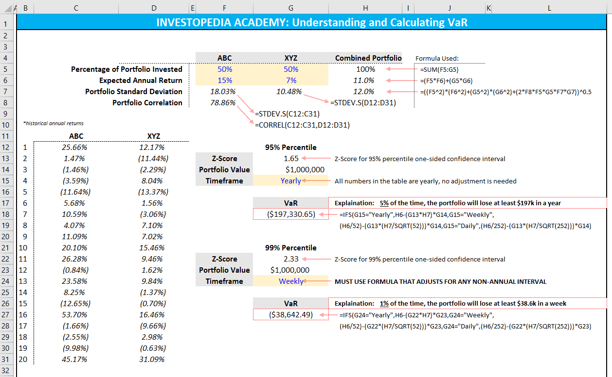

Value at Risk (VaR) is a vital tool in risk management and algorithmic trading, offering a statistical measure to predict potential losses in a trading portfolio. As financial markets continue to evolve, managing risk has become an essential aspect of maintaining robust trading strategies. VaR serves as a primary metric that helps institutions quantify risk by estimating the maximum loss that can occur within a specified period with a predetermined confidence level. This means that VaR not only provides a snapshot of potential downside risk but also assists in setting risk tolerance levels across diverse portfolios.

The significance of VaR is particularly notable in its application within algorithmic trading, where automated strategies can rapidly execute numerous orders based on predefined algorithms. In this context, VaR is instrumental in assessing the risk associated with these strategies and ensuring that they remain within acceptable loss thresholds. By integrating VaR into risk management frameworks, financial institutions and traders gain crucial insights into the volatility and risk exposure of their portfolios. This information enables them to make informed decisions about capital allocation, risk appetite, and strategy adjustments.

Understanding the calculation methods of VaR is essential for its effective application. Techniques such as the Historical Method, Variance-Covariance Method, and Monte Carlo Simulation provide diverse approaches to estimating VaR, each with its own assumptions and applicability. Despite its advantages, VaR has limitations that prompt the need for complementary tools and techniques to address its constraints. This article will explore the methods of calculating VaR, its advantages and limitations, and its real-world applications in modern trading environments. By examining these aspects, we seek to provide a comprehensive overview of VaR's role in enhancing risk management strategies.

## Table of Contents

## Understanding Value at Risk (VaR)

Value at Risk (VaR) is a statistical measure that estimates the maximum potential loss that a financial portfolio might incur over a specified time frame, given a certain confidence level. It is a key component in the risk management toolkit of financial institutions and investment firms, providing a forecast that aids in understanding the risk exposure of asset portfolios.

At its core, VaR aims to encapsulate the worst loss expected under normal market conditions over a particular period. For instance, a one-day VaR with a 95% confidence level of $1 million suggests that there is only a 5% chance that the portfolio will incur a loss exceeding $1 million over the next trading day. This probabilistic measure assists risk managers in evaluating how much they could potentially lose, thereby helping them maintain exposures within predefined risk thresholds.

Despite its widespread use, VaR is not without limitations. One of its main drawbacks is that it does not provide any information about the magnitude of losses exceeding the VaR threshold. This issue is known as the problem of "tail risk," where VaR fails to account for extreme market movements or 'black swan' events that may occur with low probability but have a significant impact. Consequently, relying solely on VaR could lead to underestimating potential risks during periods of financial turmoil.

Another limitation is that VaR is highly dependent on the historical data and assumptions used in its calculation. The accuracy of VaR forecasts can be significantly impacted by the choice of the time horizon, confidence level, and the statistical approach employed. It also assumes markets are efficient and that past price movements can be indicative of future fluctuations, which may not always hold true in volatile market conditions.

Therefore, risk managers often complement VaR with other risk metrics and methodologies to gain a more comprehensive view of potential financial risks. Measures such as Conditional VaR (CVaR) or Expected Shortfall, which estimate the average loss in scenarios where losses exceed the VaR threshold, are increasingly used to provide insights into the tail risks that VaR itself does not capture.

Overall, VaR remains a valuable tool for financial firms, offering a straightforward and interpretable means of assessing portfolio risk. However, its limitations underscore the importance of using VaR in conjunction with other metrics and models to ensure a robust and thorough risk management framework.

## Methods of Calculating VaR

Value at Risk (VaR) is a statistical measure used to evaluate the potential loss in value of a portfolio under normal market conditions over a set time period, with a specified confidence level. The calculation of VaR can be approached through several techniques, each with its distinct assumptions and suitability for different types of financial instruments and market conditions.

### Historical Method

The historical method, also known as historical simulation, involves using actual historical market data to estimate potential future losses. By observing past returns, this method assumes that historical price movements will repeat in the future. To calculate VaR using this method, one typically follows these steps:

1. **Collect Historical Data**: Gather a time series of historical returns for the portfolio or asset.
2. **Sort the Returns**: Arrange these returns in ascending order.
3. **Determine the VaR**: Identify the return corresponding to the desired confidence level. For instance, for a 95% confidence level, the VaR is the 5th percentile of the sorted returns.

This method's simplicity and reliance on actual market data make it easy to implement. However, it assumes that past market behavior is indicative of future risks, which may not always hold true, especially during periods of significant market change.

### Variance-Covariance Method

The variance-covariance method, also known as the parametric method, relies on the statistical properties of portfolio returns. It assumes that the returns are normally distributed and calculates VaR based on the mean and standard deviation of the returns. The primary steps involved are:

1. **Calculate the Mean and Standard Deviation**: Determine the average (mean) return and the standard deviation of returns for the portfolio.
2. **Apply the Formula**: Using the assumption of normal distribution, VaR is calculated as:
$$
   \text{VaR} = Z \cdot \sigma - \mu

$$

   where $Z$ is the z-score corresponding to the desired confidence level, $\sigma$ is the standard deviation, and $\mu$ is the mean return.

The advantage of this method lies in its analytical simplicity and efficiency when dealing with portfolios containing a large number of assets. However, its reliance on the normality assumption may lead to inaccuracies in scenarios where returns exhibit fat tails or skewness.

### Monte Carlo Simulation

Monte Carlo Simulation is a more advanced and flexible method, especially useful for portfolios with non-linear risks or complex derivatives. It involves generating a large number of hypothetical scenarios to model potential future states of the market. The process is as follows:

1. **Model the Underlying Asset**: Define the statistical properties and dynamics governing the asset prices, including the mean, volatility, and any other relevant parameters.
2. **Generate Scenarios**: Simulate a multitude of random price paths using computational algorithms based on probabilistic models like the Geometric Brownian Motion.
3. **Calculate End-of-Period Values**: Evaluate the portfolio under each simulated scenario to determine potential gains or losses.
4. **Compute VaR**: From the distribution of simulated outcomes, identify the loss corresponding to the confidence level.

Monte Carlo offers a powerful approach to capturing the complexities and nuances of market behavior, handling assets with path-dependent payoffs or non-linear risk profiles effectively. However, it is computationally intensive and requires robust modeling skills, making it resource-demanding.

In conclusion, each method of calculating VaR provides unique insights into risk management and is best suited to specific types of investments and market conditions. The choice of method depends on the characteristics of the portfolio, computational resources, and the risk manager's objectives and assumptions.

## VaR in Algorithmic Trading

In [algorithmic trading](/wiki/algorithmic-trading), Value at Risk (VaR) serves as a crucial metric for assessing and managing the potential losses associated with trading strategies. It provides traders and financial institutions with quantitative insights into the risk exposure of their portfolios, which in turn assists in making informed decisions to optimize returns while controlling risks.

One of the primary applications of VaR in algorithmic trading is risk assessment. By quantifying the maximum expected loss within a specified time frame and confidence level, traders can gain a clear understanding of the potential downside of their strategies. For example, if a trading strategy has a daily VaR of $1 million at a 95% confidence level, it indicates that there is a 5% chance that the portfolio could lose more than $1 million in a single day. This probabilistic assessment allows traders to evaluate the viability of their strategies under various market conditions.

VaR also facilitates the modification and optimization of trading strategies. By analyzing the VaR of different strategies, traders can compare their risk-return profiles and choose the most efficient ones. This process is particularly important in high-frequency trading environments, where small divergences from expected outcomes can lead to significant cumulative losses. As a result, VaR enables traders to adjust their algorithms to maintain risk within acceptable limits, thereby enhancing strategy robustness.

Furthermore, VaR assists in setting risk thresholds and limits. Financial institutions and traders can implement VaR-based risk limits to ensure that their trading activities do not exceed predefined risk appetites. For instance, a trading firm might establish a policy that prohibits any strategy with a VaR exceeding a certain percentage of the portfolio's overall value. This approach not only prevents excessive risk-taking but also aligns trading activities with broader risk management frameworks.

The integration of VaR into algorithmic trading systems can be accomplished through a variety of methods, including programming and simulation techniques. Utilizing Python, for example, traders can simulate different market scenarios to compute VaR for their strategies. Libraries such as NumPy and SciPy can be employed for statistical computations, while [backtesting](/wiki/backtesting) frameworks like PyAlgoTrade can be used to validate and refine algorithmic models based on historical data.

Overall, VaR's role in algorithmic trading is indispensable as it helps in predicting potential losses, optimizing strategy selection, and setting enforceable risk limits. However, it is important to note that while VaR is a valuable tool, it should be complemented with other risk metrics to provide a comprehensive view of risk exposure.

## Advantages and Limitations of VaR

Value at Risk (VaR) stands out for its simplicity and ease of interpretation, providing a clear metric that can be effectively communicated to stakeholders. This characteristic makes VaR an efficient tool in assessing and conveying the risk levels of portfolios, thus aiding in strategic decision-making by financial managers and investors. Its widely recognized format allows for seamless integration into regular financial reporting and risk management strategies.

One of VaR's primary strengths is its versatility. It is applicable to a diverse array of assets and portfolio types, ranging from equities and bonds to derivatives and more complex structured products. This adaptability ensures that VaR can be used within various financial contexts, offering consistent insights across different asset classes and market environments.

Nevertheless, VaR is not without its limitations. A significant drawback of this measure is its inability to capture extreme 'tail events,' often referred to as black swan events. These are rare and severe market scenarios where potential losses exceed the calculated VaR, leading to underestimated risk assessments in unusually volatile markets. The focus of VaR on a specific confidence interval means that anything outside of this is essentially ignored, which can be particularly problematic during periods of financial turmoil.

The reliability of VaR is heavily contingent on the quality of the historical data used and the assumptions underlying the models. VaR calculations typically assume normal distribution of returns and stable market conditions, assumptions that do not always hold true in practice. For example, the Variance-Covariance Method relies on statistical parameters like mean return and standard deviation, which may not adequately reflect the actual distribution of market returns, especially in the presence of skewness or kurtosis.

To mitigate these shortcomings, users of VaR often complement it with other risk assessment tools and advanced techniques. Despite its ease of use and applicability, it's crucial for financial professionals to recognize the potential pitfalls and exercise caution when relying solely on VaR for risk management. Employing a multi-faceted approach can provide a more comprehensive view of risk, enhancing the robustness of financial strategies in facing diverse market conditions.

## Advanced VaR Techniques and Considerations

Value at Risk (VaR), while widely used, has inherent limitations, particularly in capturing potential extreme losses or tail risks. To address these limitations, advanced techniques such as Conditional Value at Risk (CVaR), also known as Expected Shortfall (ES), are employed. CVaR offers a more comprehensive risk measure by considering the average of losses that occur beyond the VaR threshold, providing a fuller picture of potential risks in extreme scenarios. Formally, CVaR can be expressed as:

$$
\text{CVaR}_\alpha(X) = E[X \mid X > \text{VaR}_\alpha(X)]
$$

where $X$ represents the portfolio returns, $\alpha$ is the confidence level, and $\text{VaR}_\alpha(X)$ is the Value at Risk at confidence level $\alpha$.

Backtesting is an essential process for evaluating the accuracy and reliability of VaR models. It involves comparing the predicted losses to the actual outcomes over time, allowing risk managers to identify discrepancies and refine models. Effective backtesting ensures that the VaR model remains robust and responsive to the dynamic nature of financial markets. A common practice in backtesting VaR models includes using statistical tests like the Kupiec’s test or the Christoffersen’s test to assess the exceedance frequency and independence.

Regulatory frameworks often require financial institutions to incorporate Stressed VaR (sVaR) into their risk assessments. This involves adjusting VaR calculations to reflect potential adverse market conditions by using historical data from stress periods. Stressed VaR aims to ensure that institutions are prepared for market downturns and possess sufficient capital buffers to withstand such events. Financial regulators, such as the Basel Committee on Banking Supervision, mandate the use of sVaR as part of broader market risk capital requirements, highlighting its importance in promoting financial stability.

These advanced techniques and considerations underscore the necessity for a multifaceted approach to risk management that goes beyond traditional VaR, ensuring more resilient financial strategies in the face of uncertainty.

## Conclusion

Value at Risk (VaR) continues to be an essential tool in risk management strategies, particularly vital for algorithmic trading. Its ability to provide a quantifiable measure of potential losses makes it indispensable for financial institutions. However, while VaR's applicability and ease of interpretation are advantageous, traders must remain cognizant of its limitations. VaR does not sufficiently capture extreme market events, and its accuracy is dependent on the quality of historical data and the assumptions underlying its calculation methods.

To ensure a comprehensive risk management strategy, VaR should be used in conjunction with other assessment methods. Techniques such as Conditional VaR or Expected Shortfall can fill the gaps left by traditional VaR methods, providing a more robust estimation of risk by considering extreme loss scenarios. Additionally, regular backtesting and adjusting models according to market conditions are critical practices for maintaining the accuracy of VaR assessments.

Looking forward, advancements in technology present new opportunities to enhance VaR models. Integrating [machine learning](/wiki/machine-learning) algorithms offers the potential to refine risk predictions by analyzing complex patterns within financial data, leading to more dynamic and accurate assessments. These emerging methodologies promise to evolve traditional VaR, making it a more powerful tool in the ever-changing landscape of financial risk management.

## References & Further Reading

[1]: Jorion, P. (2006). ["Value at Risk: The New Benchmark for Managing Financial Risk."](https://books.google.com/books/about/Value_at_Risk_3rd_Ed.html?id=nnblKhI7KP8C) McGraw-Hill.

[2]: Hull, J. C. (2015). ["Options, Futures, and Other Derivatives."](https://www.amazon.com/Options-Futures-Other-Derivatives-10th/dp/013447208X) Pearson.

[3]: Glasserman, P. (2003). ["Monte Carlo Methods in Financial Engineering."](https://link.springer.com/book/10.1007/978-0-387-21617-1) Springer.

[4]: Dowd, K. (2005). ["Measuring Market Risk."](https://onlinelibrary.wiley.com/doi/book/10.1002/9781118673485) Wiley.

[5]: Alexander, C. (2008). ["Market Risk Analysis, Volume III: Pricing, Hedging and Trading Financial Instruments."](https://download.e-bookshelf.de/download/0000/5795/04/L-G-0000579504-0002383568.pdf) Wiley.