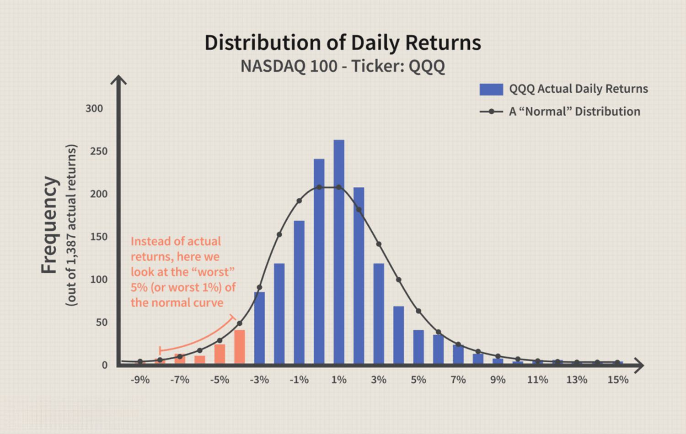

Value at Risk (VaR) is a fundamental instrument in financial risk management, providing a statistical measure designed to quantify potential losses in a portfolio over a predetermined timeframe. It serves as a cornerstone in risk assessment, offering insights into the extent and probabilities of potential financial setbacks within various financial investments. Predominantly leveraged by investment and commercial banks, VaR aids in evaluating the risk profile of portfolios, helping institutions manage their financial exposures strategically.

In computing VaR, several methodologies are employed, each catering to different aspects of risk measurement and forecasting. These methodologies offer comprehensive approaches to understanding market conditions and potential impacts on assets. This article is structured to cover these computational techniques, highlighting their applications and significance in both algorithmic trading and holistic financial risk management.



Furthermore, the discussion extends to advanced VaR techniques, assessing their advantages, limitations, and how they adapt to modern portfolio management needs. As financial environments grow increasingly complex, the evolution and refinement of VaR methodologies continue to play a crucial role. Through this exploration, insights into advanced methodologies, such as dynamic risk models and machine learning applications, will be gleaned, demonstrating their capacity to enhance VaR's predictiveness and accuracy.

## Table of Contents

## What is Value at Risk (VaR)?

Value at Risk (VaR) is a fundamental statistical measure employed in financial risk management to quantify the potential loss that a portfolio might experience under normal market conditions over a predetermined timeframe and specified confidence level. VaR is typically expressed as either a dollar value or percentage, providing clear insights into the potential financial losses that investors and firms might face. This metric aids in determining the risk exposure of individual investments as well as performing comprehensive firm-wide risk assessments.

The calculation of VaR involves establishing a threshold value such that the probability of a loss exceeding this value is predetermined, usually at confidence levels of 95% or 99%. If a portfolio has a one-day VaR of $1 million at a 95% confidence level, it indicates that there is a 95% chance that the portfolio will not lose more than $1 million in a day, under normal market conditions.

The significance of VaR lies in its utility as a risk management tool, enabling financial institutions, corporations, and individual investors to quantify and communicate risk using a consistent framework. This risk assessment supports decision-making processes related to capital allocation, limit setting, and performance evaluation.

Mathematically, VaR can be represented by determining the quantile of the loss distribution. For normally distributed returns, VaR can be calculated as:

$$
\text{VaR}_{\alpha} = \mu + z_{\alpha} \cdot \sigma
$$

where $\mu$ is the mean of the portfolio returns, $\sigma$ is the standard deviation, and $z_{\alpha}$ is the z-score corresponding to the desired confidence level $\alpha$.

Below is an illustrative Python code to compute the VaR for a given set of portfolio returns assuming normal distribution:

```python
import numpy as np
import scipy.stats as stats

def calculate_var(returns, confidence_level=0.95):
    mu = np.mean(returns)
    sigma = np.std(returns)
    z = stats.norm.ppf(confidence_level)
    var = mu + z * sigma
    return var

# Example portfolio returns
portfolio_returns = np.random.normal(loc=0.001, scale=0.02, size=1000)

var_95 = calculate_var(portfolio_returns, confidence_level=0.95)
print(f"VaR at 95% confidence level: {-var_95:.2f}")
```

While VaR is a versatile tool in risk management, it's important to note that it's based on the assumption of normal market conditions and thus may not fully capture risks stemming from extreme market events. Nonetheless, its widespread adoption underscores its effectiveness in providing a clear, quantifiable view of risk exposure.

## VaR Computation Methodologies

Value at Risk (VaR) is a crucial metric in financial risk management. To compute VaR effectively, three primary methodologies are commonly used: the historical method, the variance-covariance method, and the Monte Carlo method.

The historical method involves analyzing historical returns to assess potential future financial risks. It operates on the principle that past market behaviors indicative of future market outcomes. This method requires ordering past returns over a specific period and determining the loss level that corresponds to the desired confidence interval. For example, if using a 95% confidence level, the VaR would be the return level that marks the threshold for the worst 5% of historical returns.

The variance-covariance method, also known as the parametric method, assumes that asset returns follow a normal distribution. This method uses the mean and standard deviation of the returns to estimate potential losses. The formula for VaR in this approach is:

$$
\text{VaR} = \text{Mean} - z \times \text{Standard Deviation}
$$

where $z$ is the z-score corresponding to the chosen confidence level (e.g., 1.65 for 95% confidence). This method's main advantage is its simplicity and speed. However, it may not accurately reflect market conditions if the assumption of normal distribution is violated, especially during periods of significant market volatility.

The Monte Carlo method uses stochastic simulations to forecast potential losses by generating numerous random price paths based on statistical properties of the return series. This approach allows for a more flexible modeling of risk factors, accommodating complex financial instruments and capturing non-linear risks. A Python example to illustrate this method is as follows:

```python
import numpy as np

# Parameters
n_scenarios = 10000
initial_price = 100
volatility = 0.2
time_horizon = 1  # one day
confidence_level = 0.95

# Simulating returns
random_returns = np.random.normal(0, volatility, n_scenarios)

# Calculating end prices
end_prices = initial_price * np.exp(random_returns * time_horizon)

# Sorting the price outcomes
sorted_prices = np.sort(end_prices)

# Determining the VaR
var_index = int((1 - confidence_level) * n_scenarios)
value_at_risk = initial_price - sorted_prices[var_index]

print("Value at Risk (VaR) is:", value_at_risk)
```

This snippet calculates the VaR by simulating 10,000 potential price paths, allowing for a comprehensive view of possible future losses under normal market conditions.

Each methodology offers distinct advantages and limitations, making them suitable for different scenarios based on the nature of the portfolio and the specific financial questions being addressed. Integrating these methods within a robust risk management framework enhances the capability to assess and manage potential financial losses effectively.

## Advantages and Disadvantages of Value at Risk (VaR)

Value at Risk (VaR) is widely regarded for its simplicity and effectiveness as a single, quantifiable risk metric. One of the primary advantages of VaR is its straightforward interpretation across various asset classes, making it a universal tool for investors and institutions to assess their risk exposure. By providing a financial loss estimate under normal market conditions, VaR aids in strategic decision-making and risk management, enabling firms to identify high-risk areas in their portfolios and take corrective actions accordingly.

However, VaR is not without its shortcomings. A notable limitation is its reliance on historical data, which may not accurately predict future market behaviors, particularly during extreme events or market crashes. This dependency could lead to underestimation of risk, as historical data may not always capture unprecedented or rare events. Another significant issue stems from the assumption of normal distribution in some methodologies, such as the variance-covariance approach. Real-world data often exhibit skewness and kurtosis that deviate from the normal distribution, potentially resulting in misrepresented risk figures.

Moreover, VaR provides what is considered a minimum risk estimate, focusing only on the threshold below which a certain percentage of losses occur. It does not offer insights into the scale of losses beyond this point, which can be crucial for managing extreme risk scenarios. This limitation implies that while VaR can effectively highlight potential risk levels, it may overlook the severity of losses beyond the specified confidence interval. As such, financial institutions are encouraged to complement VaR with additional risk measures, such as expected shortfall, to gain a more comprehensive risk profile.

## VaR in Algorithmic Trading and Risk Management

Value at Risk (VaR) plays a pivotal role in [algorithmic trading](/wiki/algorithmic-trading) and financial risk management by providing a quantitative measure of potential losses. This measure assists in evaluating trading strategies and understanding the financial risks associated with market fluctuations. In the fast-paced environment of algorithmic trading, where computers execute trades based on pre-set rules, assessing risk accurately is crucial.

VaR aids in setting stop-loss limits, which are predetermined price levels at which a security is sold to prevent further losses. By calculating the maximum expected loss over a specified time frame, traders can establish stop-loss orders that protect their investments from excessive downside risk. This feature is particularly valuable in reducing the adverse impact of sudden market movements, ensuring that trading positions are closed before losses become unsustainable.

Determining the appropriate level of leverage—using borrowed funds to amplify potential returns—requires a careful balance between risk and reward. VaR helps traders assess the risk associated with leveraging by estimating potential losses, enabling them to adjust their leverage ratios. By incorporating VaR into this decision-making process, traders can avoid excessive risk exposure and preserve capital.

Optimizing portfolio allocations is another crucial application of VaR in algorithmic trading. Traders can leverage VaR to evaluate the risk levels of different assets and their contribution to the overall portfolio risk. By allocating assets in a manner that minimizes VaR, traders can achieve an optimal balance between risk and return, maximizing potential profits while keeping risk within acceptable levels.

Efficient risk management through VaR also ensures that firms maintain adequate capital reserves. By quantifying potential losses, firms can determine the minimum capital required to cushion against adverse market events. This is particularly important for maintaining regulatory compliance and ensuring business continuity during volatile periods.

In summary, VaR serves as an essential tool in algorithmic trading and risk management by helping traders set stop-loss limits, determine leverage, and optimize portfolio allocations. Its ability to quantify potential losses ensures that firms maintain adequate capital reserves, facilitating informed trading decisions and promoting financial stability.

## Regulatory Aspects of Value at Risk (VaR)

Value at Risk (VaR) is an essential component in regulatory frameworks for ensuring that financial institutions maintain adequate capital reserves to mitigate potential losses. One of the most prominent regulations embedding VaR is the Basel Accords, which are international banking guidelines established by the Basel Committee on Banking Supervision (BCBS). These accords set forth the requirement for banks to employ VaR as a standardized measure for assessing market risk and determining capital requirements.

The Basel Accords, particularly Basel II and Basel III, have mandated that banks calculate and disclose their VaR metrics to ensure they possess sufficient capital to cover potential losses. Under these accords, financial institutions are required to hold capital reserves that are at least equal to the maximum potential loss indicated by the VaR measure. This requirement is particularly emphasized for trading portfolios, where banks must calculate a 99% VaR over a ten-day horizon. The formula for VaR can be expressed as:

$$
\text{VaR}_{\alpha} = \inf \{ \text{loss} \mid P(\text{Loss} \leq \text{VaR}_{\alpha}) \geq \alpha \}
$$

where $\alpha$ is the confidence level, typically set at 99% for regulatory purposes.

However, while VaR serves as a critical tool in compliance and risk management, financial institutions are advised to complement it with other risk measures. This is to address the inherent limitations of VaR, such as its inability to predict risks associated with rare but extreme events (tail risks). Measures such as Conditional Value at Risk (CVaR), also known as Expected Shortfall, provide additional insights by accounting for potential tail losses beyond the VaR threshold.

The regulatory emphasis on employing a suite of risk assessment tools alongside VaR ensures a comprehensive risk management approach. Institutions are encouraged to integrate stress testing, scenario analysis, and other advanced risk measurement techniques to fortify their defense against market volatilities and to close any predictive gaps left by VaR calculations alone. As financial regulations continue to evolve, the integration of more sophisticated and adaptive risk measures alongside VaR will likely remain essential to safeguarding the stability of financial markets.

## Advanced VaR Techniques and Dynamic Risk Modelling

Recent advancements in the field of risk management have significantly enhanced the predictive capabilities of Value at Risk (VaR) through the incorporation of dynamic risk models and [machine learning](/wiki/machine-learning) techniques. These innovations are particularly valuable during periods of market [volatility](/wiki/volatility-trading-strategies), where traditional VaR models may fall short. Dynamic models account for changes in market conditions by adjusting their parameters in real-time, thus providing a more robust risk assessment.

One such advancement is the use of expected shortfall (ES), also known as conditional VaR or CVaR. Unlike traditional VaR, which estimates the maximum expected loss at a given confidence level, expected shortfall focuses on the average losses that occur beyond the VaR threshold. This makes ES particularly useful when evaluating potential tail losses, thus providing a clearer picture of the risk landscape. Mathematically, expected shortfall at the $\alpha$ confidence level can be expressed as:

$$
\text{ES}_\alpha = \mathbb{E}\left[ X \mid X \leq \text{VaR}_\alpha \right]
$$

where $\mathbb{E}$ is the expectation operator, $X$ represents the loss variable, and $\text{VaR}_\alpha$ is the VaR at the $\alpha$ confidence level.

Adaptive algorithms, often driven by machine learning, have also become integral in refining VaR calculations. These algorithms utilize historical data and learn patterns that signify emerging risks, allowing them to adjust in response to shifting market conditions. Machine learning approaches such as neural networks and support vector machines can model the complex, nonlinear relationships present in financial markets, enhancing the accuracy of risk predictions.

An example of Python code to implement a simple adaptive VaR model using past return data might be:

```python
import numpy as np
from sklearn.ensemble import RandomForestRegressor

# Sample return data
returns = np.random.normal(loc=0, scale=1, size=1000)

# Define window size for dynamic adjustment
window_size = 100

# Initialize lists to store computed VaR and time
var_series = []

# Dynamic computation of VaR
for i in range(window_size, len(returns)):
    window = returns[i-window_size:i]
    var = np.percentile(window, 5)  # 95% confidence level
    var_series.append(var)

print(f"Recent VaR estimate: {var_series[-1]}")
```

In this code, a rolling window is used to continually update the VaR estimate, allowing the model to adapt to new market data. In practice, more advanced machine learning models, including those incorporating neural networks and ensemble methods, can be deployed to provide even greater accuracy.

These techniques are not without their challenges, though. They require substantial computational power and data, and their effectiveness can be contingent on the quality of the input data. Nonetheless, the integration of dynamic modelling and machine learning continues to expand the capabilities and precision of VaR, making it a more versatile tool for risk management in today's complex financial environments.

## Conclusion

Value at Risk (VaR) remains a cornerstone in financial risk management, consistently providing essential insights into potential financial losses. By establishing a standard for quantifying potential loss, VaR functions as an invaluable tool across a variety of asset classes. Its versatility allows it to be applied to individual investments, portfolios, and entire firms, making it integral to comprehensive risk assessments. Despite inherent limitations, such as reliance on historical data and assumptions of normal distribution, VaR offers a streamlined risk metric that is easily interpretable.

The adaptability of VaR is one of its most significant strengths, positioning it at the forefront of risk management practices. As financial markets evolve, the diverse nature of VaR allows it to be customized to fit the unique characteristics of different financial contexts. This adaptability ensures its continued centrality in the identification and management of risk across varying scenarios.

Modern advancements in computational techniques and technology promise to further enhance the precision and applicability of VaR. The integration of machine learning and sophisticated simulation models, such as Monte Carlo methods, is expected to mitigate some of its limitations, notably those associated with extreme market events and non-normal distributions. Additionally, the development of advanced risk measures, such as expected shortfall, complements VaR by offering a broader view of potential losses beyond traditional risk thresholds.

These innovations underscore the ongoing relevance of VaR in modern financial markets, driven by the need for more accurate and responsive risk assessments. As a result, VaR continues to play a vital role in enabling financial institutions to make informed decisions and maintain the necessary capital reserves for risk management.

## References & Further Reading

[1]: Jorion, P. (2006). ["Value at Risk: The New Benchmark for Managing Financial Risk."](https://books.google.com/books/about/Value_at_Risk_3rd_Ed.html?id=nnblKhI7KP8C) McGraw-Hill.

[2]: Hull, J. (2018). ["Options, Futures, and Other Derivatives."](https://www.amazon.com/Options-Futures-Other-Derivatives-10th/dp/013447208X) Pearson.

[3]: Dowd, K. (2002). ["Measuring Market Risk."](https://onlinelibrary.wiley.com/doi/book/10.1002/9781118673485) Wiley.

[4]: Lopez de Prado, M. (2018). ["Advances in Financial Machine Learning."](https://www.amazon.com/Advances-Financial-Machine-Learning-Marcos/dp/1119482089) Wiley.

[5]: Aït-Sahalia, Y., & Hansen, L. P. (2009). ["Handbook of Financial Econometrics: Tools and Techniques."](https://www.sciencedirect.com/book/9780444508973/handbook-of-financial-econometrics-tools-and-techniques) Elsevier.

[6]: Fabozzi, F. J., Focardi, S. M., & Kolm, P. N. (2010). ["Quantitative Equity Investing: Techniques and Strategies."](https://www.semanticscholar.org/paper/Quantitative-Equity-Investing%3A-Techniques-and-Fabozzi-Focardi/1c49a2a53919f7e65cb96f16691b8ff726fd3cd7) Wiley. 

[7]: McNeil, A. J., Frey, R., & Embrechts, P. (2015). ["Quantitative Risk Management: Concepts, Techniques and Tools."](https://www.researchgate.net/publication/235622467_Quantitative_Risk_Management_Concepts_Techniques_and_Tools) Princeton University Press.

[8]: Christoffersen, P. F. (2011). ["Elements of Financial Risk Management."](https://www.sciencedirect.com/book/9780123744487/elements-of-financial-risk-management) Academic Press.

[9]: Glasserman, P. (2004). ["Monte Carlo Methods in Financial Engineering."](https://link.springer.com/book/10.1007/978-0-387-21617-1) Springer.

[10]: Basel Committee on Banking Supervision. (2006). ["International Convergence of Capital Measurement and Capital Standards: A Revised Framework (Basel II)."](https://www.bis.org/publ/bcbs128.htm) Bank for International Settlements.