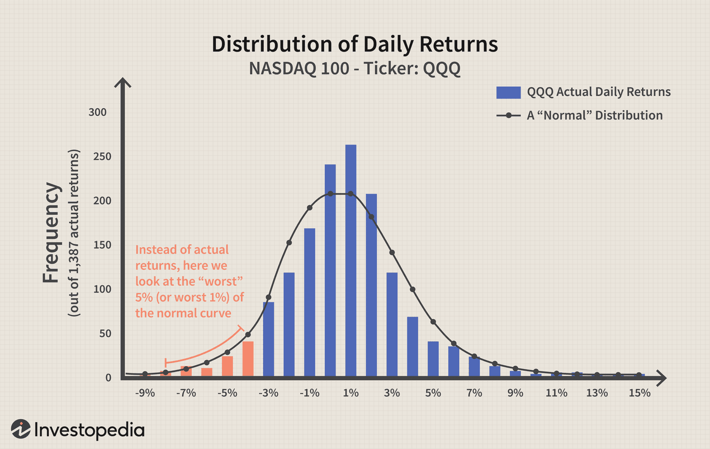

Algorithmic trading has transformed the landscape of financial markets through the use of intricate algorithms to execute trading strategies with precision and speed. By leveraging computational power and advanced mathematical models, algorithmic trading systems can process vast amounts of market data in real-time, identifying trading opportunities that were previously inaccessible through manual trading methods. 

As algorithmic trading continues to dominate the financial markets, understanding the inherent risks associated with these trading strategies becomes imperative. One of the primary concerns in this domain is the quantification and management of risk exposure. Metrics such as Value at Risk (VaR) and Tail Value at Risk (TVaR) play a pivotal role in this aspect. VaR provides a statistical measure that quantifies the potential for losses in a portfolio over a defined period, given a specific confidence level. It helps traders and risk managers assess the maximum expected loss that could be encountered under normal market conditions. However, its limitation lies in its inability to accurately capture extreme market movements, commonly referred to as "tail risks."



Tail risk refers to the likelihood of rare, significant market events that have the potential to cause substantial financial damage. Traditional VaR models often fall short in accounting for these rare events, potentially leading to an underestimation of the true risk faced by trading strategies during periods of market stress. This is where TVaR, also known as Conditional VaR, offers additional insights by evaluating the expected loss beyond the VaR threshold. TVaR provides a more comprehensive risk assessment by considering the impact and magnitude of losses in the tail end of a loss distribution, which is crucial for the robustness of algorithmic trading systems.

This article endeavors to explore the intricate relationship between VaR, tail risk, and loss distribution within the context of algorithmic trading. By doing so, it highlights the necessity of incorporating advanced risk measures like TVaR to ensure comprehensive risk management in an increasingly complex trading environment.

## Table of Contents

## Understanding Value at Risk (VaR)

Value at Risk (VaR) is a widely used financial metric that estimates the potential loss in the value of a portfolio over a defined time period for a given confidence interval. VaR aims to measure how much a set of investments might lose, with a certain level of confidence, under normal market conditions. For instance, a portfolio with a one-day VaR of $1 million at a 95% confidence level implies that there is a 5% chance that the portfolio will lose more than $1 million in a single day.

Mathematically, VaR can be represented as the quantile of a loss distribution. If $L$ represents the loss of the portfolio, then the VaR at the confidence level $\alpha$ is the smallest number $v$ such that:

$$
P(L > v) \leq 1 - \alpha
$$

Where $\alpha$ is the confidence level, typically set at 95%, 99%, or 99.9%.

The calculation of VaR can be done through several methodologies, including:

1. **Historical Simulation**: This method involves using historical market data to simulate future portfolio value changes. By sorting the historical returns and applying the chosen confidence level, the VaR is determined.

2. **Variance-Covariance Method (Parametric VaR)**: This analytical technique assumes that returns are normally distributed. Using the mean and standard deviation of portfolio returns, VaR can be calculated as:

$$
VaR = Z_{\alpha} \times \sigma \times \sqrt{T}
$$

Here, $Z_{\alpha}$ is the z-score corresponding to the desired confidence level, $\sigma$ is the portfolio's standard deviation, and $T$ is the time horizon.

3. **Monte Carlo Simulation**: This method uses random sampling and statistical modeling to account for potential future scenarios by simulating numerous possible outcomes for the portfolio value at the end of the period.

Despite its widespread use, VaR has considerable limitations. Primarily, VaR does not provide any information beyond the specified confidence level. It gives no insight into the scale of losses that could occur beyond this threshold, which is crucial for understanding extreme market conditions, known as "tail risks". VaR also assumes normal market conditions, which may not account for events like financial crises where market behavior deviates significantly from the norm.

Given these limitations, VaR should not be used in isolation but rather as part of a comprehensive risk management framework that also considers other metrics and qualitative information to understand and mitigate financial risks effectively.

## Importance of Tail Risk in Financial Markets

Tail risk refers to the likelihood of rare events that can lead to substantial financial losses. These events, often described as "black swan" events, occur in the extreme ends of a probability distribution's tail. In financial markets, tail risk presents a significant challenge due to the potential for drastic and unexpected market movements.

Traditional Value at Risk (VaR) models are commonly used to estimate the maximum potential loss over a specified period at a given confidence level. However, they are typically based on the assumption of normal market conditions and often leverage past market data to predict future risks. This can result in an underestimation of risks associated with extreme events, as VaR models focus primarily on the center of the probability distribution and neglect the less frequent, severe outcomes that reside in the tails.

Mathematically, VaR at a confidence level $\alpha$ is defined as the threshold value such that the probability that the loss $L$ exceeds this value is $1-\alpha$. Specifically, for a loss distribution function $F$, the VaR is given by:

$$
\text{VaR}_\alpha = \inf \{ x \in \mathbb{R} : F(x) \geq \alpha \}
$$

However, this measure does not account for the magnitude of losses that exceed the VaR threshold, highlighting its limitation in capturing tail risk.

Understanding and managing tail risk is particularly crucial in [algorithmic trading](/wiki/algorithmic-trading), where automated strategies execute trades based on predefined criteria. These strategies can exacerbate losses during extreme market events if tail risks are not adequately addressed. For instance, during market crises, algorithmic trading systems may react to price signals without considering the broader context, potentially triggering a cascade of sell-offs and amplifying losses.

To mitigate tail risk, traders and risk managers must employ more comprehensive risk management techniques beyond traditional VaR models. This includes using metrics such as Tail Value at Risk (TVaR), also known as Conditional VaR, which evaluates the expected loss in the tail of the loss distribution beyond the VaR threshold, providing a more nuanced understanding of the potential severity of tail events.

By incorporating these advanced risk management strategies, algorithmic trading systems can enhance their resilience to extreme market conditions, safeguarding portfolios against catastrophic financial losses. As financial markets continue to evolve, the importance of addressing tail risk effectively becomes increasingly critical to maintaining stability and achieving sustainable returns.

## Tail Value at Risk (TVaR): A Deeper Insight

Tail Value at Risk (TVaR), also known as Conditional Value at Risk (CVaR), is an advanced risk assessment measure focused on the expected loss occurring in the tail of a loss distribution, beyond the Value at Risk (VaR) threshold. Unlike VaR, which provides a cutoff point for the worst-case scenario at a specific confidence level, TVaR delves deeper by calculating the average of losses that exceed the VaR mark. This approach offers a more comprehensive understanding of potential financial risk, particularly under extreme market conditions where large losses are possible.

Mathematically, TVaR can be described as follows. Let $X$ represent the portfolio loss, and $\alpha$ the confidence level. If $\text{VaR}_{\alpha}(X)$ is the VaR at the confidence level $\alpha$, then TVaR is defined as:

$$
\text{TVaR}_{\alpha}(X) = \mathbb{E}[X \mid X > \text{VaR}_{\alpha}(X)]
$$

This formula illustrates that TVaR is the expected value of losses given that those losses exceed the VaR, thereby providing an understanding of the severity of extreme losses. By capturing the tail-end risk, TVaR goes beyond what VaR can typically reveal, thus offering meaningful insights into the potential impact of rare but severe losses.

In algorithmic trading, TVaR is critical for refining risk management strategies. By accounting for the magnitude of potential extreme losses, traders and developers can design more robust trading algorithms. These strategies ensure better preparedness for unexpected market fluctuations by accommodating scenarios that traditional VaR might overlook. Such preparedness is crucial in preventing catastrophic losses that could arise from events like market crashes or unprecedented [volatility](/wiki/volatility-trading-strategies) spikes.

Advanced algorithmic trading setups often integrate TVaR into their risk management frameworks to optimize strategies for both returns and risk. By simulating various market conditions and incorporating TVaR, traders can enhance the resilience of their strategies, ensuring longevity and consistent performance across volatile market environments.

Incorporating TVaR requires sophisticated computational techniques and access to quality market data, as it necessitates accurate modeling of the loss distribution. Python, with its robust libraries such as NumPy and SciPy, is frequently employed for these calculations, providing traders with flexible and efficient tools for evaluating TVaR and other related risk measures.

## Loss Distribution in VaR and TVaR

Loss distribution is a fundamental component in the calculation of Value at Risk (VaR) and Tail Value at Risk (TVaR) as it helps quantify the likelihood and consequences of financial losses. Understanding the distribution of potential losses allows traders and risk managers to better anticipate and plan for adverse market movements.

**Value at Risk (VaR)** is typically focused on determining the loss threshold, below which lies a pre-specified percentage of the loss distribution. This threshold, known as the VaR level, indicates the maximum expected loss over a defined period at a given confidence level. Mathematically, if $L$ represents the loss over the period and $\alpha$ is the confidence level, VaR is defined as:

$$
\text{VaR}_\alpha = \inf \{ l \in \mathbb{R} : P(L > l) \leq 1 - \alpha \}
$$

Here, $\text{VaR}_\alpha$ is the loss at which there is a $(1-\alpha)$ probability of exceeding it.

**Tail Value at Risk (TVaR)**, or Conditional VaR, provides a more nuanced understanding by considering the expected losses that occur beyond the VaR threshold. It calculates the average loss given that the loss exceeds the VaR. This makes TVaR a valuable measure for assessing the severity of potential extreme losses. TVaR can be mathematically expressed as:

$$
\text{TVaR}_\alpha = E[L \mid L > \text{VaR}_\alpha]
$$

Both VaR and TVaR rely on accurate modeling of loss distribution to provide meaningful insights. This involves understanding the historical data, determining appropriate statistical models, and considering the distribution's skewness and kurtosis—factors that can significantly impact the estimation of extreme risks.

**Modeling Loss Distribution:**

1. **Data Collection:** Gathering historical return data for the asset or portfolio is the initial step. This data is the foundation for estimating the parameters of the loss distribution.

2. **Choosing the Distribution Model:** Normally distributed models are frequently used due to simplicity, but real-world financial losses often exhibit fat tails and skewness. Alternatives such as the Student's t-distribution or generalized extreme value (GEV) distributions can be more appropriate for capturing tail risk.

3. **Parameter Estimation:** Using statistical techniques, parameters of the chosen distribution model are estimated. Tools such as Maximum Likelihood Estimation (MLE) or the method of moments are common.

4. **Backtesting and Validation:** The model is backtested using out-of-sample data to ensure its predictive accuracy. Calibration adjustments may be required to improve the model's performance against historical extreme events.

Accurate modeling of loss distributions is essential for effective risk management in algorithmic trading. It enables traders to better manage their financial exposure by aligning strategies with the anticipated risks identified through the measurement of VaR and TVaR. In algorithmic trading, this thorough understanding guides the development of resilient trading systems that navigate both regular and turbulent market conditions proficiently.

## Application in Algorithmic Trading

Algorithmic trading strategies leverage Value at Risk (VaR) and Tail Value at Risk (TVaR) to optimize risk-return profiles effectively. These metrics aid in assessing both the regular and extreme changes in market conditions, thereby providing a more comprehensive framework for decision-making.

TVaR, unlike VaR, evaluates the expected loss beyond the VaR threshold, giving a clearer picture of potential extreme losses. This makes it a crucial tool for developers and traders when designing strategies that are robust under extreme market conditions. By understanding the magnitude of potential losses in adverse scenarios, trading algorithms can be built to be more resilient to sudden market fluctuations, reducing the likelihood of catastrophic losses.

In practical applications, VaR and TVaR are integral in [backtesting](/wiki/backtesting) and performance evaluation of trading strategies. Backtesting involves running trading algorithms on historical data to evaluate how they would have performed in the past. By incorporating these risk measures, traders can select and adjust strategies based on their risk-adjusted performance rather than merely returns. For instance, a strategy might yield high returns but could also involve taking excessive risks which VaR or TVaR could reveal.

Consider a simple Python example of calculating VaR and TVaR:

```python
import numpy as np

# Hypothetical portfolio returns
returns = np.random.normal(0.001, 0.02, 1000)

# Calculate VaR at 95% confidence level
VaR_95 = np.percentile(returns, 5)

# Calculate TVaR at 95% confidence level
tail_losses = returns[returns < VaR_95]
TVaR_95 = np.mean(tail_losses)

print(f"VaR at 95% confidence level: {VaR_95}")
print(f"TVaR at 95% confidence level: {TVaR_95}")
```

In this code, we generate a set of hypothetical portfolio returns and compute the VaR and TVaR at a 95% confidence level. While VaR provides a cutoff point for potential losses, TVaR takes it further by averaging those tail losses, thus offering a more detailed risk analysis which can guide optimizing the trading strategies.

Ultimately, the integration of VaR and TVaR in algorithmic trading ensures a balanced approach to risk management, providing a scientific basis for coping with both normal market volatilities and extreme scenarios. Through these metrics, traders are empowered to refine their strategies, aiming for not just profit maximization but also sustained risk management.

## Challenges and Limitations

Calculating Value at Risk (VaR) and Tail Value at Risk (TVaR) in algorithmic trading requires the acceptance of several foundational assumptions, which may not always align with real-world market behavior. One significant assumption in VaR and TVaR calculations is the normality of returns. Financial returns, particularly in the context of volatile market environments, often exhibit skewness and kurtosis, deviating from the normal distribution model. This discrepancy can lead to the inaccurate estimation of risk, as VaR and TVaR may underestimate the probability and impact of extreme events or 'fat tails' in the distribution of returns.

Another critical assumption is consistent volatility, which suggests that past volatility can be relied upon to predict future volatility. However, financial markets can experience abrupt shifts in volatility, influenced by unexpected news or economic events. The assumption of consistent volatility could result in significant underestimation or overestimation of risk, as the models may not adapt swiftly enough to changing market conditions.

The quality of input data and accuracy of underlying models play pivotal roles in calculating VaR and TVaR. Poor data quality, such as inaccurate price feeds or incomplete transaction histories, can result in unreliable risk assessments. In addition, model inaccuracies stem from oversimplified assumptions and insufficient calibration against historical data. For instance, using historical VaR with insufficiently long data sets might not account for rare, yet impactful, financial events.

Despite these challenges, continuously refining risk models and integrating a diverse array of market scenarios can mitigate some of these limitations. For example, employing stress testing methodologies can provide insights into potential vulnerabilities by simulating extreme market conditions. Additionally, the adoption of more sophisticated models, such as those incorporating regimes of varying volatility or utilizing fat-tailed distribution models, can enhance the robustness of risk assessments.

A practical approach to overcoming these challenges is by implementing algorithmic solutions that can dynamically adjust to evolving market data. Here is a simple Python example to illustrate a historical VaR calculation:

```python
import numpy as np

def historical_var(returns, confidence_level=0.95):
    '''
    Calculate the historical Value at Risk (VaR).

    Parameters:
    returns (list or np.array): Historical returns of the portfolio.
    confidence_level (float): The confidence level for VaR, default is 0.95.

    Returns:
    float: The VaR estimate at the specified confidence level.
    '''
    sorted_returns = np.sort(returns)
    index = int((1 - confidence_level) * len(sorted_returns))
    return abs(sorted_returns[index])

# Example usage:
historical_returns = [-0.02, -0.05, 0.01, 0.03, -0.01, ..., -0.04]  # Insert historical return data here
var_95 = historical_var(historical_returns)
print(f"Historical VaR at 95% confidence level: {var_95:.2%}")
```

This approach calculates historical VaR by sorting past returns and finding the quantile corresponding to the chosen confidence level. By feeding it with a diverse array of return scenarios, traders can improve their risk estimates. In summary, addressing the limitations of VaR and TVaR in algorithmic trading involves adopting a more holistic approach to model assumptions and data quality, coupled with continual refinement and scenario testing.

## Conclusion

To ensure successful algorithmic trading, it is crucial to grasp and manage financial risk effectively. Value at Risk (VaR) and Tail Value at Risk (TVaR) are essential metrics that offer significant insights into potential losses under different market conditions. Though both measures are indispensable, they should not be the sole tools relied upon for risk management due to their inherent limitations, such as assumptions about market conditions and distributions.

VaR provides a threshold that estimates the maximum expected loss at a given confidence level within a specific time frame, while TVaR offers a deeper understanding of potential losses beyond this threshold, targeting the tail of the loss distribution. This makes TVaR particularly useful in addressing extreme market scenarios and enhancing the resilience of trading strategies. However, for comprehensive protection, VaR and TVaR need to be combined with other sophisticated risk management tools.

As algorithmic trading continues to evolve and face increasingly complex market dynamics, the integration of advanced risk measures becomes vital. Tools such as stress testing, scenario analysis, and [machine learning](/wiki/machine-learning) can offer further layers of insight and protection. Utilizing these alongside VaR and TVaR allows for a more robust framework that can better anticipate and mitigate unexpected financial risks. The continuous refinement and adaptation of these combined methodologies will play a crucial role in navigating the challenges of modern financial markets.

## References & Further Reading

[1]: Jorion, P. (2007). ["Value at Risk: The New Benchmark for Managing Financial Risk."](https://link.springer.com/article/10.1007/s11408-007-0057-3) McGraw-Hill Education.

[2]: Artzner, P., Delbaen, F., Eber, J. M., & Heath, D. (1999). ["Coherent Measures of Risk."](https://onlinelibrary.wiley.com/doi/abs/10.1111/1467-9965.00068) Mathematical Finance, 9(3), 203-228.

[3]: McNeil, A. J., Frey, R., & Embrechts, P. (2015). ["Quantitative Risk Management: Concepts, Techniques, and Tools."](https://www.researchgate.net/publication/235622467_Quantitative_Risk_Management_Concepts_Techniques_and_Tools) Princeton University Press.

[4]: Hull, J. C. (2018). ["Risk Management and Financial Institutions."](https://books.google.com/books/about/Risk_Management_and_Financial_Institutio.html?id=1J1QDwAAQBAJ) Wiley.

[5]: Taleb, N. N. (2010). ["The Black Swan: The Impact of the Highly Improbable."](https://www.jstor.org/stable/23045073) Random House Trade Paperbacks.

[6]: Alexander, C. (2009). ["Market Risk Analysis, Volume IV: Value at Risk Models."](https://pdfs.semanticscholar.org/afba/364297b19e15f646f9964a7f319225984fe9.pdf) Wiley.