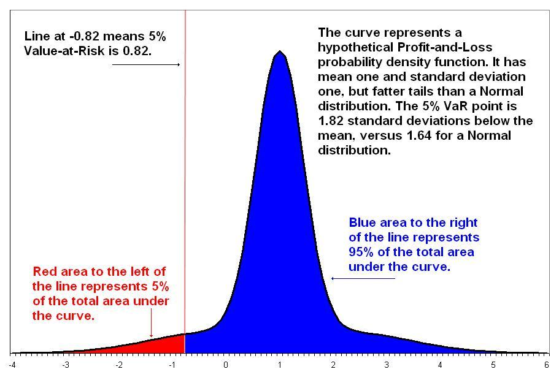

## Table of Contents

## What is Value at Risk (VaR)?

Value at Risk, or VaR, is a way to measure how much money you might lose from an investment over a certain period of time. It tells you the maximum amount you could lose, with a certain level of confidence, usually 95% or 99%. For example, if you have a $100,000 investment and the VaR is $5,000 at a 95% confidence level, it means that there's a 5% chance you could lose more than $5,000 in a given time frame.

VaR is used by banks, investment firms, and other financial institutions to manage risk. It helps them understand the potential losses they might face and plan accordingly. However, VaR is not perfect. It doesn't predict the worst-case scenario, and it assumes that past market behavior will continue into the future, which isn't always true. Despite these limitations, VaR remains a popular tool because it gives a simple way to summarize risk.

## Why is VaR important in financial risk management?

VaR is important in financial risk management because it gives a clear number to how much money might be lost. This helps banks and other financial companies know how much risk they are taking. By knowing the VaR, they can make better decisions about their investments and how much money they should keep in reserve. It's like a safety net that helps them prepare for bad times.

Even though VaR is not perfect, it is still very useful. It's a simple way to understand risk that everyone in a company can use. This makes it easier for managers to talk about risk and make plans to reduce it. VaR helps keep the financial system stable by making sure companies are ready for potential losses.

## How is VaR calculated?

VaR can be calculated in different ways, but one common method is the historical simulation method. This method looks at what happened in the past to guess what might happen in the future. You take the historical data of your investment's returns, sort them from worst to best, and then find the point where 5% or 1% of the returns are worse. That point is your VaR. For example, if you are using a 95% confidence level, you find the return that is worse than 5% of all the returns in your data. That return, when applied to your current investment, gives you the VaR.

Another way to calculate VaR is the variance-covariance method, which is also called the parametric method. This method uses math formulas to guess future returns. It assumes that the returns follow a normal distribution, which means they form a bell-shaped curve. You need to know the average return and the standard deviation of the returns. Then, you use these numbers in a formula to find the VaR. For a 95% confidence level, you would use a value from the normal distribution that cuts off the worst 5% of outcomes. This method is quicker than the historical simulation but relies on the assumption that returns are normally distributed, which is not always true in real life.

## What are the different methods to compute VaR?

There are three main ways to compute VaR: the historical simulation method, the variance-covariance method, and the Monte Carlo simulation method. The historical simulation method looks at what happened in the past to guess what might happen in the future. You take the historical data of your investment's returns, sort them from worst to best, and then find the point where 5% or 1% of the returns are worse. That point is your VaR. For example, if you are using a 95% confidence level, you find the return that is worse than 5% of all the returns in your data. That return, when applied to your current investment, gives you the VaR.

The variance-covariance method, also known as the parametric method, uses math formulas to guess future returns. It assumes that the returns follow a normal distribution, which means they form a bell-shaped curve. You need to know the average return and the standard deviation of the returns. Then, you use these numbers in a formula to find the VaR. For a 95% confidence level, you would use a value from the normal distribution that cuts off the worst 5% of outcomes. This method is quicker than the historical simulation but relies on the assumption that returns are normally distributed, which is not always true in real life.

The Monte Carlo simulation method is another way to calculate VaR. This method uses random numbers to simulate many possible future outcomes for your investment. Each simulation gives you a different possible return, and after running many simulations, you can see all the possible outcomes. You then find the return that is worse than 5% or 1% of all the simulated returns, depending on your confidence level. This method is very flexible and can handle complex investments, but it can be time-consuming because it requires a lot of simulations.

## Can you explain the Variance-Covariance method for VaR?

The Variance-Covariance method, also known as the parametric method, is a way to calculate Value at Risk (VaR) using math formulas. It assumes that the returns of your investment follow a normal distribution, which means they make a bell-shaped curve. To use this method, you need to know two things about your investment's past returns: the average return and the standard deviation, which shows how much the returns vary. Once you have these numbers, you can plug them into a formula to find the VaR. For a 95% confidence level, you use a value from the normal distribution that cuts off the worst 5% of outcomes.

This method is quick and easy to use once you have the right numbers. It's great for simple investments where returns do follow a normal distribution. However, it has a big downside: it assumes that returns are always normally distributed, which is not always true in real life. If your investment's returns don't fit the normal distribution, the VaR you calculate might not be accurate. Despite this, the Variance-Covariance method is still widely used because it gives a simple way to estimate risk.

## How does the Historical Simulation method work for VaR?

The Historical Simulation method for calculating Value at Risk (VaR) looks at what happened in the past to guess what might happen in the future. You start by gathering historical data on the returns of your investment. Then, you sort these returns from the worst to the best. If you want to calculate VaR at a 95% confidence level, you find the return that is worse than 5% of all the returns in your data. This return, when applied to your current investment, gives you the VaR. For example, if your investment is $100,000 and the return at the 5th percentile is -5%, then your VaR would be $5,000. This means there's a 5% chance you could lose more than $5,000 over the time period you're looking at.

This method is easy to understand because it uses real data from the past. It doesn't make assumptions about how returns are distributed, so it can handle investments that don't follow a normal pattern. However, it assumes that the future will be similar to the past, which might not always be true. If the market changes a lot, the historical data might not be a good guide for what could happen next. Despite this, the Historical Simulation method is popular because it's straightforward and gives a clear picture of potential losses based on what has actually happened before.

## What is the Monte Carlo Simulation approach to VaR?

The Monte Carlo Simulation approach to calculating Value at Risk (VaR) uses random numbers to guess what might happen in the future. You start by making a computer model of your investment. This model uses random numbers to simulate many different possible future outcomes. Each simulation gives you a different possible return for your investment. After running many simulations, you can see all the possible outcomes. To find the VaR, you look at the returns from all the simulations and find the one that is worse than 5% or 1% of them, depending on your confidence level.

This method is very flexible because it can handle complex investments that might not fit simple patterns. It's good for situations where the future might be very different from the past. However, it can take a long time to run all the simulations, and you need a good computer model to make sure the results are accurate. Even though it's more complicated and time-consuming, the Monte Carlo Simulation is a powerful tool for understanding the risk of losing money in different scenarios.

## What are the limitations and criticisms of VaR?

Value at Risk (VaR) has some limitations and people often criticize it. One big problem is that VaR only tells you the worst loss you might face with a certain confidence level, like 95% or 99%. It doesn't tell you how bad things could get if that worst loss happens. This means you might not be ready for really bad situations. Another issue is that VaR assumes the future will be like the past. But markets can change a lot, so using old data might not help you predict what will happen next. Also, VaR can be hard to calculate for complex investments, and different methods might give you different answers, which can be confusing.

Another criticism is that VaR can make people feel too safe. If you think you know the maximum you could lose, you might take more risks than you should. This is called the "VaR illusion." People also argue that VaR focuses too much on normal times and doesn't prepare you well for big shocks or crises. For example, during the 2008 financial crisis, many banks found their VaR estimates were way off because the market behaved in ways they hadn't seen before. So, while VaR is a useful tool, it's important to use it carefully and not rely on it too much.

## How does VaR relate to other risk measures like Expected Shortfall?

Value at Risk (VaR) and Expected Shortfall (ES) are both used to measure the risk of losing money in investments, but they look at risk in different ways. VaR tells you the maximum amount you could lose over a certain time with a certain level of confidence, like 95% or 99%. For example, if your VaR is $5,000 at a 95% confidence level, there's a 5% chance you could lose more than $5,000. VaR is good because it gives you a clear number to work with, but it doesn't tell you what could happen if things go really bad beyond that number.

Expected Shortfall, also called Conditional VaR, goes a step further than VaR. It doesn't just tell you the worst loss you might face; it also tells you the average loss you could expect if you go beyond the VaR number. So, if your VaR is $5,000 at a 95% confidence level, the Expected Shortfall would tell you the average loss in the worst 5% of cases. This makes ES a more complete measure of risk because it gives you an idea of how bad things could get in the worst situations, which is something VaR doesn't do.

## What are some practical examples of VaR in financial institutions?

Banks use VaR to figure out how much money they might lose in their trading activities. For example, a bank might calculate the VaR for its stock portfolio to know the maximum amount it could lose over a day with a 99% confidence level. If the VaR is $1 million, the bank knows there's a 1% chance it could lose more than $1 million in a single day. This helps the bank decide how much money to keep in reserve to cover potential losses and how much risk it's willing to take on.

Investment firms also use VaR to manage the risk of their clients' portfolios. For instance, an investment firm might tell a client that the VaR for their investment is $10,000 at a 95% confidence level over a month. This means there's a 5% chance the client could lose more than $10,000 in a month. By knowing this, the client and the firm can make better decisions about how to invest the money and what risks to take. It helps them plan and prepare for possible losses, making their financial strategies more stable and secure.

## How can VaR be used in portfolio management?

In portfolio management, VaR helps managers understand how much money they might lose from their investments over a certain time. For example, if a manager calculates that the VaR for a portfolio is $50,000 at a 95% confidence level over a month, it means there's a 5% chance the portfolio could lose more than $50,000 in that month. This information is very useful because it helps the manager decide how much risk to take. They can use VaR to compare different investments and choose the ones that fit their risk level. It also helps them know how much money to keep aside to cover potential losses, making sure the portfolio stays safe even if the market goes down.

VaR is also helpful when managers are talking to their clients about risk. If a client wants to know how risky their investments are, the manager can use VaR to explain it in a simple way. For instance, they might say, "There's a 5% chance you could lose more than $10,000 in a month." This clear number helps the client understand the risk and make better decisions about their investments. By using VaR, managers can keep their clients informed and help them feel more comfortable with their investment choices, even when the market is unpredictable.

## What advanced techniques can be applied to enhance VaR models?

One way to make VaR models better is by using something called stress testing. Stress testing looks at what might happen if the market goes through really bad times, like a big financial crisis. By doing this, you can see how your investments might do in the worst situations, which VaR alone might not show you. Another advanced technique is to use more complex math models, like those that don't assume returns are normally distributed. These models can handle the ups and downs of the market better and give a more accurate picture of risk.

You can also improve VaR by using more data and better technology. For example, machine learning can help by finding patterns in big sets of data that normal methods might miss. This can make your VaR predictions more accurate. Another way is to use real-time data to update your VaR calculations more often. This keeps your risk measures current with what's happening in the market, making them more useful for making quick decisions.

## What is Understanding Value at Risk (VaR)?

Value at Risk (VaR) is a statistical measure widely utilized in finance to quantify the potential risk of loss in an investment portfolio. Specifically, VaR provides an estimate of the maximum expected loss over a specific time frame at a given confidence level. This makes VaR a key tool for investors and risk managers in evaluating the potential risks associated with their investment strategies.

Formally, VaR can be defined as the threshold value $L$ such that the probability that the loss over the given time period exceeds $L$ is equal to the complement of the confidence level. Mathematically, if $X$ represents the portfolio's loss, and assuming a confidence level of $\alpha$, VaR is determined by the equation:

$$
P(X > \text{VaR}_{\alpha}) = 1 - \alpha
$$

For example, if a portfolio has a 1-day VaR of $1 million at a 95% confidence level, it means there is a 5% chance that the portfolio will lose more than $1 million in a single day.

Despite its usefulness, VaR does not specify the extent of losses beyond the VaR threshold. To address this limitation, financial analysts often use complementary measures such as Conditional Value at Risk (CVaR), also known as Expected Shortfall. CVaR provides the expected loss exceeding VaR, offering a more comprehensive view of tail risk. Schematically, if VaR tells us the worst expected loss under normal circumstances, CVaR informs us about the expected loss if that worst-case line is crossed.

Calculating VaR typically involves historical data analysis or statistical modeling to forecast potential losses. The accuracy of these calculations directly impacts the effectiveness of risk management decisions, underscoring the importance of choosing appropriate models and assumptions, especially in volatile markets.

Here is a simple example in Python to calculate VaR using the Historical method:

```python
import numpy as np

# Sample portfolio losses (daily returns)
portfolio_losses = np.array([-0.02, -0.03, 0.01, -0.05, 0.03, -0.01, -0.03, 0.02])

# Confidence level
confidence_level = 0.95

# Calculate VaR
VaR = np.percentile(portfolio_losses, (1 - confidence_level) * 100)

print(f"Value at Risk (VaR) at {confidence_level*100}% confidence level is {VaR:.2f}")
```

This code snippet calculates the VaR using historical returns data for a given confidence level. Such a calculation helps in understanding potential loss under historical distribution assumptions but should be used with consideration of market conditions and portfolio characteristics to ensure accurate risk assessments.

## What are the methods for calculating VaR?

Value at Risk (VaR) can be calculated using several methodologies, each with its assumptions and applications. Three primary methods include the Variance-Covariance method, Historical Simulation, and Monte Carlo Simulation.

**Variance-Covariance Method:** This method, often referred to as the parametric approach, assumes that returns are normally distributed and that the relationship between the variables remains constant over time. The approach is straightforward, making it computationally efficient. To calculate VaR using this method, the formula is:

$$
\text{VaR} = Z \cdot \sigma \cdot \sqrt{t}
$$

where $Z$ represents the Z-score corresponding to the desired confidence level, $\sigma$ is the standard deviation of the portfolio returns, and $t$ is the time period over which VaR is calculated. While this method is simple and quick, its reliance on normal distribution assumptions can lead to underestimation of risk in highly volatile or non-normally distributed markets.

**Historical Simulation:** This non-parametric approach involves using actual historical returns to simulate potential outcomes. By rearranging historical returns in order of magnitude and selecting the appropriate percentile for the confidence level, this method captures real market distributions, making it effective in identifying non-normal patterns. For instance, if a 95% confidence level is required, the VaR is the 5th percentile of the historical return distribution. This approach is highly attractive because it does not assume a specific distribution; however, its accuracy is contingent on the historical data relevance.

**Monte Carlo Simulation:** The Monte Carlo method is a robust and flexible simulation technique that uses random sampling to generate and analyze a wide array of hypothetical scenarios. It involves making random draws from assumed probability distributions for the risk factors affecting the portfolio, running numerous trials to simulate various possible investment landscapes. A Python implementation might look like the following:

```python
import numpy as np

def monte_carlo_var(initial_value, num_simulations, time_horizon, mu, sigma, confidence_level):
    # Simulate returns
    simulated_returns = np.random.normal(mu, sigma, (num_simulations, time_horizon))
    # Simulate portfolio values
    portfolio_values = initial_value * np.exp(simulated_returns.cumsum(axis=1))
    # Calculate losses
    losses = initial_value - portfolio_values[:,-1]
    # Calculate VaR
    var_value = np.percentile(losses, (1 - confidence_level) * 100)
    return var_value

# Example usage
initial_value = 1000000
num_simulations = 10000
time_horizon = 1
mu = 0.05
sigma = 0.2
confidence_level = 0.95

var = monte_carlo_var(initial_value, num_simulations, time_horizon, mu, sigma, confidence_level)
print(f"Monte Carlo VaR: {var}")
```

Monte Carlo Simulation requires substantial computational resources due to its iterative nature, yet it excels in capturing complex risk structures and is highly adaptable to varying asset dynamics and correlations within a portfolio.

Each method of VaR calculation has its advantages and challenges. In practice, the choice largely depends on the specific portfolio characteristics and the degree of model sophistication available to the institution.

## References & Further Reading

- Jorion, P. (2007). *Value at Risk: The New Benchmark for Managing Financial Risk*. McGraw-Hill Education. This book offers a comprehensive guide on Value at Risk, presenting VaR as a critical tool for managing financial risk and providing elucidation on its methodologies and applications.

- Basel Committee on Banking Supervision. *Amendment to the Capital Accord to incorporate market risks*. Bank for International Settlements. This document includes essential regulatory perspectives on market risks and the implementation of VaR in institutional risk management practices.

- Glasserman, P. (2004). *Monte Carlo Methods in Financial Engineering*. Springer. This reference provides an in-depth exploration of Monte Carlo simulations as an effective technique for estimating VaR, particularly suited for complex portfolio structures.

- Lowenstein, R. (2000). *When Genius Failed: The Rise and Fall of Long-Term Capital Management*. Random House. While primarily a historical account, this book offers insights into risk management failures, underscoring the importance of robust VaR models in financial stability.

