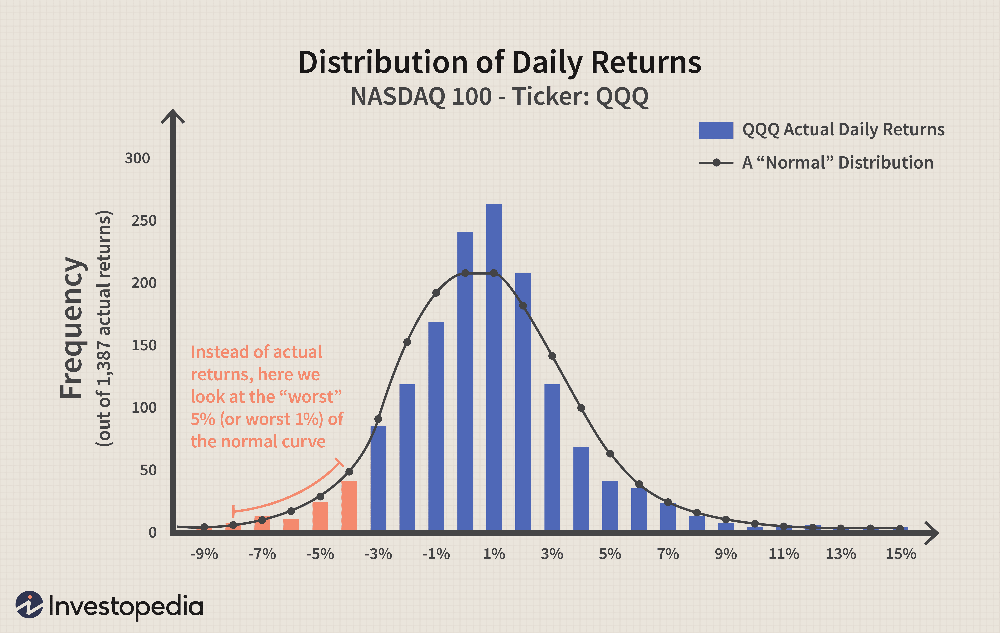

In today's fast-paced financial markets, effective risk management is crucial for traders and investors. Among the tools used for mitigating financial risk, Value at Risk (VaR) has emerged as a significant measure, particularly within the sphere of algorithmic trading. VaR assists investors and traders in understanding and quantifying the potential for loss in a portfolio. It does this by specifying a confidence level over a given time frame, thereby offering a statistical forecast of the maximum expected loss. As algorithmic trading systems automatically execute trades based on pre-set rules or algorithms, managing risk efficiently is paramount for their sustainability and profitability.

Algorithmic trading, characterized by speed and precision, is inherently risk-laden due to the volatile nature of financial markets. VaR plays a critical role in these systems by providing a quantifiable risk measure, enabling traders to assess and limit potential losses. This statistical tool allows for the formulation of strategies that are robust under various market conditions, thus enhancing the overall performance and resilience of trading algorithms.



As the financial industry continues to evolve with technological advancements, the integration of VaR into financial risk management frameworks, particularly algorithmic trading, becomes increasingly vital. This article focuses on how VaR is implemented to manage financial risks and optimize algorithmic trading systems. It investigates into methodologies for calculating VaR, its application in setting risk limits, and strategies to enhance predictive accuracy. The discussion will also touch upon advanced techniques and ongoing developments in VaR, underscoring its enduring importance in maintaining financial stability.

## Table of Contents

## Understanding Value at Risk (VaR)

Value at Risk (VaR) is a statistical measure widely utilized in finance to quantify the potential risk of loss in an investment portfolio. Specifically, VaR provides an estimate of the maximum expected loss over a specific time frame at a given confidence level. This makes VaR a key tool for investors and risk managers in evaluating the potential risks associated with their investment strategies.

Formally, VaR can be defined as the threshold value $L$ such that the probability that the loss over the given time period exceeds $L$ is equal to the complement of the confidence level. Mathematically, if $X$ represents the portfolio's loss, and assuming a confidence level of $\alpha$, VaR is determined by the equation:

$$
P(X > \text{VaR}_{\alpha}) = 1 - \alpha
$$

For example, if a portfolio has a 1-day VaR of $1 million at a 95% confidence level, it means there is a 5% chance that the portfolio will lose more than $1 million in a single day.

Despite its usefulness, VaR does not specify the extent of losses beyond the VaR threshold. To address this limitation, financial analysts often use complementary measures such as Conditional Value at Risk (CVaR), also known as Expected Shortfall. CVaR provides the expected loss exceeding VaR, offering a more comprehensive view of tail risk. Schematically, if VaR tells us the worst expected loss under normal circumstances, CVaR informs us about the expected loss if that worst-case line is crossed.

Calculating VaR typically involves historical data analysis or statistical modeling to forecast potential losses. The accuracy of these calculations directly impacts the effectiveness of risk management decisions, underscoring the importance of choosing appropriate models and assumptions, especially in volatile markets.

Here is a simple example in Python to calculate VaR using the Historical method:

```python
import numpy as np

# Sample portfolio losses (daily returns)
portfolio_losses = np.array([-0.02, -0.03, 0.01, -0.05, 0.03, -0.01, -0.03, 0.02])

# Confidence level
confidence_level = 0.95

# Calculate VaR
VaR = np.percentile(portfolio_losses, (1 - confidence_level) * 100)

print(f"Value at Risk (VaR) at {confidence_level*100}% confidence level is {VaR:.2f}")
```

This code snippet calculates the VaR using historical returns data for a given confidence level. Such a calculation helps in understanding potential loss under historical distribution assumptions but should be used with consideration of market conditions and portfolio characteristics to ensure accurate risk assessments.

## The Role of VaR in Risk Management

Value at Risk (VaR) serves as a fundamental component in financial risk management by providing a quantifiable metric for potential financial losses within a portfolio over a specified period at a given confidence level. By quantifying potential losses, VaR allows financial institutions and investors to set informed risk limits and develop strategic risk management approaches that align with their objectives and risk appetite.

A key aspect of employing VaR in portfolio management is its role in defining risk limits. Institutions use VaR to determine the maximum expected loss they are willing to absorb under normal market conditions for a set period. This information guides decisions on asset allocations and hedging strategies, striving to optimize returns while adhering to the established risk thresholds. For example, a portfolio manager might set a VaR limit of 5% at a 95% confidence level, meaning there is a 5% chance that the portfolio could lose more than the specified VaR amount over the given time frame. This quantitative insight enables managers to adjust portfolios proactively, balancing potential gains against acceptable risks.

The influence of VaR extends beyond internal portfolio management and into regulatory compliance. Regulatory bodies, such as the Basel Committee on Banking Supervision, mandate financial institutions to report VaR as part of their market risk assessments. These requirements are integral to ensuring that institutions maintain sufficient capital reserves to manage potential market-induced losses, promoting stability within the financial system. By standardizing VaR reporting, regulators can benchmark firms against one another, assessing the systemic risk posed by institutions and ensuring that risk management practices meet industry standards.

The broad acceptance and implementation of VaR by regulators highlight its importance within financial risk management frameworks. Despite its limitations, such as assuming normal market conditions and not accounting for extreme events, VaR remains indispensable due to its versatility and ability to integrate with other risk assessment tools. Institutions continually refine their VaR models, incorporating stress testing and scenario analysis to complement VaR's insights and provide a more comprehensive view of potential risks. Through strategic application and ongoing enhancement, VaR maintains its critical role in safeguarding financial stability and informing prudent investment decision-making.

## VaR Calculation Methods

Value at Risk (VaR) can be calculated using several methodologies, each with its assumptions and applications. Three primary methods include the Variance-Covariance method, Historical Simulation, and Monte Carlo Simulation.

**Variance-Covariance Method:** This method, often referred to as the parametric approach, assumes that returns are normally distributed and that the relationship between the variables remains constant over time. The approach is straightforward, making it computationally efficient. To calculate VaR using this method, the formula is:

$$
\text{VaR} = Z \cdot \sigma \cdot \sqrt{t}
$$

where $Z$ represents the Z-score corresponding to the desired confidence level, $\sigma$ is the standard deviation of the portfolio returns, and $t$ is the time period over which VaR is calculated. While this method is simple and quick, its reliance on normal distribution assumptions can lead to underestimation of risk in highly volatile or non-normally distributed markets.

**Historical Simulation:** This non-parametric approach involves using actual historical returns to simulate potential outcomes. By rearranging historical returns in order of magnitude and selecting the appropriate percentile for the confidence level, this method captures real market distributions, making it effective in identifying non-normal patterns. For instance, if a 95% confidence level is required, the VaR is the 5th percentile of the historical return distribution. This approach is highly attractive because it does not assume a specific distribution; however, its accuracy is contingent on the historical data relevance.

**Monte Carlo Simulation:** The Monte Carlo method is a robust and flexible simulation technique that uses random sampling to generate and analyze a wide array of hypothetical scenarios. It involves making random draws from assumed probability distributions for the risk factors affecting the portfolio, running numerous trials to simulate various possible investment landscapes. A Python implementation might look like the following:

```python
import numpy as np

def monte_carlo_var(initial_value, num_simulations, time_horizon, mu, sigma, confidence_level):
    # Simulate returns
    simulated_returns = np.random.normal(mu, sigma, (num_simulations, time_horizon))
    # Simulate portfolio values
    portfolio_values = initial_value * np.exp(simulated_returns.cumsum(axis=1))
    # Calculate losses
    losses = initial_value - portfolio_values[:,-1]
    # Calculate VaR
    var_value = np.percentile(losses, (1 - confidence_level) * 100)
    return var_value

# Example usage
initial_value = 1000000
num_simulations = 10000
time_horizon = 1
mu = 0.05
sigma = 0.2
confidence_level = 0.95

var = monte_carlo_var(initial_value, num_simulations, time_horizon, mu, sigma, confidence_level)
print(f"Monte Carlo VaR: {var}")
```

Monte Carlo Simulation requires substantial computational resources due to its iterative nature, yet it excels in capturing complex risk structures and is highly adaptable to varying asset dynamics and correlations within a portfolio.

Each method of VaR calculation has its advantages and challenges. In practice, the choice largely depends on the specific portfolio characteristics and the degree of model sophistication available to the institution.

## Integrating VaR into Algo Trading

Algorithmic trading systems incorporate Value at Risk (VaR) to effectively manage and estimate the risk associated with executing automated trading strategies. In these systems, VaR serves as a key metric to quantify potential losses, allowing traders to understand the risk exposure of their algorithms under varying market conditions.

A significant challenge in [algorithmic trading](/wiki/algorithmic-trading) is the calculation of VaR for portfolios composed of multiple assets. The [volatility](/wiki/volatility-trading-strategies) and correlation among different assets can fluctuate substantially, complicating the task of accurately assessing risk. For instance, computing the VaR for a multi-asset portfolio might involve assessing the historical price movements of each asset and factoring in their interdependencies. The complexity increases further when a trading system needs to adapt to dynamic changes in market conditions, requiring real-time updates to the risk estimates.

To compute VaR efficiently in an algorithmic setting, traders often rely on sophisticated quantitative models such as Monte Carlo simulations or Historical Simulation methods. Monte Carlo simulations are particularly effective as they allow traders to model numerous potential future states of the market by generating a large number of random price paths. Historical Simulation, on the other hand, uses actual past market data to infer potential future losses, capturing unusual market movements that might occur again.

Backtesting these VaR models is critical to ensure the reliability of the risk assessments and to refine the trading algorithms accordingly. Backtesting involves comparing the predicted VaR with actual trading outcomes over historical data to evaluate the performance of the risk models. This validation step helps in fine-tuning the parameters used in the algorithmic trading strategy, enhancing its robustness and accuracy.

An example of defining a [backtesting](/wiki/backtesting) function in Python might involve comparing the predicted VaR against actual losses:

```python
import numpy as np

def backtest_var(predicted_var, actual_losses, confidence_level):
    hits = (actual_losses > predicted_var).sum()
    total_observations = len(predicted_var)
    expected_hits = (1 - confidence_level) * total_observations
    return hits, expected_hits

# Example usage
predicted_var = np.array([100, 150, 120, 130])  # hypothetical VaR values
actual_losses = np.array([80, 200, 90, 140])    # actual losses realized
confidence_level = 0.95                          # 95% confidence level

hits, expected_hits = backtest_var(predicted_var, actual_losses, confidence_level)
print(f"Actual Hits: {hits}, Expected Hits: {expected_hits}")
```

In this example, a trader would validate the effectiveness of a VaR model by checking how often actual losses exceed predicted VaR, compared to the expectations set by the confidence level. Such assessments are crucial for continuously improving the risk management framework of algorithmic trading systems and ensuring their resilience in unpredictable markets.

## Advanced Techniques and Future of VaR

The evolution of financial markets and repeated crises have necessitated the development of advanced methodologies such as stressed Value at Risk (stressed VaR). This variant augments the traditional VaR model to specifically account for extreme market conditions by incorporating historical market stress events into risk calculations. Stressed VaR is particularly insightful during periods of high volatility, as it provides a clearer estimate of potential losses under adverse conditions, thereby refining the robustness of risk assessments.

Future advancements in VaR are gravitating towards the integration of [machine learning](/wiki/machine-learning) algorithms, which promise to enhance the predictive accuracy of risk models. Leveraging techniques like neural networks, support vector machines, and decision trees, machine learning can identify patterns and adapt to new data trends more efficiently than conventional statistical models. For instance, neural networks can be deployed to model non-linear relationships in financial data, offering an improved estimation of risk factors. Here's an example of how a basic predictive model can be implemented in Python using a [neural network](/wiki/neural-network):

```python
from sklearn.model_selection import train_test_split
from sklearn.neural_network import MLPRegressor
import numpy as np

# Sample financial data with returns and historical VaR values
X = np.array([[...], [...], ...])  # Input features
y = np.array([...])  # Target variable, e.g., future returns

# Split data into training and testing sets
X_train, X_test, y_train, y_test = train_test_split(X, y, test_size=0.2, random_state=42)

# Initialize the neural network model
mlp = MLPRegressor(hidden_layer_sizes=(100,), activation='relu', max_iter=500, random_state=42)

# Train the model on the training data
mlp.fit(X_train, y_train)

# Evaluate the model
score = mlp.score(X_test, y_test)
print(f'Model accuracy: {score:.2f}')
```

This approach not only refines VaR calculations but also dynamically updates models as new market data becomes available, ensuring that risk assessments remain relevant.

The role of VaR in regulatory frameworks is expanding, accentuating the need for continuous innovation and adaptation. Institutions are increasingly required by regulatory bodies, such as the Basel Committee on Banking Supervision, to report not only their standard VaR metrics but also stressed VaR measures. This regulatory demand underscores the growing importance of VaR in maintaining financial stability and compliance with market risk requirements. Consequently, financial institutions must remain agile, continuously adapting their risk management processes to integrate new techniques and adhere to evolving regulations. As the financial landscape advances, so too will the methodologies underpinning VaR, ensuring its ongoing critical role in safeguarding the integrity of financial markets.

## Conclusion

Value at Risk (VaR) remains a foundational tool in risk management, bridging theoretical robustness with practical applications, particularly within algorithmic trading. As financial markets evolve with increasing speed and complexity, the significance of understanding and managing risks becomes paramount. VaR’s ability to provide a quantifiable measure of potential losses over a specific timeframe with a given confidence level offers a critical advantage to traders and financial institutions alike.

Despite its limitations—such as assumptions of market normality and the inability to predict losses beyond the calculated threshold—VaR’s adaptability ensures its continued relevance in today's financial landscape. This adaptability is further enhanced by its integration with complementary metrics, such as Conditional Value at Risk (CVaR), offering a more comprehensive risk assessment framework. By incorporating VaR with other measures, financial professionals can develop nuanced and sensitive risk profiles that account for varied market conditions.

Continuous advancements in technology and quantitative methods promise to enhance VaR’s application further. The incorporation of machine learning models and data analytics can improve the precision and predictive power of VaR methodologies, thereby refining risk assessment processes. Furthermore, the regulatory landscape continues to push for innovation within risk management practices, ensuring that VaR remains an integral part of regulatory compliance and financial stability frameworks.

In summary, as financial trading strategies become increasingly automated, the strategic application of VaR alongside other risk measures will support more sustainable, effective, and resilient trading systems. VaR’s enduring presence in risk management testifies to its utility and potential for growth in mitigating financial risks and fostering stability within volatile markets.

## References & Further Reading

- Jorion, P. (2007). *Value at Risk: The New Benchmark for Managing Financial Risk*. McGraw-Hill Education. This book offers a comprehensive guide on Value at Risk, presenting VaR as a critical tool for managing financial risk and providing elucidation on its methodologies and applications.

- Basel Committee on Banking Supervision. *Amendment to the Capital Accord to incorporate market risks*. Bank for International Settlements. This document includes essential regulatory perspectives on market risks and the implementation of VaR in institutional risk management practices.

- Glasserman, P. (2004). *Monte Carlo Methods in Financial Engineering*. Springer. This reference provides an in-depth exploration of Monte Carlo simulations as an effective technique for estimating VaR, particularly suited for complex portfolio structures.

- Lowenstein, R. (2000). *When Genius Failed: The Rise and Fall of Long-Term Capital Management*. Random House. While primarily a historical account, this book offers insights into risk management failures, underscoring the importance of robust VaR models in financial stability.

