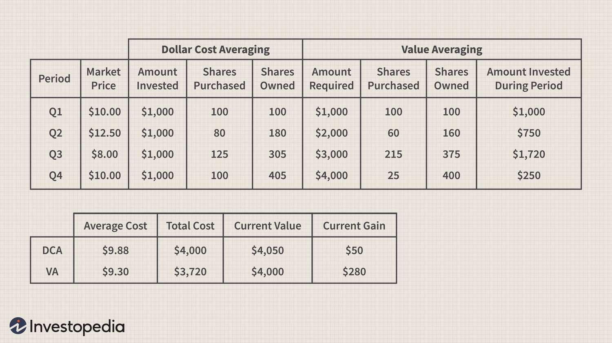

Value investing is a fundamental investment strategy where investors seek stocks that they believe are undervalued by the market. By purchasing these undervalued stocks, investors aim to build a robust investment portfolio that has the potential for long-term capital appreciation. The crux of value investing is the assessment of intrinsic value, which involves evaluating a company's fundamental characteristics, such as earnings, dividends, and growth potential, to ascertain their true worth as opposed to their market price. This method contrasts with growth investing, which focuses on companies expected to grow at an above-average rate.

Value averaging stands out as an investment strategy that aims to systematically capitalize on investment opportunities by adjusting the dollar amount invested over time. Unlike dollar-cost averaging (DCA), which involves investing a fixed amount at regular intervals, value averaging requires the investor to ensure that the total market value of the investment account increases by a predefined amount each period. Consequently, this approach entails buying more shares when prices are low and fewer shares when prices are high, thus automatically taking advantage of market fluctuations and adhering to the value investing principle of "buying low."

Algorithmic trading is a technological advancement in modern finance that employs computer algorithms to automate and execute investment strategies at optimal speeds and efficiency. These algorithms can incorporate complex calculations and statistical models to determine when and how to buy or sell securities. By leveraging algorithmic trading, strategies like value averaging can be executed with precision and discipline, minimizing human error and emotion-driven decisions.

The article's objective is to explore value averaging as an investment strategy in conjunction with algorithmic trading. The focus is on illustrating how algorithmic tools can enhance the practical execution of value averaging, making it accessible and more efficient for investors. Such integration can help investors maintain a disciplined approach to investing, which is crucial for achieving investment goals amidst the dynamic nature of financial markets.

## Table of Contents

## Understanding Value Averaging

Value averaging is an investment strategy designed to take advantage of market fluctuations by adjusting the amount of money invested in a portfolio based on its value, rather than investing a fixed dollar amount. The primary goal of value averaging is to buy more shares when prices are low and fewer when prices are high, thereby minimizing the average cost per share over time and optimizing returns.

The mechanics of value averaging involve setting a target growth rate for the portfolio. Each period—such as monthly or quarterly—the investor calculates the desired total value of the portfolio based on this target. The difference between the current portfolio value and the target value determines the amount to be invested or withdrawn. If the portfolio value is below the target, more money is invested to bring it in line; if the portfolio value exceeds the target, money is withdrawn or less is invested.

For example, let's say an investor wants their portfolio to grow by $1,000 per month. If their portfolio is valued at $9,500 at the end of the month, they would invest an additional $1,500 to bring the portfolio up to the $10,500 target for the following month. Conversely, if the portfolio is already valued at $10,800, the investor would adjust by investing $200 less or withdrawing $300 to meet the target.

Value averaging can be compared with dollar-cost averaging (DCA), a strategy where a fixed dollar amount is regularly invested, regardless of the asset's price. While DCA smooths the impact of [volatility](/wiki/volatility-trading-strategies) and removes emotional decision-making from investing, it doesn't inherently adjust for market conditions. Value averaging, on the other hand, tends to be more aggressive during market downturns and conservative during upswings. This characteristic can result in potentially better performance compared to DCA, especially in volatile markets, although it also requires more active management and greater [liquidity](/wiki/liquidity-risk-premium).

Historical analysis has illustrated the potential benefits of value averaging. One study by Professor Michael Edleson, who popularized the value averaging method in his 1991 book "Value Averaging: The Safe and Easy Strategy for Higher Investment Returns", demonstrated that this strategy often outperformed dollar-cost averaging in turbulent markets, where frequent price fluctuations enable capitalizing on lower price points. The approach leverages the mean reversion characteristic of stock prices in the long term, buying more during low points to maximize future gains.

Though value averaging can offer significant advantages, it also presents challenges. It requires a disciplined approach and the capacity to invest additional funds when markets decline, which may not always be feasible for all investors. Additionally, transaction costs can eat into returns if adjustments are made too frequently. Nonetheless, studies and models incorporating a range of market conditions generally support value averaging as a method capable of enhancing returns over standard dollar-cost averaging, particularly for seasoned investors with ample capital availability and a long-term investment horizon.

## Algorithmic Trading and Its Relevance

Algorithmic trading refers to the use of computer algorithms to automate the process of trading financial securities according to predetermined criteria. These algorithms analyze market data to identify potential trading opportunities, execute orders, and manage positions with greater speed and precision than human traders. With its roots in the early 1970s, [algorithmic trading](/wiki/algorithmic-trading) has evolved considerably, driven by advances in computational power, data analytics, and the growth of electronic trading platforms.

The growing prevalence of algorithmic trading in financial markets is evidenced by its significant proportion of trade volumes on global exchanges. For instance, it accounts for approximately 60-70% of total trading [volume](/wiki/volume-trading-strategy) in the U.S. equity markets. This rise is attributed to the efficiency algorithms bring to trading processes, leading to reduced transaction costs, increased liquidity, and minimized emotional biases in investment decisions.

A key advantage of algorithmic trading is its ability to automate and enhance investment strategies, including those like value averaging. Value averaging aims to maintain a target growth of an investment portfolio by buying more shares when prices are low and fewer when prices are high. Algorithms can execute this strategy by continuously monitoring market conditions and adjusting investments in real-time. This automation ensures that the strategy is implemented consistently and without the psychological biases that may influence human traders.

Technological advancements have been pivotal in enabling algorithmic trading. High-frequency trading systems leverage cutting-edge hardware and software to execute a large number of orders in fractions of a second. Machine learning algorithms analyze vast datasets to improve trade prediction accuracy. Tools such as Python and R provide robust platforms for developing and back-testing trading strategies. Additionally, APIs offered by trading platforms enable seamless integration of algorithms with live market feeds, allowing for precise execution of trades.

Using algorithms is crucial for managing complex investment strategies efficiently. They allow for the handling of large datasets, implementation of sophisticated mathematical models, and rapid adaptation to changing market conditions. By employing algorithms, investors can optimize portfolio returns, manage risks more effectively, and capitalize on fleeting market opportunities. These features make algorithmic trading an indispensable tool in modern finance, complementing strategies like value averaging to enhance their performance and reliability.

## Integrating Value Averaging with Algorithmic Trading

To create an algorithm that supports value averaging, begin by understanding the underlying mechanics of value averaging, which involves setting a target investment value for a portfolio at regular intervals. The algorithm's task is to adjust the investment amounts to ensure that the actual portfolio value aligns with the target value. Here are the steps involved in creating such an algorithm:

1. **Define Investment Parameters**: Establish the initial investment, target growth rate, and investment intervals. For example, if you start with an initial investment of $1,000 and aim for a 10% quarterly growth rate, your target for the next period would be $1,100.

2. **Data Input and Processing**: Input the current value of the portfolio and the price of the asset. The algorithm should be able to access real-time market data or historical data to calculate the required adjustments.

3. **Calculation of Investment Needed**:
$$
   \text{Investment\_Needed} = \text{Target\_Value} - \text{Current\_Value}

$$
   The target value for a given period is calculated based on the desired growth rate and initial investment.

4. **Execution of Trades**: The algorithm executes buy or sell orders based on the calculated investment needed. If the market value is below the target, the algorithm purchases additional shares; if above, it sells shares as necessary.

5. **Monitoring and Adjustment**: Continuously monitor the portfolio and make adjustments at each interval. The algorithm must adapt to changes in market conditions to maintain the desired trajectory.

Algorithms play a crucial role in managing the calculation and execution of investments based on the pre-set criteria of value averaging. By automating these processes, algorithms ensure that the investment strategy is executed consistently without being influenced by emotional biases. The benefits of automation include time efficiency, accuracy in computation, and the ability to handle complex calculations seamlessly.

An example of successful integration of value averaging with algorithmic trading can be seen in quantitative hedge funds, which use sophisticated algorithms to execute investment strategies. For instance, some hedge funds have adopted algorithmic frameworks to automate value-based investment strategies, leading to improved returns and risk management through disciplined portfolio adjustments.

These algorithms constantly evolve using [machine learning](/wiki/machine-learning) and [artificial intelligence](/wiki/ai-artificial-intelligence) to enhance precision and scenario analysis. This integration allows investors to benefit from the systematic and quantitative aspects of trading while harnessing the strategic advantage of value averaging, striving for an optimized investment outcome.

## Challenges and Considerations

Implementing a value averaging investment strategy presents several challenges, especially during market downturns. One of the primary difficulties is ensuring sufficient funding to increase investments when the market declines. Value averaging requires purchasing more assets when prices fall to maintain a predetermined investment growth path. During downturns, this might necessitate significant capital inflows, straining available resources. Investors must carefully consider their liquidity and cash reserves to meet these funding demands without jeopardizing financial stability.

Algorithmic trading, while offering efficiency and precision, is not without risks. Technological failures, such as software bugs or hardware malfunctions, can lead to unintended trading activity and financial losses. Moreover, algorithms can be susceptible to market anomalies that deviate from their programmed logic, potentially exacerbating volatility. There are also ethical considerations, including concerns about market manipulation and the broader impact of high-frequency trading on market stability. 

To mitigate these risks, diversification and regular monitoring of algorithmic performance are crucial. Diversification can reduce the impact of adverse price movements in individual assets. Additionally, continuous monitoring and periodic reviews help ensure that algorithms function as intended, adapting to changes in market conditions. Implementing robust risk management systems, such as stop-loss orders or circuit breakers, can further safeguard against significant drawdowns.

Having a well-defined investment goal is vital for the successful execution of a value averaging strategy. Clearly established objectives facilitate better alignment with investment decisions and algorithmic criteria. Regularly reviewing strategy outcomes against these goals allows for adjustments and fine-tuning to optimize performance. This iterative process ensures that the investment strategy evolves alongside market dynamics and investor needs, thereby enhancing its long-term efficacy.

## Conclusion

Combining value averaging with algorithmic trading offers a robust and flexible approach to investment strategy. This integration allows investors to capitalize on the benefits of value averaging—buying more shares when prices are low and fewer when they are high—while leveraging the precision and efficiency of algorithmic trading. By automating the investment process, algorithms can eliminate human biases, ensure discipline in executing the strategy, and enhance the potential for optimal returns.

Ongoing education and adaptation to new technologies in the financial sector are crucial as they enable investors to stay ahead in a rapidly evolving market landscape. As technology continues to advance, understanding the tools and methodologies that drive algorithmic trading will be essential for achieving investment success. This continual learning process ensures that investors are well-equipped to harness cutting-edge strategies that align with their investment goals.

Investors should carefully assess their risk tolerance and financial objectives when selecting investment strategies. Recognizing one's risk appetite can guide the choice of algorithms and the degree to which value averaging is applied. By aligning strategies with personal financial goals, investors can build portfolios that not only manage risk effectively but also capitalize on market opportunities.

In conclusion, investors are encouraged to explore the potential of integrating algorithmic methods with value averaging in pursuit of better returns. By embracing these sophisticated approaches, investors can achieve a more disciplined and potentially rewarding investment experience. As the financial landscape continues to evolve, the ability to adapt and incorporate new technologies will be paramount to sustaining and growing wealth.

## References & Further Reading

[1]: Edleson, M. J. (1993). ["Value Averaging: The Safe and Easy Strategy for Higher Investment Returns."](https://www.amazon.com/Value-Averaging-Strategy-Investment-Returns/dp/0470049774) John Wiley & Sons.

[2]: Chan, E. P. (2008). ["Quantitative Trading: How to Build Your Own Algorithmic Trading Business."](https://github.com/ftvision/quant_trading_echan_book) John Wiley & Sons.

[3]: Prado, M. L. de. (2018). ["Advances in Financial Machine Learning."](https://www.amazon.com/Advances-Financial-Machine-Learning-Marcos/dp/1119482089) Wiley.

[4]: Jansen, S. (2020). ["Machine Learning for Algorithmic Trading: Predictive models to extract signals from market and alternative data for systematic trading strategies with Python."](https://github.com/stefan-jansen/machine-learning-for-trading) Packt Publishing.

[5]: Aronson, D. R. (2007). ["Evidence-Based Technical Analysis: Applying the Scientific Method and Statistical Inference to Trading Signals."](https://onlinelibrary.wiley.com/doi/book/10.1002/9781118268315) Wiley.

[6]: Kroll, Y., Levy, H., & Markowitz, H. M. (1984). ["Mean-variance versus direct utility maximization."](https://onlinelibrary.wiley.com/doi/10.1111/j.1540-6261.1984.tb03859.x) Journal of Finance, 39(1), 47-61.