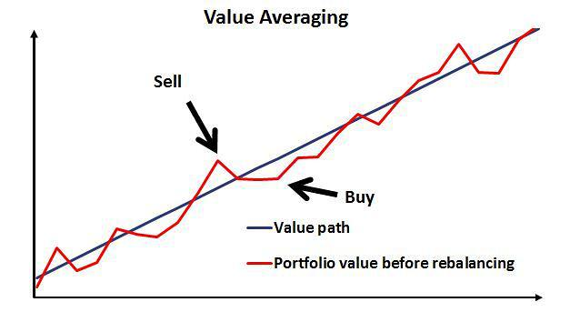

Value investing and algorithmic trading are two influential strategies in the field of finance, each with distinct methodologies and advantages. Value investing involves selecting stocks that appear to be undervalued based on intrinsic value assessments. Investors adopting this method seek long-term benefits by identifying opportunities in assets that are temporarily overlooked by the market. In contrast, algorithmic trading employs computer programs to execute trading strategies at speeds and frequencies that are unachievable by human traders. This approach leverages vast amounts of data to make precise and objective financial decisions.

Merging value averaging with algorithmic trading is aimed at optimizing investment outcomes by harnessing the strengths of both approaches. Value averaging, a strategy designed to maximize investment returns while minimizing risk, involves adjusting the investment amount to maintain a constant expected growth rate. When integrated with algorithmic trading, this strategy can be executed with enhanced speed and precision, ensuring that the trading decisions are based on real-time data analysis. The automated nature of algorithms can significantly reduce the emotional biases that often lead to suboptimal investment decisions. By consistently adhering to predefined rules, algorithms ensure that the value averaging strategy is meticulously applied.



Automated strategies in investment provide numerous benefits, including minimized transaction costs, the ability to manage large volumes of data, and the elimination of human error. They enable investors to systematically and swiftly respond to market changes, enhancing the precision and efficiency of trading activities. As such, the integration of algorithmic trading with value averaging not only streamlines the execution process but also strengthens decision-making frameworks by relying on data-driven insights.

This article sets the stage for a comprehensive exploration of how value averaging can be adapted to modern financial markets through the lens of algorithmic trading. By examining this synthesis, we aim to uncover innovative pathways for investors seeking to enhance their strategies in an increasingly complex and fast-paced financial environment.

## Table of Contents

## Understanding Value Averaging

Value averaging is an investment strategy that involves adjusting the amount invested in a particular asset to achieve a predetermined level of portfolio value at regular intervals. This methodology aims to minimize the average cost per share by purchasing more shares when prices are low and fewer shares when prices are high. The core mechanics of value averaging rest on a formulaic approach that decides the investment amount based on the actual and target portfolio value at each interval, enhancing long-term investment efficiency.

The primary goal of value averaging is to decrease the average cost per share. This objective is achieved by systematically increasing the investment in declining markets and reducing it in rising markets. This contrasts with dollar-cost averaging (DCA), where a fixed amount is invested at regular intervals, regardless of market conditions. DCA smooths out the investment over time but doesn't directly aim to minimize cost per share like value averaging does.

In value averaging, a target growth rate is established, defining the desired trajectory of portfolio growth over time. Investors can determine the target value at each period using the formula:

$$
\text{Target value} = \text{Previous target value} + (\text{Previous target value} \times \text{Target growth rate})
$$

If the actual portfolio value is below this target, the investor adds funds to reach the target; if above, they invest less or withdraw funds. The target growth rate's implications are significant, as a higher rate necessitates larger investments during market downturns, potentially increasing [liquidity](/wiki/liquidity-risk-premium) risks.

Historical analyses of value averaging illustrate its potential advantages in various market conditions. For example, during periods of market [volatility](/wiki/volatility-trading-strategies), this strategy may outperform dollar-cost averaging by capitalizing on market fluctuations to acquire more shares at lower prices. Studies have shown instances where applying value averaging during downturns, such as the financial crisis of 2008, resulted in a lower average cost per share compared to a constant investment approach.

Overall, value averaging requires careful planning and market understanding but can lead to more efficient portfolio management and cost optimization over time.

## Algorithmic Trading and Its Relevance

Algorithmic trading, frequently referred to as algo trading, utilizes computer algorithms to execute trading orders with optimal speed, precision, and efficiency. These algorithms can analyze complex data sets in real-time, identify [arbitrage](/wiki/arbitrage) opportunities, and execute trades seamlessly across various markets. Algorithmic trading relies heavily on pre-defined criteria and models, facilitating trades according to predetermined instructions such as timing, price, or quantity. This strategic approach is designed to outperform human capabilities by minimizing execution time and reducing the potential for emotional bias.

One of the primary advantages of [algorithmic trading](/wiki/algorithmic-trading) is its ability to process vast amounts of financial data swiftly and accurately. This data-driven approach allows traders to capitalize on market opportunities and make informed decisions faster than manual trading methods. Algorithms can parse through historical data, analyze current market conditions, and predict future trends. The sophistication of these computational models ensures that trades are executed at the most favorable prices, thus increasing potential profit margins and optimizing investment portfolios.

Algorithmic trading has gained significant traction in global exchanges over recent years, revolutionizing how trades are conducted worldwide. Financial institutions, hedge funds, and institutional investors all employ algorithms to execute high-frequency trading strategies. The rise of electronic communication networks (ECNs) and the technological advancements in trading infrastructure have further fueled this growth, making algorithmic trading a dominant force in global markets.

The melding of algorithmic trading with value averaging provides a robust framework for strategic execution. Value averaging is an investment strategy that involves adjusting the amount invested to achieve a desired portfolio growth rate. By integrating algorithmic trading, investors can automate the value averaging process, leveraging real-time data and computational models to decide investment amounts automatically. This integration can be illustrated through programming languages such as Python, which can be used to develop algorithms that continuously evaluate market conditions and adjust investments accordingly.

```python
# Example of a simple Python script for automating value averaging with algorithmic trading
import numpy as np

def calculate_investment(target_value, current_value, market_price):
    """ Calculate the investment needed to achieve target value """
    return max(0, (target_value - current_value) / market_price)

# Sample data
target_growth_rate = 0.05
initial_investment = 1000
current_value = initial_investment
market_prices = [10, 10.5, 9, 11]  # Hypothetical market prices

for price in market_prices:
    target_value = initial_investment * (1 + target_growth_rate)
    investment = calculate_investment(target_value, current_value, price)
    print(f"Market price: {price}, Invest: {investment}")
    current_value += investment

```

This blend of algorithmic trading and value averaging minimizes emotional biases, as decisions are driven by pre-set conditions and strategic goals rather than impulsive reactions. By automating the investment process, it ensures consistency in the execution of the value averaging approach, enhancing the effectiveness of the strategy.

## Integrating Value Averaging with Algorithmic Trading

Value averaging is an investment strategy that involves adjusting the amount invested to reach a predetermined portfolio value at each interval. Integrating this method with algorithmic trading can automate and enhance the strategy's effectiveness. Algorithms play a pivotal role in automating value averaging strategies by leveraging real-time data and computational models to execute trades without human intervention.

Real-time data is essential for algorithmic trading, as it allows for the immediate processing of market changes and adjustments in investment strategies. Computational models analyze this data, providing traders with the necessary insights to decide on buying or selling assets based on the desired portfolio value targets. These models can quickly adapt to fluctuating market conditions, ensuring that investment strategies are executed with precision.

To create an algorithm that supports value averaging, one must first define the target portfolio value for each investment period. This requires inputting initial investment parameters and setting a desired growth rate. With this data, the algorithm calculates the difference between the current portfolio value and the target value, determining the amount to invest or disinvest to align with the strategy.

Here is a simplified Python example of implementing a value averaging algorithm:

```python
def value_averaging_algorithm(current_value, target_value, current_assets_price):
    # Calculate the difference between the target and current portfolio value
    difference = target_value - current_value

    # Determine the number of shares to buy or sell based on current asset price
    shares_to_trade = difference / current_assets_price

    return shares_to_trade

# Example usage
current_portfolio_value = 10000
target_portfolio_value = 11000
current_stock_price = 50

shares_traded = value_averaging_algorithm(current_portfolio_value, target_portfolio_value, current_stock_price)
print(f"Shares to trade: {shares_traded}")
```

In this example, the algorithm calculates the number of shares to trade to meet the target portfolio value by dividing the value difference by the current price of the asset. Such automated calculations allow for rapid and precise execution of trades, eliminating emotional biases that often plague human decision-making. 

The precision afforded by algorithms not only reduces the potential for human error but also helps in maintaining discipline in investing. Algorithms stick to predefined rules, ensuring that investments are made based on logic rather than emotion. This objectivity can be especially beneficial in volatile markets, where emotions might lead to irrational decisions.

In summary, integrating value averaging with algorithmic trading enhances the strategic execution of investments, providing investors with a systematic and disciplined approach. The reliance on real-time data and computational models ensures timely decisions, while algorithmic precision minimizes emotional biases, making it a robust strategy in contemporary finance.

## Challenges and Considerations

Implementing value averaging as an investment strategy presents several challenges that investors and traders must consider to optimize the effectiveness of their portfolios. Understanding these challenges is crucial to successfully integrating value averaging with algorithmic trading, thus achieving desired investment outcomes.

One of the primary challenges of implementing value averaging is ensuring sufficient liquidity. Value averaging requires periodic investments or divestments to maintain the intended investment trajectory and achieve the target portfolio value over time. This necessitates a highly liquid portfolio to facilitate frequent trading. Insufficient liquidity can lead to difficulties in executing transactions at desired prices, potentially increasing costs and reducing the strategy's effectiveness. Investors need to carefully manage their portfolios to ensure that assets can be quickly and efficiently traded without significant market impact.

Portfolio management is another crucial consideration in value averaging. Investors need to maintain a diversified and balanced portfolio while adhering to the strategy's requirements. This requires regular portfolio assessments and adjustments to align with the target growth rate, which can be complex and time-consuming. Additionally, as market conditions fluctuate, the target growth rate may need to be recalibrated, making ongoing monitoring essential.

While algorithmic trading offers the precision and speed necessary for executing value averaging strategies, it also introduces certain risks, notably technical malfunctions. Algorithms rely on sophisticated software, which can be susceptible to bugs, glitches, or hardware failures. These technical malfunctions can lead to erroneous trades, delays, or even system outages, which may significantly impact an investor's strategy. To mitigate these risks, rigorous testing, ongoing maintenance, and implementing safeguards such as circuit breakers or manual oversight are crucial.

Continuous monitoring and strategy adjustments form an integral part of addressing these challenges. As market conditions evolve, algorithms need to be fine-tuned to adapt to new information and emerging trends. This requires a robust framework for real-time data analysis and decision-making. Investors must ensure their algorithms are equipped with adaptive mechanisms to adjust to market dynamics swiftly. Regular reviews and updates of both the algorithmic processes and the underlying investment strategy are vital to maintain alignment with financial objectives and risk tolerance.

In summary, implementing value averaging with algorithmic trading requires addressing liquidity concerns, maintaining effective portfolio management, safeguarding against technical malfunctions, and ensuring ongoing strategy optimization through frequent monitoring and adjustments. By considering these challenges, investors can better utilize the benefits of automated strategies in achieving long-term investment success.

## Conclusion

The integration of value averaging with algorithmic trading presents a compelling strategy for modern investors, offering a balance between methodical cost management and the efficiency of automated systems. By combining these approaches, investors can potentially achieve more consistent long-term growth while mitigating the emotional biases that often accompany traditional investment methods. 

The core advantage of this integration lies in its adaptability to individual financial goals and risk tolerance. Investors can customize the algorithms to account for specific targets, adjusting for variables such as risk levels, asset classes, and market conditions. This personalization ensures that the investment strategy aligns closely with personal financial objectives while maintaining discipline in execution. 

Continuous learning and adaptation are crucial in the dynamic financial landscape. The markets are ever-evolving, influenced by technological advancements, regulatory changes, and economic shifts. As such, investors must remain vigilant and open to adjusting their strategies as new data and insights become available. Leveraging the computational power of algorithms can assist in this process, enabling more rapid assimilation of new information into investment decisions. 

In conclusion, the synthesis of value averaging and algorithmic trading harnesses the strengths of both strategies. It offers a robust framework for achieving steady investment growth while reducing susceptibility to market volatility. By incorporating these modern investment strategies, investors are better positioned to navigate the complexities of today's financial markets, ultimately enhancing their potential for success.

## References & Further Reading

1. **"Value Averaging: The Safe and Easy Strategy for Higher Investment Returns" by Michael E. Edleson** - This book offers a comprehensive introduction to the value averaging method, detailing the theory, mechanics, and benefits of the strategy over traditional dollar-cost averaging. It serves as an essential reading for anyone interested in the fundamentals of value averaging and its historical applications.

2. **"Algorithmic Trading: Winning Strategies and Their Rationale" by Ernie Chan** - Chan's work delves into the world of algorithmic trading, offering insights into developing and executing data-driven trading strategies. This book is foundational for understanding how algorithms function in the financial markets and can be integrated with investment strategies like value averaging.

3. **"Quantitative Trading: How to Build Your Own Algorithmic Trading Business" by Ernie Chan** - A practical guide that expands on the implementation aspect of algorithmic trading, covering everything from setting up backtesting systems to managing capital. It is particularly useful for readers interested in automating strategies such as value averaging.

4. **"Advances in Financial Machine Learning" by Marcos López de Prado** - This book explores the application of machine learning techniques in financial markets, providing a deeper understanding of the data-driven methods that can enhance algorithmic trading strategies. Readers can gain insights into how value averaging can be automated using machine learning models.

5. **"The Black-Litterman Model: Estimation and Applications" by Thomas B. Vincent and Manish Malhotra** - While not directly focused on value averaging, this publication offers valuable insights into asset allocation principles and methodologies that can complement the strategy within a broader portfolio management context.

6. **"High-Frequency Trading: A Practical Guide to Algorithmic Strategies and Trading Systems" by Irene Aldridge** - Aldridge's book sheds light on high-frequency trading and the algorithms that execute trades at lightning speeds. It helps illustrate the landscape in which algorithmic trading takes place and informs the potential speed advantages when applying strategies like value averaging.

7. **"Mathematics of Financial Markets" by Robert J. Elliott and P. E. Kopp** - This resource provides a robust mathematical framework for financial markets, including stochastic calculus and its implications for trading strategies. A good reference for those interested in the quantitative side of algorithmic trading and value averaging integration.

These references provide a solid foundation for understanding the key components of value averaging and algorithmic trading, offering valuable insights into the benefits and considerations of combining these investment strategies in modern finance.