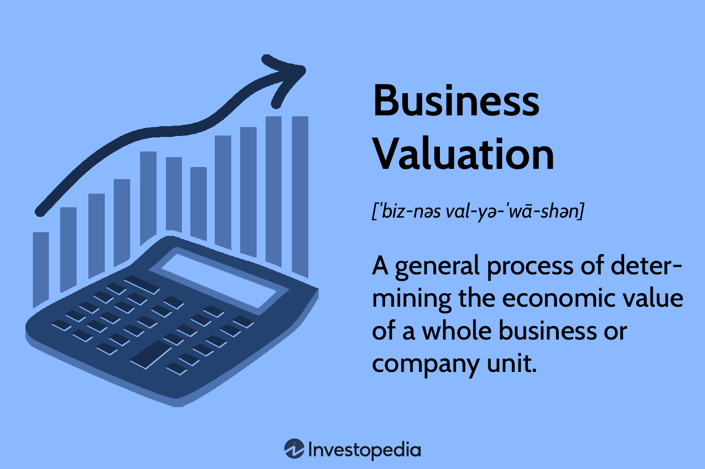

In today's fast-paced financial markets, algorithmic trading plays a pivotal role in shaping successful trading strategies. By leveraging complex algorithms, traders are able to execute trades with remarkable speed and precision. This technological advancement not only optimizes trading efficiency but also profoundly impacts the broader financial landscape.

The concept of value in business and finance is intricately linked with algorithmic trading, as it offers a new dimension in measuring and creating value. Understanding the various facets of value creation can empower both traditional and algorithmic investors to maximize their returns. Value within the financial sector can be quantified and assessed through various lenses, including market value, intrinsic value, and risk-adjusted returns. These metrics are crucial in making informed investment decisions and enhancing financial performance.



Algorithmic trading brings distinct benefits, such as reducing transaction costs, increasing execution speed, and minimizing human emotion in trading decisions. Additionally, it has transformed market operations by improving liquidity and promoting market efficiency. As financial markets evolve, the ability to understand and utilize algorithmic trading strategies becomes increasingly important for investors aiming for sustained profitability and competitive advantage.

By the end of this article, you will understand how the integration of value principles and algorithmic strategies caters to the evolving demands of financial markets. This knowledge will equip both novice and experienced traders with the tools required to harness algorithmic trading techniques, aligning financial goals with market opportunities.

## Table of Contents

## Understanding Value in Finance

Value in finance is a multifaceted concept that refers to the worth assigned to assets, goods, or services, influencing investment decisions and strategies. Understanding this notion is pivotal, as it underpins many financial activities and decisions.

Key concepts in valuing financial entities include market value, book value, fair value, and shareholder value. Market value, often synonymous with market capitalization in public companies, is determined by the stock market through supply and demand dynamics. It is calculated as the current share price multiplied by the total number of outstanding shares. Meanwhile, book value signifies the net value of a company's assets recorded on its balance sheet, subtracting its liabilities. It provides insights into the intrinsic worth of a company, particularly when compared to its market value.

Fair value represents an estimate of an asset's price agreed upon by a willing buyer and seller. This concept is crucial in financial reporting and accounting, as it aligns asset valuation with current market conditions and influences investment decisions. Shareholder value focuses on maximizing the wealth of a company's shareholders, often reflected in stock price appreciation and dividend payouts.

Valuation, the process of calculating and assigning value, is essential for informed trading and investment choices. Financial analysts use various methods, such as discounted cash flow (DCF) analysis, which computes the present value of expected future cash flows, to assess value. The formula:

$$

DCF = \sum \frac{C_t}{(1 + r)^t}
$$

where $C_t$ is the cash flow at time $t$, and $r$ is the discount rate, is widely used. This approach helps in evaluating whether a stock is undervalued or overvalued compared to its market price.

The valuation of a company significantly impacts investment decisions, influencing whether investors buy, hold, or sell securities. In [algorithmic trading](/wiki/algorithmic-trading), where decision-making is often automated, understanding these value concepts is crucial for developing strategies that respond to changing valuations efficiently. Algorithms can be programmed to identify discrepancies between intrinsic and market values, allowing for potentially profitable trading opportunities. For example, an algorithm might execute a trade when a stock's market value falls below its calculated fair value, signaling an undervaluation.

In sum, understanding value in finance is integral for structuring effective investment strategies, especially within the fast-paced environment of algorithmic trading, where rapid valuation and execution can capitalize on market inefficiencies.

## Basics of Algorithmic Trading

Algorithmic trading involves the use of computer algorithms to automate the trading process, utilizing predefined rules and instructions to execute buy or sell orders. This method leverages computational power to assess market data and execute trades at speeds unobtainable by human traders. The primary benefits of algorithmic trading are its speed, accuracy, and the elimination of emotional and psychological influences in trading decisions, leading to more disciplined and efficient trading operations.

### Key Benefits

The speed of execution in algorithmic trading is unparalleled. Algorithms can process vast amounts of market data in milliseconds and make trading decisions based on this analysis nearly instantaneously. This quick decision-making capability is critical in fast-paced financial markets, where price movements can happen in fractions of a second.

Accuracy is another significant advantage of algorithmic trading. Algorithms strictly adhere to their coded instructions, which helps prevent the errors and inconsistencies that might arise from manual input. Furthermore, algorithms can be rigorously backtested against historical data sets to ensure their reliability and performance before being deployed in live trading environments.

### Strategy Range

Algorithmic trading strategies can vary from the relatively simple to the highly complex. Simple strategies might involve using moving averages to predict market trends, while more advanced strategies can employ statistical models and [machine learning](/wiki/machine-learning) techniques to anticipate price movements. This versatility allows algorithmic trading to adapt to different market conditions and trading opportunities, providing traders with a broad toolkit for developing tailored trading strategies.

### Technical and Infrastructure Requirements

The basic technical and infrastructure requirements for algorithmic trading are modest, yet it demands a solid understanding of both programming and financial markets for successful implementation. Tools such as Python offer libraries like NumPy and pandas for numerical and data analysis, making them suitable for crafting algorithmic strategies. Here's a simple example of a moving average crossover strategy using Python:

```python
import numpy as np
import pandas as pd

# Sample data
data = pd.DataFrame({
    'price': np.random.rand(100)
})

# Calculate moving averages
data['Short_MA'] = data['price'].rolling(window=5).mean()
data['Long_MA'] = data['price'].rolling(window=20).mean()

# Generate buy/sell signals
data['Signal'] = np.where(data['Short_MA'] > data['Long_MA'], 1, -1)
```

### Advantages and Potential Drawbacks

While algorithmic trading offers significant advantages, it is not without its potential drawbacks. The necessity for rapid execution means that sophisticated algorithms may require advanced technological infrastructure, leading to increased costs. Additionally, the reliance on algorithms can sometimes result in market disruptions. For example, a poorly designed algorithm or a malfunction can lead to erroneous trades, impacting both the trader and the broader market. High-frequency trading, a subset of algorithmic trading, has been scrutinized for its role in triggering "flash crashes," where rapid sell-offs occur, momentarily wiping out value in financial markets.

Overall, algorithmic trading continues to be a cornerstone of modern financial markets, offering substantial benefits through innovation, but it requires a careful approach to manage its risks effectively.

## Value Creation Through Algorithmic Trading

Algorithmic trading, often referred to as algo trading, is a powerful technique that generates value by leveraging automated, pre-programmed trading strategies. One of its primary advantages is the ability to capture even the smallest market inefficiencies through rapid execution. This is achieved through the use of advanced algorithms that analyze vast datasets to identify trends and execute trades almost instantaneously.

Traders utilizing algo trading deploy sophisticated algorithms to assess market trends and execute trades in real-time, maximizing profits while minimizing risks associated with market [volatility](/wiki/volatility-trading-strategies). These algorithms are capable of processing a multitude of market variables, including price movements, [volume](/wiki/volume-trading-strategy), and other indicators, thus providing traders with a substantial edge over manual trading methods.

Strategies such as trend-following and statistical [arbitrage](/wiki/arbitrage) are fundamental to algorithmic trading, as they enable traders to exploit price discrepancies across different markets. Trend-following strategies rely on market [momentum](/wiki/momentum), making trades in the direction of current trends, while [statistical arbitrage](/wiki/statistical-arbitrage) involves identifying and leveraging mispriced securities based on statistical models.

High-frequency trading ([HFT](/wiki/high-frequency-trading-strategies)), a specialized segment of algorithmic trading, capitalizes on micro-price fluctuations. By executing a large number of trades at extremely high speeds, HFT accumulates substantial gains over short periods. This strategy relies on advanced technology and infrastructure to achieve latencies measured in milliseconds, allowing traders to react instantly to market changes.

The impact of algorithmic trading extends beyond individual gains to the financial markets as a whole. It significantly enhances market [liquidity](/wiki/liquidity-risk-premium), providing more opportunities for investors to buy and sell securities without causing substantial price changes. Furthermore, trading efficiency is improved through the continuous adaptation of algorithms that analyze and react to market conditions.

As a result, algorithmic trading adds significant value to both individual traders and the broader financial markets. It not only enhances the ability to capitalize on fleeting market opportunities but also contributes to the overall health and stability of financial systems by optimizing liquidity and efficiency.

## Implementing Algorithmic Trading for Value

Effective implementation of algorithmic trading requires selecting the right platforms and tools that align with specific trading goals and strategies. Popular platforms such as MetaTrader, QuantConnect, and [Interactive Brokers](/wiki/interactive-brokers-api) provide comprehensive environments for developing and executing algorithmic strategies. Each platform offers unique benefits; for instance, MetaTrader is favored for its extensive user base and ease of use in [forex](/wiki/forex-system) markets, QuantConnect offers robust support for [backtesting](/wiki/backtesting) in multiple programming languages, and Interactive Brokers provides access to a wide array of asset classes and markets.

An algorithmic trading system comprises several key components, each serving a critical function in executing trades effectively. The first component is the data source, which supplies real-time and historical market data necessary for informed trading decisions. Reliable data sources ensure the accuracy of market predictions and the effective implementation of trading strategies. Backtesting engines are equally important, allowing traders to simulate their strategies against historical data to assess their viability before deployment. This helps in identifying potential pitfalls and improving strategy robustness.

Execution engines play a pivotal role in executing trades based on the algorithmic instructions. They ensure that trades are executed with minimal latency, which is crucial in high-frequency trading scenarios where prices can change in fractions of a second. Finally, risk management systems are integral to any algorithmic trading setup. These systems monitor and adjust trading strategies in real-time to mitigate potential losses, ensuring that trades align with predefined risk parameters. This might involve dynamically adjusting position sizes or setting stop-loss orders to protect against adverse market movements.

Developing custom algorithms offers traders the ability to tailor their strategies to maximize value extraction based on individual preferences and market assessments. This customization involves coding specific trading rules and logic that align with a trader's unique insights into market behavior. Python is a popular choice for developing these algorithms due to its extensive libraries and ease of use in handling data. For example, the pandas library can be utilized for data manipulation, while statsmodels and scikit-learn are invaluable for statistical analysis and machine learning, respectively.

Here’s an example of a simple moving average crossover strategy implemented in Python:

```python
import pandas as pd

# Example data import
data = pd.read_csv('market_data.csv')

# Calculate moving averages
data['SMA_20'] = data['Close'].rolling(window=20).mean()
data['SMA_50'] = data['Close'].rolling(window=50).mean()

# Generate signals
data['Signal'] = 0
data.loc[data['SMA_20'] > data['SMA_50'], 'Signal'] = 1
data.loc[data['SMA_20'] < data['SMA_50'], 'Signal'] = -1

# Implement the logic for buy/sell decisions
def trade_signals(row):
    if row['Signal'] == 1:
        return 'Buy'
    elif row['Signal'] == -1:
        return 'Sell'
    else:
        return 'Hold'

data['Decision'] = data.apply(trade_signals, axis=1)

# Output the data including signals
print(data[['Close', 'SMA_20', 'SMA_50', 'Signal', 'Decision']])
```

This code calculates the 20-day and 50-day simple moving averages (SMA) on the closing prices of a market dataset. It then generates buy or sell signals based on the crossover of these averages, marking a basic yet widely used strategy in financial markets. By tailoring such algorithms to their unique insights, traders can potentially leverage market inefficiencies, thus optimizing the value creation potential of their trading activities.

## Conclusion

Algorithmic trading stands as a transformative progression within the financial trading landscape, distinguished by its unmatched ability to execute trades with remarkable speed and precision. These capabilities facilitate not only rapid execution but also empower traders to engage in sophisticated strategies that capitalize on minute market discrepancies, leading to significant value discovery. This evolution in trading techniques necessitates a deep understanding of the convergence between traditional business value principles and modern trading strategies. Traders who adeptly integrate these elements can maximize the potential that algorithmic trading offers.

As financial markets continue their dynamic evolution, the incorporation of advanced algorithms is likely to further enhance both market efficiency and trader profitability. The ongoing innovation in algorithmic techniques will expand their application across diverse financial domains, thereby broadening the horizons of traditional trading approaches. For instance, algorithms that leverage machine learning and [artificial intelligence](/wiki/ai-artificial-intelligence) foretell a future where predictive analytics can preempt market trends, enabling even more strategic decision-making.

Looking ahead, the trajectory of trading will likely focus on the refinement and continuous improvement of these algorithm-based tools and methods. This will involve not only technical advancements but also strategic integrations that enhance the overall financial ecosystem. As such, traders and investors who invest in understanding and deploying algorithmic trading are poised to achieve superior financial outcomes. With the comprehensive insights provided in this article, financial practitioners are now better equipped to exploit the benefits of algorithmic trading, potentially leading to enhanced success in their trading endeavors.

## References & Further Reading

[1]: Bergstra, J., Bardenet, R., Bengio, Y., & Kégl, B. (2011). ["Algorithms for Hyper-Parameter Optimization."](https://dl.acm.org/doi/10.5555/2986459.2986743) Advances in Neural Information Processing Systems 24.

[2]: ["Advances in Financial Machine Learning"](https://www.amazon.com/Advances-Financial-Machine-Learning-Marcos/dp/1119482089) by Marcos Lopez de Prado

[3]: ["Evidence-Based Technical Analysis: Applying the Scientific Method and Statistical Inference to Trading Signals"](https://www.amazon.com/Evidence-Based-Technical-Analysis-Scientific-Statistical/dp/0470008741) by David Aronson

[4]: ["Machine Learning for Algorithmic Trading"](https://github.com/stefan-jansen/machine-learning-for-trading) by Stefan Jansen

[5]: ["Quantitative Trading: How to Build Your Own Algorithmic Trading Business"](https://www.amazon.com/Quantitative-Trading-Build-Algorithmic-Business/dp/1119800064) by Ernest P. Chan