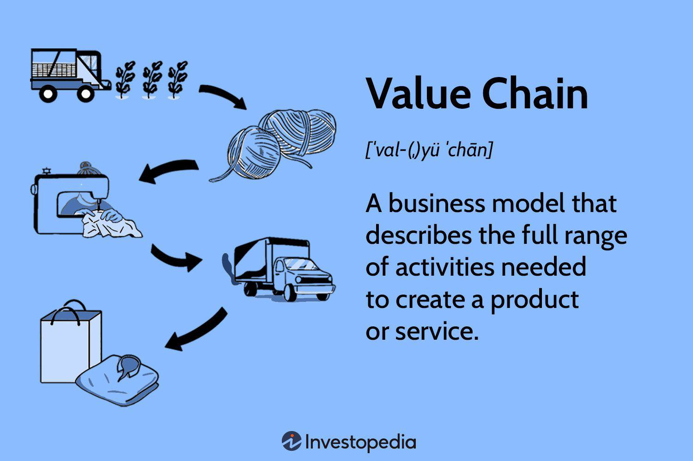

Strategic management and value chain analysis are essential components in enhancing business operations and achieving a competitive advantage. Strategic management involves the comprehensive planning and execution of company objectives, ensuring that all aspects of the business align with the overarching goals to outperform competitors. Value chain analysis, on the other hand, provides a detailed examination of each step in a company’s operations, identifying areas where improvements can increase efficiency and effectiveness, thereby reducing costs and enhancing value delivery to customers.

The advent of algorithmic trading has dramatically transformed the finance sector by automating trading processes through sophisticated data-driven algorithms. These algorithms are capable of processing vast amounts of market data at speeds unattainable by human traders, allowing for trading decisions that are not only faster but also more accurate. This has significantly reduced human error and bias, leading to more dependable trading outcomes.



This article aims to explore how strategic management, value chain analysis, and algorithmic trading intersect within a business context. By examining these concepts, companies can gain valuable insights that enhance operational efficiency, profitability, and market standing. Understanding how these three elements interact enables businesses to innovate and adapt strategies that best leverage technological advancements in trading while optimizing their processes and resources. As companies increasingly rely on data-driven methodologies, the integration of these concepts underscores a strategic approach to navigating today's dynamic business environment.

## Table of Contents

## Understanding Strategic Management in Business

Strategic management is a critical process in organizations, focusing on the systematic planning, monitoring, analysis, and assessment of all resources and operations to ensure that an organization's objectives are met. This comprehensive approach is fundamental in aligning the organization’s structure with its strategy, ultimately aiming to achieve performance goals while adapting to a constantly evolving business environment.

The process of strategic management encompasses several key stages: strategic analysis, strategy formulation, and strategy implementation. Strategic analysis involves evaluating the company's internal capabilities and external environment. Tools such as SWOT analysis (Strengths, Weaknesses, Opportunities, and Threats) and PESTEL analysis (Political, Economic, Social, Technological, Environmental, and Legal) are commonly used to facilitate this understanding. This analysis provides insights into the organization's current market position and potential challenges and opportunities.

Following the analysis, strategy formulation is the process of deciding on the best courses of action for achieving the organizational objectives. The formulation involves setting goals that are Specific, Measurable, Achievable, Relevant, and Time-bound (SMART) and developing policies and plans to achieve these goals. In formulating effective strategies, companies may focus on competitive advantages, which can be achieved through cost leadership, differentiation, or focusing on niche markets.

Strategy implementation involves the execution of chosen strategies through the allocation of resources and the establishment of systems to execute the plans. It requires clear communication of the strategy across the organization, aligning individual and departmental roles with strategic objectives. Regular monitoring and adjustments are essential to respond to any deviations from the planned performance.

Effective strategic management leads to sustainable competitive advantages by continuously adapting to market changes and optimizing internal operations. By systematically assessing the organizational and environmental contexts, organizations can anticipate shifts in the market and act proactively. This dynamic process enhances the organization's capability to maintain long-term success in increasingly competitive markets, securing its position through innovative and responsive strategies.

## Value Chain Analysis: Enhancing Business Processes

Value chain analysis is a systematic approach to evaluating the discrete activities a company undertakes in its operations to identify where value can be increased or costs reduced. This method involves dissecting the company's processes and functions to enhance the efficiency and effectiveness of each activity. The primary aim of value chain analysis is to optimize the overall operational framework, thereby elevating competitive advantage and business performance.

The concept of the value chain was popularized by Michael Porter in his 1985 book "Competitive Advantage: Creating and Sustaining Superior Performance." Porter delineates the value chain as a chain of activities common to all businesses where value is added to an article during the production process.[^1] Each company operates as part of a larger chain of value creation, contributing to the entire system's product or service. 

### Key Components of Value Chain Analysis:

1. **Primary Activities**: These are the core activities directly related to creating and delivering a product or service. They include:
   - **Inbound Logistics**: Receiving, warehousing, and inventory management of raw materials.
   - **Operations**: Processes that transform inputs into the final product.
   - **Outbound Logistics**: Activities necessary to get the finished product to the customer, including storage and order fulfillment.
   - **Marketing and Sales**: Strategies to create buyer interest and facilitate the sale of the product.
   - **Service**: Activities to maintain the product's value after purchase, including customer support and repair services.

2. **Support Activities**: These activities support primary activities and are essential for sustaining business operations. They include:
   - **Procurement**: The process of acquiring the goods and services the company needs to carry out its operations.
   - **Technology Development**: Activities that relate to managing and integrating technological advancements and innovations.
   - **Human Resource Management**: Recruitment, training, and development of employees.
   - **Infrastructure**: The organizational infrastructure, including management, finance, planning, and strategic systems necessary for the business to thrive.

### Optimization Strategies:

By optimizing each component of the value chain, companies can streamline their operational processes, reducing waste and costs while improving product quality. For example, advancements in technology can be utilized in operations to decrease production time and increase precision, thereby minimizing defects and waste.[^2]

Python can be utilized in optimizing the value chain operations. For instance, companies can apply data analytics to predict demand, optimize inventory, and manage logistics. Consider the following basic Python example to simulate inventory optimization using a simple demand forecast:

```python
import numpy as np

# Simulate daily demand data
mean_demand = 100  # Average daily demand
std_dev = 10  # Demand standard deviation
days = 30  # Number of days to simulate

# Generate random daily demand
daily_demand = np.random.normal(mean_demand, std_dev, days)

# Assuming a constant lead time for new stock
lead_time = 5  # days
restock_threshold = mean_demand * lead_time

# Check if restocking is needed
stock_on_hand = 500  # Initial stock
for day in range(days):
    if stock_on_hand < restock_threshold:
        print(f"Day {day}: Need to restock")
    stock_on_hand -= daily_demand[day]

print("Simulation completed.")
```

This simulation helps in making informed decisions about when to restock, potentially reducing carrying costs and enhancing the inbound logistics segment of the value chain.

In conclusion, primary and support activities in a value chain complement each other and contribute significantly to the firm's success by fostering an integrated and seamless operation flow, leading to superior customer value and competitive differentiation.

[^1]: Porter, M. E. (1985). "Competitive Advantage: Creating and Sustaining Superior Performance." Free Press.
[^2]: Kaplan, R. S., & Norton, D. P. (1996). "The Balanced Scorecard: Translating Strategy into Action." Harvard Business Review Press.

## The Role of Algorithmic Trading

Algorithmic trading utilizes complex computer algorithms to automate the decision-making process in financial markets, thereby transforming the traditional trading landscape. This technological advancement has significantly enhanced the speed at which trades are executed, allowing for transactions in fractions of a second—something impossible for human traders. The precision offered by algorithms minimizes errors typical of manual trading, thus reducing human biases and emotional responses, which can adversely affect trading outcomes.

One of the primary benefits of [algorithmic trading](/wiki/algorithmic-trading) is its ability to process vast amounts of data in real time and identify profitable trading opportunities. Algorithms can quickly analyze price changes, compare historical data, and monitor market conditions to make informed trading decisions without human intervention. This efficiency is achieved through several strategies, including [arbitrage](/wiki/arbitrage), [market making](/wiki/market-making), and high-frequency trading ([HFT](/wiki/high-frequency-trading-strategies)).

Arbitrage exploits price discrepancies in different markets or financial instruments. For example, if an asset is priced differently on two exchanges, an algorithm can simultaneously buy low on one and sell high on the other to secure a profit. This process helps in price correction across markets and contributes to market [liquidity](/wiki/liquidity-risk-premium).

Market making involves providing liquidity to financial markets by simultaneously offering to buy and sell a financial instrument at specified prices. Algorithmic traders capitalize on the bid-ask spread—the difference between the prices quoted for an immediate sale and purchase. By continuously updating their quotes based on market supply and demand, algorithms ensure a fluid market environment, benefitting both buyers and sellers.

High-frequency trading represents the pinnacle of algorithmic strategies, characterized by executing a large number of orders in extremely short time frames. This strategy relies on fast execution and low-latency connections to trading venues. A key component to successful HFT is minimizing the time delay in transmitting data between a trader's system and the exchange, often termed as "latency." Firms invest heavily in infrastructure to achieve nanosecond execution speeds, providing a competitive edge.

The underlying algorithm can use a variety of mathematical models to predict market trends and behavior. For instance, mean reversion models assume asset prices will revert to their historical means, prompting buy or sell actions based on deviations from the mean. Machine learning models are increasingly being adopted to improve prediction accuracy, leveraging past market data to train algorithms that can anticipate future price movements.

```python
# Example of a simple mean reversion strategy in Python using a moving average
import pandas as pd

def simple_mean_reversion_strategy(prices, window=20):
    """
    A simple mean reversion strategy using moving average.

    :param prices: A pandas Series of stock prices
    :param window: Number of days to calculate moving average
    :return: Buy and sell signals
    """
    # Calculate moving average
    moving_average = prices.rolling(window=window).mean()

    # Generate buy/sell signals
    signals = pd.Series(index=prices.index)
    signals[prices < moving_average] = 1     # Buy signal
    signals[prices > moving_average] = -1    # Sell signal

    return signals

# Example usage:
# prices = pd.Series([some_prices_data])
# signals = simple_mean_reversion_strategy(prices)
```

This sample code demonstrates a basic algorithm that issues buy and sell signals based on a stock's moving average, an elementary form of algorithmic trading. Modern algorithms are more sophisticated, incorporating advanced statistical techniques and vast computational power to optimize trading strategies.

In conclusion, algorithmic trading continues to revolutionize financial markets by providing efficiency, accuracy, and speed. By employing sophisticated mathematical models and exploiting high-speed processing capabilities, algorithmic trading enhances market efficiency and offers immense potential for profitability. As technology advances, the role of algorithmic trading is poised to expand, further integrating data-driven decision-making into the financial ecosystem.

## Integrating Value Chain Analysis in Algo Trading

Incorporating value chain analysis into algorithmic trading provides a structured approach to addressing inefficiencies within trading processes. Value chain analysis involves dissecting a company's operations into primary and support activities, which helps identify specific areas where improvements can be made. When applied to algorithmic trading, this methodology aids in scrutinizing both technological and human resource components involved in executing trades.

Technological resources, such as the trading algorithms and supporting software infrastructure, can be optimized to enhance performance by ensuring that data processing and trade execution occur with speed and precision. This might involve refining algorithms to reduce latency—an essential [factor](/wiki/factor-investing) in high-frequency trading. For instance, optimizing the coding of algorithms to run faster computations or deploying them on hardware with superior processing capabilities can significantly affect performance. Here's a simplified example in Python to illustrate an optimized algorithmic function:

```python
def optimized_trading_algorithm(data):
    # Example of optimizing trade decision logic
    results = []
    for price in data:
        if price > threshold:
            results.append("Buy")
        else:
            results.append("Sell")
    return results
```

In this example, the algorithm is simplified for clarity, but real-world applications would involve complex data structures and conditions, emphasizing computational efficiency.

Human resources also play a critical role in the development and management of these systems. An effective value chain analysis will shed light on the necessity of training and skill development for personnel involved in interpreting algorithmic outputs and making strategic decisions based on them. Aligning human expertise with technological capabilities ensures that traders can better understand the value drivers within algorithms and leverage them to develop strategies that enhance the value proposition of the financial products and services offered.

Understanding the value drivers within algorithmic systems can lead to the customization of algorithms that cater to specific market conditions, customer requirements, or financial instruments. By doing so, traders can not only improve the accuracy and relevance of trading strategies but also ensure that the financial products align with broader business objectives, thus increasing competitive advantage.

By connecting the dots between value chain analysis and algorithmic trading, businesses can ensure that every link in the chain—from data analysis and algorithm design to trade execution and after-trade services—works in harmony to add value and improve efficiency. This integration creates a comprehensive framework for optimizing resources and crafting strategies that respond effectively to market dynamics.

## Implementing Strategic Management for Competitive Advantage

Businesses achieve a competitive advantage by strategically aligning their management practices with advancements in value chain improvements and algorithmic trading. This alignment seeks to optimize resource allocation, streamline processes, and leverage data-driven insights for superior market responsiveness.

Incorporating data and analytics from algorithmic trading into strategic management allows businesses to make informed decisions that are vital for optimizing resources and improving operational efficiencies. Algorithmic trading provides a wealth of data regarding market trends and consumer behaviors, which can be leveraged to refine strategic objectives and enhance decision-making. For instance, analyzing trading patterns and financial market movements helps companies anticipate changes that might affect their value chains, enabling them to adapt swiftly to new market conditions.

Strategies focusing on cost leadership, differentiation, and market responsiveness are crucial components of this approach. Cost leadership involves minimizing operational expenses to offer competitive pricing without sacrificing quality. By using algorithmic trading data, businesses can identify cost-saving opportunities within their supply chains or production processes, thus maintaining a lower cost structure.

Differentiation, on the other hand, requires businesses to offer unique products or services that stand out in the marketplace. By understanding customer preferences and market gaps through analytical insights, companies can tailor their offerings to better meet customer needs, enhancing their competitive positioning.

Market responsiveness is the ability to quickly adapt to market changes. Using real-time data and predictive analytics from algorithmic trading, businesses can anticipate market movements and adjust their strategies accordingly. This agility ensures that a business remains relevant and competitive, even in volatile markets.

To illustrate, consider a Python example that demonstrates how real-time data analytics can support strategic decision-making:

```python
import pandas as pd
import numpy as np

# Example: Real-time market data simulation
market_data = pd.DataFrame({
    'timestamp': pd.date_range(start='2023-01-01', periods=100, freq='D'),
    'price': np.random.normal(loc=100, scale=10, size=100)  # Simulated market prices
})

# Calculate moving average to identify price trends
market_data['moving_average'] = market_data['price'].rolling(window=5).mean()

# Identify buy/sell points
market_data['signal'] = np.where(market_data['price'] > market_data['moving_average'], 'Buy', 'Sell')

# Display the first few rows of the data
print(market_data.head())
```

This Python script simulates real-time market data and calculates a moving average to identify buy or sell signals, a rudimentary form of algorithmic trading analysis.

In conclusion, by integrating strategic management with innovative tools like algorithmic trading and effective value chain strategies, businesses can not only navigate but also excel in dynamic and competitive environments. Such integration fosters an ecosystem where efficiency, uniqueness, and flexibility converge to enhance overall market performance.

## Challenges and Solutions in Building an Integrated Framework

Balancing technological advancements with traditional management practices presents significant challenges for businesses aiming to build an integrated framework of strategic management, value chain analysis, and algorithmic trading. One of the fundamental challenges is ensuring data integrity, which is critical for making accurate, data-driven decisions. In algorithmic trading, algorithms rely heavily on the quality and reliability of input data. Ensuring that data is accurate, complete, and timely requires robust data management practices and systems.

Managing cybersecurity risks is another crucial aspect of this integration. As financial operations increasingly shift online, the threat of cyberattacks becomes more pronounced. Companies must invest in advanced cybersecurity measures, such as encryption and multi-factor authentication, to protect sensitive financial data and maintain trust. Implementing a proactive cybersecurity strategy can mitigate risks associated with data breaches, which could otherwise compromise business operations and competitive positioning.

Continuous innovation and adaptability are essential solutions for businesses seeking to integrate strategic management, value chain analysis, and algorithmic trading. Organizations must foster a culture of innovation where employees are encouraged to explore new technologies and methodologies. This cultural shift can help identify opportunities for improvement and adaptation in processes, resulting in a more agile and responsive business model.

Investing in research and development can support continuous innovation by enabling companies to discover advanced algorithms and more efficient trading strategies. Collaboration with technology providers and academic institutions can also facilitate access to cutting-edge technologies and expertise.

To illustrate the practical application of these solutions, consider using Python to automate data validation processes, ensuring integrity in algorithmic trading:

```python
import pandas as pd

# Load trading data
data = pd.read_csv('trading_data.csv')

# Define a function to check for missing values
def check_data_integrity(dataframe):
    if dataframe.isnull().values.any():
        return "Data integrity compromised: Missing values detected."
    return "Data integrity intact: No missing values."

# Check data integrity
result = check_data_integrity(data)
print(result)
```

In conclusion, while challenges exist in integrating technological advancements with traditional management practices, focusing on data integrity, cybersecurity, continuous innovation, and adaptability provides a pathway for successful integration. This comprehensive approach enables businesses to leverage strategic management, value chain analysis, and algorithmic trading effectively, paving the way for sustainable growth and competitive advantage.

## Conclusion

The confluence of strategic management, value chain analysis, and algorithmic trading presents new paradigms for business optimization. By effectively integrating these elements, companies can streamline their operations and unlock significant improvements in productivity and profitability. Strategic management provides a framework for setting long-term goals and aligning resources, while value chain analysis helps identify and optimize the various components of business operations. Algorithmic trading contributes advanced data analytics and decision-making capabilities, enhancing precision in financial transactions and market strategies.

As businesses navigate through increasingly dynamic markets, the ability to integrate these disciplines becomes essential. Companies that embrace this integrative approach are better equipped to respond swiftly to market changes and capitalize on emerging opportunities. This strategic agility fosters a more adaptive business model, capable of sustaining competitiveness over time.

Future trends are likely to emphasize even greater reliance on data-driven decision-making as technological advances continue to unfold. Continuous innovations in [artificial intelligence](/wiki/ai-artificial-intelligence), [machine learning](/wiki/machine-learning), and big data analytics will further empower businesses to make informed choices and optimize their value chains. In this context, strategic agility will not only be an advantage but a necessity, providing the flexibility needed to thrive amidst rapid technological and market evolutions.

## References & Further Reading

[1]: Porter, M. E. (1985). "Competitive Advantage: Creating and Sustaining Superior Performance." Free Press.

[2]: Kaplan, R. S., & Norton, D. P. (1996). "The Balanced Scorecard: Translating Strategy into Action." Harvard Business Review Press.

[3]: Bergstra, J., Bardenet, R., Bengio, Y., & Kégl, B. (2011). ["Algorithms for Hyper-Parameter Optimization."](https://proceedings.neurips.cc/paper/2011/file/86e8f7ab32cfd12577bc2619bc635690-Paper.pdf) Advances in Neural Information Processing Systems 24.

[4]: ["Advances in Financial Machine Learning"](https://www.amazon.com/Advances-Financial-Machine-Learning-Marcos/dp/1119482089) by Marcos Lopez de Prado

[5]: ["Evidence-Based Technical Analysis: Applying the Scientific Method and Statistical Inference to Trading Signals"](https://www.amazon.com/Evidence-Based-Technical-Analysis-Scientific-Statistical/dp/0470008741) by David Aronson

[6]: ["Machine Learning for Algorithmic Trading"](https://github.com/PacktPublishing/Machine-Learning-for-Algorithmic-Trading-Second-Edition) by Stefan Jansen

[7]: ["Quantitative Trading: How to Build Your Own Algorithmic Trading Business"](https://books.google.com/books/about/Quantitative_Trading.html?id=j70yEAAAQBAJ) by Ernest P. Chan