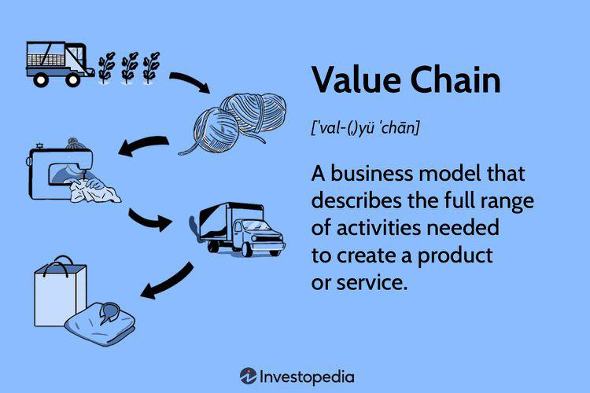

In today's fast-paced business environment, firms face the enduring challenge of maintaining a competitive edge—a crucial determinant of their success. A well-crafted business strategy plays a pivotal role in shaping a company's market position and overall profitability. In this context, businesses are increasingly looking towards innovative approaches to maintain and enhance their competitiveness.

One such approach is the integration of value chain analysis and algorithmic trading into business strategies. Value chain analysis is a strategic tool used to evaluate each step of a company's value creation activities, thereby enabling the identification of areas for improvement and optimization. By refining each component of the value chain, businesses can enhance customer value while minimizing costs, contributing to a stronger competitive advantage.



Algorithmic trading, on the other hand, introduces a technological edge by leveraging mathematical models and computing power to automate trading decisions. This technology offers unparalleled speed, precision, and efficiency, allowing businesses to swiftly respond to market fluctuations and capitalize on emerging opportunities. By integrating algorithmic trading into financial strategies, companies can optimize market positioning and operational efficiency.

Understanding these elements of value chain analysis and algorithmic trading is essential for businesses aiming to improve their operational efficiency and market responsiveness. As the business landscape continues to evolve, the ability to adapt and strategically align resources and capabilities becomes increasingly vital. Employing these tools not only helps in streamlining operations but also positions businesses for sustained growth and competitive resilience in a dynamic market environment.

## Table of Contents

## Understanding Competitive Advantage

Competitive advantage is a crucial concept in business strategy, representing a company's ability to consistently outperform its rivals. This superior performance can be achieved through several strategic routes, including cost leadership, differentiation, and innovation. 

Cost leadership involves becoming the lowest-cost producer in an industry, allowing a company to offer products or services at lower prices or maintain standard prices to achieve higher margins. This strategy relies heavily on efficient production techniques, economies of scale, and tight cost controls. For example, companies like Walmart have traditionally used cost leadership to maintain their competitive positions by sourcing products efficiently and minimizing operational expenses.

Differentiation, on the other hand, focuses on providing unique products or services that offer distinct features valued by customers. This uniqueness can be achieved through innovation, superior quality, brand reputation, or customer service. Companies such as Apple have leveraged differentiation through design and technological innovation, creating a loyal customer base willing to pay premium prices for their products.

Innovation as a competitive advantage involves developing new products, services, or processes that create value for customers and improve the company's market position. This can be seen in sectors like technology and pharmaceuticals, where rapid advancements and research and development investments are pivotal.

To sustain competitive advantage, companies must effectively leverage their unique resources and capabilities. These include tangible assets like proprietary technologies and intangible resources such as brand equity and customer loyalty. The Resource-Based View (RBV) of the firm posits that these resources need to be valuable, rare, inimitable, and non-substitutable (VRIN) for sustained competitive advantage.

Moreover, continuous improvement and strategic adaptability are essential in preserving a competitive position in ever-changing market conditions. This requires businesses to engage in ongoing process enhancements and be responsive to technological advancements and shifting consumer preferences. Implementing feedback mechanisms and maintaining a flexibility-oriented organizational culture are key strategies that facilitate adaptive change.

By understanding and utilizing these elements of competitive advantage, companies can strategically navigate competitive markets, enhancing their prospects for long-term success.

## The Role of Business Strategy

Business strategy is a critical element for achieving long-term organizational objectives, acting as a comprehensive plan that guides a company toward sustained success. A well-crafted strategy aligns the activities of an organization with prevailing market opportunities, ensuring that resources are utilized effectively to meet both current and future challenges. To align organizational activities with market opportunities, companies must identify and capitalize on favorable trends while mitigating potential risks. This requires a thorough understanding of market dynamics and competitor behavior, as well as an ability to anticipate changes in consumer preferences and technological advancements.

Strategic planning involves a rigorous analysis of both internal strengths and external market conditions. Organizations need to conduct internal audits to identify their core competencies, resources, and potential areas for improvement. Concurrently, an examination of external factors such as competitive forces, regulatory environments, and economic conditions provides insight into opportunities and threats in the marketplace. Tools such as SWOT (Strengths, Weaknesses, Opportunities, and Threats) analysis or PESTEL (Political, Economic, Social, Technological, Environmental, and Legal) analysis are often utilized to systematically assess these dimensions and inform strategic decision-making.

In an ever-evolving competitive landscape, companies must continually refine their business strategies to maintain relevance and efficiency. This requires a dynamic approach to strategy formulation and implementation, where continuous feedback and evaluation play a central role. By adopting agile methodologies, businesses can promptly react to changes, leveraging real-time data and analytics to drive decision-making. Advanced technologies, including [machine learning](/wiki/machine-learning) and [artificial intelligence](/wiki/ai-artificial-intelligence), further enhance this agility by offering predictive insights and optimizing operational processes.

To illustrate, consider a company operating in an industry undergoing rapid technological change. By deploying a strategy focused on innovation, the company can invest in R&D and foster a culture of creativity and experimentation. This strategic orientation not only aids in developing unique products or services but also helps in capturing new market segments, thereby reinforcing the company's competitive position.

In conclusion, a robust business strategy functions as a navigational tool that steers organizations through the complexities of the market landscape. It harmonizes internal capabilities with external opportunities, enabling firms to achieve long-term goals and adapt to environmental shifts. As strategies are refined and executed effectively, businesses enhance their chances for sustained growth and profitability in an increasingly competitive economy.

## Exploring Value Chain Analysis

Value chain analysis is a strategic tool used to identify and optimize the various activities a company undertakes to create value for its customers. By dissecting each stage of the value chain, businesses can pinpoint inefficiencies, allocate resources more effectively, and enhance the overall value delivered at a reduced cost. 

The concept of the value chain was introduced by Michael E. Porter in his 1985 book, "Competitive Advantage: Creating and Sustaining Superior Performance." Porter's value chain framework divides a company's activities into primary and support activities. Primary activities encompass inbound logistics, operations, outbound logistics, marketing and sales, and service. Support activities include procurement, technology development, human resource management, and firm infrastructure. Each of these activities plays a critical role in adding value to the organization's product or service.

To effectively employ value chain analysis, a company must begin by systematically examining each individual activity in its process. This involves assessing the inputs, transformation processes, outputs, and the linkages between activities. By doing so, firms can determine which processes are the most cost-effective or add the greatest value, allowing them to allocate resources towards strengthening these areas.

For example, if a firm identifies that its inbound logistics are particularly efficient, ensuring timely delivery and reduced storage costs, further investments can be directed towards enhancing these processes. Conversely, if the analysis reveals inefficiencies in outbound logistics, such as delays in product distribution, strategies can be developed to overcome these bottlenecks, thereby increasing customer satisfaction and competitive advantage.

Optimizing the value chain involves minimizing costs while maximizing output quality. This can be illustrated by the formula for profit maximization, $\text{Profit} = \text{Total Revenue} - \text{Total Cost}$. By increasing efficiency across the value chain, firms can boost revenue or reduce costs, thereby enhancing profits.

In addition, technology plays an instrumental role in modern value chain analysis. Tools such as data analytics and automation enable firms to gain real-time insights into their operations, driving further efficiencies. For instance, machine learning algorithms can predict demand fluctuations, allowing companies to adjust their production schedules and inventories accordingly. An example of such an algorithm in Python might look like:

```python
from sklearn.ensemble import RandomForestRegressor
import numpy as np

# Example demand data
demand_data = np.array([[10, 500], [15, 600], [20, 700], [25, 900]])
X = demand_data[:, 0].reshape(-1, 1) # Features (e.g., past demand)
y = demand_data[:, 1]                # Target variable (e.g., future demand)

# Create and fit the model
model = RandomForestRegressor()
model.fit(X, y)

# Predict future demand
future_features = np.array([[30]])    # Example future scenario
predicted_demand = model.predict(future_features)
print(predicted_demand)
```

By enhancing every component of the value chain, firms can bolster their market position, deliver superior customer value, and achieve a sustainable competitive advantage. The overarching goal is to create an efficient and effective operation that not only meets the current demands of the market but is also flexible enough to adapt to future changes.

## Algorithmic Trading: A Technological Edge

Algorithmic trading is an advanced methodology in which mathematical models are used to execute trading decisions through computer algorithms. This autonomous trading approach provides substantial advantages in speed, precision, and efficiency, which are critical in the fast-paced financial markets. Unlike human traders, algorithmic systems can process vast volumes of data and execute multiple transactions instantaneously, thereby capitalizing on fleeting market opportunities.

Key to its effectiveness is the ability to respond to real-time data and market conditions with minimal latency. High-frequency trading ([HFT](/wiki/high-frequency-trading-strategies)), a subset of [algorithmic trading](/wiki/algorithmic-trading), is particularly reliant on these capabilities, as it seeks to profit from minuscule price movements over very short time frames. According to a study by Aldridge (Aldridge, I. (2013). High-Frequency Trading: A Practical Guide to Algorithmic Strategies and Trading Systems), HFT firms can execute thousands of trades in microseconds, which would be inconceivable for a human trader.

The competitive edge algorithmic trading offers is further amplified through machine learning and advanced data analytics. These technologies enable trading algorithms to learn from data, adapt strategies in response to market shifts, and improve decision-making over time. For example, Python libraries such as TensorFlow and scikit-learn can be utilized to build predictive models that forecast stock price movements based on historical data patterns.

```python
import numpy as np
from sklearn.ensemble import RandomForestRegressor

# Example of implementing a simple predictive model for stock prices
# Assuming `X_train` is the feature set and `y_train` is the target variable
model = RandomForestRegressor(n_estimators=100, random_state=42)
model.fit(X_train, y_train)

# Predictions based on test data
predictions = model.predict(X_test)
```

In a broader context, algorithmic trading plays a pivotal role in optimizing financial strategies. For example, portfolio management and risk assessment processes can be refined by integrating algorithmic solutions capable of rebalancing portfolios more effectively than traditional methods. The ability to execute complex strategies such as statistical [arbitrage](/wiki/arbitrage) and pairs trading with enhanced speed and minimal human intervention underscores the transformative impact of algorithmic trading on the financial industry.

As companies harness algorithmic trading to bolster their market positioning, they gain a substantial advantage through enhanced operational efficiency and the ability to swiftly adjust to market dynamics. This capability not only increases the probability of exploiting profitable opportunities but also allows firms to manage risks more adeptly, solidifying their competitive standing in the financial markets.

## Integrating Value Chain Analysis with Algo Trading

Integrating value chain analysis with algorithmic trading offers a powerful strategy for businesses seeking to optimize their operations and financial transactions. This integration begins by recognizing how value chain insights can pinpoint key areas where algorithmic trading might yield significant benefits. 

### Value Chain Insights and Algorithmic Trading Impact

Value chain analysis involves evaluating each component of a company’s operations to enhance efficiency and value creation. By scrutinizing the different stages of production and service delivery, businesses can identify segments where algorithmic trading would be most impactful. For instance, procurement and supply chain logistics can benefit from real-time trading algorithms that optimize purchasing strategies based on market price fluctuations.

### Optimization of Operations and Financial Transactions

Algorithmic trading can uniquely address the requirements identified through value chain analysis. These algorithms, driven by advanced mathematical models, can execute high-frequency trades and make swift decisions that account for complex market signals. This capability supports the optimization of both operational workflow and capital deployment.

```python
import numpy as np
import pandas as pd

def optimize_trading_strategy(market_data):
    # Example function to simulate trading strategy optimization

    signals = generate_market_signals(market_data)
    optimal_strategy = []

    for signal in signals:
        if is_profitable(signal):
            optimal_strategy.append(execute_trade(signal))

    return optimal_strategy

def generate_market_signals(data):
    # Function to generate trade signals based on market data
    # This is a simplified example and would need more complexity in a real scenario

    return np.random.choice(['buy', 'sell', 'hold'], size=len(data))

def is_profitable(signal):
    # Dummy condition for trading profitability

    return signal in ['buy', 'sell']

def execute_trade(signal):
    # Simulate trade execution
    # In reality, this would interact with a trading platform

    return f"Executed {signal} trade"

# Assume 'market_data' is a DataFrame containing historical market prices
market_data = pd.DataFrame({'price': np.random.randn(100)})
optimize_trading_strategy(market_data)
```

### Achieving Operational Synergy and Competitive Resilience

Combining the precision of algorithmic trading with the structured approach of value chain analysis creates operational synergy. Such integration not only streamlines financial transactions but also enhances decision-making processes across the value chain. This results in a business that is both competitive and resilient, capable of adapting quickly to market changes while maintaining strategic coherence. By leveraging these tools, companies can better navigate the complexities of modern markets, sustain competitive advantage, and achieve long-term profitability.

## Case Studies and Real-World Applications

Several firms have exemplified the successful integration of value chain analysis and algorithmic trading, leading to significant competitive advantages. Here, we examine select case studies and real-world applications that highlight the impact of these strategies.

One notable case is that of Goldman Sachs, a global investment banking firm. They have extensively utilized algorithmic trading to enhance their market operations. By implementing high-frequency trading algorithms, Goldman Sachs improved the speed and accuracy of their trades, thereby gaining a competitive edge in the financial markets. Their algorithmic systems are designed to process market data in real-time, executing complex trading strategies that human traders would find challenging to perform with similar speed and precision. This technology not only optimizes their financial transactions but also significantly reduces the transaction costs associated with conventional trading methods.

In parallel, Dell Technologies offers an insightful example of employing value chain analysis to enhance operational efficiency. By meticulously analyzing each component of their production and delivery processes, Dell identified opportunities to reduce cost and time, ultimately providing greater value to their customers. For instance, Dell's build-to-order model is an outcome of this analysis, where they leveraged value chain insights to minimize inventory costs and improve customer service through customized computer systems. This strategic alignment of operations with consumer needs has helped Dell maintain a strong market position.

Moreover, the logistics giant FedEx illustrates how the combination of value chain analysis and algorithmic trading can be applied beyond traditional financial sectors. FedEx uses algorithmic solutions to manage logistics and supply chain operations. By integrating predictive analytics and routing algorithms, FedEx optimizes delivery paths, enhances shipment tracking accuracy, and reduces fuel consumption. These innovations not only improve operational efficiency but also contribute to sustainability goals, underscoring the strategic value of technological integration.

These case studies underscore the practical benefits of combining value chain analysis and algorithmic trading. Firms that strategically implement these tools can achieve improved operational efficiency, streamlined processes, and enhanced market responsiveness. As demonstrated by these real-world examples, leveraging technology in this manner is instrumental in maintaining a competitive advantage. Other businesses can draw valuable lessons from these examples, applying similar strategies within their own operational contexts to achieve strategic success.

## Conclusion

Achieving a competitive advantage requires a multifaceted approach and innovative thinking that combines strategic methodologies and technological advancements. The integration of value chain analysis and algorithmic trading has emerged as a pivotal strategy, enhancing business success by optimizing operational processes and financial strategies.

Value chain analysis enables businesses to scrutinize each stage of their production processes, identifying areas where value can be maximized while minimizing costs. This thorough examination helps in strengthening each link of the chain, thereby enhancing the overall competitive posture of the firm. Algorithmic trading, on the other hand, brings precision and speed to financial transactions, allowing businesses to react swiftly to market fluctuations and capitalize on emerging opportunities. Together, these strategies create a holistic framework that not only enhances efficiency but also strengthens market positioning.

As markets evolve, the necessity for companies to adapt and refine their strategies grows increasingly important. With rapid technological advancements and changing consumer preferences, businesses must remain agile, continuously integrating new insights and tools to maintain their competitive edge. By effectively leveraging value chain analysis and algorithmic trading, companies can position themselves for sustained growth and profitability amidst fluctuating market conditions.

Ultimately, the goal is to forge a business model that is both resilient and adaptive, capable of thriving under any market condition. This resilience is built on a foundation of continuous improvement and strategic innovation, ensuring that the business can weather any challenges and seize potential opportunities. In an ever-changing business landscape, such proactive and integrated strategies empower organizations to not only survive but excel, achieving lasting success in their respective industries.

## References & Further Reading

[1]: Porter, M. E. (1985). ["Competitive Advantage: Creating and Sustaining Superior Performance."](https://www.hbs.edu/faculty/Pages/item.aspx?num=193) Free Press.

[2]: Aldridge, I. (2013). ["High-Frequency Trading: A Practical Guide to Algorithmic Strategies and Trading Systems."](https://www.wiley.com/en-us/High+Frequency+Trading%3A+A+Practical+Guide+to+Algorithmic+Strategies+and+Trading+Systems%2C+2nd+Edition-p-9781118343500) Wiley.

[3]: "Advances in Financial Machine Learning" by Marcos Lopez de Prado. [(Link to book)](https://www.amazon.com/Advances-Financial-Machine-Learning-Marcos/dp/1119482089)

[4]: Jansen, S. (2018). ["Machine Learning for Algorithmic Trading."](https://github.com/stefan-jansen/machine-learning-for-trading) Packt Publishing.

[5]: Chan, E. P. (2008). ["Quantitative Trading: How to Build Your Own Algorithmic Trading Business."](https://github.com/ftvision/quant_trading_echan_book) Wiley.