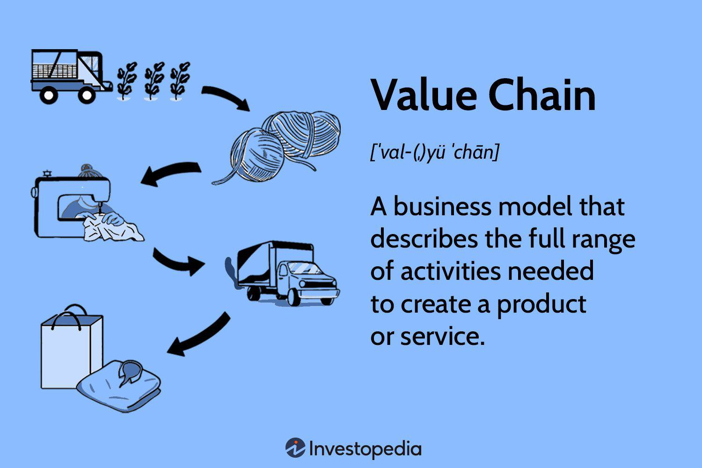

Value change in stock trading refers to the fluctuations in the price of a stock over a specific period. This change is a crucial metric utilized by investors and financial analysts to assess the performance and potential of stocks within the financial markets. Understanding value change is vital as it provides insights into market trends, investor sentiment, and the broader economic landscape, thereby aiding in making informed investment decisions.

In the stock market, value change is influenced by a myriad of factors, including but not limited to, market dynamics, supply and demand conditions, and macroeconomic indicators. Investors and analysts closely monitor these changes to evaluate risk, forecast potential returns, and strategize their investment portfolios accordingly. By analyzing historical value changes, financial professionals can identify patterns that signal future performance, thus allowing them to optimize their trading practices.



Furthermore, value change is integral to algorithmic trading, a sophisticated method of executing trades using automated and pre-programmed trading instructions. Algorithmic trading systems leverage real-time data, including value changes, to make swift and efficient trading decisions with minimal human intervention. These systems use algorithms to detect trends from value changes, determine optimal entry and exit points, and execute trades with precision, thus enhancing the speed and accuracy of trading operations. As such, understanding value change not only benefits traditional traders but is also crucial for developing robust algorithmic trading models.

## Table of Contents

## Understanding the Concept of Value Change

Value change in the stock market refers to the fluctuation in the market value of a stock over a specific time period. It is an essential metric for investors and traders as it provides insights into the potential profitability or risk associated with holding a particular stock. Understanding value change assists in determining the health and performance of a company and the general sentiment in the market.

**Factors Affecting Value Change**

Several factors influence the value change in stocks, with market dynamics playing a crucial role. Market dynamics encompass a myriad of elements, including economic indicators, investor sentiment, geopolitical events, and macroeconomic trends. These elements collectively shape the market environment and influence the supply and demand forces in the stock market.

Supply and demand are fundamental drivers of stock value changes. When the demand for a stock increases, its price typically rises, reflecting positive value change. Conversely, if there is more supply than demand, the stock price is likely to decrease, resulting in negative value change. Investor perception, company performance, and broader economic conditions primarily dictate these supply-demand dynamics.

**Calculation and Adjustment of Value Change**

Value change is calculated as the absolute or percentage change in the stock price between two points in time. The absolute value change is given by:

$$
\text{Absolute Value Change} = \text{Closing Price}_t - \text{Closing Price}_{t-1}
$$

where $\text{Closing Price}_t$ is the closing price of the stock at time $t$, and $\text{Closing Price}_{t-1}$ is the closing price at time $t-1$.

The percentage value change is calculated as:

$$
\text{Percentage Value Change} = \frac{\text{Closing Price}_t - \text{Closing Price}_{t-1}}{\text{Closing Price}_{t-1}} \times 100\%
$$

This calculation helps investors evaluate the relative performance of different stocks over the same period.

Moreover, value change is adjusted daily based on the number of outstanding shares, which can affect the stock's market capitalization and perceived value. Changes in the number of outstanding shares, due to periodic issuance or buybacks, can influence the stock's market price independently of trading activities, thus impacting the calculated value change.

Understanding these calculations and factors is crucial for investors and analysts to interpret market trends accurately and make informed investment decisions. Deploying these insights helps in predicting future price movements and assessing investment risks effectively.

## Mechanisms Influencing Value Change

Value change in stock trading is a pivotal element that helps in understanding market dynamics and investor behavior. It reflects how the market adjusts to new information and incorporates investor expectations and sentiments.

Value change profoundly mirrors investor behavior and market conditions. When investors anticipate economic growth or downturn, their buying or selling actions directly impact stock prices. Market sentiment is influenced by global economic trends, geopolitical affairs, and investor outlook. For instance, a bullish market might show widespread optimism, leading to increased buying activity and a consequent rise in stock values. Conversely, a bearish market reflects skepticism and risk aversion, often resulting in depreciating stock prices.

Economic indicators and news play a vital role in influencing value changes. Key indicators like GDP growth rates, unemployment data, inflation rates, and consumer confidence indexes provide critical insights into economic health. Positive economic news can bolster market confidence, prompting investors to buy, which pushes stock values higher. Conversely, negative news can lead to increased selling pressures and a decrease in value. News about changes in monetary policies, such as [interest rate](/wiki/interest-rate-trading-strategies) adjustments by central banks, can also result in significant value fluctuations. For example, an interest rate hike may make borrowing more expensive, slowing down economic activity, and potentially decreasing stock values.

Company-specific events are crucial in impacting value change as they directly affect a firm’s perceived profitability and risk profile. Earnings reports are particularly influential; if a company reports earnings significantly above expectations, the stock price typically appreciates as investors anticipate greater profits. Conversely, if the earnings are below forecasts, it can result in a decline in stock value as future profit expectations are reassessed downwards. Other significant events include product launches, management changes, regulatory issues, and mergers and acquisitions. These events can lead to rapid value changes as investors quickly reassess the company’s future prospects.

Overall, understanding the mechanisms behind value change requires analyzing how investor behavior, economic indicators, news, and company-specific events interact to affect stock prices. For traders and financial analysts, recognizing these factors can provide valuable insights for predicting market movements and making informed investment decisions.

## Examples of Value Change in Action

Value change in stock prices is a crucial indicator of market dynamics and investor sentiment. It represents the change in a stock's price over a given period and is pivotal in assessing a company's financial health and future prospects.

### Hypothetical Examples

Consider a company, XYZ Corp., that manufactures electric vehicles. Suppose XYZ Corp. announces a breakthrough in battery technology, promising to double the range of their electric cars. This news can significantly increase market demand for XYZ's stock, causing its price to rise from $100 to $150 within a week. The value change in this scenario is $50 per share, indicating strong positive sentiment among investors, expecting future profitability and market growth.

Alternatively, imagine XYZ Corp. faces a major recall due to a defect found in its vehicles. This negative news might result in a drop in stock price from $150 to $100 in a day, reflecting a value change of -$50 per share. The sudden decline indicates investors' loss of confidence and concerns over the company's future earnings and reputation.

### Real-World Cases

A notable real-world example is the substantial value change in Tesla Inc.'s stock following its inclusion in the S&P 500 index in December 2020. Tesla’s stock price surged, reflecting increased investor interest and institutional buying. The announcement led to a value change that significantly impacted market perception, as it was seen as validation of Tesla's position in the market.

Another instance is the effect on Boeing's stock in early 2019, when safety concerns regarding its 737 Max aircraft resulted in substantial declines in stock value. The negative value change in Boeing’s stock reflected market concerns over potential financial and reputational damage.

### Leveraging Value Change Data

Traders can leverage value change data to inform their strategies. For instance, a trader may program an algorithm to trigger buy orders when a stock's two-day moving average crosses above its previous five-day moving average, indicating a positive trend or value change. The formula for a simple moving average (SMA) is:

$$
\text{SMA}(n) = \frac{P_1 + P_2 + \ldots + P_n}{n}
$$

where $P_1, P_2, \ldots, P_n$ are the closing prices over $n$ days.

In case of a significant negative value change, traders might set up stop-loss orders to limit potential losses. By analyzing value change trends, traders can anticipate market movements and adjust their portfolios accordingly, enhancing decision-making and optimizing returns.

In conclusion, hypothetical and real-world examples of value change demonstrate its profound impact on stock market dynamics and the decision-making process of investors. Accurate interpretation of value change data enables traders to make well-informed investment choices.

## Value Change in Algorithmic Trading

Incorporating value change metrics into [algorithmic trading](/wiki/algorithmic-trading) strategies entails analyzing these metrics to inform trading decisions. Value change reflects fluctuations in a stock's price and can serve as a critical indicator for optimizing trading strategies.

One of the primary applications of value change data is programming entry and [exit](/wiki/exit-strategy) points within trading algorithms. By setting thresholds for value change, algorithms can automatically trigger buy or sell orders. For example, if a stock's value change surpasses a predefined percentage, it might signal a favorable moment to buy, anticipating further upward [momentum](/wiki/momentum). Conversely, if the value change falls below a certain threshold, it could prompt the algorithm to sell, thereby reducing potential losses.

Algorithmic models also play a significant role in predicting future value changes. These models use historical data and statistical techniques to forecast price movements. Machine learning algorithms, such as time series analysis and neural networks, are particularly effective. For instance, a model can be trained to predict value changes based on input features like historical price data, trading [volume](/wiki/volume-trading-strategy), and relevant news indicators. The formula used in a simple predictive model might be:

$$
\text{Future Value Change} = \text{Intercept} + \sum (\text{Coefficient}_i \times \text{Feature}_i)
$$

This model evaluates multiple features, adjusting coefficients to minimize prediction error.

Consider the following Python example. This code employs a basic [machine learning](/wiki/machine-learning) model using the `scikit-learn` library to forecast value changes based on historical data:

```python
from sklearn.linear_model import LinearRegression
import numpy as np

# Example historical data: features could be past prices, volumes, etc.
X = np.array([[1.2, 3.4], [2.1, 4.0], [3.1, 5.2]])  # Features
y = np.array([0.5, 0.6, 0.7])  # Target future value changes

# Initialize and train the model
model = LinearRegression()
model.fit(X, y)

# Predict future value change
new_data = np.array([[1.5, 3.5]])  # New data point
predicted_change = model.predict(new_data)

print(f"Predicted Value Change: {predicted_change[0]}")
```

In the code snippet above, `X` represents past inputs (such as previous value changes and other financial metrics), and `y` shows their associated value changes. By fitting the model and predicting using new data, traders can assess potential future movements.

Ultimately, integrating value change metrics within algorithmic trading requires meticulous data analysis and strategic implementation. These metrics enhance the precision of trades, providing a data-driven foundation for more sophisticated investment decisions.

## Benefits and Challenges of Using Value Change

Focusing on value change in stock trading offers several advantages, most notably in enhancing trading accuracy. By closely monitoring value change, traders can identify trends and patterns that may indicate shifts in market sentiment. These insights allow for more precise adjustments to investment portfolios, leading to potential increases in returns. For instance, by understanding the mechanisms of value change, investors can better predict stock price movements, enabling them to buy stocks at a low price and sell them at a high price.

However, there are notable challenges associated with relying solely on value change metrics. Market [volatility](/wiki/volatility-trading-strategies) is a significant concern, as sudden price swings can obscure the underlying reasons for a value change, making it difficult for traders to make informed decisions. Additionally, data reliability poses a challenge. Market data is subject to errors, delays, and potential manipulation, all of which can skew value change calculations. Traders must critically assess the sources of their data to ensure its accuracy and reliability.

To effectively leverage value change, it is vital to complement these metrics with other analytical tools. This multifaceted approach can provide a broader understanding of market dynamics. For example, integrating technical analysis, [fundamental analysis](/wiki/fundamental-analysis), and sentiment analysis with value change metrics can offer a more comprehensive view of market conditions. Using Python, traders can develop algorithms that [factor](/wiki/factor-investing) in multiple types of data:

```python
def calculate_composite_score(stock_data, value_change, technical_indicators, sentiment):
    return (0.4 * value_change + 0.3 * technical_indicators + 0.3 * sentiment)

stock_data = {...}  # hypothetical data input
value_change = compute_value_change(stock_data)
technical_indicators = compute_technical_indicators(stock_data)
sentiment = compute_sentiment(stock_data)

score = calculate_composite_score(stock_data, value_change, technical_indicators, sentiment)
decision = "Buy" if score > threshold else "Sell"
```

Such models enable the integration of diverse data points, enhancing prediction accuracy and providing traders with actionable insights. Understanding both the benefits and challenges of using value change as part of a broader strategy is essential for making informed investment decisions.

## Conclusion

Understanding value change is crucial for investors and financial analysts who aim to maximize returns and mitigate risks in the stock market. Value change, as a dynamic economic indicator, provides insights into how the price of stocks fluctuates over time due to various factors such as market dynamics and investor sentiment. These price fluctuations illuminate underlying patterns and trends that inform decision-making processes.

Incorporating value change into algorithmic trading amplifies the potential to make informed trading decisions. Algorithms can process vast amounts of data, identifying value changes with precision and speed far beyond human capabilities. This enables traders to set more accurate entry and exit points, optimizing strategy execution. Algorithmic models can then predict future value changes, allowing for proactive positioning in the market.

Despite its benefits, value change is only one of several metrics that should guide trading strategies. While powerful, it is not infallible due to inherent market volatility and occasional data discrepancies. Therefore, it is essential to complement value change analysis with other tools and indicators to achieve a holistic understanding of market conditions and enhance predictive accuracy.

Financial professionals and traders are encouraged to conduct further exploration and analysis of value change and its applications. By staying abreast of ongoing market developments and refining the tools used in analysis, they can better navigate the complexities of the stock market and leverage value change data more effectively. Engaging in continuous learning and adapting to technological advancements will bolster their ability to utilize value change as a pivotal component of their trading strategies.

## References and Further Reading

1. **Book: "Quantitative Equity Portfolio Management: An Active Approach to Portfolio Construction and Management" by Ludwig B. Chincarini and Daehwan Kim**  
   This book provides insights into quantitative strategies and how metrics like value change can be factored into active portfolio management. [Link to Book](https://www.wiley.com/en-us/Quantitative+Equity+Portfolio+Management%3A+An+Active+Approach+to+Portfolio+Construction+and+Management-p-9780071459393)

2. **Research Paper: "Factors that Influence Stock Price Volatility: A Study of Financial Institutions during the 2007-2008 Global Financial Crisis" by Hong Kong Baptist University**  
   This paper discusses various factors influencing stock prices, including value change, particularly during periods of financial instability. [Link to Paper](https://repository.hkbu.edu.hk/hkbu_staff_publication/1477/)

3. **Article: "The Role of Behavioral Finance in Investment Decisions"**  
   An article exploring how investor behavior impacts stock value changes and how it can be analyzed for better investment outcomes. [Link to Article](https://www.investopedia.com/articles/basics/behavioralfinance.asp)

4. **Journal Article: "Algorithmic Trading and the Role of Value Change in Algorithm Development"**  
   This article discusses how algorithmic trading mechanisms incorporate metrics such as value change to enhance trading strategies. [Link to Journal](https://www.sciencedirect.com/science/article/pii/S0165188913000370)

5. **Study: "Market Reactions to Earnings Announcements and the Value Change Phenomenon"**  
   A study analyzing the impact of corporate earnings announcements on value change and subsequent stock price adjustments. [Link to Study](https://doi.org/10.1111/j.1540-6261.2004.00640.x)

6. **Report: "Understanding Market Dynamics and Value Change" by the CFA Institute**  
   This report provides an overview of market dynamics, highlighting the importance of understanding value change in financial markets. [Link to Report](https://www.cfainstitute.org/en/research/financial-analysis-journal/)

By exploring these resources, traders and financial analysts can gain deeper insights into how value change affects stock trading and how it can be effectively integrated into investment strategies.

## References & Further Reading

[1]: Bergstra, J., Bardenet, R., Bengio, Y., & Kégl, B. (2011). ["Algorithms for Hyper-Parameter Optimization."](https://dl.acm.org/doi/10.5555/2986459.2986743) Advances in Neural Information Processing Systems 24.

[2]: ["Advances in Financial Machine Learning"](https://www.amazon.com/Advances-Financial-Machine-Learning-Marcos/dp/1119482089) by Marcos Lopez de Prado

[3]: ["Evidence-Based Technical Analysis: Applying the Scientific Method and Statistical Inference to Trading Signals"](https://www.amazon.com/Evidence-Based-Technical-Analysis-Scientific-Statistical/dp/0470008741) by David Aronson

[4]: ["Machine Learning for Algorithmic Trading"](https://github.com/stefan-jansen/machine-learning-for-trading) by Stefan Jansen

[5]: ["Quantitative Trading: How to Build Your Own Algorithmic Trading Business"](https://www.amazon.com/Quantitative-Trading-Build-Algorithmic-Business/dp/1119800064) by Ernest P. Chan