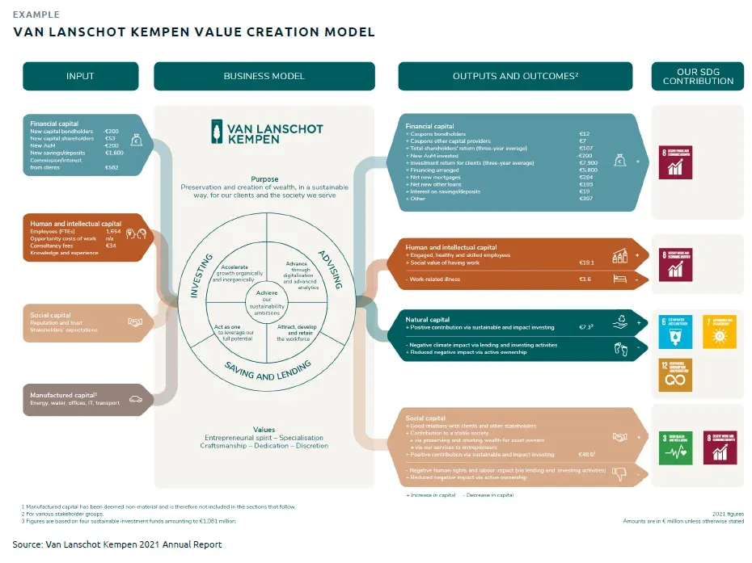

## Table of Contents

## What is the concept of value change?

Value change is when the things people think are important or good start to change over time. For example, what was considered valuable or right in the past might not be seen the same way today. This can happen because of new ideas, changes in society, or because people learn new things.

These changes can affect how people behave and make decisions. For instance, if more people start to value protecting the environment, they might choose to use less plastic or drive less. Understanding value change helps us see why societies evolve and how people's priorities shift as the world around them changes.

## Why is understanding value change important?

Understanding value change is important because it helps us see how and why people's ideas about what is good or important change over time. When we know this, we can better understand why people start to act differently. For example, if more people start to care about the environment, they might begin to recycle more or use less energy. This shows us that changes in what people value can lead to big changes in how they live their lives.

It's also important for making good decisions in society. If leaders and planners know that people's values are changing, they can make better choices about laws, policies, and programs. For instance, if people start to value health more, governments might put more money into healthcare. By understanding value change, we can plan for the future in a way that matches what people care about, making society better for everyone.

## How does value change occur in society?

Value change happens in society because of many different things. One big reason is new ideas. When people learn about new ways of thinking or new information, it can make them see the world differently. For example, if scientists find out that something we do is bad for the environment, more people might start to value protecting nature. Also, big events like wars or economic changes can make people rethink what's important. If a country goes through a tough time, people might start to value things like safety and stability more than before.

Another way value change happens is through the influence of different groups of people. As societies become more connected, ideas from one place can spread to another. For example, if a lot of people start to care about human rights in one country, those ideas can spread to other countries and change what people there think is important. Also, as generations change, younger people might grow up with different values than their parents. They might value technology and innovation more because that's what they grew up with. Over time, these new values can become more common in society.

So, value change is a slow process that happens because of new ideas, big events, the influence of different groups, and the way different generations think. It's like a big, slow-moving wave that changes what people care about and how they live their lives.

## What are the main mechanisms driving value change?

Value change happens because of new ideas. When people learn something new or see things in a different way, their values can change. For example, if scientists find out that a certain behavior harms the environment, more people might start to value protecting nature. Big events like wars or economic crises can also make people rethink what's important. If a country faces tough times, people might value safety and stability more than before.

Another way value change happens is through the influence of different groups and generations. As societies become more connected, ideas from one place can spread to another. If a lot of people in one country start caring about human rights, those ideas can spread and change what people in other countries value. Also, younger generations might grow up with different values than their parents. They might value technology and innovation more because that's what they know. Over time, these new values can become more common in society.

So, value change is a slow process driven by new ideas, big events, and the influence of different groups and generations. It's like a big, slow-moving wave that changes what people care about and how they live their lives.

## Can you provide an example of value change in history?

One big example of value change in history is how people's views on women's rights changed over time. In the past, many societies believed that women should stay at home and not have the same rights as men. But, as new ideas spread and more people started to think about equality, things began to change. In the late 19th and early 20th centuries, more and more people started to believe that women should have the right to vote. This led to big movements for women's suffrage, and eventually, many countries gave women the right to vote.

Another example is how people's values about the environment have changed. In the past, many people didn't think much about protecting nature. They focused more on using natural resources to build things and make money. But, as scientists learned more about how pollution and climate change harm the planet, people's values started to change. By the late 20th century, more people began to care about protecting the environment. This led to new laws and movements to save nature and reduce pollution.

## How do cultural factors influence value change?

Cultural factors play a big role in how values change over time. Culture includes things like traditions, beliefs, and the way people live their lives. When cultures mix or change, new ideas can spread and make people think differently about what's important. For example, if a society values family a lot, but then starts to value personal freedom more because of new ideas from another culture, people might start to change how they live and what they think is important.

Another way cultural factors influence value change is through big events or movements that happen in a culture. For instance, if a country goes through a civil rights movement, the culture might start to value equality and fairness more than before. These movements can change what people think is right and wrong, leading to new values that become part of the culture. Over time, these new values can become the norm and shape how future generations see the world.

## What role do economic conditions play in value change?

Economic conditions can really change what people think is important. When times are tough and money is tight, people might start to value things like safety and stability more. They might worry more about having enough to eat or a place to live, so those things become more important to them. On the other hand, when the economy is doing well and people have more money, they might start to care more about things like education, travel, or enjoying life. So, how much money people have and how the economy is doing can make them rethink what they value.

Also, big economic changes can make people's values shift over time. For example, if a country goes from being poor to being rich, people might start to value different things. They might care more about getting a good job or buying nice things. Economic changes can also bring new ideas and ways of living that change what people think is important. So, the economy can be a big reason why people's values change, because it affects what they can do and what they want in life.

## How can value change be measured and tracked over time?

Value change can be measured and tracked over time by looking at surveys and polls. Researchers often ask people about what they think is important and compare the answers over many years. For example, they might ask people if they care a lot about the environment or about having a good job. By seeing how these answers change, researchers can tell if people's values are shifting. They can also use big studies that happen every few years to see long-term trends in what people value.

Another way to track value change is by looking at what people do. If more people start to recycle or use less energy, it might mean they value the environment more. Also, if more people go to school or learn new skills, it might mean they value education more. By watching these actions, we can see if people's values are changing. This helps us understand how society is changing and what might happen in the future.

## What are the psychological theories behind value change?

One psychological theory behind value change is called cognitive dissonance. This theory says that when people see or learn something new that doesn't match what they already believe, they feel uncomfortable. To feel better, they might change their values to fit the new information. For example, if someone learns that using plastic is bad for the environment, they might start to value protecting nature more and try to use less plastic. This shows how new information can make people change what they think is important.

Another theory is social learning theory. This theory says that people learn values by watching and copying others. If someone sees a lot of people around them starting to care about something new, like human rights, they might start to care about it too. Over time, as more people in a society start to value the same things, these values can spread and become more common. This shows how the people around us can influence what we think is important and how our values can change.

## How does globalization affect value change across different cultures?

Globalization makes the world more connected, which can change what people in different cultures think is important. When people from different places start to talk and share ideas, they might start to value things that they didn't before. For example, if someone in one country sees that people in another country care a lot about the environment, they might start to care about it too. This can happen because of movies, the internet, or people traveling to new places. As ideas spread, people's values can change to be more like the values of other cultures.

Also, globalization can bring new ways of living and working that change what people value. If a country starts to do more business with other countries, people might start to value money and success more. Or, if new technology comes from another country, people might start to value innovation and progress. Over time, these changes can make different cultures start to value similar things. So, globalization can mix and change values across the world, making people's ideas about what's important more alike.

## What are the challenges in predicting future value changes?

Predicting future value changes is hard because many things can affect what people think is important. It's like trying to guess the weather a long time from now. New ideas, big events, and the way people live their lives can all make values change in ways we might not expect. For example, a new invention could make people value technology more, or a war could make them value peace and safety. Because there are so many different things that can happen, it's tough to know exactly how values will change.

Another challenge is that different groups of people can have very different values. What's important to one group might not matter to another. For example, young people might care more about the environment than older people. Also, values can change at different speeds in different places. In one country, people might start to care about human rights quickly, while in another country, it might take a long time. All these differences make it hard to predict how values will change across the whole world.

## How can organizations and policymakers respond effectively to value change?

Organizations and policymakers can respond to value change by staying aware of what people care about. They can do this by looking at surveys and talking to people to see how their values are changing. If they see that more people start to care about the environment, they can make new rules or start programs to help protect nature. By keeping up with value changes, they can make choices that match what people think is important, which can make people happier and more supportive of what they do.

Another way to respond effectively is by being flexible and ready to change. When values change, what worked before might not work anymore. So, organizations and policymakers need to be ready to try new things and change their plans. If people start to value education more, they might need to spend more money on schools or make it easier for people to learn new skills. By being open to change and listening to what people want, they can keep up with value changes and help make society better for everyone.

## What is the concept of value change and how can it be understood?

Value change in the stock market refers to the fluctuation in the market value of a stock over a specific time period. It is an essential metric for investors and traders as it provides insights into the potential profitability or risk associated with holding a particular stock. Understanding value change assists in determining the health and performance of a company and the general sentiment in the market.

**Factors Affecting Value Change**

Several factors influence the value change in stocks, with market dynamics playing a crucial role. Market dynamics encompass a myriad of elements, including economic indicators, investor sentiment, geopolitical events, and macroeconomic trends. These elements collectively shape the market environment and influence the supply and demand forces in the stock market.

Supply and demand are fundamental drivers of stock value changes. When the demand for a stock increases, its price typically rises, reflecting positive value change. Conversely, if there is more supply than demand, the stock price is likely to decrease, resulting in negative value change. Investor perception, company performance, and broader economic conditions primarily dictate these supply-demand dynamics.

**Calculation and Adjustment of Value Change**

Value change is calculated as the absolute or percentage change in the stock price between two points in time. The absolute value change is given by:

$$
\text{Absolute Value Change} = \text{Closing Price}_t - \text{Closing Price}_{t-1}
$$

where $\text{Closing Price}_t$ is the closing price of the stock at time $t$, and $\text{Closing Price}_{t-1}$ is the closing price at time $t-1$.

The percentage value change is calculated as:

$$
\text{Percentage Value Change} = \frac{\text{Closing Price}_t - \text{Closing Price}_{t-1}}{\text{Closing Price}_{t-1}} \times 100\%
$$

This calculation helps investors evaluate the relative performance of different stocks over the same period.

Moreover, value change is adjusted daily based on the number of outstanding shares, which can affect the stock's market capitalization and perceived value. Changes in the number of outstanding shares, due to periodic issuance or buybacks, can influence the stock's market price independently of trading activities, thus impacting the calculated value change.

Understanding these calculations and factors is crucial for investors and analysts to interpret market trends accurately and make informed investment decisions. Deploying these insights helps in predicting future price movements and assessing investment risks effectively.

## What are examples of value change in action?

Value change in stock prices is a crucial indicator of market dynamics and investor sentiment. It represents the change in a stock's price over a given period and is pivotal in assessing a company's financial health and future prospects.

### Hypothetical Examples

Consider a company, XYZ Corp., that manufactures electric vehicles. Suppose XYZ Corp. announces a breakthrough in battery technology, promising to double the range of their electric cars. This news can significantly increase market demand for XYZ's stock, causing its price to rise from $100 to $150 within a week. The value change in this scenario is $50 per share, indicating strong positive sentiment among investors, expecting future profitability and market growth.

Alternatively, imagine XYZ Corp. faces a major recall due to a defect found in its vehicles. This negative news might result in a drop in stock price from $150 to $100 in a day, reflecting a value change of -$50 per share. The sudden decline indicates investors' loss of confidence and concerns over the company's future earnings and reputation.

### Real-World Cases

A notable real-world example is the substantial value change in Tesla Inc.'s stock following its inclusion in the S&P 500 index in December 2020. Tesla’s stock price surged, reflecting increased investor interest and institutional buying. The announcement led to a value change that significantly impacted market perception, as it was seen as validation of Tesla's position in the market.

Another instance is the effect on Boeing's stock in early 2019, when safety concerns regarding its 737 Max aircraft resulted in substantial declines in stock value. The negative value change in Boeing’s stock reflected market concerns over potential financial and reputational damage.

### Leveraging Value Change Data

Traders can leverage value change data to inform their strategies. For instance, a trader may program an algorithm to trigger buy orders when a stock's two-day moving average crosses above its previous five-day moving average, indicating a positive trend or value change. The formula for a simple moving average (SMA) is:

$$
\text{SMA}(n) = \frac{P_1 + P_2 + \ldots + P_n}{n}
$$

where $P_1, P_2, \ldots, P_n$ are the closing prices over $n$ days.

In case of a significant negative value change, traders might set up stop-loss orders to limit potential losses. By analyzing value change trends, traders can anticipate market movements and adjust their portfolios accordingly, enhancing decision-making and optimizing returns.

In conclusion, hypothetical and real-world examples of value change demonstrate its profound impact on stock market dynamics and the decision-making process of investors. Accurate interpretation of value change data enables traders to make well-informed investment choices.

## How does value change in algorithmic trading?

Incorporating value change metrics into [algorithmic trading](/wiki/algorithmic-trading) strategies entails analyzing these metrics to inform trading decisions. Value change reflects fluctuations in a stock's price and can serve as a critical indicator for optimizing trading strategies.

One of the primary applications of value change data is programming entry and [exit](/wiki/exit-strategy) points within trading algorithms. By setting thresholds for value change, algorithms can automatically trigger buy or sell orders. For example, if a stock's value change surpasses a predefined percentage, it might signal a favorable moment to buy, anticipating further upward [momentum](/wiki/momentum). Conversely, if the value change falls below a certain threshold, it could prompt the algorithm to sell, thereby reducing potential losses.

Algorithmic models also play a significant role in predicting future value changes. These models use historical data and statistical techniques to forecast price movements. Machine learning algorithms, such as time series analysis and neural networks, are particularly effective. For instance, a model can be trained to predict value changes based on input features like historical price data, trading [volume](/wiki/volume-trading-strategy), and relevant news indicators. The formula used in a simple predictive model might be:

$$
\text{Future Value Change} = \text{Intercept} + \sum (\text{Coefficient}_i \times \text{Feature}_i)
$$

This model evaluates multiple features, adjusting coefficients to minimize prediction error.

Consider the following Python example. This code employs a basic [machine learning](/wiki/machine-learning) model using the `scikit-learn` library to forecast value changes based on historical data:

```python
from sklearn.linear_model import LinearRegression
import numpy as np

# Example historical data: features could be past prices, volumes, etc.
X = np.array([[1.2, 3.4], [2.1, 4.0], [3.1, 5.2]])  # Features
y = np.array([0.5, 0.6, 0.7])  # Target future value changes

# Initialize and train the model
model = LinearRegression()
model.fit(X, y)

# Predict future value change
new_data = np.array([[1.5, 3.5]])  # New data point
predicted_change = model.predict(new_data)

print(f"Predicted Value Change: {predicted_change[0]}")
```

In the code snippet above, `X` represents past inputs (such as previous value changes and other financial metrics), and `y` shows their associated value changes. By fitting the model and predicting using new data, traders can assess potential future movements.

Ultimately, integrating value change metrics within algorithmic trading requires meticulous data analysis and strategic implementation. These metrics enhance the precision of trades, providing a data-driven foundation for more sophisticated investment decisions.

## References & Further Reading

[1]: Bergstra, J., Bardenet, R., Bengio, Y., & Kégl, B. (2011). ["Algorithms for Hyper-Parameter Optimization."](https://dl.acm.org/doi/10.5555/2986459.2986743) Advances in Neural Information Processing Systems 24.

[2]: ["Advances in Financial Machine Learning"](https://www.amazon.com/Advances-Financial-Machine-Learning-Marcos/dp/1119482089) by Marcos Lopez de Prado

[3]: ["Evidence-Based Technical Analysis: Applying the Scientific Method and Statistical Inference to Trading Signals"](https://www.amazon.com/Evidence-Based-Technical-Analysis-Scientific-Statistical/dp/0470008741) by David Aronson

[4]: ["Machine Learning for Algorithmic Trading"](https://github.com/stefan-jansen/machine-learning-for-trading) by Stefan Jansen

[5]: ["Quantitative Trading: How to Build Your Own Algorithmic Trading Business"](https://www.amazon.com/Quantitative-Trading-Build-Algorithmic-Business/dp/1119800064) by Ernest P. Chan