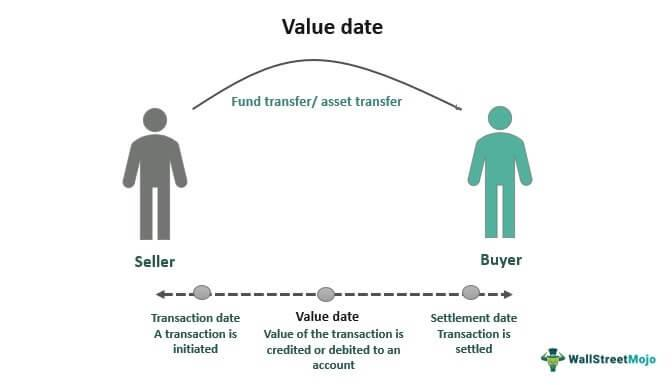

The intersection of banking and trading is a dynamic space where core concepts like value dates and algorithmic trading are increasingly influential. As global financial markets advance, the integration of these elements has significantly reshaped the landscape, providing investors and institutions with tools for heightened efficiency and strategic advantage. 

In this article, we delve into the complexities of trading banking value dates and the role of algorithmic trading in optimizing financial operations. Value dates play a pivotal role in banking and trading by determining when transactions become effective and funds are accessible. Their significance is particularly pronounced in foreign exchange markets where settlement times can vary widely. Understanding and effectively managing value dates is crucial for optimizing cash flows and ensuring consistency in financial transactions.



Algorithmic trading, on the other hand, has transformed the trading environment by utilizing programmed instructions to execute trades at high speeds and efficiencies. It enables market participants to capitalize on opportunities that might escape human traders, thereby enhancing liquidity and market efficiency while minimizing human error and emotional biases in trading decisions.

This article discusses the synergy between these components and their impact on modern financial markets. The fusion of value dates with algorithmic trading has the potential to refine transaction timing, enhance settlement precision, and bolster financial stability. Its implications are far-reaching, offering reduced settlement risks and improved trading strategies. 

For market professionals, comprehending the interplay between these two elements provides a competitive edge as trading strategies evolve. By understanding these underlying mechanics, one can optimize financial operations and stay ahead in an ever-evolving market landscape. Join us as we unpack these concepts, dissect their implications, and look ahead to future trends, ensuring that you remain strategically agile in navigating the complexities of the financial world.

## Table of Contents

## Understanding Value Dates in Banking and Trading

A value date in banking denotes the specific date on which transactions become effective, allowing funds to be fully accessible and utilized. From a financial operations perspective, this is the date when the interest calculations start, and it determines when the funds will be credited or debited to a customer's account. Proper identification and usage of value dates are critical in ensuring accurate interest computations and maintaining financial clarity, thereby avoiding interest income or expense discrepancies. 

In the context of trading, value dates assume paramount importance, particularly in the foreign exchange ([FX](/wiki/fx-anomaly)) markets. The settlement of trades in FX involves transferring currency between parties, usually completing two business days after the trade date. This period, known as T+2, accommodates the diverse time zones and national banking regulations, which can lead to variability in delivery times. Recognizing and adhering to value dates can effectively manage these settlements, optimizing cash flows and ensuring that financial transactions are executed timely and efficiently.

Properly managing value dates contributes significantly to financial stability. When managed effectively, value dates help optimize an organization’s [liquidity](/wiki/liquidity-risk-premium) by ensuring funds are available as expected and preventing costly overdraft situations. This requires precise coordination and communication between banking institutions and trading platforms, reinforcing the stability and reliability of financial operations.

The determination of value dates requires an understanding of the rules that govern specific transactions, such as public holidays and weekends that may affect settlement periods. In foreign exchange, for example, if a transaction’s T+2 settlement lands on a non-business day in either participating currency's country, the value date is shifted to the next business day. Such adjustments prevent potential mismatches in recordkeeping, supporting clear and accurate transaction processing.

Understanding value dates is integral to avoiding discrepancies in financial reporting and transactions. Compliance with the correct value dates ensures that account statements and transaction histories reflect true financial standings, thereby fostering transparency and confidence in financial dealings. This comprehension is not only critical for internal financial management but also for maintaining trust with stakeholders, regulators, and clients.

## The Advent of Algorithmic Trading

Algorithmic trading, also known as algo-trading, refers to the use of automated software to execute trades with minimal human intervention. It employs pre-defined sets of rules or algorithms, which can incorporate variables such as timing, price, quantity, or any mathematical model. These algorithms allow for high-frequency trading, executing trades at speeds and efficiencies that are unattainable for human traders.

One of the primary advantages of [algorithmic trading](/wiki/algorithmic-trading) is its ability to rapidly process vast amounts of data, identifying trading opportunities that might otherwise be overlooked. By leveraging these advanced computational capabilities, algo-trading can effectively scan multiple markets and securities, offering insights and executing trades before human traders can even react. This extensive market scanning results in increased liquidity and improved market efficiency.

Algorithmic trading has revolutionized financial markets by significantly reducing the role of human error and emotional bias in trading decisions. Unlike a human trader, an algorithm operates purely on data and logic, adhering strictly to its pre-set rules and thus minimizing impulsive decisions caused by emotional reactions to market fluctuations. This aspect helps in maintaining consistency in trading approaches and reducing variability in outcomes.

Different algorithmic trading strategies have been developed over time, each serving distinct market goals. Trend-following strategies, for instance, capitalize on market directions by employing technical indicators like moving averages or [breakout](/wiki/breakout-trading) patterns to guide trade actions. On the other hand, [arbitrage](/wiki/arbitrage) strategies exploit price differentials of the same asset in different markets or forms, executing trades to profit from these temporary discrepancies.

Moreover, algorithmic trading's role in financial markets is ever-evolving. As technology advances continue to emerge, more sophisticated algorithms are being developed. Machine learning and [artificial intelligence](/wiki/ai-artificial-intelligence) are increasingly integrated into trading models, enabling algorithms to learn from vast datasets, adapt to changing market conditions, and refine trading strategies over time.

Python, in particular, has become a popular language for developing algorithmic trading strategies due to its robust libraries like pandas, NumPy, and scikit-learn. The flexibility and scalability provided by Python allow traders to create complex models and test them with historical data. For example, a simple trend-following strategy can be implemented using Python as follows:

```python
import pandas as pd
import numpy as np

# Load historical data
data = pd.read_csv('historical_data.csv')
data['SMA_50'] = data['Close'].rolling(window=50).mean()
data['SMA_200'] = data['Close'].rolling(window=200).mean()

# Define signals
data['Signal'] = 0
data['Signal'][data['SMA_50'] > data['SMA_200']] = 1
data['Signal'][data['SMA_50'] < data['SMA_200']] = -1

# Generate trading orders
data['Position'] = data['Signal'].shift()

# Return analysis
data['Return'] = data['Position'] * data['Close'].pct_change()
cumulative_return = (1 + data['Return']).cumprod() - 1
print(cumulative_return[-1])
```

This code represents a simplified version of a moving average crossover strategy, where signals are generated based on the relationship between short-term and long-term moving averages. This type of algorithm is foundational in algorithmic trading, demonstrating how mathematical models can guide trade decisions systematically.

Overall, algorithmic trading serves as a pivotal technology in modern financial markets, promoting operational efficiencies and opening new opportunities for market participants. As systems become more advanced, the capacity to trade strategically in a data-driven manner will only continue to expand.

## The Intersection of Value Dates and Algorithmic Trading

The integration of value date considerations into algorithmic trading systems serves as a crucial enhancement for the precision and efficiency of financial transactions. By embedding value dates into algorithmic trading algorithms, traders can achieve optimal management of settlement risks, which is particularly critical in high-frequency trading environments. These algorithms can time trades to avoid settlement failures and ensure liquidity by accurately predicting the effective dates when transactions clear. This integration helps in streamlining operations and minimizing potential financial discrepancies.

To account for different settlement dates within these sophisticated algorithms, financial models can incorporate variables representing the value dates. For instance, an algorithm might use a data structure where each transaction includes a field for the value date, allowing it to schedule execution and liquidation accordingly. Consider a Python implementation:

```python
def optimize_trades(trades):
    # trades is a list of dictionaries with keys: 'trade_id', 'amount', and 'value_date'
    sorted_trades = sorted(trades, key=lambda x: x['value_date'])
    # Execute trades in order of their value date
    for trade in sorted_trades:
        execute_trade(trade)

def execute_trade(trade):
    # Simulate trade execution considering value date
    print(f"Executing trade {trade['trade_id']} for amount {trade['amount']} with value date {trade['value_date']}")

# Example trade dataset
trades = [
    {'trade_id': 'T1', 'amount': 1000, 'value_date': '2023-10-08'},
    {'trade_id': 'T2', 'amount': 1500, 'value_date': '2023-10-05'},
    {'trade_id': 'T3', 'amount': 500, 'value_date': '2023-10-10'}
]

optimize_trades(trades)
```

In this scenario, trades are sorted based on their value dates to ensure that the settlement is aligned with available funds and market conditions. Through these processes, firms can improve capital efficiency by reducing holding periods and balancing liquidity needs with strategic market positions.

Institutional investors find significant advantages in this alignment as it offers a comprehensive view of market operations and strategic insights. Integrating value dates with algorithmic systems also helps in harmonizing financial flows and reducing the friction caused by settlement uncertainties.

This symbiotic relationship between value date management and algorithmic trading supports enhanced decision-making capabilities. By synchronizing these elements, market participants can exploit market opportunities with greater assurance of transactional success, thereby fostering a more resilient trading infrastructure.

## Challenges and Considerations

Algorithmic trading and the management of value dates offer significant potential, but they come with distinct challenges that must be carefully navigated. A primary concern is regulatory compliance, as financial markets are highly regulated environments. Navigating these regulations requires understanding jurisdiction-specific rules that impact algorithmic trading and settlement date practices. Regulations can also limit exposure and impose restrictions on trading algorithms, necessitating rigorous compliance mechanisms for market participants.

Technology infrastructure is another critical [factor](/wiki/factor-investing). High-frequency trading ([HFT](/wiki/high-frequency-trading-strategies)), which relies heavily on algorithmic strategies, demands advanced systems capable of processing large volumes of data with minimal latency. The reliability and speed of these systems are paramount, as any delays or data inaccuracies can lead to suboptimal trading outcomes or significant financial losses. Ensuring robust technological infrastructure involves investment in state-of-the-art hardware and software solutions, alongside rapid data processing capabilities.

Additionally, potential overfitting poses a notable risk. In algorithmic trading, models that are too closely tailored to historical data may not perform effectively in real-time market conditions. Overfitted models are often less adaptable to unexpected market changes, leading to increased risk and possible financial disruption. Traders must strive for a balance between model complexity and generalization to maintain efficacy across diverse market scenarios.

Market practitioners must also address risks associated with technological failures and adverse market impacts from HFT strategies. High-frequency algorithms can exacerbate market [volatility](/wiki/volatility-trading-strategies), and any technical malfunction can trigger cascading failures. Therefore, the development and deployment of algorithmic systems should incorporate rigorous testing and fail-safe mechanisms to minimize these risks.

Finally, understanding the legal and operational environment is indispensable. As financial products and trading platforms evolve, so too does the legal landscape governing them. Proper due diligence and staying informed about ongoing legal changes are crucial to leveraging algorithmic strategies effectively. Practitioners must be proactive in adapting their methods to align with updated regulations and operational practices to mitigate legal risks and enhance market efficiency.

## Conclusion

The amalgamation of value dates and algorithmic trading stands at the forefront of modern financial innovation, offering substantial benefits as market complexities intensify. By integrating these tools, financial operations can achieve greater precision, efficiency, and compliance. This integration not only enhances the timing and settlement of trades but also allows market participants to optimize their strategies in real-time.

For both novices and seasoned professionals, staying updated on these developments is crucial for maintaining strategic flexibility. As algorithms become more sophisticated, they can process massive volumes of data to uncover trends and execute strategies that would be unfeasible for human traders alone. This capability offers traders the edge necessary to navigate rapidly changing markets.

Future advancements promise to facilitate even more seamless integration, enhancing the capabilities of financial algorithms and expanding the potential for profitable opportunities. For example, incorporating [machine learning](/wiki/machine-learning) techniques within algorithmic trading systems could enable the dynamic adjustment of strategies in response to real-time market conditions, further refining the management of value dates to align with optimal trading periods.

Knowledge and adaptability are essential when leveraging algorithmic and date-based trading systems, as they allow traders and financial institutions to remain competitive amidst evolving market demands. By mastering these tools, industry participants can not only improve their operational efficiency but also shape the future of trading practices.

## References & Further Reading

[1]: Bergstra, J., Bardenet, R., Bengio, Y., & Kégl, B. (2011). ["Algorithms for Hyper-Parameter Optimization."](https://papers.nips.cc/paper/4443-algorithms-for-hyper-parameter-optimization) Advances in Neural Information Processing Systems 24.

[2]: ["Advances in Financial Machine Learning"](https://www.amazon.com/Advances-Financial-Machine-Learning-Marcos/dp/1119482089) by Marcos Lopez de Prado

[3]: ["Evidence-Based Technical Analysis: Applying the Scientific Method and Statistical Inference to Trading Signals"](https://www.amazon.com/Evidence-Based-Technical-Analysis-Scientific-Statistical/dp/0470008741) by David Aronson

[4]: ["Machine Learning for Algorithmic Trading"](https://github.com/PacktPublishing/Machine-Learning-for-Algorithmic-Trading-Second-Edition) by Stefan Jansen

[5]: ["Quantitative Trading: How to Build Your Own Algorithmic Trading Business"](https://books.google.com/books/about/Quantitative_Trading.html?id=j70yEAAAQBAJ) by Ernest P. Chan