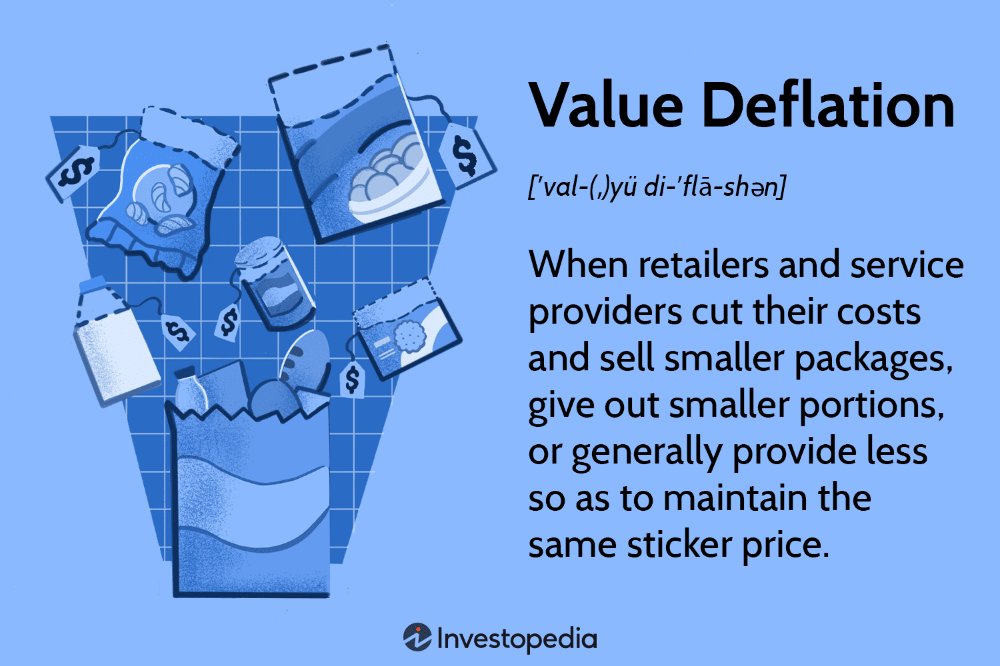

Value deflation, economic deflation, and algorithmic trading are pivotal concepts in understanding contemporary finance and economics. Their convergence offers insights into market dynamics, shaping consumer behavior and guiding investment strategies. This article aims to examine each of these aspects comprehensively, highlighting their individual and collective impact on economic realities. Identifying the nuances of these factors is crucial for investors, policymakers, and economists who seek to navigate and influence financial landscapes effectively.

Value deflation, often synonymous with shrinkflation, involves a subtle reduction in the quantity or quality of goods and services while maintaining price levels. This practice can distort inflation statistics and affect consumer trust, as the value perceived by consumers diminishes without a corresponding price hike. Economic deflation, on the other hand, is characterized by a general decline in the price level of goods and services, which enhances the currency's purchasing power. While this can benefit consumers in the short term, prolonged deflation may lead to economic stagnation, as evidenced by historical instances such as the Great Depression and Japan's Lost Decade.



Algorithmic trading leverages computer programs to perform fast, high-volume trades based on pre-set parameters. In deflationary markets, the accuracy of these algorithms in predicting price movements becomes paramount. Such trading systems are increasingly enhanced with artificial intelligence and machine learning, allowing for better adaptation to low volatility and reduced trading volumes that characterize these economic conditions.

By understanding these fundamental concepts, stakeholders can make informed decisions that contribute to robust economic and investment policies. The interplay between value deflation, economic deflation, and algorithmic trading presents both challenges and opportunities, underscoring the importance of strategic insights to mitigate risks and capitalize on market advantages.

## Table of Contents

## Understanding Value Deflation

Value deflation, also known as shrinkflation, occurs when a company covertly increases prices by reducing the quantity or quality of goods and services offered, while maintaining the same price point. This strategy effectively leads to a reduction in the perceived value provided to consumers, as they receive less product or service for their money. Unlike traditional inflation, where the cost of goods rises outright, value deflation can subtly influence economic indicators and consumer perception without altering the nominal prices directly.

The practice of value deflation is typically adopted by businesses as a response to increasing production costs, such as raw materials or labor expenses. Instead of raising prices, which might deter consumers, companies opt for this subtler approach, hoping consumers do not notice the diminished value. However, as production costs continue to rise, the frequency and extent of value deflation can increase, further skewing economic data.

One of the critical consequences of value deflation is its potential to mislead inflation [statistics](/wiki/bayesian-statistics). Since official inflation measurements often rely on price indexes that may not account for changes in quantity or quality, the prevalence of value deflation means that inflation figures might underestimate the actual economic pressure on consumers. This underestimation can result in distorted economic policy decisions, as policymakers may believe inflation is under control while real purchasing power is eroding.

The impact on consumer purchasing power is another significant implication. As the effective cost of goods and services increases covertly, consumers may experience a decline in their ability to maintain their standard of living. This can lead to shifts in consumer behavior, such as altered spending patterns or increased sensitivity to perceived value in their purchases.

Different sectors experience value deflation in varied ways. For instance, in the food industry, manufacturers might reduce package sizes while keeping prices constant. In technology, companies could lower the hardware specifications or quality of materials without changing the product's advertised price. These practices can affect consumer trust, as individuals may feel deceived when they notice reductions in value without corresponding price adjustments.

In conclusion, value deflation is a complex economic phenomenon with significant implications for statistical accuracy, consumer spending, and market dynamics. Its widespread use across industries poses challenges for both consumers and policymakers, necessitating careful monitoring and strategic responses to ensure economic stability and consumer protection.

## Economic Deflation: A Closer Look

Economic deflation constitutes a critical aspect of macroeconomic analysis. It is defined by a sustained period of declining prices for goods and services, resulting in an increase in the real value of money. This phenomenon can occur due to several factors, including diminished aggregate demand, enhanced productivity, or a contraction in the money supply.

When demand for goods and services decreases, perhaps due to economic pessimism or reduced consumer spending, businesses are forced to lower prices to attract buyers. This decrease in demand may result from various factors, such as high-interest rates discouraging borrowing, or simply consumer preferences shifting away from consumption. Enhanced productivity can also trigger deflation. As advances in technology and efficiencies reduce the cost of production, these savings may be passed on to consumers in the form of lower prices. Additionally, a reduction in money supply, perhaps due to restrictive monetary policy or banking crises leading to reduced lending, can lead to deflation by decreasing the overall spending capacity of an economy.

While the initial effects of deflation might appear beneficial due to increased purchasing power, prolonged deflation can result in detrimental economic consequences. One significant risk is economic stagnation. As prices fall, consumers may delay purchases in anticipation of even lower prices in the future, decreasing overall demand. This can lead to lower revenues for companies, initiating a cycle of layoffs and wage reductions, further reducing consumer spending and stalling economic growth.

Historical instances of deflation provide insight into its potential impacts on an economy. The Great Depression, which began in 1929, remains one of the most severe episodes of deflation in history. During this time, the United States experienced a significant decline in economic activity, bank failures, and severe unemployment, exacerbated by a deflationary spiral that lasted several years. Similarly, Japan’s Lost Decade, a period of economic stagnation beginning in the 1990s, was marked by persistent deflation. Efforts to combat deflation included massive fiscal stimulus and unconventional monetary policy measures, such as quantitative easing.

Governments and central banks have developed various strategies to mitigate deflationary pressures. Monetary policy is a principal tool, with central banks often reducing interest rates to encourage borrowing and spending. In situations where interest rates are already low, central banks may resort to quantitative easing, purchasing assets to increase the money supply and spur economic activity. Fiscal policy can also be employed by governments, including increasing public spending or cutting taxes to boost aggregate demand.

Understanding and addressing economic deflation requires a nuanced approach, taking into account both its immediate advantages and long-term challenges. Policymakers must carefully balance interventions to avoid prolonged periods of deflation, which could lead to economic stagnation and eroded consumer confidence.

## The Role of Algorithmic Trading

Algorithmic trading, often referred to as algo trading, employs sophisticated computer programs to execute trades at high speed and [volume](/wiki/volume-trading-strategy) based on predetermined criteria. These programs analyze a vast array of data points and execute orders by leveraging a range of strategies, such as [arbitrage](/wiki/arbitrage), [trend following](/wiki/trend-following), or mean reversion. The reliance on precise algorithms allows traders to exploit minute price discrepancies and inefficiencies in the market that are imperceptible to human traders.

In deflationary markets, characterized by declining prices and a potential slowdown in economic activity, understanding price movements becomes crucial for optimizing algorithmic models. Deflationary conditions often lead to reduced trading volumes and lower market [volatility](/wiki/volatility-trading-strategies), requiring algorithms to be particularly sensitive to these changes to maintain their effectiveness. This necessitates the adaptation of trading strategies to suit the specific challenges presented by deflation.

Algorithmic strategies in deflationary environments may need to account for diminished [liquidity](/wiki/liquidity-risk-premium), which can impact trade execution times and prices. For instance, trading algorithms might have to incorporate filters that assess liquidity levels or adjust trading speeds to minimize market impact. Moreover, traditional [momentum](/wiki/momentum)-based strategies may need recalibration, as price movements are less pronounced and trends are harder to discern.

The integration of [artificial intelligence](/wiki/ai-artificial-intelligence) (AI) and [machine learning](/wiki/machine-learning) has further enhanced the capabilities of [algorithmic trading](/wiki/algorithmic-trading) systems. These technologies enable the algorithms to learn from market data continuously, improving their accuracy and responsiveness to real-time market conditions. Machine learning algorithms can identify complex patterns and relationships within financial data, which can be particularly advantageous during periods of deflation when traditional market indicators might be less reliable.

Consider a simple example utilizing Python to illustrate an algorithmic trading strategy that adapts to low volatility conditions typical of deflationary periods. Here, we use a moving average crossover strategy, but adjust it to incorporate volatility filters:

```python
import pandas as pd
import numpy as np

# Sample data: prices, compute moving averages and volatility
prices = pd.Series([...] )  # Example price data
short_window = 5
long_window = 20

# Calculate moving averages
short_mavg = prices.rolling(window=short_window).mean()
long_mavg = prices.rolling(window=long_window).mean()

# Calculate volatility as standard deviation
volatility = prices.rolling(window=10).std()

# Generate trading signals
signals = np.where((short_mavg > long_mavg) & (volatility < 0.02), 1, 0)

# 1 indicates a buy signal; 0 holds position
```

This code snippet represents a simplified trading signal generator that adapts to low volatility by incorporating a condition where trades are only executed if the market volatility is below a certain threshold.

In conclusion, the role of algorithmic trading in deflationary contexts highlights the importance of agile and robust trading models that can adjust to changing market conditions. As technology continues to evolve, the integration of AI and machine learning will play an increasingly vital role in enhancing the effectiveness of algorithmic trading strategies, providing traders with competitive advantages even in challenging economic climates.

## Interconnections and Implications

Value deflation and economic deflation are phenomena that significantly influence consumer and investor behavior, although in different ways. Value deflation, often referred to as shrinkflation, happens when products diminish in quantity or quality but maintain the same price. In contrast, economic deflation occurs when the overall price level decreases, increasing the purchasing power of money. While both forms of deflation impact market dynamics, they do so through different mechanisms, yet they may occasionally converge to create complex economic scenarios.

Value deflation can act as a covert inflation mask by maintaining price stability in statistical terms, even as consumers receive less per unit of spending. This adjustment can mislead traditional inflation indices, which generally focus only on price levels rather than value transitions. For instance, a cereal box might contain fewer ounces today than it did last year, while the price remains constant, leading to a nominal inflation rate of zero. However, consumers are receiving less, which affects their purchasing power in real terms. As consumers adjust to perceived inflationary pressures, their spending behavior may shift towards bulk buying or seeking alternatives, altering demand patterns and potentially impacting overall economic activity.

On the other hand, economic deflation directly impacts asset values and the financial health of populations. As the general price level falls, the real value of debt rises, which can constrain consumer spending and business investments. This scenario can lead to adverse economic cycles characterized by reduced demand, lower production, and unemployment. Notable examples of economic deflation include the Great Depression and Japan's Lost Decade, where prolonged deflation led to significant economic stagnation.

Algorithmic trading in such deflationary environments requires continuous adaptation to optimize returns. Traders and investment firms utilizing algorithmic trading must adjust their strategies to account for changes in price movements, trading volumes, and volatility brought about by deflationary pressures. For instance, algorithms can be designed to detect shifts in consumer and market behavior due to perceived or actual deflation. Incorporating artificial intelligence and machine learning into these algorithms can enhance their ability to respond swiftly to such changes.

Understanding the interplay between value deflation and economic deflation is crucial for investors and policymakers. These phenomena can influence asset valuations, consumer confidence, and economic stability. Policymakers need to craft policies that address the disguised inflationary pressures of value deflation while also mitigating the broader economic impacts of economic deflation.

In shaping economic and investment policies, several strategies can be employed. Policymakers might focus on transparency in consumer goods to better capture value deflation in economic measures. Meanwhile, fiscal and monetary policies could aim to stimulate demand and investment to counter economic deflation. Investors may benefit from diversification strategies that include assets less sensitive to deflationary cycles, such as bonds or commodities with intrinsic value.

In conclusion, navigating these complex interactions requires a nuanced understanding of how different types of deflation affect the economy and the financial markets. By leveraging insights from both phenomena, stakeholders can make informed decisions to foster economic stability and growth.

## Conclusion

Navigating the complexities of value deflation, economic deflation, and algorithmic trading requires a comprehensive understanding of both historical and contemporary contexts. Policymakers and investors must remain vigilant to the challenges and opportunities these phenomena present to mitigate potential negative impacts and leverage market advantages. 

One of the key elements in addressing deflationary pressures is recognizing how past economic conditions inform present strategies. Historical examples, such as the Great Depression and Japan's Lost Decade, provide valuable lessons on the consequences of deflation and the efficacy of various economic policies. By studying these cases, policymakers can formulate preventive measures and responsive strategies tailored to current economic climates, minimizing risks associated with deflationary spirals and economic stagnation.

Continuous research and analysis are crucial in developing robust strategies to counteract deflationary pressures. The integration of tools such as machine learning and AI in algorithmic trading models can offer enhanced adaptability and precision in response to evolving market dynamics. For instance, by employing predictive analytics, traders can anticipate price movements more accurately, adapting their strategies to maintain profitability even during periods of low inflation or deflation.

Developing informed strategies involves not only understanding deflationary trends but also anticipating their broader economic implications. For investors, this means identifying sectors or assets that may benefit from these trends and adjusting portfolios to hedge against potential losses. Policymakers, on the other hand, must consider fiscal and monetary policies that encourage economic growth while preventing deflation from taking root.

In conclusion, informed strategies crafted from a thorough understanding of value deflation, economic deflation, and algorithmic trading can mitigate risks and capitalize on potential market advantages. By being proactive and resourceful, both investors and policymakers can navigate these economic phenomena, ensuring financial stability and sustained economic growth.

## References & Further Reading

[1]: Bernanke, B. S. (2000). ["Japanese Monetary Policy: A Case of Self-Induced Paralysis?"](https://www.princeton.edu/~pkrugman/bernanke_paralysis.pdf) National Bureau of Economic Research Working Paper No. 7358.

[2]: Mishkin, F. S. (2008). ["The Federal Reserve's Enhanced Communication Strategy and the Science of Monetary Policy."](https://www.federalreserve.gov/newsevents/speech/mishkin20071129a.htm) Speech at the National Association for Business Economics, Washington, D.C.

[3]: Rajan, R. G. (1994). ["Why Bank Credit Policies Fluctuate: A Theory and Some Evidence."](https://www.jstor.org/stable/2118468) The Quarterly Journal of Economics.

[4]: ["Algorithmic Trading and DMA: An Introduction to Direct Access Trading Strategies"](https://archive.org/details/algorithmictradi0000john) by Barry Johnson

[5]: Snyder, C.M., and Nicholson, W. (2011). ["Microeconomic Theory: Basic Principles and Extensions."](https://books.google.com/books/about/Microeconomic_Theory_Basic_Principles_an.html?id=DXcJAAAAQBAJ) South-Western Cengage Learning. 

[6]: Shiller, R. J. (2015). ["Irrational Exuberance."](https://press.princeton.edu/books/paperback/9780691173122/irrational-exuberance) Princeton University Press.

[7]: Gordon, R. J. (1982). ["Price Inertia and Policy Ineffectiveness in the United States, 1890-1980."](https://www.jstor.org/stable/pdf/1830940.pdf) National Bureau of Economic Research Working Paper No. 751.