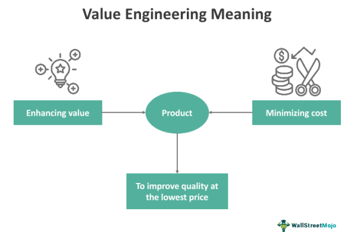

In the ever-evolving landscape of finance and engineering, innovative strategies such as cost reduction, value engineering, engineering optimization, and algorithmic trading are instrumental in shaping the future of these fields. Each strategy offers unique methodologies and benefits, providing companies with the tools needed to enhance efficiency, reduce costs, and maintain a competitive edge in a dynamic marketplace.

Understanding these concepts is vital for organizations seeking to optimize their operations. Cost reduction focuses on decreasing expenses without compromising quality, employing techniques like process improvements and technological advancements. Value engineering takes a systematic approach to enhance project value, ensuring that necessary functions are delivered at the lowest cost through innovation. Meanwhile, engineering optimization leverages mathematical and computational methods to refine systems, identifying the best configurations under specific constraints and performance criteria.

Algorithmic trading represents a synthesis of these strategies within the financial sector, automating trade executions based on predetermined criteria and leveraging advanced statistical and machine learning models. This not only optimizes trading performance but also reduces transaction costs, offering a competitive advantage in financial markets.

This article explores the synergy between these domains, showcasing how their integration can lead to superior outcomes. By examining the underlying theories of each concept and their practical applications, the article highlights the benefits they offer across diverse industries. These strategies converge to create solutions that are not only optimized but also economically viable, emphasizing their significance in today's competitive environment. Understanding these interconnected disciplines is crucial for businesses seeking to achieve sustainable growth and innovation in the face of ever-changing market demands.

## Table of Contents

## Understanding Cost Reduction in Engineering

Cost reduction serves as a cornerstone in the field of engineering, focusing on minimizing expenses while preserving or enhancing the quality and performance of products and systems. This objective is crucial for businesses striving to maintain competitiveness and profitability in a fast-paced industrial environment.

One fundamental approach to cost reduction is process improvement. By streamlining operations and eliminating inefficiencies, organizations can achieve lower operational costs. Techniques such as Lean Manufacturing and Six Sigma are widely employed to identify and eliminate waste, resulting in more efficient production processes. For example, Lean Manufacturing emphasizes the elimination of non-value-added activities, while Six Sigma focuses on reducing process variability and defects.

Material substitution is another vital strategy. Engineers often opt to replace expensive materials with cost-effective alternatives that do not compromise on quality or performance. Composite materials, for example, are frequently used in aerospace and automotive industries to reduce weight and cost while maintaining structural integrity. Such substitutions can result in significant material savings without adversely affecting product functionality.

Technological advancements, particularly in the realms of automation and digital transformation, significantly contribute to cost reduction. Automation of repetitive tasks reduces labor costs and enhances precision. Digital twins and simulations allow engineers to model and optimize manufacturing processes, reducing the need for physical prototyping and minimizing production errors.

The significance of cost reduction extends across multiple industries. In construction, for example, cost reduction strategies help manage budget constraints and enhance profitability. The implementation of Building Information Modeling (BIM) allows for better project visualization, conflict resolution, and resource management, ultimately reducing project costs.

Implementing a structured cost reduction plan involves a comprehensive analysis of business processes, identification of cost drivers, and development of targeted strategies to address them. Effective plans are data-driven and involve cross-functional teams to ensure all aspects of production and design are optimized for cost efficiency. By doing so, organizations can achieve substantial savings while maintaining or improving product integrity.

Real-world examples of successful cost reduction in engineering are abundant. For instance, the automotive industry frequently employs cost reduction strategies such as platform engineering, where multiple vehicle models are built on the same platform to save on design and production costs. In electronics, companies like Apple have optimized their supply chain management and production processes to reduce costs while ensuring high product quality.

In conclusion, cost reduction in engineering is not just about cutting expenses but involves strategic enhancements to processes, materials, and technology to deliver products efficiently and sustainably. Adopting such strategies is essential for companies to maintain their competitive edge and ensure long-term viability in their respective markets.

## The Role of Value Engineering

Value engineering is a strategic methodology that targets the optimization of a project’s functions while minimizing associated costs. This technique appraises the functions of goods and services to find innovative ways to advance their value. By systematically analyzing project components, value engineering identifies opportunities where cost efficiency can be increased without sacrificing quality.

The principles of value engineering emerged in the mid-20th century, initially applied within the manufacturing sector to optimize production costs. The core of value engineering lies in its function-oriented approach: it seeks to understand what each component or process must achieve, then explores alternative ways to fulfill those functions more economically. This approach can involve the use of alternative materials, simplification of procedures, or the integration of new technologies that offer superior performance at a reduced cost.

Construction and manufacturing industries have prominently adopted value engineering. In construction, for example, this might mean selecting alternative building materials or modifying design elements to reduce expenses while maintaining structural integrity and performance. In manufacturing, it might involve streamlining assembly lines or employing robotics to increase efficiency and reduce labor costs.

Value engineering significantly aids in product and process redesigns aimed at enhancing value delivery to the client or end-user. By reassessing project elements with a focus on function rather than tradition or precedent, opportunities for improvement are uncovered, leading to not only cost reductions but also potential performance gains.

The benefits of employing value engineering are manifold. It fosters a culture of continuous improvement, prompting teams to regularly evaluate and innovate on existing practices. Improved cost efficiency is a direct outcome, potentially lowering project budgets and increasing profitability. Additionally, by fostering innovative thinking, value engineering can enhance project performance, leading to higher quality outcomes.

In today's market conditions, where cost-effectiveness is paramount, organizations that adopt value engineering principles can gain a competitive advantage. By ensuring projects meet functional requirements at optimized costs, businesses can improve their financial performance while delivering superior value to customers.

## Engineering Optimization Methods

Engineering optimization is a crucial component in the enhancement of system designs through the use of mathematical and computational strategies. Its primary objective is to find the optimal configuration of a system that satisfies performance requirements while minimizing or maximizing certain attributes such as cost, weight, or strength. This optimization process is pivotal because it supports informed decision-making, leading to more efficient and effective engineering solutions.

Several methods are routinely employed in engineering optimization, each suitable for different types of problems and constraints. Linear programming, for instance, is utilized to optimize a linear objective function, subjected to linear equality and inequality constraints. It is widely used in operations research and economics, where decisions are needed on resource allocation.

Another significant technique is genetic algorithms, which are inspired by the principles of natural selection and genetics. They are often employed when the search space is large and complex. Genetic algorithms can handle non-linear, multi-modal optimization problems and are suitable for finding near-optimal solutions in high-dimensional spaces. They conduct a global search using operations such as selection, crossover, and mutation.

Gradient-based methods are particularly useful for optimization problems where the objective function is differentiable. They rely on the calculation of gradients to understand how the change in variables affects the output, allowing for precise adjustments towards an optimal solution. These techniques are beneficial for fine-tuning system parameters when local optima are to be exploited due to their fast convergence properties.

The significance of engineering optimization lies in its ability to boost decision-making capabilities by providing a structured approach to enhancing system performance. For example, in structural engineering, optimization can lead to designs that use less material without compromising strength, substantially reducing costs.

For a practical illustration, consider the optimization of a cantilever beam's cross-section to minimize weight while ensuring it can withstand specific loads. The problem might be formulated as:

$$
\min_{w, h} \quad \rho \cdot L \cdot w \cdot h 
$$

subject to

$$
\sigma \leq \frac{M \cdot c}{I}
$$

$$
w, h > 0
$$

where $\rho$ is the material density, $L$ the beam length, $w$ width, $h$ height, $\sigma$ the stress, $M$ the moment, $c$ the distance from the neutral axis, and $I$ the moment of inertia. Solving such an optimization problem can result in a material-efficient design, reducing both weight and cost.

In conclusion, engineering optimization integrates various mathematical and algorithmic methods to refine design processes. By solving optimization problems, engineers can improve efficiency, effectiveness, and sustainability across numerous applications, fostering innovation and enhancing competitiveness in the market.

## Algorithmic Trading: Automating Finance

Algorithmic trading is a transformative approach within the financial markets, characterized by the employment of pre-programmed algorithms to execute trades. These algorithms use complex financial calculations to make trading decisions at speeds and frequencies that are impossible for human traders. The core of [algorithmic trading](/wiki/algorithmic-trading) lies in leveraging statistical and [machine learning](/wiki/machine-learning) models to enhance trading performance and minimize transaction costs.

Central to algorithmic trading is the process of designing algorithms that capitalize on price inefficiencies in the markets. These algorithms can be structured around a variety of trading strategies, such as statistical [arbitrage](/wiki/arbitrage), mean reversion, or [momentum](/wiki/momentum) strategies. For instance, [statistical arbitrage](/wiki/statistical-arbitrage) relies on identifying pricing discrepancies between related securities, while momentum strategies focus on long-term trends supported by significant volumes. 

A pivotal advantage of algorithmic trading is its contribution to market [liquidity](/wiki/liquidity-risk-premium) and the reduction of transaction times. Algorithms can execute trades based on microsecond-level calculations, significantly improving the liquidity flow in the financial markets. This rapid execution also helps in narrowing spreads and reducing trading costs, providing a competitive edge to traders and financial institutions employing these strategies.

Technological advancements have been crucial in the development of algorithmic trading. High-frequency trading ([HFT](/wiki/high-frequency-trading-strategies)) platforms, for instance, utilize sophisticated algorithms capable of executing thousands of trades within fractions of a second. Machine learning techniques, such as neural networks and [reinforcement learning](/wiki/reinforcement-learning), are increasingly being integrated into these algorithms to enhance their predictive accuracy and adaptability to market changes.

Despite its benefits, algorithmic trading introduces certain challenges. The risk of market [volatility](/wiki/volatility-trading-strategies) is a concern, as algorithms can exacerbate price swings during periods of instability. There is also the issue of overfitting, where algorithms perform well on historical data but fail to adapt to real-time conditions. Regulation poses another challenge, as financial authorities continue to scrutinize algorithmic trading due to concerns over fairness and market manipulation.

Looking forward, the future of algorithmic trading is poised to be shaped by continuous advancements in [artificial intelligence](/wiki/ai-artificial-intelligence) and quantum computing. These technologies promise to refine the precision and speed of algorithmic strategies, leading to more robust models and frameworks. Automation and enhanced machine learning algorithms are expected to drive the next wave of innovation, facilitating more nuanced decision-making processes that can adapt in real-time to market fluctuations.

In summary, algorithmic trading stands as a cornerstone of modern financial markets, continuously evolving with technology to optimize trading operations. Its capacity to process vast datasets rapidly and execute trades with precision not only enhances market efficiency but also sets the groundwork for future advancements in fintech.

## Synergies Between These Disciplines

Cost reduction, value engineering, optimization, and algorithmic trading, though superficially distinct, converge through shared principles focused on efficiency and improved performance. These methodologies can be integrated across disciplines to develop robust and comprehensive solutions that are adaptable to complex industry needs.

The integration of engineering and financial strategies enables optimized resource management, leveraging the precision of cost reduction and engineering optimization with the analytical power of algorithmic trading. For instance, engineering optimization techniques such as linear programming can be applied within financial models to enhance trade execution strategies by minimizing costs while maximizing returns. This can be illustrated by optimizing a cost function $C(x)$, subject to constraints $Ax \leq b$, using algorithms that adjust variables $x$ to achieve minimal expenditure or maximal savings.

Furthermore, value engineering's emphasis on function over cost can influence financial systems where the objective is to maximize economic value rather than mere cost savings. By adopting its principles, financial products can be designed to ensure that each feature provides maximum value per unit of cost. This approach is notably beneficial in product development scenarios within sectors like manufacturing, where each component's value is optimized economically and functionally.

In practice, the synergy between these disciplines is manifested in collaborative platforms that combine engineering prowess with financial intelligence to optimize overall system performance. For example, the automotive industry employs engineering optimization for vehicle design while simultaneously utilizing algorithmic trading strategies to manage fluctuations in raw material costs, thus ensuring both high product quality and cost efficiency.

These interdisciplinary collaborations often result in significant innovations, such as developing advanced supply chain solutions where data-driven insights from algorithmic trading help anticipate market shifts, facilitating more responsive and cost-effective engineering adjustments. 

Successful real-world integrations abound, especially in sectors like aerospace, where engineering optimization improves aircraft design efficiencies, and algorithmic trading optimizes fuel procurement strategies based on predicted market trends, ultimately enhancing both operational efficiency and financial stability.

Through the convergence of these diverse but complementary disciplines, enterprises achieve not only innovation and cost efficiencies but also a formidable competitive advantage. This positions them to adapt fluidly to market changes while sustaining growth and profitability.

## Conclusion

In today's competitive landscape, where cost-efficiency and innovation are pivotal, the integration of cost reduction, value engineering, engineering optimization, and algorithmic trading presents an invaluable prospect for companies across diverse industries. By embracing these interconnected principles, businesses can significantly boost agility and resilience.

The effective application of cost reduction strategies enables companies to maintain or improve product quality while decreasing expenses, thereby enhancing their profitability and sustainability. Value engineering complements this by focusing on delivering necessary functions economically, ensuring products and projects achieve high value at reduced costs. Engineering optimization, through mathematical and computational techniques, refines system designs to maximize or minimize desired outcomes, whether it be cost, weight, or performance.

On the financial side, algorithmic trading exemplifies the transformative power of technology in automating processes to achieve enhanced trading efficiency and reduced transaction costs. This capability not only optimizes financial performance but also fortifies a company's position in a rapidly evolving market.

Together, these strategies construct holistic, economically viable solutions that align with modern business objectives. They foster the construction of robust frameworks that accommodate both economic constraints and the pursuit of innovation.

As industries continue to evolve, it is crucial for organizations to remain informed about these concepts. Understanding their synergy and staying current with advancements will be vital for achieving long-term sustainability and growth. By proactively exploring and implementing these strategies, companies can maintain a competitive edge and drive forward a future-oriented approach in their respective markets.

## References & Further Reading

[1]: Miles, L. D. (1989). ["Techniques of Value Analysis and Engineering."](https://books.google.com/books/about/Techniques_of_Value_Analysis_and_Enginee.html?id=XxhbDwAAQBAJ) Lawrence D. Miles Value Foundation.

[2]: Montgomery, D. C. (2009). ["Introduction to Statistical Quality Control."](https://books.google.com/books/about/Introduction_to_Statistical_Quality_Cont.html?id=oh7zDwAAQBAJ) John Wiley & Sons.

[3]: Womack, J. P., & Jones, D. T. (2003). ["Lean Thinking: Banish Waste and Create Wealth in Your Corporation."](https://www.researchgate.net/publication/200657172_Lean_Thinking_Banish_Waste_and_Create_Wealth_in_Your_Corporation) Simon & Schuster.

[4]: Vanderbei, R. J. (2014). ["Linear Programming: Foundations and Extensions."](https://link.springer.com/book/10.1007/978-3-030-39415-8) Springer.

[5]: Chan, E. P. (2009). ["Quantitative Trading: How to Build Your Own Algorithmic Trading Business."](https://github.com/ftvision/quant_trading_echan_book) John Wiley & Sons.