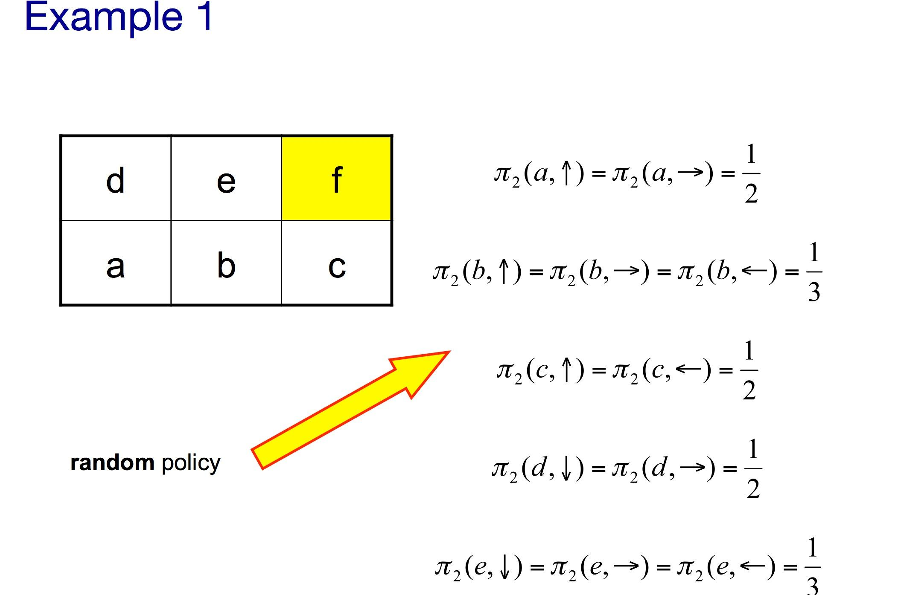

## Table of Contents

## What is Value Function Estimation in the context of Machine Learning?

Value Function Estimation is a key concept in reinforcement learning, a type of machine learning where an agent learns to make decisions by interacting with an environment. The value function estimates how good it is for the agent to be in a particular state or to take a specific action in that state. This estimation helps the agent decide the best actions to take to maximize a reward over time. The value function can be thought of as a prediction of future rewards the agent can expect from being in a certain state.

There are different methods to estimate the value function, such as Monte Carlo methods and Temporal Difference learning. Monte Carlo methods estimate the value function by averaging the returns obtained from multiple complete episodes of interaction with the environment. On the other hand, Temporal Difference learning updates the value function estimates based on the difference between predicted and actual rewards as the agent interacts with the environment in real-time. Both methods aim to refine the value function to better guide the agent's decision-making process.

For example, in a game where the goal is to reach a target, the value function might estimate higher values for states closer to the target, guiding the agent to move towards it. Mathematically, if $$V(s)$$ represents the value of being in state $$s$$, the goal is to find a policy that maximizes the expected return, which is the sum of discounted future rewards. This can be expressed as $$V(s) = \mathbb{E}[\sum_{t=0}^{\infty} \gamma^t R_{t+1} | S_t = s]$$, where $$R_{t+1}$$ is the reward at time step $$t+1$$, $$\gamma$$ is the discount factor, and $$\mathbb{E}$$ denotes the expected value.

## Why is Value Function Estimation important in reinforcement learning?

Value Function Estimation is important in [reinforcement learning](/wiki/reinforcement-learning) because it helps the agent understand which states or actions are more likely to lead to higher rewards. By estimating the value of being in a certain state or taking a specific action, the agent can make better decisions on how to behave to maximize its total reward over time. For example, if an agent is trying to navigate a maze, the value function can help it figure out which paths are more likely to lead to the [exit](/wiki/exit-strategy), guiding it to choose the best route.

In practical terms, the value function acts like a roadmap for the agent, showing it the expected long-term outcomes of its current choices. Without a good value function, the agent might make short-sighted decisions that lead to immediate rewards but fail to achieve the best overall outcome. The value function, represented as $$V(s)$$, helps the agent balance immediate and future rewards, aiming to maximize the expected return, which is the sum of discounted future rewards, expressed as $$V(s) = \mathbb{E}[\sum_{t=0}^{\infty} \gamma^t R_{t+1} | S_t = s]$$. This formula shows how the agent calculates the value of being in state $$s$$ by considering all future rewards, discounted by a [factor](/wiki/factor-investing) $$\gamma$$.

## What are the basic methods used for estimating value functions?

There are two main methods for estimating value functions: Monte Carlo methods and Temporal Difference (TD) learning. Monte Carlo methods work by playing through complete episodes of the task and then calculating the total reward received. By repeating this process many times, the average of these rewards can be used to estimate the value of a state. For example, if an agent is trying to navigate a maze, the Monte Carlo method would involve running the agent through the maze multiple times and using the average time it takes to reach the exit to estimate the value of each state in the maze.

Temporal Difference learning, on the other hand, updates the value function as the agent interacts with the environment in real-time. Instead of waiting for an episode to finish, TD learning updates the value estimate based on the difference between the predicted and the actual reward received at each step. This makes it more efficient because the agent doesn't need to complete an entire episode before learning. The basic update rule for TD learning can be expressed as $$V(S_t) \leftarrow V(S_t) + \alpha [R_{t+1} + \gamma V(S_{t+1}) - V(S_t)]$$, where $$V(S_t)$$ is the current value estimate for state $$S_t$$, $$\alpha$$ is the learning rate, $$R_{t+1}$$ is the immediate reward, and $$\gamma$$ is the discount factor.

Both methods have their strengths and are used depending on the specific requirements of the task. Monte Carlo methods provide an unbiased estimate of the value function but require complete episodes, while TD learning can learn from incomplete sequences and is more sample-efficient. By understanding and applying these methods, [agents](/wiki/agents) can better estimate the value of states and improve their decision-making process in reinforcement learning scenarios.

## How does the HOC (Higher-Order Correction) method work in value function estimation?

The Higher-Order Correction (HOC) method is a technique used in value function estimation to improve the accuracy of the value estimates in reinforcement learning. It does this by considering not just the immediate reward and the next state's value, but also the potential future changes in the value function. The idea is to use higher-order information, like how the value function might change in future steps, to make better predictions about the current state's value. This method helps the agent understand the long-term impact of its actions better, leading to more informed decision-making.

In practical terms, the HOC method adjusts the value function estimate by adding a correction term that accounts for the expected future changes in the value function. This can be expressed as $$V(S_t) \leftarrow V(S_t) + \alpha [R_{t+1} + \gamma V(S_{t+1}) - V(S_t) + \text{HOC}]$$, where HOC represents the higher-order correction term. This term is usually calculated based on the second or higher derivatives of the value function, which gives the agent a glimpse into how the value might evolve over time. By incorporating this additional information, the HOC method can lead to faster convergence and more stable learning, especially in complex environments where the value function changes significantly over time.

## Can you explain the V-trace algorithm and its application in value function estimation?

The V-trace algorithm is a method used in reinforcement learning to improve how we estimate value functions. It's especially useful in situations where the agent might not always follow the optimal policy or when we're dealing with off-policy learning. V-trace helps by adjusting the value estimates to account for the differences between the behavior policy (the policy the agent is actually using) and the target policy (the policy we're trying to learn about). This makes the value estimates more accurate and stable, even when the agent is exploring or learning from other agents' experiences.

The key idea behind V-trace is to use a correction term that adjusts the value estimates based on how much the behavior policy deviates from the target policy. This correction helps the agent learn a more reliable value function by reducing the bias that can come from using off-policy data. The V-trace update can be expressed as $$V(s) \leftarrow V(s) + \alpha \sum_{t=0}^{T-1} \gamma^t \rho_t \delta_t^v$$, where $$V(s)$$ is the value estimate for state $$s$$, $$\alpha$$ is the learning rate, $$\gamma$$ is the discount factor, $$\rho_t$$ is the importance sampling ratio, and $$\delta_t^v$$ is the TD-error at time step $$t$$. By incorporating this correction, V-trace helps the agent better understand the long-term value of states, leading to more effective learning and decision-making.

## What is the Retrace algorithm and how does it improve upon traditional methods?

The Retrace algorithm is a method used in reinforcement learning to make value function estimation more accurate, especially when the agent is learning from actions that are not part of its main strategy. It works by blending the ideas from two other methods: Q(lambda) and Retrace. Retrace takes the good parts of these methods and combines them to create a more stable way to learn from different experiences. It helps the agent understand the value of states better by using a special correction that makes sure the learning stays on track even when the agent is trying out new things.

Retrace improves upon traditional methods by being more efficient and stable. It does this by using a formula that adjusts how much the agent learns from each experience based on how different the action it took is from what its main strategy would do. The formula for Retrace can be written as $$V(s) \leftarrow V(s) + \alpha \sum_{t=0}^{T-1} \gamma^t \min(1, \rho_t) \delta_t^v$$, where $$V(s)$$ is the value estimate for state $$s$$, $$\alpha$$ is the learning rate, $$\gamma$$ is the discount factor, $$\rho_t$$ is the importance sampling ratio, and $$\delta_t^v$$ is the TD-error at time step $$t$$. By using this formula, Retrace helps the agent learn faster and more reliably, making it a powerful tool for improving how we estimate value functions in reinforcement learning.

## How do N-step Returns contribute to more accurate value function estimation?

N-step Returns help make value function estimation more accurate by looking at the rewards over several steps instead of just the next step. In traditional methods like one-step Temporal Difference (TD) learning, the value of a state is updated based on the immediate reward and the estimated value of the next state. But with N-step Returns, the agent waits for N steps before updating the value, which gives a better idea of the long-term effects of its actions. This approach can capture more of the future rewards, leading to a more stable and accurate estimate of the value function.

For example, if an agent is trying to navigate a maze, using N-step Returns means it can see the rewards it gets over the next few moves, not just the next one. This helps the agent understand which paths are better in the long run. The formula for N-step Returns can be written as $$G_t^{(N)} = R_{t+1} + \gamma R_{t+2} + \gamma^2 R_{t+3} + ... + \gamma^{N-1} R_{t+N} + \gamma^N V(S_{t+N})$$, where $$G_t^{(N)}$$ is the N-step return starting from time step $$t$$, $$R_{t+i}$$ is the reward at time step $$t+i$$, $$\gamma$$ is the discount factor, and $$V(S_{t+N})$$ is the value estimate of the state at time step $$t+N$$. By using this formula, the agent can make better decisions because it has a clearer picture of the future rewards.

## What is the role of Stochastic Dueling Networks in value function estimation?

Stochastic Dueling Networks are a special kind of [neural network](/wiki/neural-network) used in reinforcement learning to estimate the value of different states more accurately. They work by comparing two different ways of estimating the value of a state and choosing the better one. This method helps to reduce errors in the value estimates because it uses a bit of randomness to explore different possibilities. By doing this, the network can find the best value estimate even when the environment is tricky or when the rewards are not clear right away.

The main idea behind Stochastic Dueling Networks is to use two separate networks to estimate the value of a state. One network gives a general idea of the value, while the other network focuses on how the value changes when you take different actions. By comparing these two estimates, the network can figure out which one is more reliable. This approach helps the agent make better decisions because it gets a more accurate picture of what will happen in the future. The formula for updating the value estimate using Stochastic Dueling Networks can be expressed as $$V(s) \leftarrow V(s) + \alpha [R + \gamma \max_a Q(s', a) - V(s)]$$, where $$V(s)$$ is the value estimate for state $$s$$, $$\alpha$$ is the learning rate, $$R$$ is the reward, $$\gamma$$ is the discount factor, and $$Q(s', a)$$ is the action-value estimate for the next state $$s'$$ and action $$a$$.

## How does the QPT (Q-Prop with Traces) method enhance value function estimation?

The QPT (Q-Prop with Traces) method helps improve value function estimation by combining the strengths of Q-learning and eligibility traces. In Q-learning, the agent learns the value of taking certain actions in certain states. Eligibility traces, on the other hand, help the agent remember past states and actions, so it can update their values even after some time has passed. By putting these two together, QPT allows the agent to learn from experiences more effectively. It updates the value estimates not just based on immediate rewards but also considers how past actions and states might have contributed to the current situation, leading to more accurate and stable value estimates.

In practical terms, QPT uses a special formula to update the value function. The formula is $$Q(s, a) \leftarrow Q(s, a) + \alpha \delta_t e_t(s, a)$$, where $$Q(s, a)$$ is the action-value estimate for state $$s$$ and action $$a$$, $$\alpha$$ is the learning rate, $$\delta_t$$ is the TD-error at time step $$t$$, and $$e_t(s, a)$$ is the eligibility trace for state-action pair $$(s, a)$$. This formula helps the agent learn faster and better understand the long-term effects of its actions. By using QPT, the agent can make more informed decisions and improve its performance in complex environments where understanding the value of different actions over time is crucial.

## What are the challenges faced when implementing value function estimation in complex environments?

Implementing value function estimation in complex environments can be tricky because there are many things that can go wrong. One big challenge is dealing with a lot of different states and actions. In a simple game, there might be only a few choices, but in a complex environment like a big city or a detailed video game, there can be thousands or even millions of different states and actions. This makes it hard for the agent to figure out the value of each state because it has to explore and learn from so many possibilities. Another problem is that the rewards might not be clear right away. In some situations, the agent might do something that seems good at first but turns out to be bad later on. This makes it hard to know what the true value of a state is because the agent has to think about what might happen in the future.

Another challenge is dealing with noise and uncertainty. In real-world environments, things don't always go as planned. The agent might get rewards that are not consistent or might face unexpected events that change the value of states. This can make the value estimates less accurate because the agent has to guess what might happen next. To deal with these challenges, researchers use special methods like Monte Carlo methods, Temporal Difference learning, and more advanced techniques like V-trace or Retrace. These methods help the agent learn better by considering more information and adjusting the value estimates to be more accurate. For example, the formula for updating the value estimate using Temporal Difference learning is $$V(S_t) \leftarrow V(S_t) + \alpha [R_{t+1} + \gamma V(S_{t+1}) - V(S_t)]$$, where $$V(S_t)$$ is the current value estimate for state $$S_t$$, $$\alpha$$ is the learning rate, $$R_{t+1}$$ is the immediate reward, and $$\gamma$$ is the discount factor. By using these methods, the agent can handle the complexity and uncertainty of the environment better and make smarter decisions.

## How can one evaluate the performance of different value function estimation techniques?

To evaluate the performance of different value function estimation techniques, you can look at how well they help the agent make good decisions. One way to do this is by checking how much reward the agent gets over time. If the agent is doing well and getting more rewards, it means the value function is helping it make the right choices. Another way is to compare the value estimates to what actually happens. If the value estimates are close to the real rewards, then the technique is working well. You can also look at how quickly the agent learns. A good value function estimation technique should help the agent learn faster and make fewer mistakes.

There are also some specific measures you can use to evaluate these techniques. One measure is the Mean Squared Error (MSE), which shows how far off the value estimates are from the true values. The formula for MSE is $$MSE = \frac{1}{n} \sum_{i=1}^{n} (V_{\text{estimated}}(s_i) - V_{\text{true}}(s_i))^2$$, where $$V_{\text{estimated}}(s_i)$$ is the estimated value for state $$s_i$$ and $$V_{\text{true}}(s_i)$$ is the true value. Another measure is the bias and variance of the value estimates. Bias shows if the estimates are consistently too high or too low, while variance shows how much the estimates change from one run to another. By looking at these measures, you can see which technique is the most accurate and reliable for your specific problem.

## What are the latest advancements and future directions in value function estimation research?

Recent advancements in value function estimation have focused on improving the accuracy and efficiency of learning in complex environments. One notable development is the use of deep neural networks, such as Deep Q-Networks (DQNs), which have shown great success in handling high-dimensional state spaces. Researchers have also been exploring methods like V-trace and Retrace to better handle off-policy learning, where the agent learns from experiences that are not part of its current policy. These techniques help reduce bias and improve the stability of value estimates by adjusting how much the agent learns from each experience based on how different it is from the target policy. For example, the V-trace update can be expressed as $$V(s) \leftarrow V(s) + \alpha \sum_{t=0}^{T-1} \gamma^t \rho_t \delta_t^v$$, where $$\alpha$$ is the learning rate, $$\gamma$$ is the discount factor, $$\rho_t$$ is the importance sampling ratio, and $$\delta_t^v$$ is the TD-error.

Future directions in value function estimation research are likely to continue exploring ways to make learning more efficient and effective, especially in environments with sparse rewards or partial observability. One promising area is the integration of model-based reinforcement learning, which uses a model of the environment to plan ahead and improve value estimates. Another area of interest is the use of meta-learning techniques to quickly adapt value function estimation to new tasks. Researchers are also working on developing more robust methods to handle noisy and uncertain environments, which could involve incorporating uncertainty estimates into the value function. By combining these advancements, future value function estimation methods could lead to agents that learn faster and perform better in a wide range of real-world applications.

## References & Further Reading

[1]: Sutton, R. S., & Barto, A. G. (2018). ["Reinforcement Learning: An Introduction."](https://web.stanford.edu/class/psych209/Readings/SuttonBartoIPRLBook2ndEd.pdf) MIT Press.

[2]: Mnih, V., Kavukcuoglu, K., Silver, D., Rusu, A. A., & others. (2015). ["Human-level control through deep reinforcement learning."](https://www.nature.com/articles/nature14236) Nature, 518(7540), 529–533.

[3]: Watkins, C. J. C. H., & Dayan, P. (1992). ["Q-Learning."](https://link.springer.com/article/10.1007/BF00992698) Machine Learning, 8(3-4), 279-292.

[4]: Espeholt, L., Soyer, H., Munos, R., Simonyan, K., Mnih, V., Ward, T., ... & others. (2018). ["IMPALA: Scalable Distributed Deep-RL with Importance Weighted Actor-Learner Architectures."](https://arxiv.org/abs/1802.01561) In International Conference on Machine Learning, 1407-1416.

[5]: Schulman, J., Levine, S., Moritz, P., Jordan, M., & Abbeel, P. (2015). ["Trust Region Policy Optimization."](https://arxiv.org/abs/1502.05477) arXiv preprint arXiv:1502.05477.

[6]: Lillicrap, T. P., Hunt, J. J., Pritzel, A., Heess, N., & others. (2015). ["Continuous control with deep reinforcement learning."](https://arxiv.org/abs/1509.02971) arXiv preprint arXiv:1509.02971.