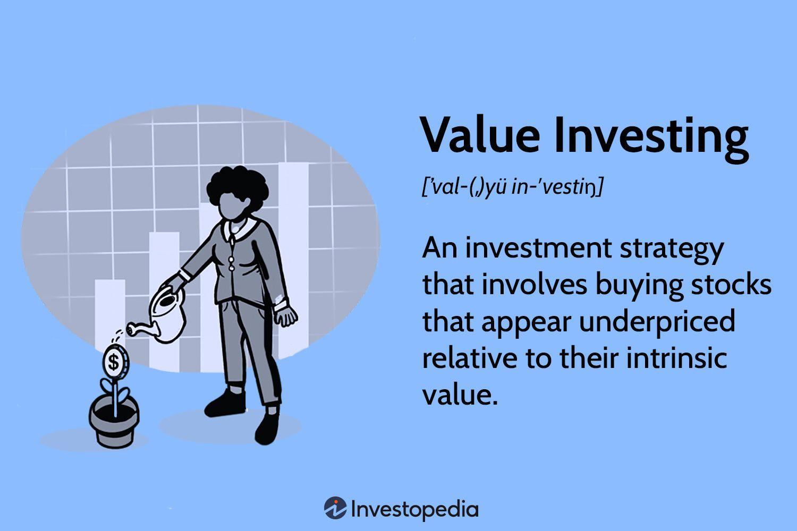

## Table of Contents

## What is a value fund?

A value fund is a type of investment fund that focuses on buying stocks that are believed to be undervalued. This means the fund managers look for companies whose stock prices are lower than what they think the companies are really worth. They do this by looking at different financial measures, like the price-to-earnings ratio, to find stocks that seem like a good deal. The idea is to buy these stocks at a low price and then sell them later when their prices go up, making a profit.

Value funds are popular with investors who want to take a long-term approach to investing. These investors believe that over time, the market will recognize the true value of these undervalued companies, and their stock prices will rise. This strategy can be less risky than investing in stocks that are popular and have high prices, which might fall if the market changes. However, it requires patience, as it can take a while for the market to adjust and for the stocks to reach their expected value.

## How does a value fund differ from a growth fund?

A value fund and a growth fund are two different ways to invest in the stock market. A value fund looks for companies that are not very popular right now but are thought to be worth more than their current stock price. The people who manage these funds look at things like how much the company earns and how much it costs to buy a share of the company. They want to buy these stocks when they are cheap and then wait for the price to go up over time. This can take a long time, but the idea is to make money by buying low and selling high.

On the other hand, a growth fund focuses on companies that are growing fast and are expected to keep growing. These companies might not pay dividends because they are using their money to grow even more. The stock prices of these companies can go up quickly if they keep doing well. People who invest in growth funds are looking for quick gains and are willing to take more risk. They believe that the fast growth of these companies will make their stock prices go up a lot in a shorter amount of time.

The main difference between the two is the type of companies they invest in and the strategy they use. Value funds are about finding bargains and waiting for the market to recognize the true value of these companies. Growth funds are about betting on companies that are already doing well and are expected to keep doing well, hoping for quick and big returns. Both strategies have their own risks and rewards, and which one is better depends on what an investor is looking for and how much risk they are willing to take.

## What are the key principles of value investing?

Value investing is all about finding companies that are not as popular right now but are worth more than their current stock price. People who do value investing look for bargains. They want to buy stocks when they are cheap and then wait for the price to go up over time. They do this by looking at a company's financial numbers, like how much money it makes and how much it costs to buy a share. They compare these numbers to other companies to see if the stock is a good deal. The idea is to buy these undervalued stocks and hold onto them until the market realizes how good the company really is, and the stock price goes up.

Another big part of value investing is being patient and not getting scared by short-term changes in the market. Value investors know that it can take a long time for the market to see the true value of a company. They are willing to wait because they believe that over time, good companies will be recognized and their stock prices will rise. This means they need to be calm and not sell their stocks just because the market goes down for a little while. They focus on the long-term value of their investments and try not to let short-term ups and downs affect their decisions.

## Who are some famous value investors and what are their strategies?

One famous value investor is Warren Buffett. He is known for his long-term approach to investing. Buffett looks for companies that are undervalued and have strong business models. He believes in buying these companies at a good price and holding onto them for a long time. He also likes companies that pay dividends because it gives him regular income while he waits for the stock price to go up. Buffett's strategy is all about patience and understanding the businesses he invests in. He often says that his favorite holding period is "forever," meaning he wants to keep his investments for as long as possible.

Another well-known value investor is Benjamin Graham, who is often called the father of value investing. Graham wrote a book called "The Intelligent Investor," which is very popular among people who want to learn about value investing. His strategy involves looking at a company's financial numbers to find stocks that are cheaper than they should be. Graham used something called the "margin of safety," which means he only bought stocks when they were much cheaper than their real value. This way, even if the stock price didn't go up as much as he hoped, he would still make money. Graham's ideas have influenced many other investors, including Warren Buffett, who was one of his students.

Seth Klarman is another famous value investor. He runs a fund called Baupost Group and is known for being very careful with his investments. Klarman looks for companies that are in trouble but have the potential to recover. He buys these companies at a low price and waits for them to get better. Klarman also believes in having a lot of cash on hand so he can buy more stocks when prices are low. His strategy is about being patient and waiting for the right opportunities to come along. Like Graham and Buffett, Klarman focuses on the long-term value of his investments and tries to avoid big risks.

## How do you identify undervalued stocks for a value fund?

To identify undervalued stocks for a value fund, you start by looking at a company's financial numbers. You want to find out if the stock is cheaper than it should be. One way to do this is by looking at the price-to-earnings ratio, which tells you how much you are paying for each dollar of the company's earnings. If this ratio is lower than the industry average, the stock might be undervalued. Another thing to check is the price-to-book ratio, which compares the stock price to the company's net asset value. If this ratio is low, it could mean the stock is a good deal. You also want to look at the company's debt and how much money it is making to see if it is in good financial health.

Once you have looked at the numbers, you need to think about the company's future. You want to know if the company has a good business model and if it can keep making money over time. This means looking at things like the company's market position, its competition, and any new products or services it might be working on. If the company looks strong and the stock price is low, it could be a good investment for a value fund. The key is to find companies that are not popular right now but have the potential to do well in the future. By buying these stocks at a low price and holding onto them, you can make money when the market finally sees their true value.

## What financial ratios are important when evaluating stocks for a value fund?

When you are looking for stocks to put in a value fund, you need to look at some important financial ratios. One of these is the price-to-earnings ratio, or P/E ratio. This tells you how much you are paying for each dollar of the company's earnings. If the P/E ratio is lower than the average for other companies in the same industry, it might mean the stock is undervalued. Another important ratio is the price-to-book ratio, or P/B ratio. This compares the stock price to the company's net asset value. A low P/B ratio can show that the stock is a good deal because you are paying less for the company's assets than they are worth.

You should also look at the company's debt levels and how much money it is making. The debt-to-equity ratio tells you how much debt the company has compared to its equity. A lower ratio means the company is not relying too much on borrowed money, which is good. The return on equity, or ROE, shows how well the company is using its money to make profits. A high ROE can mean the company is doing well and might be undervalued if its stock price is low. By looking at these ratios, you can find stocks that are not popular right now but have the potential to do well in the future, which is what value investing is all about.

## What are the risks associated with value fund investing?

Value fund investing can be a good way to make money, but it also comes with some risks. One big risk is that the stocks you think are undervalued might stay undervalued for a long time. This means you could be waiting a while before you see any profit. Sometimes, the market might never recognize the true value of the company, and the stock price might not go up at all. This can be frustrating and might make you want to sell your stocks at a loss.

Another risk is that the company you invest in might have problems that you didn't see when you bought the stock. Maybe the company is losing money, or it has a lot of debt. If the company's situation gets worse, the stock price could go down even more. This can happen even if the stock looked like a good deal at first. So, it's important to keep an eye on the companies you invest in and be ready to change your mind if things don't go as planned.

## How does market timing affect the performance of a value fund?

Market timing can have a big impact on how well a value fund does. If you buy stocks when the market is low, you might get them at a good price. This can be a good thing for a value fund because it means you are buying stocks that are undervalued. But if you buy stocks when the market is high, you might end up paying too much for them. This can make it harder for the value fund to make money because the stocks might not go up in price as much as you hoped.

It's also important to think about when you sell the stocks. If you sell them when the market is high, you can make a good profit. But if you sell them when the market is low, you might lose money. Value fund managers try to buy and sell at the right times, but it's not easy to do. They need to be patient and wait for the right moment to make their moves. This is why market timing is so important for the performance of a value fund.

## What role does sector allocation play in a value fund's strategy?

Sector allocation is important for a value fund because it helps the fund managers decide which parts of the economy to invest in. They look at different sectors like technology, healthcare, or energy to find companies that are not as popular right now but might be worth more than their current stock price. By focusing on certain sectors, the fund can take advantage of opportunities where stocks are undervalued. For example, if the technology sector is going through a rough time and stock prices are low, a value fund might see this as a chance to buy good companies at a discount.

The choice of sectors can also help spread out the risk. If a value fund puts all its money into one sector and that sector does badly, the whole fund could lose money. But if the fund invests in different sectors, it can balance out the risks. For instance, if the energy sector is doing poorly, but the healthcare sector is doing well, the fund might still make money overall. So, sector allocation is a key part of a value fund's strategy to find undervalued stocks and manage risk.

## How can value fund performance be measured and benchmarked?

To measure how well a value fund is doing, you can look at its returns over time. This means checking how much money the fund has made for its investors. You can compare these returns to a benchmark, which is like a standard to see if the fund is doing better or worse than expected. A common benchmark for value funds is the Russell 1000 Value Index, which tracks the performance of large U.S. companies that are considered value stocks. If the fund's returns are higher than the benchmark, it's doing well. If they are lower, it might need to improve its strategy.

Another way to measure a value fund's performance is by looking at its risk-adjusted returns. This means seeing how much risk the fund took to get its returns. A popular way to do this is by using the Sharpe ratio, which compares the fund's returns to the risk-free rate of return, like what you would get from a U.S. Treasury bond. A higher Sharpe ratio means the fund is doing a good job of making money without taking too much risk. By using these measures and benchmarks, investors can get a clear picture of how well a value fund is performing and whether it's a good choice for their money.

## What are the tax implications of investing in a value fund?

When you invest in a value fund, you need to think about taxes. If the fund makes money by selling stocks that have gone up in price, you might have to pay capital gains tax. This tax depends on how long the fund held the stocks before selling them. If the stocks were held for less than a year, you pay a short-term capital gains tax, which is the same as your regular income tax rate. If the stocks were held for more than a year, you pay a long-term capital gains tax, which is usually lower.

Another thing to think about is dividends. If the companies in the value fund pay dividends, you might have to pay taxes on that money too. Dividends can be taxed at a special rate, which is often lower than your regular income tax rate. But if the fund reinvests the dividends instead of paying them out to you, you still have to pay taxes on them. So, it's important to understand how the value fund works and how it might affect your taxes.

## How do macroeconomic factors influence the success of a value fund strategy?

Macroeconomic factors can have a big impact on how well a value fund does. Things like interest rates, inflation, and how the economy is doing overall can change the value of the stocks in the fund. For example, if interest rates go up, it can make it harder for companies to borrow money, which might hurt their profits and make their stock prices go down. On the other hand, if the economy is doing well and people are spending more money, companies might do better, and their stock prices could go up. Value fund managers need to keep an eye on these big economic changes to decide when to buy or sell stocks.

Another important macroeconomic factor is the business cycle. Different parts of the economy do better or worse at different times in the business cycle. For example, during a recession, some sectors like consumer goods might do better than others like luxury items. Value fund managers might look for undervalued stocks in sectors that are expected to do well as the economy recovers. By understanding where the economy is in its cycle, they can pick stocks that are likely to go up in price over time. This way, they can make the most of the opportunities that come with changes in the economy.

## References & Further Reading

[1]: Graham, B. (1949). ["The Intelligent Investor"](https://en.wikipedia.org/wiki/The_Intelligent_Investor). Harper & Brothers.

[2]: Buffett, W. E., & Cunningham, L. A. (2008). ["The Essays of Warren Buffett: Lessons for Corporate America"](https://archive.org/details/essaysofwarrenbu0000buff_4edi). Carolina Academic Press.

[3]: Pardo, R. (2011). ["The Evaluation and Optimization of Trading Strategies"](https://onlinelibrary.wiley.com/doi/book/10.1002/9781119196969). Wiley Trading.

[4]: Narang, R. K. (2013). ["Inside the Black Box: A Simple Guide to Quantitative and High Frequency Trading"](https://onlinelibrary.wiley.com/doi/book/10.1002/9781118662717). Wiley.

[5]: Knight, J. R. (2016). ["Trade Like a Stock Market Wizard: How to Achieve Super Performance in Stocks in Any Market"](https://www.amazon.com/Trade-Like-Stock-Market-Wizard/dp/0071807225). McGraw-Hill Education.