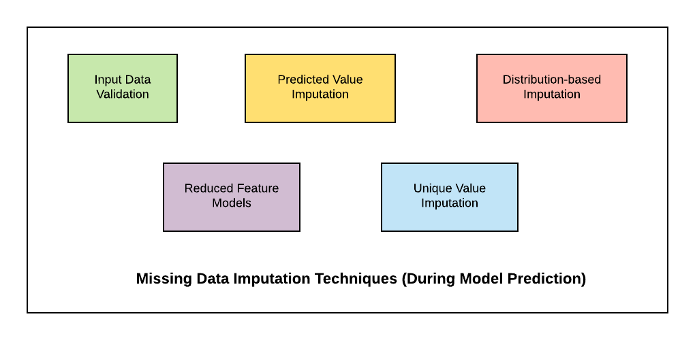

## Table of Contents

## What is value imputation in the context of machine learning?

Value imputation in machine learning is the process of filling in missing data in a dataset. When you're working with real-world data, it's common to find that some information is missing. This can be a problem because many machine learning algorithms need complete data to work properly. Imputation helps by estimating the missing values so that the dataset can be used more effectively.

There are different ways to do imputation. One simple method is to fill in the missing values with the mean or median of the available data for that feature. For example, if you're missing some age values in a dataset, you might replace them with the average age of the people whose ages are known. More advanced techniques might use machine learning models to predict the missing values based on other data in the dataset. The choice of method depends on the nature of the data and the specific requirements of the project.

Imputation is important because it can help improve the accuracy and reliability of machine learning models. By filling in missing data, you can avoid losing valuable information that might otherwise be discarded. However, it's also important to be careful with imputation, as it can introduce bias if not done correctly. Always consider the potential impact of your imputation method on the final results of your analysis.

## Why is value imputation important for data preprocessing?

Value imputation is a key part of data preprocessing because it helps deal with missing data, which is common in real-world datasets. When data is missing, it can cause problems for machine learning models, which often need complete data to work well. By filling in these missing values, imputation helps make sure that the dataset is complete and ready for analysis. This can lead to better and more accurate results from the machine learning models.

Choosing the right way to impute values is important. Simple methods like using the average or most common value can work well for some datasets. For example, if you're missing some age values, you might replace them with the average age of the people whose ages are known. More advanced techniques might use other data in the dataset to predict what the missing values should be. The choice depends on the type of data and what you need for your project. It's important to be careful with imputation, though, because if it's not done right, it can add bias to your data and affect your results.

## What are the common types of missing data that require imputation?

Missing data is a common problem in datasets, and it can happen in different ways. One type is Missing Completely at Random (MCAR), where the missing values have no pattern and are just random. For example, if some survey responses are missing because people forgot to answer, and it has nothing to do with their other answers, that's MCAR. Another type is Missing at Random (MAR), where the missingness can be explained by other observed data. For instance, if men are less likely to report their income than women, the missing income data is related to gender, which is observed.

The third type is Missing Not at Random (MNAR), where the missingness is related to the missing data itself. For example, if people with high incomes are less likely to report their income, the missing data is related to the income values themselves. Understanding the type of missing data is important because it helps you choose the right imputation method. If the data is MCAR, simple methods like filling in the average or most common value might work well. But if it's MAR or MNAR, you might need more advanced techniques that use other data to predict the missing values.

## What are some simple methods for value imputation?

One simple method for value imputation is to use the mean or average of the available data. If you have a dataset with ages and some ages are missing, you can fill in the missing ages with the average age of the people whose ages you do know. For example, if the average age in your dataset is 30, you would replace each missing age with 30. This method is easy to do and works well when the data is Missing Completely at Random (MCAR). However, it can be a problem if the data is not MCAR because it might not capture the true variation in the data.

Another simple method is to use the median or the middle value of the available data. The median is less affected by extreme values than the mean, so it can be a better choice if your data has outliers. For example, if the ages in your dataset are 20, 25, 30, 35, and 40, the median age is 30. If an age is missing, you would fill it in with 30. This method can be useful when you want to avoid the influence of outliers on your imputation.

A third simple method is to use the mode, which is the most common value in the dataset. This is often used for categorical data, like filling in missing values for a "color" column with the most common color in the dataset. For example, if most of the entries in a "color" column are "blue," you would fill in missing values with "blue." This method is straightforward and can be effective for categorical data, but it may not capture the full range of variation in the data.

## How does the choice of imputation method affect model performance?

The choice of imputation method can really change how well a machine learning model works. If you pick a good method, it can make your model more accurate by filling in missing data in a smart way. For example, if you use the mean to fill in missing ages and the ages in your data are spread out a lot, your model might not do as well because it's not capturing the real differences in ages. But if you use a more advanced method like multiple imputation, which makes several guesses for each missing value and uses all of them, your model might do better because it's using more of the real variation in the data.

On the other hand, if you pick a bad method, it can make your model worse. For example, if you use the mean to fill in missing values and the data is not Missing Completely at Random (MCAR), you might add bias to your data. This means your model could make wrong predictions because the filled-in data doesn't match the real data well. So, it's important to think about what kind of missing data you have and pick an imputation method that fits it best. This can help make sure your model is as accurate as possible.

## What are the differences between univariate and multivariate imputation techniques?

Univariate imputation techniques focus on one variable at a time. They are simple and often use basic methods like filling in missing values with the mean, median, or mode of that variable. For example, if you have missing ages in a dataset, you might replace them with the average age of everyone else. These methods are easy to understand and apply, but they don't consider relationships between different variables. So, if the missing data in one variable is related to other variables, univariate imputation might not capture these connections well.

Multivariate imputation techniques, on the other hand, look at multiple variables at once. They use more advanced methods that can predict missing values based on other data in the dataset. For example, if you're missing some income data, a multivariate method might use information like age, education, and job type to guess what the missing income should be. These methods can be more accurate because they take into account the relationships between different variables. However, they are also more complex and can take longer to compute. Choosing between univariate and multivariate imputation depends on the nature of your data and how important it is to capture the relationships between variables.

## Can you explain how k-Nearest Neighbors (k-NN) imputation works?

k-Nearest Neighbors (k-NN) imputation is a way to fill in missing data by looking at similar examples in the dataset. Imagine you have a dataset with information about people, like their age, income, and education level. If someone's income is missing, k-NN imputation finds other people in the dataset who are similar to that person in terms of age and education. It then uses the incomes of these similar people to guess what the missing income should be. The "k" in k-NN stands for the number of similar examples you use to make your guess. If k is 5, you look at the 5 most similar people to help fill in the missing value.

To find the similar examples, k-NN calculates the distance between the person with the missing data and everyone else in the dataset. It uses a distance formula, like the Euclidean distance, to see how close each person is to the one with the missing data. Once it finds the k nearest neighbors, it takes their values for the missing variable and uses them to fill in the gap. For example, if the 5 nearest neighbors have incomes of $30,000, $32,000, $35,000, $31,000, and $33,000, k-NN might take the average of these incomes to fill in the missing one. This method can be more accurate than simple methods like using the mean because it considers the relationships between different pieces of data.

## What are the advantages and disadvantages of using Multiple Imputation?

Multiple Imputation is a good way to fill in missing data because it makes several guesses for each missing value and uses all of them. This means it can capture the real differences in the data better than simpler methods like using the average. For example, if you're missing some ages in a dataset, Multiple Imputation might make several different guesses for each missing age, and then use all these guesses to help the model make better predictions. This can make your machine learning model more accurate because it's using more of the real variation in the data. Also, Multiple Imputation can help you understand how much the missing data affects your results, which is important for making sure your analysis is reliable.

However, Multiple Imputation can be hard to do because it's more complex than simpler methods. It takes more time and computer power to make all those guesses and use them in your model. Also, you need to be careful to do it right, or you might add bias to your data. If the way you make the guesses doesn't match the real patterns in your data, your model might make wrong predictions. So, while Multiple Imputation can be a powerful tool, it's important to think about whether it's the right choice for your project and if you have the resources to do it well.

## How do you evaluate the effectiveness of an imputation method?

To evaluate how well an imputation method works, you can look at how it affects the results of your machine learning model. One way to do this is to compare the model's performance with the imputed data to its performance with the original data where missing values were just removed. If the model does better or about the same with the imputed data, then the imputation method is likely good. You can use measures like accuracy, precision, recall, or the F1 score to see how the model is doing. For example, if your model is trying to predict whether someone will buy a product, you might look at how often it gets the prediction right with the imputed data versus without it.

Another way to check the effectiveness of an imputation method is to use a technique called cross-validation. You can split your data into different parts, use some parts to train your model and others to test it, and then see how the model performs across these different splits. If the imputation method helps the model perform consistently well across all the splits, it's a sign that the method is working well. You can also look at how much the imputed values differ from the real values if you have some data where the true values are known. This can give you an idea of how accurate the imputation method is. For example, if you know the real ages for some people and the imputed ages are close to the real ones, that's a good sign.

## What role does domain knowledge play in choosing an imputation strategy?

Domain knowledge is really important when you're picking an imputation strategy. It helps you understand why data might be missing and what the missing values might be. For example, if you're working with medical data and you know that older people are less likely to report their income, you can use this information to choose a better way to fill in those missing incomes. This means your guesses for the missing values will be more accurate because they're based on what you know about the data.

Using domain knowledge also helps you avoid making mistakes that could mess up your results. If you don't know much about the data, you might pick a simple method like using the average value, but that might not work well if the missing data follows a certain pattern. By understanding the data better, you can pick a more advanced method that fits the data better. This can make your machine learning model more accurate and reliable.

## How can machine learning algorithms be used to predict missing values?

Machine learning algorithms can be used to predict missing values by learning patterns from the existing data. For example, if you have a dataset about people's ages, incomes, and education levels, and some income values are missing, a machine learning model can look at the ages and education levels of people with known incomes to guess what the missing incomes might be. This is done by training the model on the parts of the data where all values are known, and then using it to predict the missing values. Algorithms like k-Nearest Neighbors (k-NN) or regression models can be used for this. k-NN finds similar examples in the dataset to help fill in the missing values, while regression models might use a formula to predict the missing value based on other variables.

Choosing the right machine learning algorithm depends on the type of data and the patterns in it. For example, if the missing data is related to other variables in a complex way, a more advanced model like a neural network might be needed. Neural networks can learn very complicated patterns, but they need a lot of data and can be hard to set up. On the other hand, simpler models like linear regression might work well if the relationships between variables are straightforward. The key is to use the model that best captures the relationships in your data, so your guesses for the missing values are as accurate as possible.

## What advanced techniques exist for handling missing data in time series?

Handling missing data in time series can be tricky because the data points are connected over time. One advanced technique is called forward fill or backward fill. Forward fill means you take the last known value and use it for the missing ones until you get to the next known value. Backward fill is the opposite; you use the next known value to fill in the missing ones going backward. These methods work well when the missing data is short and the values don't change much over time. For example, if you're missing temperature readings for a few hours, using the last known temperature might be a good guess.

Another advanced technique is using interpolation. Interpolation means you guess the missing values based on the values before and after the missing ones. A common way to do this is linear interpolation, where you draw a straight line between the known points and use that line to find the missing values. For example, if you know the temperature was 20 degrees at 1 PM and 22 degrees at 3 PM, you might guess the temperature at 2 PM was 21 degrees. More advanced interpolation methods like spline interpolation can be used if the data changes in more complicated ways. These methods can be more accurate but also more complex to set up.