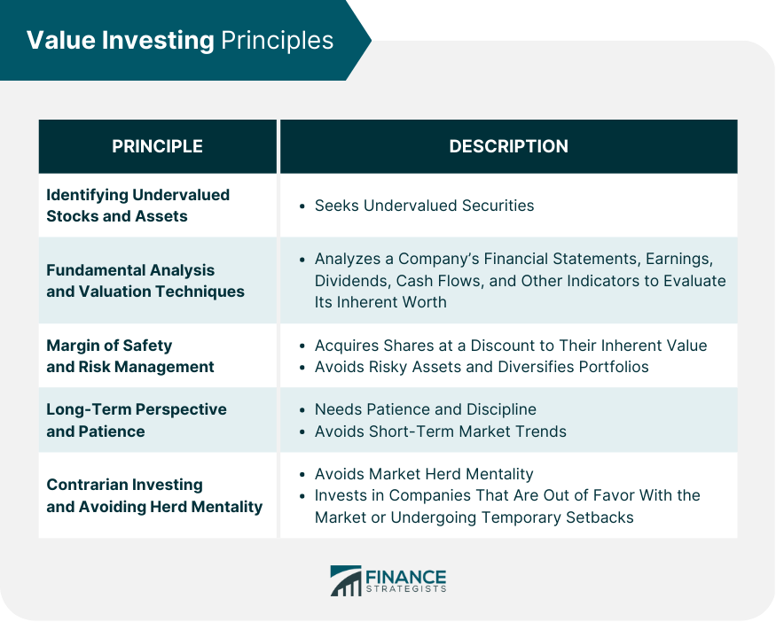

In today's dynamic financial market, investors are constantly seeking methods to optimize their returns while mitigating risks. With the ever-evolving landscape of financial instruments and market volatility, crafting a robust investment strategy remains paramount for market participants. Among the myriad of available approaches, value investing and algorithmic trading have emerged as prominent strategies, each offering unique avenues for maximizing profit potential but also posing distinct challenges.

Value investing, with its roots tracing back to the principles established by Benjamin Graham, advocates for identifying and investing in stocks that appear undervalued by the market. This method emphasizes a meticulous analysis of a company's fundamentals, often leveraging key financial metrics such as the Price-to-Earnings (P/E) and Price-to-Book (P/B) ratios. By concentrating on the intrinsic value of a company, value investors seek to harness long-term gains through disciplined buying and holding of stocks perceived as underpriced.



In contrast, algorithmic trading leverages advancements in technology to execute trades with speed and precision. Traditionally associated with short-term trading strategies, algorithmic trading is increasingly applied to long-term investments, incorporating complex models and data analysis. This strategy relies on automation to enhance the efficiency and accuracy of trades, thus seeking to minimize transactional costs and capitalize on market inefficiencies.

The appeal of these strategies is evident; however, they are not without risk. Understanding and managing the financial risks associated with value investing and algorithmic trading is crucial. This article will examine these risks and offer insights into effective risk management practices. By fostering a comprehensive understanding of these investment techniques, investors can better navigate the intricacies of the financial markets and align their approaches with their risk tolerance and investment goals.

## Table of Contents

## Understanding Value Investing

Value investing involves the identification and selection of stocks considered to be undervalued relative to their intrinsic value. This strategy, which was pioneered by Benjamin Graham, is grounded in the principle that the market's pricing of securities does not always reflect their true worth. Consequently, value investors seek to capitalize on price discrepancies by purchasing stocks when their market price is lower than their intrinsic value, with the expectation that prices will eventually adjust upward, yielding long-term gains.

The fundamental approach of value investing is to perform rigorous analysis on company fundamentals, identifying opportunities where stock prices do not align with financial metrics and business health. Essential to this evaluation are key metrics such as the Price-to-Earnings (P/E) and Price-to-Book (P/B) ratios. These ratios provide insight into how much investors are willing to pay for a company's earnings and book value, respectively.

The Price-to-Earnings (P/E) ratio is calculated as:

$$
\text{P/E Ratio} = \frac{\text{Market Price per Share}}{\text{Earnings per Share (EPS)}}
$$

This ratio serves as an indicator of a company's current valuation relative to its earnings. A low P/E ratio may suggest that a stock is undervalued compared to its earnings, making it an attractive option for value investors.

The Price-to-Book (P/B) ratio is another crucial metric, given by:

$$
\text{P/B Ratio} = \frac{\text{Market Price per Share}}{\text{Book Value per Share}}
$$

The P/B ratio gauges a company's market value against its book value, with a lower ratio often indicating undervaluation. This can be especially relevant during market fluctuations where a stock's market price might not fully capture the company’s net asset value.

In essence, value investing requires a disciplined, systematic approach to identify opportunities where the market has mispriced companies' stocks. By focusing on these discrepancies, value investors aim to achieve superior financial returns, grounded in the belief that in the long term, the market will recognize and correct these undervaluations.

## Financial Risks in Value Investing

Value investing is traditionally seen as a conservative strategy, focusing on identifying and purchasing stocks that are perceived to be trading for less than their intrinsic value. Nevertheless, this approach carries its own set of financial risks that can impact investors significantly. One primary risk arises from the potential for inaccurate valuation. This occurs when investors miscalculate a company's intrinsic value due to flawed analysis or incorrect assumptions. Fundamental metrics, such as the Price-to-Earnings (P/E) ratio and Price-to-Book (P/B) ratio, are often employed in this analysis. However, reliance solely on these indicators without a comprehensive understanding of the company's business model and market conditions can lead to misguided investment decisions.

Inaccurate valuation is often compounded by changes in industry dynamics. Industries are subject to fluctuations due to technological advancements, regulatory changes, and shifting consumer preferences. For instance, a company that seemed undervalued based on its historical performance and industry benchmarks might face significant challenges if disruptive technologies render its business model obsolete.

Investors must therefore conduct thorough evaluations of company fundamentals, including financial statements, management quality, and competitive positioning, to mitigate these risks. Moreover, external economic factors such as [interest rate](/wiki/interest-rate-trading-strategies) changes, geopolitical events, or global economic conditions can adversely affect stock valuations. These variables can influence market sentiment and, consequently, the market price of stocks deemed to be undervalued. 

To better manage these risks, investors might consider diversifying their portfolios to include a range of sectors and industries. Additionally, ongoing portfolio review and adjustments, based on updated research and market conditions, are crucial for maintaining a robust investment strategy. Employing a margin of safety, which implies purchasing stocks at a significant discount to their calculated intrinsic value, can also provide a buffer against valuation errors and unexpected market shifts.

## Algorithmic Trading in Long-Term Investment

Algorithmic trading, traditionally associated with short-term market positions, is witnessing a transformation as it is increasingly being adopted for long-term investment strategies. This evolution is largely driven by advancements in technology and the growing availability of vast datasets. While [algorithmic trading](/wiki/algorithmic-trading) originally focused on exploiting minor price discrepancies over short time frames, its utility in long-term investment is being recognized due to its ability to process large volumes of information quickly and accurately.

The core advantage of algorithmic trading in long-term investment lies in its capability to analyze a multitude of financial metrics and economic indicators systematically. By leveraging sophisticated algorithms, investors can identify long-term trends and undervalued assets that may not be immediately apparent through conventional analysis. For instance, Python libraries such as NumPy and pandas are extensively used to perform rigorous data analysis. An example code snippet for loading and analyzing a financial dataset is:

```python
import pandas as pd

# Load historical stock data
data = pd.read_csv('historical_stock_data.csv')

# Calculate moving averages to identify long-term trends
data['50_day_MA'] = data['Close'].rolling(window=50).mean()
data['200_day_MA'] = data['Close'].rolling(window=200).mean()

# Identify buy signals when short-term MA crosses long-term MA
buy_signals = data[data['50_day_MA'] > data['200_day_MA']]
```

This code demonstrates how moving averages, a common technique in long-term trend analysis, can be efficiently computed using automated processes. Such strategies enable investors to make informed decisions based on historical performance data, enhancing both the efficiency and accuracy of trade executions.

Moreover, in long-term investment, algorithmic trading alleviates emotional biases that often impede human decision-making. By relying on a data-driven approach, investors can maintain consistency and discipline in their investment strategies. Automation ensures that trades are executed whenever predefined conditions are met, thereby reducing the potential for human error and emotional trading.

However, successful application requires robust models and thorough [backtesting](/wiki/backtesting) to ensure that the algorithms perform well under varying market conditions. Backtesting involves running simulations of the trading strategy using historical data to evaluate its performance before applying it in the real market. This practice is integral to refining algorithms and adjusting them for factors such as market [volatility](/wiki/volatility-trading-strategies) and economic shifts, thus maximizing the probability of achieving desired investment outcomes.

In conclusion, as algorithmic trading continues to evolve, its role in long-term investment will likely expand. Utilizing data analysis and automation provides a powerful framework for investors seeking to enhance their decision-making capabilities, ultimately leading to more informed and objective investment strategies.

## Risks Associated with Algorithmic Trading

Algorithmic trading, despite its many advantages, presents unique risks that can lead to significant financial repercussions if not properly managed. One of the most prevalent risks in algorithmic trading arises from errors in code or the algorithms themselves. This can occur due to faulty logic, lack of rigorous testing, or unanticipated market events that the algorithm is not designed to handle. Such errors can lead to incorrect trading decisions, resulting in substantial financial losses. Historical examples, such as the 2012 Knight Capital incident, highlight how a single software glitch can lead to losses exceeding hundreds of millions of dollars in a matter of hours.

Moreover, algorithmic trading amplifies systemic risks due to the interconnectedness and high velocity of global financial markets. Algorithms can execute thousands of trades per second, and when numerous algorithms from different market participants interact simultaneously, the impact of errors or unforeseen interactions between these systems can lead to extreme volatility. This is exemplified by events such as the 2010 Flash Crash, where the Dow Jones Industrial Average plummeted almost 1,000 points within minutes, only to recover shortly afterward. Such incidents are often triggered by a cascade effect, where one algorithm's actions lead to unexpected market conditions that trigger anomalies in other algorithms.

These risks are compounded by the competitive nature of algorithmic trading, where speed is of the essence. The pressure to deploy trading strategies swiftly can sometimes lead to insufficient testing or inadequate risk management protocols, increasing the likelihood of adverse outcomes. To mitigate these risks, it is crucial for firms to implement robust testing frameworks, monitor trading activities in real-time, and adopt comprehensive risk management strategies that can dynamically respond to market changes.

Python is frequently employed to develop and test trading algorithms due to its extensive libraries and ease of use. A simplified Python code snippet for a basic algorithm might look like this:

```python
def simple_moving_average(data, window):
    return sum(data[-window:]) / window

def trading_decision(current_price, historic_data):
    sma_50 = simple_moving_average(historic_data, 50)
    sma_200 = simple_moving_average(historic_data, 200)

    if sma_50 > sma_200 and current_price > sma_50:
        return "Buy"
    elif sma_50 < sma_200 and current_price < sma_50:
        return "Sell"
    else:
        return "Hold"
```

While this code exemplifies a basic concept, real-world implementations require more sophisticated algorithms, handling of exception cases, and a comprehensive testing framework to avoid the pitfalls of hasty deployments. The careful balancing of speed, accuracy, and risk management is essential to successfully navigate the challenges of algorithmic trading in today's interconnected financial markets.

## Integration of Value Investing and Algorithmic Trading

The integration of value investing and algorithmic trading represents a synergetic approach, leveraging the strengths of both strategies to improve investment outcomes. Value investing relies heavily on [fundamental analysis](/wiki/fundamental-analysis) to identify undervalued stocks, a process that can be time-consuming and subject to human bias. In contrast, algorithmic trading excels at processing large volumes of data quickly and objectively, minimizing human error and optimizing execution speed.

One of the primary benefits of this integration is enhanced risk management. By incorporating algorithmic models into the value investing process, investors can systematically update their valuations based on new market data. This dynamic approach allows for real-time adjustments to strategies, ensuring that portfolios remain aligned with current market conditions. Furthermore, algorithms can be programmed to [factor](/wiki/factor-investing) in diverse risk metrics, such as Value at Risk (VaR) or Conditional Value at Risk (CVaR), to better anticipate potential losses and implement preemptive measures.

Additionally, the fusion of these methodologies facilitates the identification of undervalued assets with greater precision. Algorithms can be designed to screen through vast datasets, using predefined criteria aligned with value investing principles such as low Price-to-Earnings (P/E) and Price-to-Book (P/B) ratios. This process not only accelerates the discovery of attractive investments but also enhances the consistency and accuracy of stock valuations.

Moreover, the integration enables the development and application of more sophisticated investment models. For example, [machine learning](/wiki/machine-learning) techniques can be employed to refine the predictive accuracy of financial models, incorporating non-traditional data sources such as social media sentiment or macroeconomic indicators. These models can continuously evolve, learning from market behavior to improve their predictive power over time.

In conclusion, the amalgamation of value investing and algorithmic trading provides a powerful toolkit for investors seeking to optimize their investment strategies. By combining the thoroughness of fundamental analysis with the efficiency of automated trading, this hybrid approach offers the potential for superior returns while effectively managing risk.

## Conclusion

In an ever-evolving financial landscape, the juxtaposition of value investing and algorithmic trading presents a fascinating dichotomy for investors. Each strategy offers distinct advantages while posing unique challenges that require careful consideration and management. 

Value investing, with its foundation rooted in the meticulous analysis of undervalued stocks, appeals to those seeking long-term wealth accumulation. However, it necessitates a comprehensive understanding of financial statements, market conditions, and external economic factors. This strategy demands patience and the ability to withstand market fluctuations, as the anticipated correction of undervaluation may take time to materialize.

Conversely, algorithmic trading leverages technological advancements to automate and optimize trading processes. By harnessing the power of data analysis and real-time market insights, this approach aims to enhance efficiency and reduce human error. Despite its technological sophistication, algorithmic trading is not immune to risks, including coding errors and systemic risks in globally interconnected markets.

For investors, the crux lies in recognizing the underlying risks associated with each strategy and implementing robust risk management practices. A comprehensive understanding of market dynamics, coupled with continuous adaptation to technological advancements and economic shifts, is imperative. The integration of value investing principles with algorithmic precision can potentially offer a balanced approach, allowing investors to harness the strengths of both methodologies.

As financial markets grow ever more complex, the ability to navigate these complexities with informed, flexible strategies will be paramount to achieving sustained investment success.

## References & Further Reading

[1]: Graham, B., & Dodd, D. L. (2008). ["Security Analysis."](https://www.amazon.com/Security-Analysis-Seventh-Principles-Techniques/dp/1264932405) McGraw-Hill Education.

[2]: Graham, B. (2006). ["The Intelligent Investor: The Definitive Book on Value Investing."](https://www.amazon.com/Intelligent-Investor-Definitive-Investing-Essentials/dp/0060555661) Harper Business.

[3]: Chan, E. P. (2013). ["Algorithmic Trading: Winning Strategies and Their Rationale."](https://github.com/ftvision/quant_trading_echan_book) Wiley.

[4]: Lopez de Prado, M. (2018). ["Advances in Financial Machine Learning."](https://www.amazon.com/Advances-Financial-Machine-Learning-Marcos/dp/1119482089) Wiley.

[5]: Kissell, R. (2013). ["The Science of Algorithmic Trading and Portfolio Management."](https://www.sciencedirect.com/book/9780124016897/the-science-of-algorithmic-trading-and-portfolio-management) Academic Press.