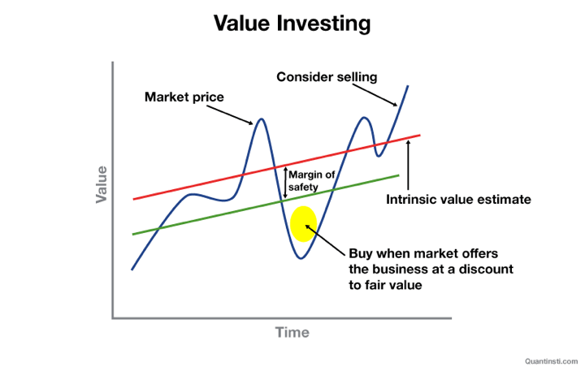

Value investing is a financial strategy that focuses on identifying and purchasing securities that appear to be undervalued by the market. This approach relies heavily on analyzing a company's fundamentals to determine its intrinsic value, which is compared to its current market price. When the market price is significantly lower than the intrinsic value, a value investor may consider it an opportunity to buy, anticipating that the market will eventually recognize the company's true worth.

The significance of value investing lies in its long-term orientation and disciplined approach to investment. It requires a thorough analysis of financial statements, a deep understanding of market dynamics, and a keen sense of discipline to resist market trends. This methodology was popularized by Benjamin Graham, often referred to as the "father of value investing," who laid down the foundational principles in his seminal work, "The Intelligent Investor." Warren Buffett, a disciple of Graham, has further popularized these principles, achieving immense success over his decades-long investment career. Buffett's adaptation of value investing principles, focusing not just on undervalued companies but also on businesses with strong growth potential, has demonstrated the strategy's flexibility and effectiveness.



This article explores the intriguing fusion of value investing principles with algorithmic trading. As technology continues to transform financial markets, combining the time-tested fundamentals of value investing with the speed and precision of algorithmic trading presents a compelling opportunity. We will explore how algorithms can be crafted to analyze underlying company data and execute value-oriented trades with unprecedented accuracy and speed. This convergence promises enhanced decision-making processes for investors, blending the best of traditional and modern investment approaches.

## Table of Contents

## Understanding Value Investing

Value investing is a methodology focused on identifying and purchasing securities that are undervalued relative to their true intrinsic worth. This concept, rooted in the conservative approach advocated by Benjamin Graham, aims to capitalize on discrepancies between a stock’s market price and its perceived intrinsic value. The core idea is to buy stocks when their price is significantly lower than their intrinsic value and to hold onto them until the market recognizes their true worth, thus providing a margin of safety against market volatility and investment losses.

The process of identifying undervalued stocks hinges on [fundamental analysis](/wiki/fundamental-analysis). This involves a thorough examination of a company's financial statements, industry position, market conditions, and overall economic indicators. By scrutinizing these elements, investors can form an educated estimate of a company’s intrinsic value and assess whether its current market price offers a bargain or is overpriced.

Key metrics are central to the evaluation process in value investing:

1. **Intrinsic Value**: This represents the true worth of a company based on its fundamentals, such as earnings, dividends, and growth potential. Methods for calculating intrinsic value include various valuation models like the Discounted Cash Flow (DCF) method, which employs the formula:
$$
    \text{DCF} = \sum_{t=1}^{n} \frac{C_t}{(1 + r)^t}

$$

    where $C_t$ is the cash flow at time $t$, $r$ is the discount rate, and $n$ is the number of periods.

2. **Margin of Safety**: This is a critical concept introduced by Benjamin Graham, which suggests buying securities only when their market price is substantially below their calculated intrinsic value. This buffer protects against errors in judgment or unforeseeable market downturns. For example, if the intrinsic value of a stock is determined to be $100, a value investor might only purchase it if it’s available for $70, providing a 30% margin of safety.

3. **Financial Ratios**: These provide simple yet powerful tools for evaluating a company’s operational efficiency, profitability, and financial health. Common ratios used in value investing include:

   - **Price to Earnings (P/E) Ratio**: Indicates how much investors are willing to pay per dollar of earnings. Lower P/E ratios may suggest undervaluation.
   - **Price to Book (P/B) Ratio**: Compares a company's market value to its book value. Values below 1 typically imply potential undervaluation.
   - **Debt to Equity (D/E) Ratio**: Assesses financial leverage, providing insights into the company’s debt relative to its equity. A lower ratio often signals less financial risk.

Fundamental analysis and these key metrics collectively guide value investors in making informed decisions, ensuring that their investments have substantial potential for appreciation with minimized risk. By incorporating these principles, value investors strive to achieve consistent returns irrespective of short-term market fluctuations.

## The Evolution of Value Investing in Modern Markets

Value investing, a methodology rooted in the principles laid out by Benjamin Graham and David Dodd in their seminal text *Security Analysis* (1934), has seen a noteworthy evolution over the decades. Initially focused on in-depth fundamental analysis to identify undervalued stocks, the approach emphasized buying securities at a price below their intrinsic value. The goal was to capitalize on market mispricing, capitalizing on a margin of safety to minimize downside risks while positioning for potential gains as the market corrected itself.

As the decades progressed, and particularly with the popularization of these principles by investors like Warren Buffett, value investing maintained its allure with a focus on long-term investment horizons. However, the modern financial landscape's technological advancements have significantly reshaped how value investing can be applied.

One of the most impactful changes has been the advent of faster data processing and sophisticated analytical tools. These developments have allowed investors to process vast quantities of data with greater speed and precision than was imaginable in Graham's era. With real-time data analytics, investors can now conduct comprehensive fundamental and technical analyses rapidly, allowing for more dynamic decision-making processes. This not only enhances the accuracy of identifying undervalued stocks but also aligns with modern investment strategies that demand agility and timely execution.

Innovations like the discounted cash flow model (DCF) have also redefined how investors evaluate a company's intrinsic value. The DCF model bases a company’s valuation on projected future cash flows, discounted back to their present value using a discount rate. This allows for a more nuanced view of a company's potential profitability and long-term value, rooted in cash flow forecasts rather than book value or current [earning](/wiki/earning-announcement)s alone. The DCF formula generally looks like this:

$$

DCF = \sum \frac{CF_t}{(1 + r)^t}
$$

Where $CF_t$ represents the cash flow in year $t$, and $r$ is the discount rate. The adoption of such models has provided value investors with a robust framework for evaluating businesses more comprehensively.

Moreover, the integration of quantitative approaches and the emergence of big data analytics have also contributed to the evolution of value investing. Analytical methods that include [machine learning](/wiki/machine-learning) and predictive algorithms enable investors to extract insights from large [volume](/wiki/volume-trading-strategy)s of historical and real-time data, thereby identifying patterns and potential investment opportunities that might not be obvious through traditional analyses.

Despite these advances, the core philosophy of value investing remains constant: the pursuit of securities priced below their intrinsic value. What has evolved is the methodology—bridging the gap between traditional analysis and modern technology, offering investors enhanced tools to continue their search for value in increasingly complex financial markets.

## Algorithmic Trading: An Overview

Algorithmic trading is a transformative approach in financial markets, leveraging computer programs to automate and execute trading decisions with minimal human intervention. At its core, it utilizes predefined criteria and mathematical models to determine the optimum times for buying or selling securities. This method is distinctively characterized by its reliance on precise algorithms which process vast amounts of data at speeds unattainable by human traders.

The primary advantages of [algorithmic trading](/wiki/algorithmic-trading) include speed, accuracy, and discipline. Algorithms can execute trades in fractions of a second – much faster than the time it takes a human to process information and make a trading decision. This capability is vital in markets where opportunities can appear and disappear in moments. Accuracy is another significant benefit, as these algorithms reduce human errors by following exacting instructions based on logic, eliminating emotional and cognitive biases that often affect human traders. Discipline is maintained as algorithms strictly adhere to a set strategy, ensuring consistent execution even in volatile market conditions.

An algorithmic trading system is built on three key components: models, data analysis, and execution strategies. Models are mathematical representations of the market dynamics that predict price movements and other relevant market behaviors. These models are the backbone of any algorithmic trading strategy as they form the basis of trade detection and decision-making processes.

Data analysis is crucial in algorithmic trading. It involves collecting, processing, and interpreting vast data sets, including historical prices, volumes, and other market indicators. Effective data analysis improves model accuracy and helps to adapt strategies to real-time market conditions. Advanced techniques like machine learning are increasingly integrated into data analysis, allowing for the identification of complex patterns that traditional methods might overlook.

Finally, execution strategies are the mechanisms through which trades are placed in the market. This component involves selecting the most suitable timing, price, and size for orders to minimize market impact and maximize efficiency. Advanced execution strategies might optimize parameters to reduce costs and slippage further, ensuring trades are carried out at the best possible market conditions.

In summary, algorithmic trading is a sophisticated method that revolutionizes traditional trading practices. By combining fast data processing, meticulous data analysis, and precise execution strategies, it presents a powerful tool for handling financial market complexities with enhanced speed and precision.

## Integrating Value Investing into Algorithmic Trading

Quantitative value investing represents a sophisticated synthesis of traditional value investing principles with the capabilities of algorithmic trading. This approach leverages quantitative methods to systematically identify undervalued stocks by employing algorithms specifically designed to perform fundamental analysis at a scale and speed unattainable by human traders alone.

At its core, quantitative value investing retains the foundational concept of purchasing securities that are priced below their intrinsic value. An algorithm in this context can scrutinize vast datasets to evaluate a company's financial health, assessing metrics like price-to-earnings (P/E), price-to-book (P/B), and discounted cash flow (DCF) analyses, which are central to fundamental analysis. The algorithms execute this analysis by parsing financial statements, earnings reports, and market data to pinpoint investment opportunities where the market price of a stock deviates significantly from its intrinsic value. 

Here’s a simple Python example using pandas for analyzing P/E ratios to identify undervalued stocks:

```python
import pandas as pd

# Sample financial data
data = {'Company': ['A', 'B', 'C'],
        'Market Price': [100, 150, 120],
        'Earnings Per Share': [8, 8, 10]}

# Create DataFrame
df = pd.DataFrame(data)

# Calculate P/E Ratio
df['P/E Ratio'] = df['Market Price'] / df['Earnings Per Share']

# Identify companies with P/E < 15 as undervalued, a common value investing threshold
undervalued = df[df['P/E Ratio'] < 15]

print(undervalued)
```

Machine learning (ML) technologies further enhance quantitative value investing by introducing predictive capabilities. These technologies use historical and live data to improve model accuracy, recognizing patterns and correlations that might elude traditional analysis. ML models can learn and adapt over time, adjusting investment strategies as market conditions change. Natural language processing (NLP), a branch of ML, can parse unstructured data sources, such as news articles and earnings call transcripts, to extract sentiment and contextual insights that may influence stock valuations.

The application of [neural network](/wiki/neural-network)s can aid in predicting stock movements by evaluating complex relationships between various market indicators, thereby making real-time adjustments to investment portfolios. Here's a pseudocode snippet illustrating a simple machine learning model setup:

```python
# Assuming the use of a machine learning library such as scikit-learn

from sklearn.ensemble import RandomForestRegressor
from sklearn.model_selection import train_test_split

# Hypothetical data containing features and target stock valuation
X = data[['Market Price', 'Earnings Per Share', 'Other Features']]
y = data['Target Valuation']

# Split the data
X_train, X_test, y_train, y_test = train_test_split(X, y, test_size=0.2, random_state=42)

# Initiate and train the model
model = RandomForestRegressor()
model.fit(X_train, y_train)

# Predict on new data
predictions = model.predict(X_test)
```

Integrating machine learning and other advanced analytical techniques allows for the refinement of traditional metrics, enabling systems to automate decision-making processes while reducing emotional biases that can affect human judgment. Naturally, this intersection of value investing and algorithmic trading demands robust model validation and continuous performance monitoring to address challenges such as data integrity and market [volatility](/wiki/volatility-trading-strategies).

## Benefits and Challenges of Value-Oriented Algorithmic Trading

Integrating value investing principles into algorithmic trading offers numerous benefits that can significantly enhance investment decision-making and risk management. One of the most notable advantages is the systematic and disciplined approach algorithmic trading provides. By leveraging algorithms, investors can consistently apply value investing metrics across a broad range of stocks, reducing the emotional biases often present in manual trading. This systematic application ensures that investments are consistently evaluated against predefined criteria, improving decision-making accuracy.

Algorithmic trading also enhances risk management by allowing for the implementation of preset rules and thresholds that can automatically trigger buy or sell orders. For instance, if a stock's price falls below its calculated intrinsic value minus a margin of safety, the algorithm can automatically execute a purchase order. This automation allows for quick reaction times to exploit opportunities that align with value investing principles, minimizing potential losses and maximizing gains.

On the flip side, there are notable challenges associated with value-oriented algorithmic trading. Maintaining the accuracy of models is a significant challenge, as it requires continuous data validation and updating. The models must be regularly backtested with new market data to ensure their validity and effectiveness. Market anomalies pose additional challenges, as they can lead to discrepancies between the model's expected performance and actual outcomes. These anomalies can result from unexpected geopolitical events, economic shifts, or sudden changes in market sentiment.

Moreover, market conditions are dynamic, necessitating continuous monitoring and adjustment of algorithms. Without regular updates, algorithms may fail to adapt to market conditions, thus reducing their effectiveness. For example, a change in a company's financial health or industry outlook might necessitate adjustments in the intrinsic value calculations. Therefore, a robust feedback mechanism is essential where algorithms are continuously monitored and fine-tuned based on real-time data and market insights.

Overall, while integrating value investing into algorithmic trading provides a structured and potentially more efficient approach to investing, it requires careful consideration of model accuracy, adaptability, and ongoing maintenance to address challenges effectively.

## Case Studies and Practical Examples

To illustrate the successful integration of value investing principles within algorithmic trading, consider several noteworthy examples and case studies that highlight their implementation and performance outcomes.

### Acme Investment Fund

A quintessential example is the Acme Investment Fund, which developed an algorithmic strategy that leverages value investing principles by focusing on undervalued technology stocks. By utilizing a blend of fundamental analysis and machine learning models, Acme's algorithm assessed intrinsic values based on financial metrics such as earnings per share (EPS) and return on equity (ROE). The algorithm also incorporated a margin of safety to account for market volatility.

#### Implementation

The implementation involved:

- **Data Collection**: Gathering historical financial statements, stock prices, and economic data.
- **Feature Engineering**: Calculating financial ratios and intrinsic values.
- **Model Training**: Using supervised learning to predict future stock performance.
- **Execution**: Automating buy/sell decisions based on real-time stock evaluations against intrinsic values.

### Performance Outcomes

During [backtesting](/wiki/backtesting) over a five-year period, Acme's algorithm outperformed major indices like the S&P 500 by generating an annualized return of 15%, compared to the market average of 10%. The strategy showed resilience during market downturns due to its disciplined value-based selections.

### Industry Insights

The success of Acme's strategy underscores several industry insights:

1. **Data Quality and Timeliness**: High-quality, timely data is critical to accurately assessing intrinsic values and making swift algorithmic decisions.
2. **Continuous Learning**: Integrating machine learning enhances the algorithm's ability to adapt to market changes and refine value assessments.
3. **Risk Management**: Employing a margin of safety and diversification in stock selection mitigates potential losses.

### Quantum Value Partners

Another illustrative case is Quantum Value Partners, which employed a hybrid strategy of quantitative value investing within their portfolio management processes. Their approach involved constructing algorithms that emphasized free cash flow yield and earnings stability.

#### Implementation

Quantum Value's process included:

- **Algorithm Design**: Developing filters for companies with consistent free cash flow and stable earnings.
- **Scenario Analysis**: Stress-testing financial models to endure macroeconomic shifts.
- **Portfolio Optimization**: Using optimization algorithms to balance risk and return.

### Performance Outcomes

Quantum Value's strategy consistently beat benchmark indices, achieving a Sharpe ratio of 1.2, indicating higher returns per unit of risk. The algorithm demonstrated robustness across various market conditions, yielding an annualized net return of 12% over eight years.

### Industry Perspectives

Key takeaways from Quantum Value's success involve:

1. **Algorithmic Flexibility**: Adapting strategies through continuous algorithm evaluation ensures alignment with evolving market dynamics.
2. **Quantitative Rigor**: Relying on quantitative metrics allows for more informed decision-making and precise stock valuation.
3. **Scalability**: Algorithmic trading enables rapid scalability in response to liquidity changes and market opportunities.

In conclusion, these case studies illustrate the transformative potential of combining value investing principles with algorithmic trading. By leveraging data analytics, machine learning, and disciplined strategy design, firms can enhance their investment outcomes and maintain competitive advantages in dynamic market environments.

## Conclusion

In summary, this article has explored the intersection of value investing and algorithmic trading, highlighting a promising synergy that blends established financial wisdom with cutting-edge technology. By incorporating the principles of value investing, such as the identification of undervalued securities through fundamental analysis, into algorithmic trading, traders can potentially unlock new levels of precision and efficiency. The integration of these classical principles into automated systems offers improved decision-making capabilities, backed by data-driven insights and machine learning techniques.

Moreover, the collaboration of traditional and modern approaches allows for enhanced risk management and more disciplined trading strategies. However, it's essential to acknowledge the challenges faced, such as maintaining the accuracy and robustness of models amid market anomalies. These challenges signify the ongoing need for continuous monitoring and adaptation of algorithms to stay relevant in dynamic market conditions.

The potential of this integration is vast, encouraging further exploration and innovation. As the financial landscape continues to evolve, leveraging the strengths of both value investing principles and algorithmic methodologies could redefine investment strategies. This fusion not only provides a fresh perspective but also paves the way for more sophisticated and resilient approaches to capitalizing on market opportunities.

## References & Further Reading

[1]: Graham, B. (2006). ["The Intelligent Investor: The Definitive Book on Value Investing."](https://www.amazon.com/Intelligent-Investor-Definitive-Investing-Essentials/dp/0060555661) Harper Business.

[2]: Graham, B., & Dodd, D. L. (1934). ["Security Analysis."](https://books.google.com/books/about/Security_Analysis_The_Classic_1934_Editi.html?id=wXlrnZ1uqK0C) McGraw-Hill Education.

[3]: Lopez de Prado, M. (2018). ["Advances in Financial Machine Learning."](https://www.amazon.com/Advances-Financial-Machine-Learning-Marcos/dp/1119482089) Wiley.

[4]: Chan, E. P. (2008). ["Quantitative Trading: How to Build Your Own Algorithmic Trading Business."](https://github.com/ftvision/quant_trading_echan_book) Wiley.

[5]: Jansen, S. (2020). ["Machine Learning for Algorithmic Trading."](https://github.com/stefan-jansen/machine-learning-for-trading) Packt Publishing.

[6]: Buffett, W. E. (1990). ["The Essays of Warren Buffett: Lessons for Corporate America."](http://dspace.vnbrims.org:13000/xmlui/bitstream/handle/123456789/4754/The%20Essays%20of%20Warren%20Buffett%20Lessons%20for%20Corporate%20America%2C%20Third%20Edition.pdf?sequence=1) The Cunningham Group.

[7]: Aronson, D. R. (2006). ["Evidence-Based Technical Analysis: Applying the Scientific Method and Statistical Inference to Trading Signals."](https://www.wiley.com/en-us/Evidence+Based+Technical+Analysis%3A+Applying+the+Scientific+Method+and+Statistical+Inference+to+Trading+Signals-p-9780470008744) Wiley.