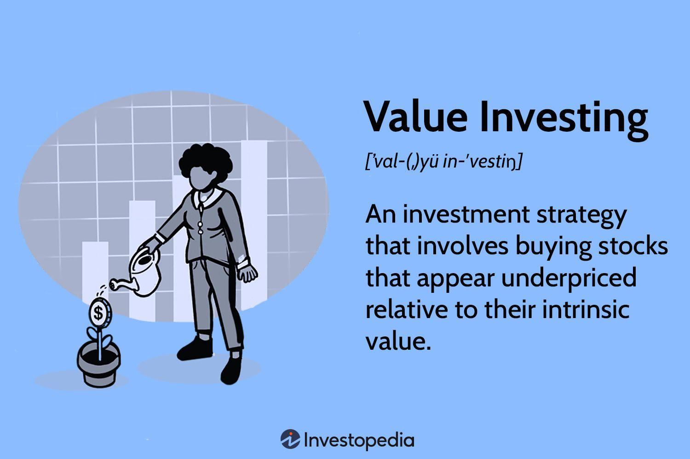

## Table of Contents

## What is value investing?

Value investing is a way of choosing stocks that are priced lower than what they are really worth. People who use this method, called value investors, look for companies that the market has overlooked or undervalued. They believe that over time, the market will recognize the true value of these companies, and their stock prices will go up. To find these undervalued stocks, value investors study a company's financial statements, like its earnings, debts, and assets. They compare these numbers to the stock's current price to see if it's a good deal.

A famous value investor named Warren Buffett has made a lot of money using this approach. He looks for companies with strong fundamentals, like good earnings and low debt, that are selling for less than they should. Buffett and other value investors often use something called the price-to-earnings ratio, or P/E ratio, to help them decide if a stock is undervalued. This ratio compares the stock's price to the company's earnings per share. A lower P/E ratio might mean the stock is undervalued. Value investing requires patience because it can take a long time for the market to correct the price of an undervalued stock, but many investors believe it's worth the wait.

## Who are some famous value investors?

Warren Buffett is one of the most famous value investors. He started investing when he was very young and became rich by buying stocks of companies that he thought were priced too low. He looks for companies with strong business models and good management. He believes in holding onto these stocks for a long time, sometimes forever, until their true value is recognized by the market. His company, Berkshire Hathaway, is well-known because of his successful value investing strategies.

Another famous value investor is Benjamin Graham. He is often called the father of value investing because he wrote a book called "The Intelligent Investor" that taught people how to find undervalued stocks. Graham's ideas influenced many other investors, including Warren Buffett, who was his student. Graham believed in looking at a company's financial statements to find stocks that were selling for less than they were worth. He taught that buying these stocks and holding them for the long term could lead to big profits.

Seth Klarman is also a well-known value investor. He runs a company called Baupost Group and is famous for his book "Margin of Safety." Klarman looks for companies that are undervalued and have a low risk of losing money. He is very careful and only invests when he is sure there is a big difference between the stock's price and its true value. Like Buffett and Graham, Klarman believes in patience and holding onto investments for a long time.

## How does value investing differ from growth investing?

Value investing and growth investing are two different ways to pick stocks. Value investors look for companies that they think are priced too low. They study a company's financial numbers, like earnings and debts, to see if the stock is a good deal. They believe that over time, the market will realize the true worth of these companies, and the stock price will go up. Value investors are patient and often hold onto their stocks for a long time, waiting for the price to rise. Famous value investors like Warren Buffett and Benjamin Graham focus on finding undervalued companies with strong fundamentals.

On the other hand, growth investors look for companies that are growing fast and are expected to keep growing. They don't mind paying a higher price for these stocks because they believe the company's earnings will increase quickly. Growth investors focus on things like new products, expanding markets, and strong leadership. They are willing to take more risk because they think the potential rewards are big. Companies like tech startups often attract growth investors who are excited about future possibilities.

In short, value investing is about finding bargains and waiting for the market to catch up, while growth investing is about betting on future growth and being okay with paying more now for bigger gains later. Both strategies have their own risks and rewards, and smart investors often use a mix of both to build their portfolios.

## What are the key principles of value investing?

Value investing is all about finding companies that are selling for less than they are really worth. People who do value investing, like Warren Buffett, look at a company's financial numbers, such as its earnings, debts, and assets. They want to see if the stock's price is lower than what the company is actually worth. They believe that over time, the market will realize the true value of these companies, and the stock price will go up. So, they buy these stocks and hold onto them for a long time, being patient until the market corrects the price.

Another big part of value investing is looking for a "margin of safety." This means buying stocks at a price that is much lower than what the company is worth, so there is less risk of losing money. Value investors also focus on companies with strong fundamentals, like good earnings and low debt. They avoid companies that are too risky or have weak financials. By sticking to these principles, value investors hope to make money over the long term, even if it takes a while for the market to recognize the true value of their investments.

## How do you identify a value stock?

To identify a value stock, you need to look at a company's financial numbers to see if its stock is priced lower than what it's really worth. You can start by checking the company's earnings, debts, and assets. A key thing to look at is the price-to-earnings ratio, or P/E ratio. This compares the stock's price to the company's earnings per share. If the P/E ratio is lower than the industry average or the company's historical average, it might mean the stock is undervalued. Another important number is the price-to-book ratio, which compares the stock's price to the company's book value. A lower ratio can suggest the stock is a good deal.

You also want to make sure the company has strong fundamentals. This means it should have good earnings, not too much debt, and a solid business model. Look for companies that have been around for a while and have a history of making money. It's also a good idea to check if the company pays dividends. Dividends are payments the company makes to its shareholders, and they can be a sign of a healthy, stable company. By combining these financial checks with a bit of patience, you can find stocks that might be undervalued and could go up in price over time.

## What financial ratios are important in value investing?

When you're trying to find a value stock, looking at certain financial ratios can help you see if a company is priced lower than it should be. One key ratio is the price-to-earnings ratio, or P/E ratio. This number compares the stock's price to the company's earnings per share. If the P/E ratio is lower than the industry average or the company's own historical average, it might mean the stock is undervalued. Another important ratio is the price-to-book ratio, which compares the stock's price to the company's book value. A lower price-to-book ratio can suggest that the stock is a good deal.

You should also check the company's debt-to-equity ratio. This ratio shows how much debt the company has compared to its equity. A lower debt-to-equity ratio can mean the company is financially healthy and less risky. The dividend yield is another useful ratio to look at, especially if you want to earn some income from your investments. It tells you how much the company pays out in dividends each year compared to its stock price. A higher dividend yield can be a sign of a stable company that might be undervalued. By using these ratios, you can get a better idea of whether a stock is a good value investment.

## What is the margin of safety in value investing?

The margin of safety is a key idea in value investing. It means buying stocks at a price that is much lower than what the company is really worth. This gives you a cushion, so even if you made a mistake or if the company's value goes down a bit, you won't lose too much money. Value investors like Warren Buffett look for this margin of safety because it helps them reduce risk. They want to make sure they are not paying too much for a stock, even if they think the company is undervalued.

To find the margin of safety, value investors study a company's financial numbers, like its earnings, debts, and assets. They compare these numbers to the stock's current price to see if there's a big enough difference. If the stock's price is much lower than what the company is worth, that's the margin of safety. This approach helps investors feel more confident that they can still make money even if things don't go exactly as planned.

## How do you calculate intrinsic value?

Intrinsic value is what a company is really worth, not just what its stock price says. To find the intrinsic value, you need to look at the company's financial numbers, like its earnings, debts, and assets. One way to do this is by using a method called discounted cash flow (DCF). With DCF, you guess how much money the company will make in the future and then figure out how much that money is worth today. You do this by taking away a little bit of value each year to account for the risk and time. If the intrinsic value you calculate is higher than the stock's current price, the stock might be a good value investment.

Another way to find intrinsic value is by looking at other companies in the same industry. You can compare things like the price-to-earnings ratio or the price-to-book ratio of the company you're interested in with other similar companies. If the company's ratios are lower than the industry average, it might be undervalued. Value investors like Warren Buffett use these methods to find stocks that they think are priced too low. By calculating the intrinsic value, they can decide if a stock is a good buy and if it has a margin of safety, which means they are not paying too much for it.

## What are common pitfalls to avoid in value investing?

One common mistake in value investing is falling into a "value trap." This happens when you think a stock is undervalued, but it's actually cheap for a good reason, like the company is struggling or losing money. Just because a stock has a low price doesn't mean it's a good buy. You need to look at the company's financial health and see if there are real problems that won't get better.

Another pitfall is not doing enough research. Value investing takes a lot of work. You need to study the company's earnings, debts, and assets to figure out its true worth. If you don't dig deep enough, you might miss important details that could change your mind about the stock. It's also important to keep an eye on the market and the economy because these can affect how well a company does.

Lastly, being too patient can be a problem. Value investors often hold onto stocks for a long time, waiting for the market to realize the company's true value. But sometimes, even good companies stay undervalued for a long time. If you hold on too long, you might miss out on other good investment opportunities. It's important to know when to sell and move on if things aren't working out.

## How can behavioral finance impact value investing strategies?

Behavioral finance looks at how people's feelings and mistakes can affect their choices about money. In value investing, these feelings can make it hard to stick to the plan. For example, if a stock's price goes down after you buy it, you might feel scared and want to sell it quickly. But if you're a value investor, you should be patient and wait for the market to see the stock's real value. Another problem is something called "confirmation bias," where you only look for information that agrees with what you already think. This can make you miss important signs that a stock is not a good buy.

Value investors can also be affected by "loss aversion," which means they feel the pain of losing money more than the joy of making money. This might make them sell a stock too soon, even if it's still a good value. On the other hand, "overconfidence" can make value investors think they know more than they really do, leading them to take bigger risks. To be a good value investor, you need to understand these feelings and try to make choices based on facts and numbers, not just how you feel at the moment. By knowing about behavioral finance, you can avoid these common mistakes and stick to your value investing strategy.

## What are some advanced techniques used in value investing?

One advanced technique in value investing is using a method called "sum of the parts" analysis. This means looking at all the different pieces of a company and figuring out what each part is worth on its own. Sometimes, a company might be undervalued because the market doesn't see how much each part is worth. By adding up the value of all the pieces, you can see if the whole company is selling for less than it should be. This can help you find hidden value in companies that have different business units or assets that aren't fully appreciated by the market.

Another advanced technique is using "reverse engineering" to find value. This means starting with the stock's price and working backward to see if it makes sense. You look at the company's earnings, growth, and other financial numbers to see if the stock's price is too low. If it is, you might have found a good value investment. This method can help you avoid value traps, which are stocks that seem cheap but are actually cheap for a reason. By using reverse engineering, you can make sure you're not just buying a stock because it's priced low, but because it's truly undervalued.

A third technique is looking at "special situations." These are events that can change a company's value, like mergers, acquisitions, or spin-offs. By understanding how these events might affect the company, you can find stocks that are undervalued because the market hasn't fully understood the impact of the special situation. This can give you an edge in finding value investments that others might miss. By combining these advanced techniques with the basic principles of value investing, you can make smarter choices and find more opportunities for good investments.

## How has value investing evolved with modern market conditions?

Value investing has changed a lot because of new technology and different ways the market works today. In the past, value investors mostly looked at a company's financial numbers like earnings and debts to find good deals. Now, they also use computers and special software to analyze lots of data quickly. This helps them find undervalued stocks faster and more accurately. Also, the rise of online trading and more information available to everyone means that value investors need to be quicker and more creative to find good investments before everyone else does.

Another big change is that value investing now often includes looking at things like environmental, social, and governance (ESG) factors. Many investors care about these things and think they can affect a company's long-term value. So, value investors might look for companies that are not just cheap but also do well in areas like sustainability or treating workers fairly. This means value investing isn't just about numbers anymore; it's also about understanding the bigger picture of how a company fits into the world today.

## What is Understanding Value Investing?

Value investing is a methodology focused on identifying and purchasing securities that are undervalued relative to their true intrinsic worth. This concept, rooted in the conservative approach advocated by Benjamin Graham, aims to capitalize on discrepancies between a stock’s market price and its perceived intrinsic value. The core idea is to buy stocks when their price is significantly lower than their intrinsic value and to hold onto them until the market recognizes their true worth, thus providing a margin of safety against market volatility and investment losses.

The process of identifying undervalued stocks hinges on [fundamental analysis](/wiki/fundamental-analysis). This involves a thorough examination of a company's financial statements, industry position, market conditions, and overall economic indicators. By scrutinizing these elements, investors can form an educated estimate of a company’s intrinsic value and assess whether its current market price offers a bargain or is overpriced.

Key metrics are central to the evaluation process in value investing:

1. **Intrinsic Value**: This represents the true worth of a company based on its fundamentals, such as earnings, dividends, and growth potential. Methods for calculating intrinsic value include various valuation models like the Discounted Cash Flow (DCF) method, which employs the formula:
$$
    \text{DCF} = \sum_{t=1}^{n} \frac{C_t}{(1 + r)^t}

$$

    where $C_t$ is the cash flow at time $t$, $r$ is the discount rate, and $n$ is the number of periods.

2. **Margin of Safety**: This is a critical concept introduced by Benjamin Graham, which suggests buying securities only when their market price is substantially below their calculated intrinsic value. This buffer protects against errors in judgment or unforeseeable market downturns. For example, if the intrinsic value of a stock is determined to be $100, a value investor might only purchase it if it’s available for $70, providing a 30% margin of safety.

3. **Financial Ratios**: These provide simple yet powerful tools for evaluating a company’s operational efficiency, profitability, and financial health. Common ratios used in value investing include:

   - **Price to Earnings (P/E) Ratio**: Indicates how much investors are willing to pay per dollar of earnings. Lower P/E ratios may suggest undervaluation.
   - **Price to Book (P/B) Ratio**: Compares a company's market value to its book value. Values below 1 typically imply potential undervaluation.
   - **Debt to Equity (D/E) Ratio**: Assesses financial leverage, providing insights into the company’s debt relative to its equity. A lower ratio often signals less financial risk.

Fundamental analysis and these key metrics collectively guide value investors in making informed decisions, ensuring that their investments have substantial potential for appreciation with minimized risk. By incorporating these principles, value investors strive to achieve consistent returns irrespective of short-term market fluctuations.

## How has value investing evolved in modern markets?

Value investing, a methodology rooted in the principles laid out by Benjamin Graham and David Dodd in their seminal text *Security Analysis* (1934), has seen a noteworthy evolution over the decades. Initially focused on in-depth fundamental analysis to identify undervalued stocks, the approach emphasized buying securities at a price below their intrinsic value. The goal was to capitalize on market mispricing, capitalizing on a margin of safety to minimize downside risks while positioning for potential gains as the market corrected itself.

As the decades progressed, and particularly with the popularization of these principles by investors like Warren Buffett, value investing maintained its allure with a focus on long-term investment horizons. However, the modern financial landscape's technological advancements have significantly reshaped how value investing can be applied.

One of the most impactful changes has been the advent of faster data processing and sophisticated analytical tools. These developments have allowed investors to process vast quantities of data with greater speed and precision than was imaginable in Graham's era. With real-time data analytics, investors can now conduct comprehensive fundamental and technical analyses rapidly, allowing for more dynamic decision-making processes. This not only enhances the accuracy of identifying undervalued stocks but also aligns with modern investment strategies that demand agility and timely execution.

Innovations like the discounted cash flow model (DCF) have also redefined how investors evaluate a company's intrinsic value. The DCF model bases a company’s valuation on projected future cash flows, discounted back to their present value using a discount rate. This allows for a more nuanced view of a company's potential profitability and long-term value, rooted in cash flow forecasts rather than book value or current [earning](/wiki/earning-announcement)s alone. The DCF formula generally looks like this:

$$

DCF = \sum \frac{CF_t}{(1 + r)^t}
$$

Where $CF_t$ represents the cash flow in year $t$, and $r$ is the discount rate. The adoption of such models has provided value investors with a robust framework for evaluating businesses more comprehensively.

Moreover, the integration of quantitative approaches and the emergence of big data analytics have also contributed to the evolution of value investing. Analytical methods that include [machine learning](/wiki/machine-learning) and predictive algorithms enable investors to extract insights from large [volume](/wiki/volume-trading-strategy)s of historical and real-time data, thereby identifying patterns and potential investment opportunities that might not be obvious through traditional analyses.

Despite these advances, the core philosophy of value investing remains constant: the pursuit of securities priced below their intrinsic value. What has evolved is the methodology—bridging the gap between traditional analysis and modern technology, offering investors enhanced tools to continue their search for value in increasingly complex financial markets.

## References & Further Reading

[1]: Graham, B. (2006). ["The Intelligent Investor: The Definitive Book on Value Investing."](https://www.amazon.com/Intelligent-Investor-Definitive-Investing-Essentials/dp/0060555661) Harper Business.

[2]: Graham, B., & Dodd, D. L. (1934). ["Security Analysis."](https://books.google.com/books/about/Security_Analysis_The_Classic_1934_Editi.html?id=wXlrnZ1uqK0C) McGraw-Hill Education.

[3]: Lopez de Prado, M. (2018). ["Advances in Financial Machine Learning."](https://www.amazon.com/Advances-Financial-Machine-Learning-Marcos/dp/1119482089) Wiley.

[4]: Chan, E. P. (2008). ["Quantitative Trading: How to Build Your Own Algorithmic Trading Business."](https://github.com/ftvision/quant_trading_echan_book) Wiley.

[5]: Jansen, S. (2020). ["Machine Learning for Algorithmic Trading."](https://github.com/stefan-jansen/machine-learning-for-trading) Packt Publishing.

[6]: Buffett, W. E. (1990). ["The Essays of Warren Buffett: Lessons for Corporate America."](http://dspace.vnbrims.org:13000/xmlui/bitstream/handle/123456789/4754/The%20Essays%20of%20Warren%20Buffett%20Lessons%20for%20Corporate%20America%2C%20Third%20Edition.pdf?sequence=1) The Cunningham Group.

[7]: Aronson, D. R. (2006). ["Evidence-Based Technical Analysis: Applying the Scientific Method and Statistical Inference to Trading Signals."](https://www.wiley.com/en-us/Evidence+Based+Technical+Analysis%3A+Applying+the+Scientific+Method+and+Statistical+Inference+to+Trading+Signals-p-9780470008744) Wiley.