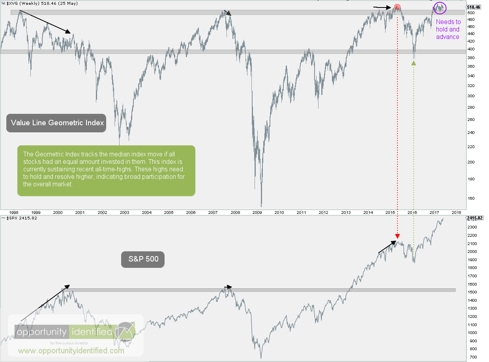

## Table of Contents

## What is the Value Line Composite Index?

The Value Line Composite Index is a stock market index that tracks the performance of around 1,700 companies in the United States. It is created by Value Line, a company that researches and ranks stocks. The index includes a wide range of companies from different industries, which makes it a good way to see how the overall market is doing. Unlike other indexes that focus on bigger companies, the Value Line Composite Index includes many smaller companies too.

This index is often used by investors to get a broad view of the stock market's health. It's different from more famous indexes like the Dow Jones Industrial Average or the S&P 500 because it covers a larger number of companies. The Value Line Composite Index is also known for being equally weighted, meaning each company in the index has the same impact on the index's performance, no matter how big or small the company is. This makes it a unique tool for investors who want to understand the market beyond just the biggest companies.

## How is the Value Line Composite Index calculated?

The Value Line Composite Index is calculated by taking an average of the stock prices of around 1,700 companies. Unlike other indexes that might focus on the biggest companies, this index includes many smaller companies too. Each company in the index is given the same importance, no matter its size. This means if a small company's stock goes up or down a lot, it can affect the index just as much as a big company's stock moving the same amount.

To figure out the index's value, Value Line adds up the total value of all the stocks in the index and then divides by the number of stocks. This gives an average price for the stocks. The index is updated every day, so it shows how the overall market is doing. Because it's made up of so many different companies, the Value Line Composite Index gives a good picture of the health of the whole stock market.

## What types of companies are included in the Value Line Composite Index?

The Value Line Composite Index includes around 1,700 companies from the United States. These companies come from all sorts of industries, like technology, healthcare, finance, and more. This mix of industries helps the index show how the whole market is doing, not just one part of it.

The index is special because it includes both big and small companies. Some famous big companies are in it, but also a lot of smaller ones that you might not have heard of. This makes the Value Line Composite Index different from other indexes that focus mostly on big companies. By including so many different kinds of companies, the index gives a good overall picture of the stock market.

## How does the Value Line Composite Index differ from other major indices like the S&P 500?

The Value Line Composite Index and the S&P 500 are both stock market indexes, but they are different in some big ways. The Value Line Composite Index includes around 1,700 companies from the United States, while the S&P 500 only includes 500 of the biggest companies. This means the Value Line Index covers a lot more companies, including many smaller ones, which gives a broader view of the market. The S&P 500, on the other hand, focuses on the biggest companies and is often seen as a good way to measure how the top part of the market is doing.

Another big difference is how the companies in each index are weighted. In the Value Line Composite Index, each company has the same impact on the index, no matter how big or small it is. This means if a small company's stock goes up or down a lot, it can affect the index just as much as a big company's stock moving the same amount. The S&P 500, however, is weighted by market capitalization, which means bigger companies have a bigger effect on the index. So, if a huge company like Apple or Microsoft changes a lot, it can move the S&P 500 more than if a smaller company changes by the same amount.

## What is the historical performance of the Value Line Composite Index?

The Value Line Composite Index has been around for a long time, and its performance over the years shows how the overall stock market has done. Since it includes a lot of different companies, big and small, the index gives a good picture of how the whole market is moving. Over the years, the index has had ups and downs, just like the stock market itself. During good times, the index goes up, showing that many companies are doing well. But during bad times, like during a recession, the index can go down a lot, showing that many companies are struggling.

Looking at long-term data, the Value Line Composite Index has generally gone up over time. This means that if you had invested in the index many years ago, your money would likely be worth more now. But it's important to remember that the stock market can be unpredictable, and the index has had some big drops during tough times. For example, during the financial crisis in 2008, the index fell a lot, but it recovered and kept growing over time. So, while the Value Line Composite Index can be a good way to see how the market is doing, it's also important to understand that it can go up and down a lot.

## How can investors use the Value Line Composite Index to gauge market trends?

Investors can use the Value Line Composite Index to get a broad view of how the stock market is doing. Because this index includes around 1,700 companies from different industries, it shows what's happening across the whole market, not just with the biggest companies. If the index is going up, it means that many companies are doing well, which could be a sign of a strong market. On the other hand, if the index is going down, it might mean that a lot of companies are struggling, which could be a warning sign for investors.

By watching the Value Line Composite Index over time, investors can spot trends and make better decisions about when to buy or sell stocks. For example, if the index has been going up steadily for a while, it might be a good time to invest because the market seems to be doing well. But if the index starts to fall sharply, it might be a good idea to be careful and maybe sell some stocks to avoid losing money. This index is a helpful tool because it gives a clear picture of the overall market's health, making it easier for investors to understand what's happening and plan their next moves.

## What are the benefits of tracking the Value Line Composite Index?

Tracking the Value Line Composite Index can help investors get a good overall view of the stock market. This index includes around 1,700 companies from different industries, so it shows how the whole market is doing, not just the big companies. When the index goes up, it means many companies are doing well, which can be a sign of a strong market. If the index goes down, it might mean a lot of companies are struggling, which can be a warning sign for investors. By watching this index, investors can see how the market is moving and make better decisions about buying or selling stocks.

Another benefit of tracking the Value Line Composite Index is that it helps investors spot trends over time. If the index has been going up steadily, it might be a good time to invest because the market seems to be doing well. But if the index starts to fall sharply, it might be a good idea to be careful and maybe sell some stocks to avoid losing money. This index is a useful tool because it gives a clear picture of the market's health, helping investors understand what's happening and plan their next moves.

## What are the limitations or criticisms of the Value Line Composite Index?

One limitation of the Value Line Composite Index is that it includes a lot of smaller companies. While this can be good for getting a broad view of the market, it can also make the index more unpredictable. Small companies can have big changes in their stock prices, which can make the whole index move a lot. This can be risky for investors who want a more stable way to track the market. Also, because the index is equally weighted, a small company's stock moving a lot can affect the index as much as a big company's stock moving the same amount, which some investors might not like.

Another criticism is that the Value Line Composite Index might not be as well-known or followed as other indexes like the S&P 500 or the Dow Jones Industrial Average. This means there might be less information and analysis available about it. Some investors might prefer to use more popular indexes because they can find more data and expert opinions to help them make decisions. Also, because the Value Line Index includes so many companies, it can be harder to understand what's driving its movements compared to indexes with fewer, bigger companies.

## How has the composition of the Value Line Composite Index changed over time?

The Value Line Composite Index has changed a lot over the years. When it first started, it had a different mix of companies than it does now. Back then, it included fewer companies and focused more on traditional industries like manufacturing and railroads. Over time, as the economy changed, the index started to include more companies from new industries like technology and healthcare. This means the index now gives a better picture of the modern economy.

The number of companies in the Value Line Composite Index has also grown. It used to have around 1,000 companies, but now it includes about 1,700. This change happened because the stock market got bigger and more companies started to go public. By including more companies, the index can show how the whole market is doing, not just a small part of it. This makes the Value Line Composite Index a good tool for investors who want to understand the overall health of the market.

## What role does the Value Line Composite Index play in portfolio diversification?

The Value Line Composite Index can help investors diversify their portfolios. Diversification means spreading your money across different kinds of investments so you're not putting all your eggs in one basket. The Value Line Composite Index includes around 1,700 companies from many different industries. By investing in a fund that tracks this index, you can own a little bit of a lot of different companies. This can lower your risk because if one company or industry does badly, it won't hurt your whole portfolio as much.

Another way the Value Line Composite Index helps with diversification is by including both big and small companies. Some other indexes focus mostly on big companies, but the Value Line Index has a lot of smaller ones too. This mix can help balance out your investments. If big companies are doing well but small ones aren't, or vice versa, your portfolio can still do okay. So, using the Value Line Composite Index can make your investments more stable and help you manage risk better.

## How do financial analysts interpret movements in the Value Line Composite Index?

Financial analysts look at the Value Line Composite Index to see how the whole stock market is doing. Because this index includes around 1,700 companies from different industries, it gives a broad view of the market. When the index goes up, analysts might think the market is strong and many companies are doing well. If the index goes down, it could mean the market is weak and a lot of companies are struggling. Analysts use these movements to predict what might happen next in the market and to make suggestions to investors about buying or selling stocks.

Analysts also pay attention to how much the index moves. Big changes in the index can mean the market is going through a lot of ups and downs, which can be a sign of uncertainty. Smaller changes might mean the market is more stable. By looking at these patterns over time, analysts can spot trends and figure out if the market is going to keep moving in the same direction or if it might change soon. This helps them give better advice to investors about how to manage their money.

## What advanced strategies can investors employ using the Value Line Composite Index data?

Investors can use the Value Line Composite Index to create a strategy called sector rotation. This means moving money from one part of the market to another based on how different industries are doing. If the index shows that tech companies are doing really well, an investor might put more money into tech stocks. But if the index starts to show that healthcare companies are doing better, the investor could switch some of their money to healthcare stocks. By watching how different parts of the index move, investors can try to pick the best times to buy and sell stocks in different industries.

Another advanced strategy is using the Value Line Composite Index for market timing. This means trying to guess when the market will go up or down and making investment decisions based on that. If the index has been going up for a while and looks like it might be getting too high, an investor might decide to sell some stocks to avoid a possible drop. On the other hand, if the index has been going down but starts to look like it's going to go back up, the investor might buy more stocks to take advantage of the coming rise. By carefully watching the index, investors can try to make smart moves to get the best returns.

## What is the Value Line Composite Index and how can it be understood?

The Value Line Composite Index is a comprehensive stock market index that encompasses a wide variety of stocks—about 1,700—from the New York Stock Exchange (NYSE), NASDAQ, and other significant exchanges. This diverse inclusion grants investors a more extensive market perspective compared to many traditional indices which often focus on larger, market-cap-weighted companies.

The Value Line Composite Index is further broken down into two distinct indices: the Geometric Composite Index and the Arithmetic Composite Index. The Geometric Composite Index is calculated using the geometric mean of the changes in the component stocks' prices. The geometric mean takes into account the compounded daily returns of the stocks, providing a more proportionate growth representation by ensuring that no single stock disproportionately influences the index due to its price change.

Mathematically, the geometric mean is calculated as:

$$
G = \left(\prod_{i=1}^{n} (1 + R_i)\right)^{1/n} - 1
$$

where $G$ is the geometric mean of returns and $R_i$ represents the individual stock returns.

In contrast, the Arithmetic Composite Index is calculated using an arithmetic mean, which adds together the price changes of the individual stocks and divides by the number of stocks. While it provides a straightforward view of average returns, the arithmetic mean is more susceptible to skewing by volatile price movements in individual stocks compared to its geometric counterpart.

$$
A = \frac{\sum_{i=1}^{n} R_i}{n}
$$

where $A$ denotes the arithmetic mean of returns.

One of the unique aspects of the Value Line Composite Index is its use of equal weighting among stocks. Unlike market-cap weighted indices, where larger companies have disproportionate influence, the equal weighting in the Value Line Index ensures that smaller and potentially more volatile stocks have an equivalent impact on the overall performance. This methodology allows for a more balanced reflection of market performance that can uncover trends obscured in typically weighted indices.

Historically, the Value Line Composite Index has demonstrated its utility as a diversified market indicator. By encompassing a broad range of sectors and stock sizes, it has offered investors valuable insights into market trends and sector performances. This diversity allows the index to function as a useful benchmark for assessing general market directions and for identifying emerging growth sectors. This capability can make the Value Line Composite Index particularly valuable for those employing [algorithmic trading](/wiki/algorithmic-trading) strategies, as it may provide a fuller picture of market dynamics.

## References & Further Reading

[1]: ["Understanding the Value Line Index"](https://fastercapital.com/content/Valueline-Index--Understanding-the-Basics-of-the-Stock-Market.html) on Investopedia

[2]: Rosenberg, B., Reid, K., & Lanstein, R. (1985). "Persuasive Evidence of Market Inefficiency." The Journal of Portfolio Management.

[3]: ["Advances in Financial Machine Learning"](https://www.amazon.com/Advances-Financial-Machine-Learning-Marcos/dp/1119482089) by Marcos Lopez de Prado

[4]: ["Machine Learning for Algorithmic Trading"](https://github.com/stefan-jansen/machine-learning-for-trading) by Stefan Jansen

[5]: Chan, E. P. (2008). ["Quantitative Trading: How to Build Your Own Algorithmic Trading Business"](https://github.com/ftvision/quant_trading_echan_book). Wiley Trading.

[6]: ["Evidence-Based Technical Analysis: Applying the Scientific Method and Statistical Inference to Trading Signals"](https://www.amazon.com/Evidence-Based-Technical-Analysis-Scientific-Statistical/dp/0470008741) by David Aronson

[7]: Aldridge, I. (2013). ["High-Frequency Trading: A Practical Guide to Algorithmic Strategies and Trading Systems"](https://www.amazon.com/High-Frequency-Trading-Practical-Algorithmic-Strategies/dp/1118343506). Wiley.