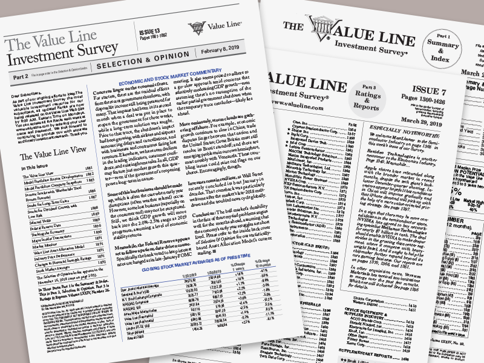

## Table of Contents

## What is the Value Line Investment Survey?

The Value Line Investment Survey is a popular tool that helps people make decisions about investing in stocks. It is published by Value Line, a company that has been around since 1931. The survey provides detailed information and analysis on a wide range of stocks, helping investors understand which ones might be good to buy, hold, or sell. It includes rankings, financial data, and forecasts, making it easier for investors to make informed choices.

The survey is divided into three main parts: the Ratings & Reports, the Summary & Index, and the Selection & Opinion section. The Ratings & Reports section gives detailed reports on about 1,700 stocks, including their past performance and future projections. The Summary & Index section offers a quick overview of the stocks covered in the survey, making it easy to find specific information. The Selection & Opinion section provides expert commentary and advice on current market trends and investment strategies. Together, these parts help investors of all levels make smarter decisions about their money.

## Who founded the Value Line Investment Survey and when was it established?

The Value Line Investment Survey was founded by Arnold Bernhard. He started it in 1931. Arnold Bernhard was a smart businessman who wanted to help people make better choices about their money.

At that time, the world was going through the Great Depression. Many people were losing their jobs and money. Arnold thought that if he could give people good information about stocks, they might be able to make smarter investments and protect their savings. That's how the Value Line Investment Survey began.

## What types of information does the Value Line Investment Survey provide?

The Value Line Investment Survey gives lots of helpful information for people who want to invest in stocks. It tells you about how well a company is doing right now and what might happen in the future. This includes things like how much money the company is making, how much it owes, and how fast it's growing. It also ranks stocks, so you can see which ones are doing better than others. This makes it easier to decide which stocks to buy, keep, or sell.

The survey is split into three big parts. The first part, called Ratings & Reports, has detailed stories about around 1,700 different stocks. It shows you their past performance and what might happen next. The second part, the Summary & Index, is like a quick guide. It helps you find the information you need fast. The third part, Selection & Opinion, gives you advice from experts about what's happening in the market and what you should do. All these parts together help you make smart choices about your money.

## How can the Value Line Investment Survey be used by investors?

The Value Line Investment Survey is a helpful tool for investors who want to make smart choices about their money. It gives detailed information about many different stocks, including how well they have done in the past and what might happen in the future. Investors can use this information to decide which stocks to buy, hold, or sell. The survey ranks stocks, so it's easy to see which ones are doing better than others. This can help investors pick the best stocks for their portfolios.

The survey is divided into three main parts, each serving a different purpose. The Ratings & Reports section provides in-depth reports on about 1,700 stocks, helping investors understand a company's financial health and growth potential. The Summary & Index section offers a quick overview, making it easy to find specific information without reading through everything. The Selection & Opinion section gives expert advice on current market trends and investment strategies. By using all these parts together, investors can make well-informed decisions and feel more confident about their investments.

## What are the key components of a Value Line Investment Survey report?

A Value Line Investment Survey report has several important parts that help investors understand a company's performance and future potential. The report starts with a summary that gives a quick look at the stock's rank, how it's been doing lately, and what the experts think might happen next. It also includes a chart that shows the stock's price over time, so you can see how it has been doing. The report then goes into more detail about the company's financials, like how much money it's making, how much it owes, and how fast it's growing. This helps investors see if the company is doing well and if it's a good investment.

The report also has a section called "Analyst's Commentary," where experts share their thoughts on the company and the stock. They talk about what's going on in the industry and any big news that might affect the company. This part can help investors understand the bigger picture and make better decisions. Finally, the report includes projections for the future, like how much money the company might make in the next few years and what the stock price might be. These predictions help investors decide if they should buy, hold, or sell the stock.

## How often is the Value Line Investment Survey updated?

The Value Line Investment Survey is updated regularly to keep investors informed about the latest changes in the stock market. The main reports in the Ratings & Reports section are updated every 13 weeks. This means that every three months, you get a fresh look at the stocks covered in the survey. This helps investors stay up-to-date with the latest information about the companies they are interested in.

In addition to the quarterly updates, the Value Line Investment Survey also has weekly updates in the Selection & Opinion section. This part of the survey gives you the latest news and expert advice on what's happening in the market. So, while the detailed reports on individual stocks are updated every three months, you can get weekly insights and tips to help you make better investment decisions.

## What is the Value Line Ranking System and how does it work?

The Value Line Ranking System is a way to see how well a stock might do compared to others. It gives each stock a score from 1 to 5, with 1 being the best and 5 being the worst. This score is called the Timeliness Rank. It looks at how the stock has been doing lately and what might happen in the next six to twelve months. The rank helps investors pick stocks that could go up in value soon.

The system also has other ranks, like the Safety Rank and the Technical Rank. The Safety Rank tells you how risky a stock is, with a score from 1 (safest) to 5 (riskiest). It looks at things like how much debt the company has and how steady its earnings are. The Technical Rank checks the stock's price movement and other market signs to see if it's a good time to buy or sell. By using all these ranks together, investors can make smarter choices about which stocks to invest in.

## How does the Value Line Investment Survey compare to other investment research tools?

The Value Line Investment Survey is a popular tool that helps people make choices about investing in stocks. It's different from other tools because it gives a lot of detailed information about many stocks, around 1,700 of them. It also updates this information regularly, every three months for the main reports and weekly for market news and advice. This makes it easier for investors to stay up-to-date and make smart decisions. Other tools might not cover as many stocks or update as often, so the Value Line Investment Survey can be more helpful for people who want a lot of information and want it to be current.

Another way the Value Line Investment Survey stands out is its ranking system. It uses a Timeliness Rank to show how well a stock might do in the next six to twelve months, which is something not all investment tools do. It also has other ranks like Safety Rank and Technical Rank, which help investors understand how risky a stock is and if it's a good time to buy or sell. Many other tools might not give you all these different ranks, so the Value Line Investment Survey can give you a more complete picture of a stock's potential. This can be really useful for investors who want to make well-informed choices.

## What are some success stories attributed to using the Value Line Investment Survey?

One success story about the Value Line Investment Survey is about a man named Peter Lynch. He was a famous investor who managed the Fidelity Magellan Fund. He used the Value Line Investment Survey to help him find good stocks to buy. With its help, he made the fund grow a lot, and many people made money because of his choices. People say that the detailed reports and rankings from Value Line were very helpful for Peter Lynch to pick the right stocks at the right time.

Another success story is about regular people who used the Value Line Investment Survey to save for their future. A family in Ohio used the survey to learn about different stocks and make smart choices about their money. They looked at the rankings and reports to decide which stocks to buy and when to sell them. Over time, they were able to save enough money to send their kids to college and even buy a new house. The Value Line Investment Survey helped them understand the stock market and make good decisions, even though they were not professional investors.

## What are the limitations or criticisms of the Value Line Investment Survey?

The Value Line Investment Survey is a helpful tool, but it has some limitations. One big problem is that it can be hard to understand for people who are new to investing. The reports have a lot of numbers and special terms that might confuse beginners. Also, the survey's predictions about the future are not always right. The stock market can be unpredictable, and even experts can make mistakes. So, if someone relies too much on the survey's forecasts, they might make bad choices about their money.

Another criticism is that the Value Line Investment Survey only covers a certain number of stocks, about 1,700. This means it might not include all the stocks someone might be interested in, especially smaller or newer companies. Some people also think that the survey's rankings, like the Timeliness Rank, can be too focused on short-term gains. This might not be the best way for everyone to invest, especially if they are looking for long-term growth. So, while the survey can be a good starting point, it's important for investors to use other tools and do their own research too.

## How can one access the Value Line Investment Survey and what are the subscription options?

You can access the Value Line Investment Survey by getting a subscription. You can do this by visiting the Value Line website and signing up. They have different plans to choose from, depending on what you need. There's a basic plan that gives you access to the main reports and rankings. If you want more, there are other plans that include extra tools and more detailed information. The cost of the subscription can change, so it's a good idea to check the website for the latest prices.

Once you have a subscription, you can use the Value Line Investment Survey online or get printed copies sent to your home. The online version is easy to use because you can search for the stocks you're interested in and get the latest updates quickly. If you like having something to read in your hands, the printed version comes out every week and every three months for the main reports. This way, you can choose what works best for you and stay informed about your investments.

## What advanced strategies can be employed using the Value Line Investment Survey data?

One advanced strategy that investors can use with the Value Line Investment Survey is to look at the Timeliness Rank and combine it with other information from the survey. For example, if a stock has a high Timeliness Rank, meaning it's expected to do well in the next six to twelve months, investors can check the Safety Rank to see if the stock is also low risk. If both ranks are good, it might be a good time to buy that stock. Investors can also look at the company's financials, like how much money it's making and how fast it's growing, to make sure it's a solid investment. By using all this information together, investors can make smarter choices about which stocks to buy and when.

Another strategy is to use the Value Line Investment Survey to find stocks that are undervalued. This means finding stocks that are priced lower than they should be based on the company's earnings and growth. Investors can look at the survey's detailed reports to see if a company's stock price is lower than what the experts think it should be. If it is, and the company is doing well, it might be a good time to buy that stock because it could go up in value. By combining the survey's rankings and financial data, investors can spot these opportunities and make money when the stock price goes up.

## References & Further Reading

[1]: "Value Line Investment Survey," Value Line, accessed [value line website](https://investors.valueline.com/The-Value-Line-Investment-Survey).

[2]: Lopez de Prado, M. (2018). ["Advances in Financial Machine Learning"](https://www.amazon.com/Advances-Financial-Machine-Learning-Marcos/dp/1119482089). Wiley.

[3]: Aronson, D. (2007). ["Evidence-Based Technical Analysis: Applying the Scientific Method and Statistical Inference to Trading Signals"](https://www.amazon.com/Evidence-Based-Technical-Analysis-Scientific-Statistical/dp/0470008741). Wiley.

[4]: Jansen, S. (2018). ["Machine Learning for Algorithmic Trading"](https://github.com/stefan-jansen/machine-learning-for-trading). Packt Publishing.

[5]: Chan, E. P. (2009). ["Quantitative Trading: How to Build Your Own Algorithmic Trading Business"](https://github.com/ftvision/quant_trading_echan_book). Wiley.