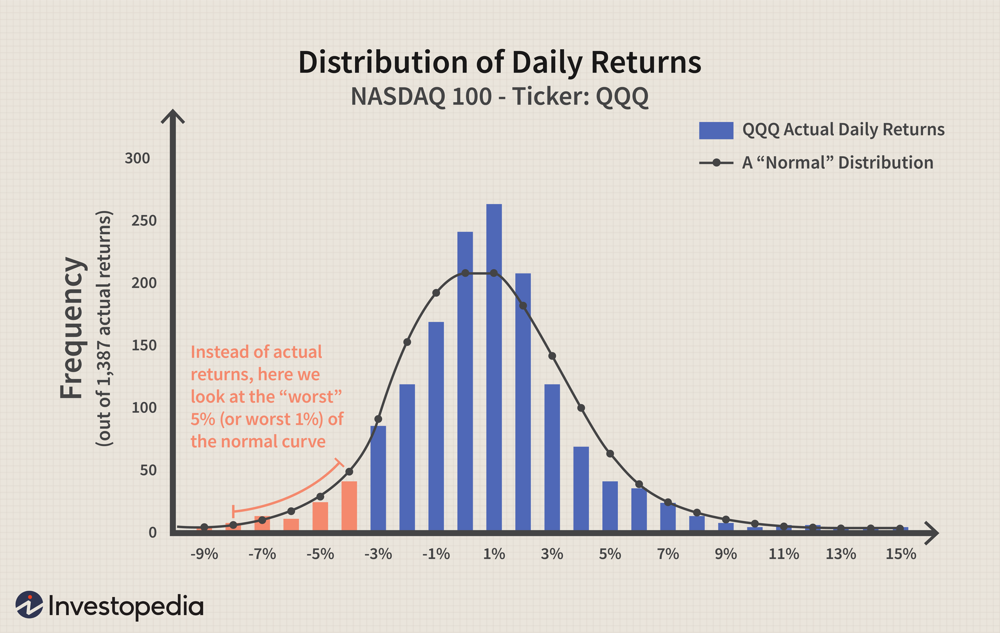

The financial landscape has undergone significant transformations with the introduction and growth of algorithmic trading. This sophisticated trading method, using algorithms to make high-speed, automated financial decisions, has reshaped markets by increasing trading volumes and enhancing market liquidity. However, it also introduces a new spectrum of financial risks that need to be comprehensively understood to maintain profitability and adhere to regulatory standards.

Understanding the financial risk associated with algorithmic trading is not just about safeguarding investments but also about ensuring compliance with evolving financial regulations. These risks are multifaceted, encompassing market risk, which involves potential losses due to market fluctuations; operational risk, stemming from failures in systems or processes; model risk, associated with inaccuracies in mathematical models used for trading; and liquidity risk, which refers to the inability to execute trades at desired prices due to insufficient market activity.



This article examines risk assessment and management techniques applicable to algorithmic trading. Key concepts such as the Value of Risk (VOR) will be explored, which evaluate the financial benefits versus potential risks of trading activities. A thorough understanding of VOR is crucial in determining which trading activities align with a company’s financial goals while managing risk appropriately.

Effective risk management strategies, combined with regulatory compliance, are paramount in navigating the complex environment of algorithmic trading. By exploring aspects such as risk assessment models and ethical considerations, readers will gain insights into effectively mitigating risks and enhancing trading strategies. As algorithmic trading evolves, the continuous adaptation of risk strategies remains crucial to maintaining competitive and compliant trading operations.

## Table of Contents

## Understanding Financial Risk in Algo Trading

Financial risk in algorithmic trading consists of various uncertainties that could lead to financial loss. These risks are particularly distinctive in the context of algorithmic trading, which relies extensively on computer algorithms to make trading decisions. Among these risks are market risk, operational risk, model risk, and liquidity risk.

**Market risk** refers to the possibility of losses due to changes in market conditions. Since algorithmic trading often involves rapid transactions based on real-time data, any glitches in processing or unexpected market shifts can lead to substantial financial setbacks. 

**Operational risk** involves the failures of systems or processes. In algorithmic trading, this could relate to software bugs, hardware failures, or human errors in programming and maintaining the trading systems. Ensuring the integrity and security of these systems is crucial for mitigating operational risk.

**Model risk** is associated with errors in the assumptions or computations of the algorithmic models. These models might inaccurately predict market behavior due to faulty assumptions, leading to incorrect trading decisions and financial losses.

**Liquidity risk** arises when a lack of market liquidity prevents trades from being executed at desired prices. In fast-moving markets, algorithms may struggle to execute large orders without affecting the market price unfavorably.

Understanding and managing these risks is vital for successful [algorithmic trading](/wiki/algorithmic-trading), and here is where the concept of the Value of Risk (VOR) comes into play. VOR is an important metric that quantifies the financial benefit of risk-taking activities by a company. It provides a framework for evaluating if the potential returns justify the risks undertaken. By calculating VOR, traders can gauge the expected benefit of different strategies while taking into account their respective risks.

To compute the Value of Risk, traders often employ sophisticated risk assessment models. These models analyze historical data, market [volatility](/wiki/volatility-trading-strategies), and other variables to estimate potential financial outcomes. By integrating these calculations into trading strategies, traders can make more informed decisions, balancing potential profits against the inherent risks.

In summary, understanding financial risk in algorithmic trading involves recognizing the unique challenges posed by market, operational, model, and [liquidity](/wiki/liquidity-risk-premium) risks. Central to managing these risks is the application of the Value of Risk, which helps quantify and analyze the financial implications of risk-taking actions, guiding more strategic and informed trading activities.

## Importance of Risk Assessment Models

Risk assessment models are critical components in creating a comprehensive risk management framework for algorithmic trading. These models enable traders and financial institutions to evaluate and manage the potential losses inherent in trading activities. Two prominent models widely used in this domain are Value at Risk (VaR) and Conditional Value at Risk (CVaR).

Value at Risk (VaR) is a statistical measure that estimates the maximum potential loss of a portfolio over a specified time period, given a certain confidence level. For example, if a portfolio has a one-day VaR of $1 million at the 95% confidence level, there is a 5% chance that the portfolio will lose more than $1 million in a single day. Mathematically, VaR can be expressed as:

$$
\text{VaR}_{\alpha} = \inf \{ x \in \mathbb{R} : P(X \leq x) \geq \alpha \}
$$

where $\alpha$ is the confidence level, $X$ is the portfolio return, and $P$ represents the probability.

Conditional Value at Risk (CVaR), or Expected Shortfall, extends the VaR by considering the average loss that exceeds the VaR threshold. It provides a more comprehensive view of the tail risk, making it a valuable tool for assessing extreme market conditions. CVaR is defined as:

$$
\text{CVaR}_{\alpha} = E[X \mid X \geq \text{VaR}_{\alpha}]
$$

where $E$ denotes the expected value.

The choice between VaR and CVaR often depends on the specific risk preferences of the trader or institution. While VaR is simpler to compute and widely recognized, CVaR offers a more detailed analysis of potential losses in scenarios beyond the VaR estimate.

The effectiveness of these models in risk management is highly dependent on their accuracy and computational efficiency. Accurate models ensure that risk estimates are realistic and reliable, whereas computational efficiency is crucial for handling large volumes of data in real-time trading environments. The complexity of financial markets necessitates that these models are not only theoretically sound but also practically applicable in dynamic conditions.

Given the increasing complexity of algorithmic trading, continuous development and refinement of risk assessment models are necessary. Financial institutions often incorporate advanced techniques such as Monte Carlo simulations, historical data analysis, and [machine learning](/wiki/machine-learning) algorithms to enhance the precision of these models. By optimizing both the accuracy and computational efficiency, traders can better anticipate potential risks and tailor their strategies accordingly.

In conclusion, risk assessment models like VaR and CVaR form the backbone of an effective risk management strategy in algorithmic trading. Their ability to quantify potential losses and provide insights into different risk scenarios is essential for maintaining a balance between risk and return. As financial technologies evolve, the ongoing enhancement of these models will play a critical role in ensuring their continued relevance and effectiveness.

## Algorithmic Trading Risk Management

Algorithmic risk management in trading involves a strategic approach to identifying and mitigating risks associated with automated trading strategies. These strategies, while offering significant advantages in terms of speed and [volume](/wiki/volume-trading-strategy), come with their own set of challenges that must be carefully managed to optimize outcomes and maintain operational integrity.

Operational risks are one of the primary concerns in algorithmic trading. These risks pertain to failures in processes, systems, or human operations that can lead to significant losses. Mitigation strategies include implementing robust testing frameworks and comprehensive system audits prior to deploying trading algorithms in live markets. Automating failure detection and response systems can also prevent escalation of operational failures.

Scalability risks arise when an algorithm is expected to operate efficiently under varying levels of market activity. Algorithms must be designed to handle both low and high-frequency trades without a loss in performance. This can often involve optimizing code for performance and ensuring that computational resources are adequate to meet peak demands, for instance, through parallel processing or cloud computing solutions.

Technological risks encompass software bugs, hardware failures, and network issues that can trigger undesirable trading behavior. Regular updates and maintenance of the underlying technology infrastructure are essential for minimizing such risks. Implementing redundant systems and having a disaster recovery plan ensures resilience against such failures.

Human resource risks relate to the potential for errors arising from human intervention. Despite the automated nature of algorithmic trading, human oversight is necessary for the development, deployment, and monitoring of trading strategies. Training and the establishment of clear procedural guidelines can mitigate risks associated with improper human actions or decisions.

Effective risk management includes strategies such as setting drawdown limits, which are used to specify the maximum loss an algorithm can incur before trading is halted. This helps in safeguarding against unexpected market moves that could otherwise lead to substantial financial detriment. Optimizing leverage involves managing the amount of borrowed capital used in trades, which can magnify both gains and losses. A prudent approach ensures that leverage is used within an acceptable risk threshold. Enhancing portfolio diversification reduces exposure to any single market event or asset, thereby distributing risk more evenly across various instruments.

The application of machine learning and [artificial intelligence](/wiki/ai-artificial-intelligence) in risk management offers further enhancement opportunities. These technologies can be leveraged to analyze vast amounts of data and detect patterns or anomalies that may not be apparent through traditional methods. Machine learning models can be developed to predict market movements or detect trading errors in real time, allowing for preemptive adjustments and improved decision-making processes.

In conclusion, a comprehensive framework for algorithmic trading risk management is essential for minimizing potential losses and maximizing the efficacy of trading algorithms. This involves a balanced approach that integrates technological solutions, structural safeguards, and strategic foresight in addressing the multifaceted risks inherent in algorithmic trading.

## The Role of Regulatory Compliance and Ethical Considerations

Compliance with regulatory standards is crucial for maintaining integrity and investor trust in the algorithmic trading sector. This sophisticated form of trading is governed by an intricate web of regulations designed to ensure fair and transparent practices in the financial markets. These regulations aim to protect investors from potential market manipulations and systemic risks that can arise from the misuse or failure of algorithmic strategies.

Algorithmic trading is subject to significant regulatory oversight. Regulatory bodies, such as the Securities and Exchange Commission (SEC) in the United States and the European Securities and Markets Authority (ESMA) in the European Union, implement and enforce rules targeting various aspects of trading algorithms. These include requirements related to market access, reporting standards, and risk management protocols. For instance, the Markets in Financial Instruments Directive II (MiFID II) in the EU mandates transparency and robust controls for algorithmic trading firms.

Ethical considerations play a pivotal role in complementing regulatory compliance. Engaging in trading strategies that exploit market inefficiencies to the detriment of market stability is discouraged. Ethical trading practices involve avoiding strategies that might contribute to unfair trading conditions or market disruptions, such as placing a massive volume of trades that could lead to a flash crash or significantly impact market pricing.

Fostering transparency and ethical behavior not only ensures adherence to legal requirements but also enhances the reputation and sustainability of trading practices. Traders and firms are encouraged to incorporate ethical guidelines that go beyond mere compliance. This includes developing algorithms with thorough [backtesting](/wiki/backtesting) and stress testing mechanisms to predict and mitigate adverse outcomes. Cultivating a culture of ethical trading helps in building long-term investor trust and contributes positively to the market's overall health.

Furthermore, transparency in algorithmic trading implies clarity in the logic and methodology employed in trading strategies. This transparency is critical for facilitating external audits and ensuring that all trading operations align with both regulatory and ethical standards. By fostering transparency and accountability, algorithmic trading firms can better manage the tensions between rapid technological advancements and regulatory expectations.

In conclusion, the integration of regulatory compliance with ethical considerations not only preserves investor trust but also contributes to the overall stability and efficiency of financial markets. Achieving a balance between regulation and ethics is imperative for the sustainable evolution of algorithmic trading practices, ensuring they contribute positively to market dynamics while safeguarding against potential abuses or system failures.

## Continuous Monitoring and Adaptation

Real-time data analysis and continuous monitoring are crucial components in adapting trading algorithms to the ever-changing market conditions. The dynamic nature of financial markets demands that trading systems maintain their effectiveness through constant updates and refinements. This necessitates a proactive approach to algorithmic updates, where strategies are not static but evolve in tandem with market trends.

Adaptive strategies play a pivotal role by enabling algorithms to respond swiftly and appropriately to shifts in market dynamics. By employing adaptive mechanisms, trading systems can adjust parameters and modify decision rules in response to new data. This responsiveness is vital for capitalizing on emerging opportunities and for mitigating risks associated with sudden market changes.

Anomalies in trading behavior or unexpected market conditions can lead to substantial losses if not addressed timely. Therefore, regular updates to both the trading algorithms and the underlying monitoring systems are essential. These updates ensure that any deviations from expected performance are quickly identified and rectified. 

One approach to achieving this is by integrating machine learning techniques within the algorithmic framework. Machine learning can enhance pattern recognition, which is instrumental in forecasting market movements and refining trading strategies. For example, using a [reinforcement learning](/wiki/reinforcement-learning) model, an algorithm can be trained to optimize decision-making by learning from interactions with the market environment.

```python
import numpy as np
import matplotlib.pyplot as plt

# Simulation of a simple reinforcement learning environment
class SimpleMarketEnv:
    def __init__(self, prices):
        self.prices = prices
        self.current_step = 0

    def reset(self):
        self.current_step = 0
        return self.prices[self.current_step]

    def step(self, action):
        self.current_step += 1
        reward = np.random.choice([-1, 1]) if action == 'buy' else 0
        done = self.current_step >= len(self.prices) - 1
        return self.prices[self.current_step], reward, done

# Simulate market data
market_prices = np.random.normal(100, 1, 100)

# Initiate environment
env = SimpleMarketEnv(market_prices)
state = env.reset()
done = False

while not done:
    action = np.random.choice(['buy', 'sell'])
    next_state, reward, done = env.step(action)
```

Continuous performance monitoring through such advanced analytics ensures detection of anomalies, as metrics like volatility and liquidity are tracked in real-time. This allows for timely adjustments, thereby safeguarding against potential financial setbacks. 

Ultimately, the task of aligning algorithmic strategies with the current market environment is a cyclical one, requiring ongoing attention and adaptation. By maintaining vigilance over market conditions and algorithm performance, traders can better navigate the complexities of automated trading, ensuring both profitability and risk minimization.

## Conclusion

Algorithmic trading success is heavily reliant on robust risk management practices. A comprehensive approach involves integrating advanced risk assessment models, adhering to rigorous regulatory standards, and employing continuous monitoring strategies. Risk assessment models like Value at Risk (VaR) and Conditional Value at Risk (CVaR) provide critical insights into potential losses and risk scenarios, enabling traders to make informed decisions. These models, when accurately and efficiently utilized, form a solid foundation for managing financial risks associated with algorithmic trading.

In addition to technical models, maintaining strict adherence to regulatory standards is essential for the credibility and trustworthiness of algorithmic trading systems. Regulatory compliance not only ensures operational integrity but also protects the interests of investors and the market as a whole. Ethical considerations must be prioritized, avoiding strategies that disrupt market stability or exploit inefficiencies.

Continuous monitoring and adaptation are crucial as they ensure trading algorithms are responsive to dynamic market conditions. Real-time data analysis, along with regular updates and refinements of algorithms, is necessary to address changes in market dynamics promptly. This approach helps in identifying anomalies and preventing potential losses, thereby enhancing the resilience and efficiency of trading operations.

Balancing technology with ethical practices ensures that algorithmic trading remains sustainable and profitable. As the industry continues to evolve, ongoing adaptation and thorough risk analysis are imperative. Embracing technological advancements, while maintaining a strong ethical framework, will allow traders to navigate the complexities of financial markets effectively and securely align their strategies with best practices.

## References & Further Reading

[1]: Bergstra, J., Bardenet, R., Bengio, Y., & Kégl, B. (2011). ["Algorithms for Hyper-Parameter Optimization."](https://dl.acm.org/doi/10.5555/2986459.2986743) Advances in Neural Information Processing Systems 24.

[2]: ["Advances in Financial Machine Learning"](https://www.amazon.com/Advances-Financial-Machine-Learning-Marcos/dp/1119482089) by Marcos Lopez de Prado

[3]: ["Evidence-Based Technical Analysis: Applying the Scientific Method and Statistical Inference to Trading Signals"](https://www.amazon.com/Evidence-Based-Technical-Analysis-Scientific-Statistical/dp/0470008741) by David Aronson

[4]: ["Machine Learning for Algorithmic Trading"](https://github.com/stefan-jansen/machine-learning-for-trading) by Stefan Jansen

[5]: ["Quantitative Trading: How to Build Your Own Algorithmic Trading Business"](https://www.amazon.com/Quantitative-Trading-Build-Algorithmic-Business/dp/1119800064) by Ernest P. Chan