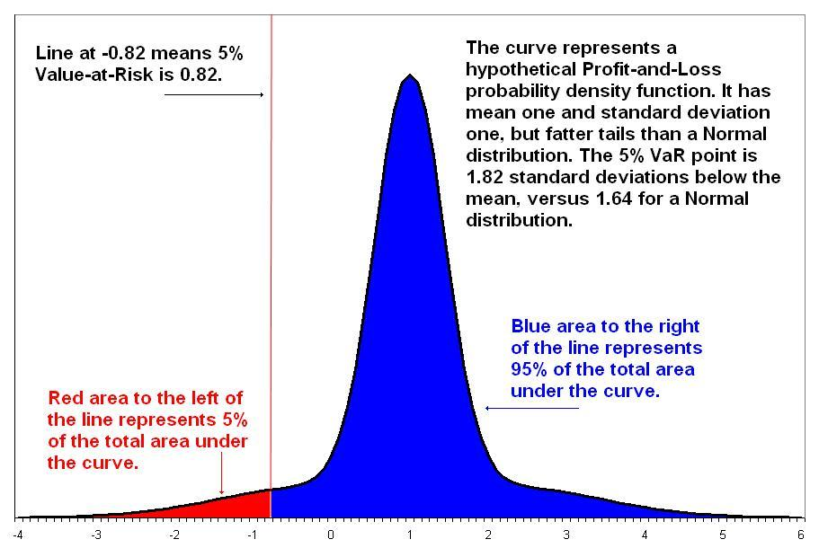

## Table of Contents

## What is the concept of 'Value of Risk'?

The concept of 'Value of Risk' is about understanding how much money you could lose when you invest in something. It's like a warning sign that tells you how risky an investment might be. Imagine you want to buy a stock; the value of risk helps you know how much of your money you could lose if the stock's price goes down. This is important because it helps you decide if the investment is worth the risk.

To figure out the value of risk, people often use something called 'Value at Risk' or VaR. This is a way to measure the most money you could lose over a certain time, like a day or a month, with a certain level of confidence. For example, if your VaR is $1,000 at 95% confidence over a day, it means there's a 5% chance you could lose more than $1,000 in a single day. This tool helps investors and businesses make smarter decisions by understanding the risks involved in their investments.

## How is 'Value of Risk' different from 'Risk Value'?

The 'Value of Risk' and 'Risk Value' might sound similar, but they talk about different things. 'Value of Risk' is all about how much money you might lose if you invest in something. It's like a warning that tells you the possible downside of your investment. For example, if you're thinking about buying a stock, the 'Value of Risk' helps you understand how much of your money could be at risk if the stock's price drops.

On the other hand, 'Risk Value' looks at the other side of the coin. It's about how much you might gain from taking a risk. Think of it as the potential upside of your investment. For instance, if you invest in a new business, the 'Risk Value' would tell you how much money you could make if the business does well. So, while 'Value of Risk' focuses on the potential loss, 'Risk Value' focuses on the potential gain.

Understanding both concepts is important for making smart investment choices. By knowing the 'Value of Risk', you can decide if you're comfortable with the potential loss. And by knowing the 'Risk Value', you can see if the potential reward is worth taking the risk. Together, they give you a full picture of what could happen with your investment.

## Why is understanding the 'Value of Risk' important in decision-making?

Understanding the 'Value of Risk' is really important when you're making decisions about where to put your money. It's like having a map that shows you the rough spots on your journey. When you know how much you could lose, you can decide if you're okay with taking that chance. For example, if you're thinking about buying a stock, knowing the 'Value of Risk' helps you figure out if the possible loss is something you can handle. This way, you won't be surprised if things don't go as planned.

Also, knowing the 'Value of Risk' helps you compare different investments. Imagine you're choosing between two different stocks. One stock might have a higher 'Value of Risk', which means you could lose more money if it goes down. But if the other stock has a lower 'Value of Risk', you might feel more comfortable with it, even if the potential reward is smaller. By understanding this, you can make choices that fit your comfort level with risk, helping you sleep better at night knowing you've made a smart decision.

## Can you provide a simple example of how 'Value of Risk' is calculated?

Let's say you have $10,000 to invest in a stock. You want to know how much you could lose in a day, and you want to be 95% sure about your estimate. To find this out, you would look at how the stock has moved in the past. You'd use this history to calculate what's called the 'Value at Risk' or VaR. 

For this example, let's say your calculations show that the most you could lose in a day, with 95% confidence, is $200. This means there's only a 5% chance you'll lose more than $200 in a single day. So, the 'Value of Risk' for your investment in this stock is $200 per day. This helps you understand the risk you're taking and decide if you're comfortable with it.

## What are the common methods used to assess the 'Value of Risk'?

There are a few common ways to figure out the 'Value of Risk' or VaR. One popular method is the historical simulation method. This means you look at how the price of what you're investing in, like a stock, has moved up and down in the past. By studying this history, you can guess how much you might lose in the future. For example, if you see that the stock lost 2% of its value on the worst days in the past, you might use that to estimate your risk now.

Another method is the variance-covariance method, which is a bit more mathy. This method uses something called a normal distribution to figure out how likely different losses are. It involves calculating the average return and the standard deviation of returns for your investment. Then, you use these numbers to find out how much you could lose at a certain confidence level. It's like using a bell curve to see where the biggest losses might fall.

There's also the Monte Carlo simulation method, which is like playing out many different scenarios on a computer. You set up a model that randomly changes the price of your investment many times. Each time, you see how much you could lose. By doing this over and over, you get a good idea of the worst-case scenarios and can find your 'Value of Risk'. This method is great for complex investments where lots of things can change.

## How does 'Value of Risk' apply to financial investments?

In financial investments, understanding the 'Value of Risk' is crucial because it tells you how much money you might lose. Imagine you're thinking about buying a stock. By knowing the 'Value of Risk', you can figure out the worst-case scenario for your investment. This means you'll know how much money you could lose in a day, a week, or any other time frame you're looking at. This helps you decide if you're okay with that level of risk. If the potential loss is too big, you might choose a different investment or decide not to invest at all.

The 'Value of Risk' also helps you compare different investments. Let's say you're choosing between two stocks. One stock might have a higher 'Value of Risk', meaning you could lose more money if things go wrong. The other stock might have a lower 'Value of Risk', which could make you feel more comfortable. By looking at the 'Value of Risk', you can make smarter choices that match how much risk you're willing to take. This way, you can balance the potential rewards with the potential losses and make decisions that fit your financial goals and comfort level.

## What role does 'Value of Risk' play in project management?

In project management, knowing the 'Value of Risk' helps managers understand how much money or time they might lose if something goes wrong. Imagine you're in charge of a big project. By figuring out the 'Value of Risk', you can see the worst-case scenarios and plan for them. This means you can set aside extra money or time as a safety net. If a part of the project might cost more than expected, knowing the 'Value of Risk' helps you decide if you need to find ways to save money elsewhere or if you should prepare for the extra cost.

Also, the 'Value of Risk' helps project managers make better choices about which projects to take on. If one project has a high 'Value of Risk', it means there's a big chance of losing a lot if things don't go as planned. Managers can compare this with other projects that might have a lower 'Value of Risk'. By doing this, they can choose projects that fit the company's goals and how much risk they're willing to take. This way, they can keep the project on track and avoid big surprises that could mess things up.

## How can 'Value of Risk' be integrated into strategic planning?

In strategic planning, knowing the 'Value of Risk' helps leaders make smarter choices about the future. They look at how much they could lose if things go wrong with their plans. This helps them decide if a new project or investment is worth the risk. For example, if a company wants to start a new product line, the leaders can use the 'Value of Risk' to see how much money they might lose if the product doesn't sell well. This helps them plan better and maybe set aside extra money or time to handle any problems that come up.

The 'Value of Risk' also helps companies compare different strategies. Let's say a company is choosing between two ways to grow: opening new stores or improving their online sales. By figuring out the 'Value of Risk' for each option, leaders can see which one might lose them less money if it doesn't work out. This way, they can pick the strategy that fits their goals and how much risk they're okay with taking. It's like having a map that shows the safest path to where they want to go.

## What are the limitations and criticisms of using 'Value of Risk' as a metric?

One big problem with using 'Value of Risk' is that it's based on what happened in the past. This means it might not be a good guess for what will happen in the future. Things can change a lot, and what worked before might not work again. Also, 'Value of Risk' only tells you how much you might lose at a certain level of confidence, like 95%. But that leaves out the 5% chance where you could lose a lot more. So, it might make you feel safer than you really are.

Another issue is that 'Value of Risk' can be hard to figure out and might not be the same for everyone. Different people might use different ways to calculate it, like looking at past data or using computer models. This can make it confusing when you're trying to compare risks across different investments or projects. Plus, 'Value of Risk' doesn't tell you about other kinds of risks, like legal problems or changes in the market. So, while it's a helpful tool, it's not perfect and shouldn't be the only thing you look at when making decisions.

## How do advanced statistical models enhance the accuracy of 'Value of Risk' assessments?

Advanced statistical models help make 'Value of Risk' assessments more accurate by using a lot of data and math to predict what might happen. These models can look at many different things at the same time, like how the price of a stock changes with the economy or other stocks. By doing this, they can give a better guess of how much money you might lose. For example, a model might use something called Monte Carlo simulation, which tries out many different scenarios to see what the worst-case situation could be. This helps make sure the 'Value of Risk' number is as close to reality as possible.

However, even with these advanced models, there are still limits to how accurate the 'Value of Risk' can be. The models are based on past data, and the future might not be the same. Also, these models can be really complicated, and small mistakes in how they're set up can lead to big differences in the results. So, while advanced statistical models make 'Value of Risk' more accurate, it's important to remember that they're not perfect. They're a helpful tool, but you should use them along with other ways of looking at risk to make the best decisions.

## Can you discuss a case study where 'Value of Risk' significantly impacted a business decision?

A good example of how 'Value of Risk' can affect a big business decision happened with a company called Long-Term Capital Management (LTCM) back in the late 1990s. LTCM was a [hedge fund](/wiki/hedge-fund-trading-strategies) run by some really smart people, including a few who had won the Nobel Prize. They used fancy math to figure out their 'Value of Risk', which told them how much money they could lose each day. But they thought their calculations were so good that they took on a lot of risk, borrowing huge amounts of money to make even bigger investments. When the markets changed in ways they didn't expect, their 'Value of Risk' numbers were way off. They lost a lot of money, and it almost caused a big problem in the whole financial world.

In the end, LTCM had to be bailed out by a group of big banks to stop the crisis from spreading. This case shows that even though 'Value of Risk' can be a helpful tool, it's not perfect. If you rely on it too much and don't think about other risks, you can get into big trouble. LTCM's story is a reminder that businesses need to use 'Value of Risk' carefully, always checking their numbers and thinking about what could go wrong that their models might not catch. By doing this, they can make better decisions and avoid big surprises.

## What future trends are expected in the application of 'Value of Risk' across different industries?

In the future, more and more industries are expected to use 'Value of Risk' to make better decisions. Companies in fields like finance, energy, and even healthcare will use this tool to understand how much they could lose if things go wrong. They'll use fancy computer models and a lot of data to make their 'Value of Risk' numbers more accurate. This will help them pick projects and investments that fit their goals and how much risk they're okay with taking. For example, a bank might use 'Value of Risk' to decide which loans to give out, and a hospital might use it to plan for new equipment or treatments.

Another trend is that 'Value of Risk' will become part of bigger risk management systems. Instead of just looking at how much money they might lose, companies will use 'Value of Risk' along with other tools to get a full picture of all the risks they face. This could include things like legal problems, changes in the market, or even natural disasters. By looking at all these risks together, businesses can make smarter choices and be ready for whatever might happen. This way, 'Value of Risk' will help companies stay safe and successful in a world that's always changing.

## What is the Importance of Risk Assessment Models?

Risk assessment models are critical components in creating a comprehensive risk management framework for [algorithmic trading](/wiki/algorithmic-trading). These models enable traders and financial institutions to evaluate and manage the potential losses inherent in trading activities. Two prominent models widely used in this domain are Value at Risk (VaR) and Conditional Value at Risk (CVaR).

Value at Risk (VaR) is a statistical measure that estimates the maximum potential loss of a portfolio over a specified time period, given a certain confidence level. For example, if a portfolio has a one-day VaR of $1 million at the 95% confidence level, there is a 5% chance that the portfolio will lose more than $1 million in a single day. Mathematically, VaR can be expressed as:

$$
\text{VaR}_{\alpha} = \inf \{ x \in \mathbb{R} : P(X \leq x) \geq \alpha \}
$$

where $\alpha$ is the confidence level, $X$ is the portfolio return, and $P$ represents the probability.

Conditional Value at Risk (CVaR), or Expected Shortfall, extends the VaR by considering the average loss that exceeds the VaR threshold. It provides a more comprehensive view of the tail risk, making it a valuable tool for assessing extreme market conditions. CVaR is defined as:

$$
\text{CVaR}_{\alpha} = E[X \mid X \geq \text{VaR}_{\alpha}]
$$

where $E$ denotes the expected value.

The choice between VaR and CVaR often depends on the specific risk preferences of the trader or institution. While VaR is simpler to compute and widely recognized, CVaR offers a more detailed analysis of potential losses in scenarios beyond the VaR estimate.

The effectiveness of these models in risk management is highly dependent on their accuracy and computational efficiency. Accurate models ensure that risk estimates are realistic and reliable, whereas computational efficiency is crucial for handling large volumes of data in real-time trading environments. The complexity of financial markets necessitates that these models are not only theoretically sound but also practically applicable in dynamic conditions.

Given the increasing complexity of algorithmic trading, continuous development and refinement of risk assessment models are necessary. Financial institutions often incorporate advanced techniques such as Monte Carlo simulations, historical data analysis, and [machine learning](/wiki/machine-learning) algorithms to enhance the precision of these models. By optimizing both the accuracy and computational efficiency, traders can better anticipate potential risks and tailor their strategies accordingly.

In conclusion, risk assessment models like VaR and CVaR form the backbone of an effective risk management strategy in algorithmic trading. Their ability to quantify potential losses and provide insights into different risk scenarios is essential for maintaining a balance between risk and return. As financial technologies evolve, the ongoing enhancement of these models will play a critical role in ensuring their continued relevance and effectiveness.

## References & Further Reading

[1]: Bergstra, J., Bardenet, R., Bengio, Y., & Kégl, B. (2011). ["Algorithms for Hyper-Parameter Optimization."](https://dl.acm.org/doi/10.5555/2986459.2986743) Advances in Neural Information Processing Systems 24.

[2]: ["Advances in Financial Machine Learning"](https://www.amazon.com/Advances-Financial-Machine-Learning-Marcos/dp/1119482089) by Marcos Lopez de Prado

[3]: ["Evidence-Based Technical Analysis: Applying the Scientific Method and Statistical Inference to Trading Signals"](https://www.amazon.com/Evidence-Based-Technical-Analysis-Scientific-Statistical/dp/0470008741) by David Aronson

[4]: ["Machine Learning for Algorithmic Trading"](https://github.com/stefan-jansen/machine-learning-for-trading) by Stefan Jansen

[5]: ["Quantitative Trading: How to Build Your Own Algorithmic Trading Business"](https://www.amazon.com/Quantitative-Trading-Build-Algorithmic-Business/dp/1119800064) by Ernest P. Chan