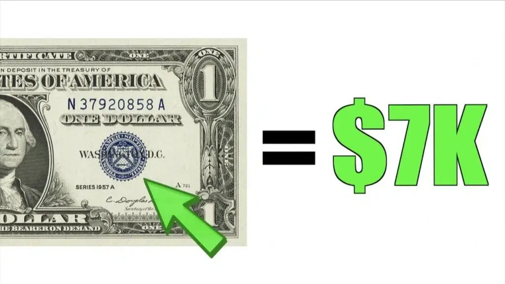

## Table of Contents

## What is a Silver Certificate Dollar Bill?

A Silver Certificate Dollar Bill is a type of paper money that the United States used to issue. It was different from regular dollar bills because it could be exchanged for actual silver. People could take their Silver Certificate to a bank and get silver dollars or silver bullion in return. These bills were first made in the late 1800s and were used until the 1960s.

Silver Certificates are no longer used as money today, but some people collect them because they are a part of history. They have a special look with blue seals and serial numbers. If you find an old Silver Certificate, it might be worth more than a regular dollar bill because collectors like them. However, you can't use them to buy things anymore.

## When were Silver Certificate Dollar Bills first issued?

Silver Certificate Dollar Bills were first issued in the United States in 1878. This was a time when the country was trying different ways to make money. The idea was to let people trade these certificates for silver, which was thought to be valuable.

These bills were part of a bigger plan to help the economy. They were used for many years, but by the 1960s, the government stopped letting people exchange them for silver. Today, Silver Certificates are no longer used as money, but they are interesting to collectors because they are a piece of history.

## How can you identify a Silver Certificate Dollar Bill?

You can spot a Silver Certificate Dollar Bill by looking at its design. These bills have a blue seal on the front, which is different from the green seals on regular dollar bills. The blue seal is usually on the right side of the bill. Also, the serial numbers on Silver Certificates are printed in blue ink, not black like on most other bills.

Another way to identify a Silver Certificate is by reading the text on the bill. It will say "Silver Certificate" at the top of the front side. This tells you that the bill could once be exchanged for silver. The back of the bill might show a picture that is different from what you see on regular dollar bills, like an old-style design or a special image.

If you find a bill with these features, you've probably got a Silver Certificate. They were made from the late 1800s until the 1960s, so they are old and no longer used as money. But they can be interesting to collectors because of their history and unique look.

## What is the historical significance of Silver Certificate Dollar Bills?

Silver Certificate Dollar Bills are important because they show how the United States tried to use different kinds of money in the past. They were first made in 1878, a time when the country was looking for ways to help its economy. The idea was to let people trade these certificates for silver, which was seen as valuable. This was part of a bigger plan to make more money available and help businesses grow. Silver Certificates were used for many years, but by the 1960s, the government stopped letting people exchange them for silver.

Today, Silver Certificates are no longer used as money, but they are still important because they are a piece of history. They show how the country's money system changed over time. Collectors like them because they are old and have a special look with blue seals and serial numbers. These bills remind us of a time when people could trade paper money for real silver, which is different from how money works now. Silver Certificates help us understand the past and how the economy worked back then.

## Are Silver Certificate Dollar Bills still legal tender?

Silver Certificate Dollar Bills are not used as money anymore. They were stopped being made in the 1960s, and you can't use them to buy things today. Even though they look like money, they are not considered legal tender now.

But, Silver Certificates are still interesting to people who like old things. Collectors might pay more than a dollar for them because they are a part of history. They remind us of a time when you could trade these bills for real silver, which is different from how money works now.

## How much silver does a Silver Certificate Dollar Bill represent?

A Silver Certificate Dollar Bill represents one dollar's worth of silver. When these bills were first made in 1878, you could take them to a bank and get one silver dollar coin for each bill. This was because the government promised that each Silver Certificate could be traded for silver.

Over time, the amount of silver you could get changed. By the 1960s, you could still trade Silver Certificates for silver, but it was based on the market price of silver. This meant you might get less than a full ounce of silver for your bill, depending on how much silver was worth at that time.

## What are the different denominations of Silver Certificate Dollar Bills?

Silver Certificate Dollar Bills came in different amounts, or denominations. They were made in $1, $2, $5, $10, $20, $50, $100, $500, and $1,000 bills. The most common ones you might see are the $1 and $5 bills because they were used a lot.

These different denominations were all part of the same idea: you could trade them for silver. The bigger the number on the bill, the more silver you could get. But by the 1960s, the government stopped letting people trade these bills for silver, so they are no longer used as money today.

## How do the values of Silver Certificate Dollar Bills vary based on condition?

The value of Silver Certificate Dollar Bills can change a lot depending on how good or bad their condition is. If a bill is in great shape, with no tears, stains, or writing on it, it can be worth more money to collectors. These bills are called "crisp uncirculated" because they look almost new. Collectors like them because they are hard to find in such good condition. A $1 Silver Certificate in perfect condition might be worth more than just a dollar, sometimes even tens or hundreds of dollars, depending on how rare it is.

On the other hand, if a Silver Certificate is worn out, dirty, or has been written on, it will be worth less. These bills are called "circulated" because they have been used a lot. Even though they might still be worth more than a regular dollar bill, their value won't be as high as a bill in perfect condition. For example, a $1 Silver Certificate that is very worn out might only be worth a few dollars more than its face value. So, the better the condition of the bill, the more money it can be worth to collectors.

## What factors determine the collectible value of a Silver Certificate Dollar Bill?

The collectible value of a Silver Certificate Dollar Bill depends on a few things. One big thing is how good the condition of the bill is. If it looks almost new, with no tears, stains, or writing on it, collectors will pay more for it. These bills are called "crisp uncirculated" and can be worth a lot more than just a dollar. Another thing that matters is how rare the bill is. Some Silver Certificates were made in smaller numbers, so they are harder to find. If a bill is both in great shape and rare, it can be worth a lot of money.

Another [factor](/wiki/factor-investing) is the denomination of the bill. While $1 and $5 Silver Certificates are common, higher denominations like $500 or $1,000 are very rare and can be worth a lot more. The year the bill was made also plays a role. Some years are more popular with collectors, which can make those bills more valuable. Finally, any special features or errors on the bill can increase its value. For example, if a bill has a printing mistake or a unique serial number, collectors might be willing to pay more for it.

## Where can Silver Certificate Dollar Bills be purchased or sold?

You can buy or sell Silver Certificate Dollar Bills at places where people trade old money. One common place is at coin and currency shows. These are events where collectors come together to buy, sell, and trade old coins and bills. You can also find Silver Certificates at special stores called coin shops. These shops often have people who know a lot about old money and can help you figure out how much your bill is worth.

Another way to buy or sell Silver Certificates is online. Websites like eBay and specialized currency websites let you list your bills for sale or buy them from other people. It's important to be careful when buying online because you want to make sure the bill is real and in the condition the seller says it is. You can also join online groups or forums where collectors talk about old money. These places can be good for learning more about Silver Certificates and finding people who want to buy or sell them.

## How have Silver Certificate Dollar Bills been used in numismatic investments?

Silver Certificate Dollar Bills have been used in numismatic investments because they can be worth more than their face value. Collectors and investors look for these bills because they are old and have a special look with blue seals and serial numbers. The value of a Silver Certificate can go up if it is in good condition, rare, or has a high denomination. People who invest in these bills hope to buy them for a low price and sell them later for more money, especially if the bill becomes more popular or harder to find.

Some investors focus on buying Silver Certificates at coin shows, coin shops, or online. They might pay more attention to bills that are in perfect condition or have unique features like printing errors or special serial numbers. These details can make a bill more interesting to collectors, which can increase its value over time. By understanding what makes a Silver Certificate valuable, investors can make smart choices about which bills to buy and sell, hoping to make a profit from their numismatic investments.

## What are some rare varieties of Silver Certificate Dollar Bills and their estimated values?

Some Silver Certificate Dollar Bills are very rare and can be worth a lot of money. One example is the 1928 $1,000 Silver Certificate. Not many of these were made, so they are hard to find. If you have one in good condition, it could be worth thousands of dollars. Another rare bill is the 1899 $1 Silver Certificate with a black eagle on the front. These are also not common, and a nice one might be worth hundreds of dollars. The 1953 $2 Silver Certificate with a red seal is another rare type. If it's in great shape, it could be worth over a hundred dollars.

The value of these rare Silver Certificates can change based on how good they look and how many people want them. For example, a 1923 $1 Silver Certificate with a blue seal, known as the "Porthole Note" because of its round design, can be worth a lot if it's in perfect condition. These might sell for several hundred dollars. Another interesting bill is the 1896 $5 Silver Certificate, called the "Educational Note" because of its special design. A nice one of these can be worth over a thousand dollars. So, if you find one of these rare Silver Certificates, it could be a valuable piece of history.

## References & Further Reading

[1]: Mishkin, F. S. (2015). ["The Economics of Money, Banking, and Financial Markets,"](https://www.pearsonhighered.com/assets/preface/0/1/3/4/0134855388.pdf) 11th Edition, Pearson Education.

[2]: Bowers, Q. D. (1995). ["The Comprehensive Catalog of U.S. Paper Money."](https://archive.org/details/comprehensivecat0000hess_ed05) Bowers and Merena Galleries.

[3]: Lopez de Prado, M. (2018). ["Advances in Financial Machine Learning."](https://www.amazon.com/Advances-Financial-Machine-Learning-Marcos/dp/1119482089) Wiley, Hoboken, New Jersey.

[4]: Aronson, D. R. (2007). ["Evidence-Based Technical Analysis: Applying the Scientific Method and Statistical Inference to Trading Signals."](https://onlinelibrary.wiley.com/doi/book/10.1002/9781118268315) Wiley, Hoboken, New Jersey.

[5]: Jansen, S. (2020). ["Machine Learning for Algorithmic Trading."](https://github.com/stefan-jansen/machine-learning-for-trading) Packt Publishing.

[6]: Chan, E. P. (2008). ["Quantitative Trading: How to Build Your Own Algorithmic Trading Business."](https://github.com/ftvision/quant_trading_echan_book) Wiley Trading Series.