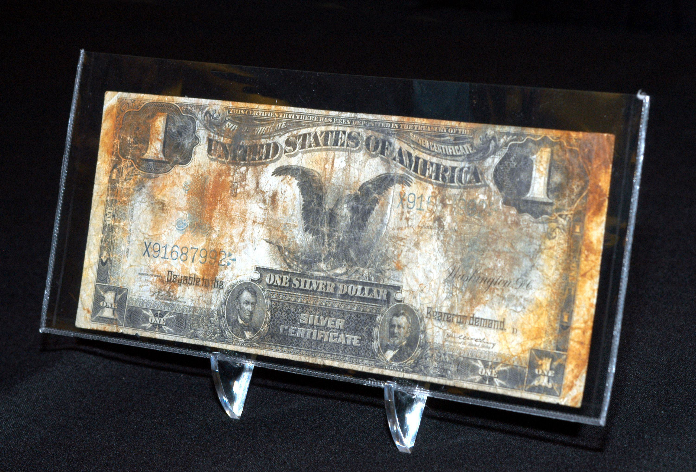

Silver Certificate Dollar Bills are a notable part of American monetary history. First introduced in 1878, these bills were originally issued by the U.S. government as legal tender, backed by silver. This meant that holders could exchange them for a specified amount of silver bullion. Over time, their function changed, and they were eventually phased out of circulation by the late 20th century. Today, silver certificates are no longer redeemable for silver, yet they retain significant interest among collectors due to their historical value and the nostalgia associated with a bygone era of U.S. currency.

The concept of currency value extends beyond mere face value, especially in the world of collectibles. For numismatists and investors, the value of silver certificates is determined by several factors, including rarity, condition, and historical significance. These elements combine to create a dynamic market where values are influenced by supply and demand, much like contemporary currencies and commodities. Understanding these intricacies is essential for collectors and investors looking to maximize their investments in such items.



Algorithmic trading, or algo trading, represents a modern approach in financial markets, utilizing computer algorithms to execute trades at optimal times based on predetermined criteria. While traditionally applied to fiat and digital currencies, the principles of algo trading can also be extended to collectible markets, such as silver certificates. This involves using advanced technologies to analyze market trends, predict price fluctuations, and execute transactions with speed and precision.

The purpose of this article is to explore the currency value of silver certificate dollar bills through the lens of their historical importance and to investigate the potential application of algorithmic trading in this niche market. The structure of the article is designed to first explain the nature and historical context of silver certificates, evaluate their collectible value, and then explore the role and potential of algo trading in both traditional and collectible currency sectors. By examining these interlinked topics, the article aims to offer valuable insights to enthusiasts and investors interested in the evolving landscape of collectible currency markets.

## Table of Contents

## Understanding Silver Certificate Dollar Bills

Silver certificate dollar bills were a form of paper currency issued by the United States government, originally introduced as part of the nation's effort to create a more standardized and reliable monetary system. These bills were backed by silver held by the U.S. Treasury and were once redeemable for their equivalent value in silver. Introduced under the Coinage Act of 1878, the issuance of silver certificates was part of the Bland-Allison Act, which sought to maintain a bimetallic monetary standard—essentially utilizing both gold and silver as legal tender.

The issuance of silver certificates spanned from 1878 to 1964, during which time they underwent several design changes and variations. Initially, they played a pivotal role in everyday transactions as a substitute for bulky silver coins. However, over time, as the economic landscape changed and the U.S. moved away from the silver standard, the practical use of silver certificates evolved. By 1968, the U.S. government ceased redeeming silver certificates for silver, though they continued to function as legal tender thereafter, effectively becoming standard paper currency without the backing of precious metal.

Silver certificates are now considered collectible items, with their value determined by multiple factors beyond their original face value. Collectors often evaluate these bills based on their rarity, condition, and historical significance. The rarity of a silver certificate is typically influenced by the number of notes originally produced and those still existing in good condition, while condition is assessed using rigorous grading systems that consider factors such as wear, tears, and color vibrancy. Historical significance may attach to notes based on unique features or their presence during pivotal moments in history.

Certain silver certificates are particularly iconic or valuable to collectors. For example, the 1896 $1 Educational Series Silver Certificate is renowned for its intricate design and artistry, featuring allegorical figures and an ornate depiction of educational progress in America. Other notable examples include the 1928 $1 Silver Certificate, which holds the distinction of being a part of the first small-size paper money issued by the United States, transitioning the country towards modern currency dimensions.

Overall, silver certificate dollar bills serve as a fascinating link to a bygone era of U.S. currency and continue to attract collectors and enthusiasts interested in their unique blend of history, artistry, and numismatic value.

## Evaluating the Value of Silver Certificate Dollar Bills

Silver certificate dollar bills hold a unique place in the world of collectible currencies, and their value can fluctuate significantly based on several factors. Understanding the current market for these certificates requires examining recent trends, the criteria used by collectors to value them, and the external influences that might affect their worth.

### Market Trends

The market for silver certificate dollar bills is influenced by general interest in numismatics, economic conditions, and changes in the precious metals market. As more people discover the hobby of collecting currencies, there's a proportional rise in demand for such historical pieces, potentially elevating their market value. Economic downturns or booms can also play a role; during financially uncertain times, investors may seek tangible assets, including collectible currencies, as a safer investment, affecting demand and prices. Additionally, with silver certificates no longer backed by silver, fluctuations in the precious metals market have a more indirect impact. However, historical attachments to precious metals might still influence collectors' perceptions and valuation decisions.

### Valuation Criteria

Valuing a silver certificate involves various criteria centered on rarity, condition, and historical significance. Collectors use established grading systems to rate the condition of a note. Grading agencies like the Paper Money Guaranty (PMG) and Professional Coin Grading Service (PCGS) provide professional appraisals, assigning grades that can drastically affect market value. The standard scale ranges from Poor (P-1) to Gem Uncirculated (GEM-65), with higher-grade notes fetching a premium. Beyond grading, factors like noted errors, unique serial numbers, and historical provenance can enhance value. For instance, certificates with misprints or rare series numbers are typically more sought after.

### External Factors

Several external factors also influence the value of silver certificate dollar bills. Changes in the economy and the precious metals market can alter perceptions of value, but they do so indirectly. While the certificates themselves are no longer exchangeable for silver, a spike in silver prices might boost interest in any potentially related asset, including these certificates. Additionally, public awareness and media coverage of numismatic events can temporarily inflate interest and prices. For example, a major auction of rare certificates can rekindle public interest, subsequently affecting market values across the board. Collectors and investors must therefore remain aware of these external pressures and adapt their strategies accordingly.

In conclusion, evaluating the value of silver certificate dollar bills requires a multifaceted approach that considers historical significance, market trends, grading, and external economic factors. As the numismatic community continues to grow, understanding these dynamics becomes crucial for both seasoned collectors and new investors.

## Algo Trading in Currency Markets

Algorithmic trading, often referred to as algo trading, is a method of executing financial transactions using pre-programmed instructions or algorithms. These algorithms can represent complex mathematical models that take into account various market variables and conditions. Algo trading is highly prevalent in modern financial markets, including fiat and digital currencies, due to its numerous advantages such as speed, efficiency, and the ability to process vast quantities of data.

One of the primary advantages of [algorithmic trading](/wiki/algorithmic-trading) is its speed. Transactions are executed in fractions of a second, well beyond the capabilities of human traders. This rapid execution allows traders to capitalize on fleeting opportunities, such as price discrepancies across different markets. For instance, the implementation of a simple [momentum](/wiki/momentum) strategy can be executed almost instantaneously using a basic algorithm:

```python
def momentum_strategy(prices, window=20):
    rolling_mean = prices.rolling(window=window).mean()
    positions = (prices > rolling_mean).astype(int)  # 1 if current price > rolling mean, else 0
    return positions
```

Efficiency is another critical [factor](/wiki/factor-investing) driving the popularity of algo trading. Automated systems can execute trades consistently based on predefined criteria, eliminating the impact of human emotions and biases. Additionally, algorithms can handle multiple trading strategies simultaneously, optimizing the allocation of capital and risk management.

In fiat currency markets, algo trading is used extensively for purposes such as [arbitrage](/wiki/arbitrage), [market making](/wiki/market-making), and [statistical arbitrage](/wiki/statistical-arbitrage). Market makers, for example, employ algorithms to provide [liquidity](/wiki/liquidity-risk-premium) by continuously quoting buy and sell prices. This ensures that traders can always find a counterparty, thus enhancing market stability.

Digital currency markets have similarly adopted algorithmic trading strategies, adapting them to the unique characteristics of cryptocurrencies. These markets often exhibit higher [volatility](/wiki/volatility-trading-strategies) and lower liquidity than traditional fiat markets, necessitating careful adaptation of trading algorithms. For instance, many traders utilize [machine learning](/wiki/machine-learning) algorithms to predict price movements based on historical data and sentiment analysis extracted from social media and news sources.

In both fiat and digital currency markets, algo trading stands out for its ability to process extensive datasets and operate continuously without downtime. The capacity to analyze vast amounts of data in real-time allows traders to identify patterns and trends that may not be visible to the human eye. This data-driven approach enhances decision-making and provides a competitive edge in fast-paced financial environments.

In summary, algorithmic trading has revolutionized both traditional and digital currency markets by introducing speed, efficiency, and sophisticated data processing into trading practices. As technology continues to advance, the role and impact of algo trading in financial markets are expected to grow further.

## Applying Algo Trading to Silver Certificate Dollar Bills

Algorithmic trading, or algo trading, has transformed various financial markets by leveraging advanced algorithms to execute trades with precision and speed. The underlying principle involves using computational tools to analyze data and make trading decisions based on pre-established criteria. Extending this approach to the collectible currency market, specifically silver certificate dollar bills, presents a novel yet challenging frontier.

**Potential Benefits and Implementation**

Applying algo trading to the buying and selling of silver certificate dollar bills can offer several advantages. One pivotal benefit is the ability to predict market trends and fluctuations in demand. By incorporating historical data, such as previous sales prices, rarity indices, and economic indicators, algorithms could be tailored to forecast upcoming trends, enabling investors to make informed decisions. 

For instance, if an algorithm can assess trends in the precious metals market, which historically influence collectible currency values, it could alert traders to buy or sell decisions in anticipation of value changes. Additionally, algorithms could identify optimal trading times by analyzing collector activity data from online platforms or auction houses. A simplified Python function for predicting optimal trading times based on historical sales data might look something like this:

```python
import numpy as np
import pandas as pd
from sklearn.linear_model import LinearRegression

# Sample data of past trade dates and corresponding prices
data = pd.DataFrame({
    'trade_date': pd.date_range(start='1/1/2020', periods=100, freq='M'),
    'price': np.random.rand(100) * 1000
})

# Feature engineering: extracting month and year for seasonality
data['month'] = data['trade_date'].dt.month
data['year'] = data['trade_date'].dt.year

# Linear regression to model price based on month
model = LinearRegression()
model.fit(data[['month']], data['price'])

# Predicting future values
future_months = pd.DataFrame({'month': [i for i in range(1, 13)]})
predicted_prices = model.predict(future_months)

# Determining the optimal month for trading
optimal_month = future_months['month'][np.argmax(predicted_prices)]
```

**Challenges and Limitations**

While the integration of algo trading into this niche market holds promise, it is accompanied by significant challenges. A primary issue is low liquidity; the market for silver certificates is not nearly as active as typical stock or currency markets, which may lead to difficulty in executing trades swiftly. Additionally, the niche demand means there are fewer buyers and sellers, potentially leading to unpredictable pricing models that are harder for algorithms to navigate accurately.

Furthermore, the collectible nature of silver certificates introduces a subjective element to value determination, contingent on factors like historical significance and physical condition, which are not easily quantifiable by algorithms. Overcoming these challenges requires sophisticated modeling techniques and possibly integrating human expertise to interpret nuanced market signals.

Ultimately, as algorithms become more advanced and data more comprehensive, the capability for algo trading to effectively function within the silver certificate market might improve. Nonetheless, ongoing adjustments to models and strategies will be necessary to address the unique characteristics of this collectible market segment.

## Future Prospects and Considerations

The collectible currency markets are undergoing significant transformations due to technological advancements, altering how collectors and investors approach these assets. One notable area of change is the application of algorithmic trading (algo trading) methods, traditionally associated with fiat and digital currencies, to the market for collectible items like silver certificate dollar bills.

The future of algo trading in collectible currencies could hinge on the development of more sophisticated algorithms capable of accurately analyzing market trends specific to these niche assets. These algorithms would need to assess factors unique to collectible markets, such as historical significance, rarity, and condition, alongside more traditional economic indicators. Innovation in machine learning and [artificial intelligence](/wiki/ai-artificial-intelligence) technologies will likely be pivotal in creating models that can process vast amounts of data effectively, potentially harmonizing qualitative features like historical context with quantitative data.

Furthermore, the development of blockchain technology could also play a role in enhancing the market for silver certificates. By providing a decentralized and transparent ledger, blockchain could ensure the authenticity and provenance of collectible currencies, thus boosting investor confidence and market interest. The integration of blockchain with algo trading systems may further streamline transactions, reduce fraud, and increase market transparency.

The implications of these advancements extend beyond collectible currencies to other collectible assets and investments. For instance, the art market, rare coins, and even vintage automobiles could all benefit from similar applications of technology, leading to more informed pricing and trading strategies. This cross-pollination of technology across various collectible markets could democratize access, allowing even small-scale investors to participate more fully.

Technological advancements are likely to result in greater market efficiency and liquidity, particularly in traditionally illiquid markets such as collectibles. However, challenges remain, particularly regarding data availability and the need for specialized knowledge of these markets. Furthermore, as algo trading becomes more prevalent, regulatory considerations may become essential to ensure fair practices and prevent market manipulation.

Overall, the intersection of technology and collectible currency markets promises to enrich the landscape by providing new opportunities and tools for traders and collectors alike. As these innovations unfold, staying informed and adaptable will remain crucial for those engaging with these unique assets.

## Conclusion

Silver certificate dollar bills hold a distinct place in the history of U.S. currency as both functional legal tender and coveted collector items. Their value today is shaped by numerous factors, including rarity, condition, and the intrinsic allure of their historical significance. Collectors must remain vigilant, assessing these elements to determine the value of each certificate, often employing grading systems and professional appraisals as part of their evaluation process.

As the collectible currency market continues to evolve, the application of algorithmic trading presents new potentials. Algorithmic trading, known for its speed, efficiency, and capacity to analyze vast datasets, could revolutionize how collector currencies like silver certificates are traded. Predicting market trends, identifying demand fluctuations, and optimizing trading times could enhance investment strategies in such a niche market. However, challenges like low liquidity and specific demand in the collectible currency market remain hurdles that need careful consideration.

In a world where currency markets are perpetually changing, staying informed and adaptable is crucial. For both traditional currency markets and specialized domains like collectible silver certificate trading, knowledge and adaptability are invaluable assets. As technology continues to advance, it is essential to engage in further research and exploration to better harness the potential benefits these innovations can bring to collectors and traders alike. Cryptocurrency and digital assets have already shown how swiftly currency landscapes can shift, urging stakeholders in various markets to remain keenly aware of ongoing developments.

In conclusion, while the historical value of silver certificates is well-established, the integration of technology, such as algorithmic trading, holds promise for maximizing returns and navigating these markets more effectively. The potential for innovation encourages enthusiasts and investors to expand their understanding, ensuring they remain at the forefront of both collecting and trading these unique currency assets.

## References & Further Reading

[1]: Mishkin, F. S. (2015). ["The Economics of Money, Banking, and Financial Markets,"](https://www.pearsonhighered.com/assets/preface/0/1/3/4/0134855388.pdf) 11th Edition, Pearson Education.

[2]: Bowers, Q. D. (1995). ["The Comprehensive Catalog of U.S. Paper Money."](https://archive.org/details/comprehensivecat0000hess_ed05) Bowers and Merena Galleries.

[3]: Lopez de Prado, M. (2018). ["Advances in Financial Machine Learning."](https://www.amazon.com/Advances-Financial-Machine-Learning-Marcos/dp/1119482089) Wiley, Hoboken, New Jersey.

[4]: Aronson, D. R. (2007). ["Evidence-Based Technical Analysis: Applying the Scientific Method and Statistical Inference to Trading Signals."](https://onlinelibrary.wiley.com/doi/book/10.1002/9781118268315) Wiley, Hoboken, New Jersey.

[5]: Jansen, S. (2020). ["Machine Learning for Algorithmic Trading."](https://github.com/stefan-jansen/machine-learning-for-trading) Packt Publishing.

[6]: Chan, E. P. (2008). ["Quantitative Trading: How to Build Your Own Algorithmic Trading Business."](https://github.com/ftvision/quant_trading_echan_book) Wiley Trading Series.