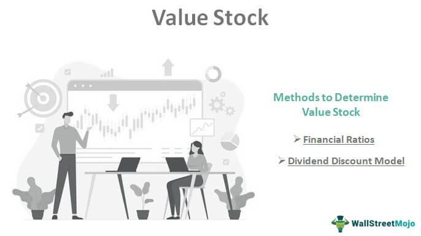

The investment landscape has undergone profound changes with the advent of technology, particularly in trading and financial analysis. One of the most significant advancements is the use of algorithmic trading, which employs sophisticated computational algorithms to execute trades based on pre-defined criteria, thereby optimizing decision-making processes. This approach reduces the influence of human emotion, offering a systematic and efficient mechanism for engaging with financial markets.

Value stocks, characterized by their fundamental undervaluation, present special advantages to astute investors. These stocks generally come with high dividends and feature low price-to-book and price-to-earnings ratios. Despite being overlooked by the broader market, they hold potential for substantial returns. As investors aim to exploit market inefficiencies, value stocks often represent stable entities with established performance records that trade below their intrinsic value.



The interplay of algorithmic trading and investing in value stocks encapsulates a compelling strategy for contemporary investors. On one hand, algorithmic trading facilitates high-frequency and low-latency transactions, which can lead to enhanced profit opportunities. On the other, value investing looks to harness the potential of financially robust yet underappreciated companies. This article seeks to examine how these two strategies can be synergistically employed within the stock market, providing a modern approach to maximizing investment returns.

## Table of Contents

## Understanding Value Stocks

Value stocks are investment securities believed to be underpriced relative to their intrinsic or fundamental value, presenting opportunities for astute investors to potentially profit through appreciation and dividends. Several key characteristics define value stocks, making them an attractive option in the stock market landscape.

One primary attribute of value stocks is their high dividend yield, which refers to the dividend income relative to the stock's current price. This characteristic offers investors a steady income even when the stock price is not performing optimally. High dividends are often associated with established, financially stable companies that distribute a significant portion of their earnings to shareholders.

Another hallmark of value stocks is a low price-to-book (P/B) ratio. This financial ratio compares a company's market value to its book value, which is the net asset value as reported in financial statements. A low P/B ratio suggests that the stock might be undervalued, potentially trading below the company's actual asset value. Investors leverage this ratio to identify stocks that may be priced lower than their tangible asset worth.

Furthermore, value stocks exhibit a low price-to-earnings (P/E) ratio, a measure that evaluates a company's current share price relative to its per-share earnings. Lower P/E ratios indicate that the stock is potentially undervalued compared to peers, representing a compelling buying opportunity. Value investors are drawn to such stocks, believing that the market will eventually recognize their intrinsic value and adjust the price upwards, yielding substantial returns.

The crux of value investing lies in exploiting market inefficiencies, which occur when stock prices do not accurately reflect their true value. Markets can misprice stocks due to various factors, including macroeconomic trends, industry changes, or short-term investor sentiment. Value investors seek to identify these discrepancies, aiming to purchase stocks that are fundamentally strong but are trading at lower prices than their intrinsic worth.

Overall, value stocks provide a robust avenue for investors looking to capitalize on mispriced opportunities in the stock market, with the potential for both income generation through dividends and capital appreciation as the market adjusts to reflect their true worth.

## Why Invest in Value Stocks?

Value stocks present a compelling option for investors seeking stability and income in their portfolios. These stocks typically belong to companies with well-established track records, indicating a history of consistent performance and resilience in diverse market conditions. This stability reduces the [volatility](/wiki/volatility-trading-strategies) associated with [growth stocks](/wiki/growth-stocks), providing investors with a potentially lower-risk investment option. 

A key characteristic of value stocks is their propensity to offer regular income through dividends. Dividends are payments made by a company to its shareholders, often derived from profits, and they serve as a tangible return on investment. This feature is particularly appealing to income-focused investors who prioritize generating regular cash flow. By investing in value stocks, these investors can benefit from a steady income stream while maintaining exposure to equity markets.

Moreover, value stocks often have favorable financial ratios such as a low price-to-earnings (P/E) ratio or a low price-to-book (P/B) ratio. This reflects their strong fundamentals relative to their market price, suggesting that they may be undervalued by the market. For instance, a low P/E ratio compared to the industry average can indicate that the stock is priced inexpensively, offering an attractive entry point for investors looking to capitalize on potential market mispricing.

In conclusion, the investment in value stocks can balance a portfolio by pairing the potential for capital appreciation with the benefits of regular income and lower volatility. This dual focus caters to investors who seek both growth and income, contributing to a diversified and resilient investment strategy.

## What Is Algorithmic Trading?

Algorithmic trading is the process of employing computer programs to perform trading tasks. These programs adhere to a set of predefined rules or criteria, such as timing, price, quantity, or any other mathematical model. The primary objective of [algorithmic trading](/wiki/algorithmic-trading) is to enhance trading efficiency by executing orders at optimal prices, minimizing market impact, and reducing transaction costs.

A significant advantage of algorithmic trading is its ability to facilitate high-frequency and low-latency trading. High-frequency trading ([HFT](/wiki/high-frequency-trading-strategies)) refers to the execution of a large number of orders at extremely rapid speeds, often within milliseconds. This is achieved through advanced algorithms and high-speed data networks, enabling traders to capitalize on minor price discrepancies across different markets or on fleeting market inefficiencies. The speed inherent in HFT provides traders with a competitive edge in capturing profit opportunities that are inaccessible through traditional manual trading methods.

One of the critical benefits of algorithmic trading is its capacity to eliminate human emotions from trading decisions. Emotions such as fear or greed can lead to irrational decision-making and result in suboptimal trading outcomes. By automating the trading process, algorithms can execute trades based solely on data-driven insights and logical reasoning. This systematic approach helps in consistency, allowing traders to adhere strictly to their trading strategies without deviation caused by emotional biases.

The consistent and systematic nature of algorithmic trading is particularly beneficial in volatile markets, where rapid shifts can have significant implications for traders. Algorithms can analyze market data in real-time, adapt to changing conditions, and make decisions more swiftly than a human trader could. This adaptability is crucial for maintaining a competitive advantage.

Overall, algorithmic trading represents a transformative approach in financial markets, leveraging technological advancements to optimize trading operations and enhance profitability.

## How Algorithmic Trading Enhances Value Investing

Algorithmic trading enhances value investing by automating the identification and execution of investment opportunities in stocks that are undervalued relative to their intrinsic value. Through the use of sophisticated algorithms, investors can screen vast amounts of financial data to identify securities that meet value investing criteria, such as a low price-to-earnings ratio or a discounted price-to-book ratio.

Algorithms streamline the screening process by employing financial metrics and ratios to evaluate large datasets, allowing for efficiency and speed that surpasses human analysis. For instance, an algorithm can be programmed to scan thousands of stocks and identify those with specific characteristics, such as consistent dividend payouts and a financial stable history, all in a fraction of the time it would take a human analyst.

Once potential investment opportunities have been identified, algorithms execute buy and sell orders with precision. This ability to execute trades at optimal prices is pivotal in enhancing returns, as it minimizes the impact of market volatility and transaction costs commonly encountered in manual trading. Such precision is facilitated by the speed at which algorithmic systems operate, executing trades within milliseconds. 

By integrating these algorithms into value investing strategies, investors are positioned to capitalize on market inefficiencies more rapidly than traditional methods permit. Consider the following simplified example in Python, implementing a basic algorithmic approach to value investing using stock data:

```python
import pandas as pd

# Simulated stock data with fundamentals
data = {'Stock': ['Company A', 'Company B', 'Company C'],
        'PE_Ratio': [8.5, 15.2, 9.8],
        'PB_Ratio': [1.1, 2.5, 0.9],
        'Div_Yield': [3.2, 1.8, 4.0]}

df = pd.DataFrame(data)

# Define criteria for identifying undervalued stocks
pe_threshold = 10
pb_threshold = 1.5
div_yield_min = 3.0

# Screening algorithm
undervalued_stocks = df[(df['PE_Ratio'] < pe_threshold) & 
                        (df['PB_Ratio'] < pb_threshold) &
                        (df['Div_Yield'] >= div_yield_min)]

print(undervalued_stocks)
```

In this example, the algorithm quickly processes stock data to identify stocks that meet predefined undervaluation criteria, demonstrating the type of analytical efficiency that enhances traditional value investing methods.

Ultimately, the fusion of algorithmic trading with value investing offers a strategic advantage in the modern investing landscape, allowing investors to act on opportunities with greater speed and confidence.

## Challenges and Risks of Algorithmic Trading

Algorithmic trading, while transformative in the financial sector, presents various challenges and risks that must be understood by practitioners and investors alike. One primary challenge lies in the necessity of complex software and high-speed internet capabilities. Algorithms require sophisticated coding, often employing languages such as Python or C++, to structure, backtest, and implement trading strategies effectively. As a result, the development and maintenance of these systems can incur significant costs. Further, executing trades with minimal latency is imperative for maintaining a competitive edge, necessitating high-speed internet and infrastructure investments.

Another significant risk involves the changing nature of market conditions, which can lead to inaccuracies within algorithmic models. Markets are dynamic and can be influenced by numerous factors, including economic indicators, geopolitical events, and sudden shifts in investor sentiment. Algorithms, which are typically designed based on historical data and predefined criteria, may not adapt swiftly to new market environments. This rigidity can lead to suboptimal trading decisions when models fail to accommodate emerging trends or abrupt market changes.

The reliability of algorithmic trading is also contingent upon the quality of input data. Algorithms ingest vast quantities of financial data to generate trading signals and execute transactions. Should this data contain errors, inaccuracies, or become outdated, the resulting trade decisions may be flawed. For instance, inaccurate financial statements or delayed pricing information can skew valuations and mislead the execution of trades.

To mitigate data-related risks, practitioners often implement data validation processes and source information from reputable providers. However, even with these precautions, ensuring data integrity can be a complex task, susceptible to human error and technical glitches. Overall, while algorithmic trading offers notable efficiencies, managing its challenges and risks requires thorough preparation, continual monitoring, and adaptation to safeguard against potential pitfalls.

## Strategies for Algorithmic Trading in Value Stocks

Algorithmic trading has significantly transformed the way investors approach value stocks, offering innovative strategies to enhance investment outcomes. Several prominent strategies have emerged that leverage sophisticated algorithms to identify, execute, and capitalize on opportunities within the stock market.

One primary strategy used is trend-following, which relies on algorithms to detect and respond to price movements. By continuously analyzing historical price data and various indicators, algorithms can identify upward or downward trends in value stocks. The fundamental idea is to buy when prices are trending upwards and sell when they start trending downwards. These algorithms can be fine-tuned to recognize persistent trends and act with a high degree of accuracy and speed. For instance, an algorithm could apply moving averages or Bolinger Bands to signal potential buy or sell opportunities. Here's a simple Python snippet demonstrating a moving average crossover strategy:

```python
import pandas as pd

def moving_average_crossover_strategy(prices, short_window=20, long_window=50):
    signals = pd.DataFrame(index=prices.index)
    signals['price'] = prices
    signals['short_mavg'] = prices['Close'].rolling(window=short_window, min_periods=1).mean()
    signals['long_mavg'] = prices['Close'].rolling(window=long_window, min_periods=1).mean()
    signals['signal'] = 0.0
    signals['signal'][short_window:] = np.where(signals['short_mavg'][short_window:] 
                                                 > signals['long_mavg'][short_window:], 1.0, 0.0) 
    signals['positions'] = signals['signal'].diff()
    return signals

# Example usage assuming 'historical_prices' is a DataFrame with a 'Close' column
signals = moving_average_crossover_strategy(historical_prices)
```

Another effective strategy is the rebalancing of index funds utilizing algorithmic models. Algorithms can automate the process of reallocating assets in a portfolio to maintain a desired level of diversification, respond to market shifts, or adhere to investment mandates. For example, if certain value stocks within an index outperform and become over-weighted, algorithms can strategically sell these overweight positions and buy others that might be relatively lower weighted, potentially increasing long-term profitability.

Finally, [arbitrage](/wiki/arbitrage) opportunities can be exploited by algorithms that monitor price differentials between markets or different forms of the same asset. Algorithms are exceptionally good at identifying and acting on arbitrage opportunities that arise due to market inefficiencies. Consider the situation where a value stock is underpriced in one market but overpriced in another; algorithmic trading can execute simultaneous buy and sell orders to lock in profit. These opportunities often require high-speed execution and minimal latency, where algorithmic trading excels.

The use of these strategies in algorithmic trading enhances the ability to generate returns in value stocks by capturing market inefficiencies and leveraging data-driven insights.

## Case Study: Successful Implementation

In this case study, we examine the successful application of algorithmic trading to value stock investment by Renaissance Technologies, a prominent quantitative [hedge fund](/wiki/hedge-fund-trading-strategies). Founded by Jim Simons, Renaissance Technologies leverages sophisticated mathematical models and algorithms to exploit market inefficiencies and identify lucrative investment opportunities in value stocks.

Renaissance Technologies employs a proprietary algorithm, known as the Medallion Fund model, which systematically analyzes vast amounts of financial data to identify undervalued stocks. The algorithm uses various indicators, including the price-to-earnings (P/E) ratio, price-to-book (P/B) ratio, and dividend yields, to detect discrepancies between the perceived market value and the intrinsic value of stocks.

Through this approach, the algorithm identifies stocks that are trading at a discount compared to their fundamental value. Here's a simplified representation of how an algorithm might be structured to identify undervalued stocks:

```python
# Python Code - Simplified Example
import pandas as pd

# Load financial data (example data frame with P/E and P/B ratios)
data = pd.DataFrame({
    'stock': ['Stock A', 'Stock B', 'Stock C'],
    'P/E_ratio': [8, 20, 15],
    'P/B_ratio': [1.0, 3.8, 2.5]
})

# Define threshold values for value stocks
pe_threshold = 10
pb_threshold = 1.5

# Identify undervalued stocks
undervalued_stocks = data[(data['P/E_ratio'] < pe_threshold) & (data['P/B_ratio'] < pb_threshold)]

# Print results
print(undervalued_stocks)
```

The simulated results showcase stock selection based on preset fundamentals thresholds. In practice, Renaissance Technologies' algorithm goes beyond basic financial ratios by incorporating Fama-French factors, macroeconomic data, and technical indicators, each integrated to predict potential price movements and pinpoint investment opportunities.

Renaissance Technologies' trading strategy also involves high-frequency trading, enabling them to capitalize swiftly on short-term price inefficiencies. Their algorithms can execute trades with millisecond precision, allowing the firm to benefit from minute arbitrage opportunities that manually-driven trading could overlook.

The financial performance of Renaissance Technologies has been remarkable, with the Medallion Fund reportedly achieving annual returns in excess of 30% before fees, for over two decades. This success exemplifies how algorithmic trading can supercharge traditional value investing principles. By utilizing advanced technology and data analysis, the firm effectively transforms market inefficiencies into consistent profits.

Overall, this case study illustrates that combining algorithmic trading with value stock strategies offers significant potential for enhanced financial performance, demonstrating the power and profitability of this method in contemporary finance.

## Conclusion

The combination of value investing and algorithmic trading represents a powerful methodology for investors aiming to enhance their trading strategies. By integrating these two approaches, investors can improve the overall efficiency, speed, and accuracy of their trading decisions. Value investing focuses on identifying undervalued stocks that possess fundamental strength and long-term potential. Traditionally, this approach requires meticulous analysis of financial statements, market conditions, and company performance indicators. 

On the other hand, algorithmic trading brings in a level of precision and automation by using computer programs to execute trades based on predefined criteria. This integration allows for rapid analysis and execution, which is often necessary in today's fast-paced financial markets. Algorithms can process vast amounts of financial data almost instantaneously, identifying stocks that fit the criteria of value investing much more swiftly than human analysis alone.

While the combination of these strategies offers significant potential for optimized returns, investors must also be cognizant of the challenges involved. The establishment of effective algorithmic systems requires access to sophisticated software, reliable data, and substantial computational resources. Moreover, the dynamic nature of market conditions means that algorithms must be continuously updated and refined to maintain accuracy.

Despite these challenges, the potential benefits make this strategy compelling. By leveraging the systematic approach of algorithmic trading with the analytical depth of value investing, investors can position themselves to capitalize on market inefficiencies more effectively. This powerful synergy not only enhances the investment decision-making process but also opens doors to achieving superior financial performance in the markets.

## FAQs

### What are value stocks?

Value stocks are shares of companies that tend to trade at a lower price relative to their fundamental metrics, such as earnings, dividends, or sales. Typically, these stocks have a low price-to-earnings (P/E) ratio, high dividend yield, and a low price-to-book (P/B) ratio. Investors who focus on value stocks aim to identify opportunities where the stock price does not fully reflect the intrinsic value of the company's assets or earnings potential. This often occurs due to short-term market factors, and value investors believe that the market will eventually correct these inefficiencies, resulting in a price increase.

### How does algorithmic trading work?

Algorithmic trading involves using computer programs to execute transactions in the financial markets based on predetermined criteria. These programs use complex mathematical models and take advantage of high-frequency trading capabilities. By processing vast amounts of data, algorithms can identify trends, execute trades at optimal times, and manage multiple transactions more effectively than human traders. In essence, algorithmic trading enables investors to make quick, data-driven decisions that reduce the influence of human emotion and increase trading efficiency.

### Can value stocks be a part of an algorithmic trading strategy?

Yes, value stocks can be incorporated into an algorithmic trading strategy. Algorithms can be programmed to scan and identify stocks that meet specific value-based criteria, such as low P/E ratios or high dividend yields. This combination allows investors to systematically scan for undervalued stocks, execute trades at the best available prices, and continuously reassess positions in response to new financial data. The integration of algorithmic trading with value investing can enhance decision-making speed and accuracy, maximizing return potential while aligning with value investment principles.

### What are the basic requirements to start algorithmic trading?

Starting with algorithmic trading requires several essential resources:

1. **Technical Infrastructure**: A reliable computer system and high-speed internet connection are fundamental for efficient algorithmic trade execution.

2. **Trading Platform**: Utilizing platforms that support algorithmic trading with the capability to write and back-test strategies is crucial. Examples include MetaTrader, NinjaTrader, or Interactive Brokers' API.

3. **Programming Knowledge**: Proficiency in programming languages like Python, C++, or Java is necessary to develop and test trading algorithms.

4. **Data Access**: Access to real-time and historical market data is vital for developing and tuning algorithms. Many trading platforms provide APIs for data retrieval.

5. **Risk Management Tools**: Effective management of capital risk requires strategies and tools that can handle stop-loss, limit orders, and other risk mitigation techniques.

### Are there any prominent examples of successful algorithmic trading in value stocks?

While specific examples of firms or individuals using algorithmic trading exclusively for value stocks aren't extensively documented, many hedge funds and financial institutions employ hybrid strategies combining value investing principles with algorithmic trading. These approaches often involve scanning financial markets for stocks meeting value criteria and swiftly executing trades based on market signals. Firms implementing these strategies have reported optimized returns and increased efficiency in capitalizing on market anomalies. However, due to competitive advantages, detailed case studies are often proprietary, and successes are typically shared in generalized terms rather than specific examples.

## References & Further Reading

[1]: Bergstra, J., Bardenet, R., Bengio, Y., & Kégl, B. (2011). ["Algorithms for Hyper-Parameter Optimization."](https://papers.nips.cc/paper/4443-algorithms-for-hyper-parameter-optimization) Advances in Neural Information Processing Systems 24.

[2]: ["Advances in Financial Machine Learning"](https://www.amazon.com/Advances-Financial-Machine-Learning-Marcos/dp/1119482089) by Marcos Lopez de Prado

[3]: ["Evidence-Based Technical Analysis: Applying the Scientific Method and Statistical Inference to Trading Signals"](https://www.amazon.com/Evidence-Based-Technical-Analysis-Scientific-Statistical/dp/0470008741) by David Aronson

[4]: ["Machine Learning for Algorithmic Trading"](https://github.com/stefan-jansen/machine-learning-for-trading) by Stefan Jansen

[5]: ["Quantitative Trading: How to Build Your Own Algorithmic Trading Business"](https://www.amazon.com/Quantitative-Trading-Build-Algorithmic-Business/dp/1119800064) by Ernest P. Chan